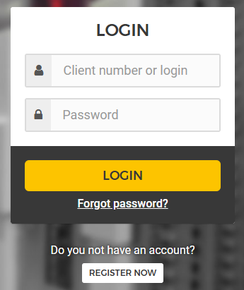
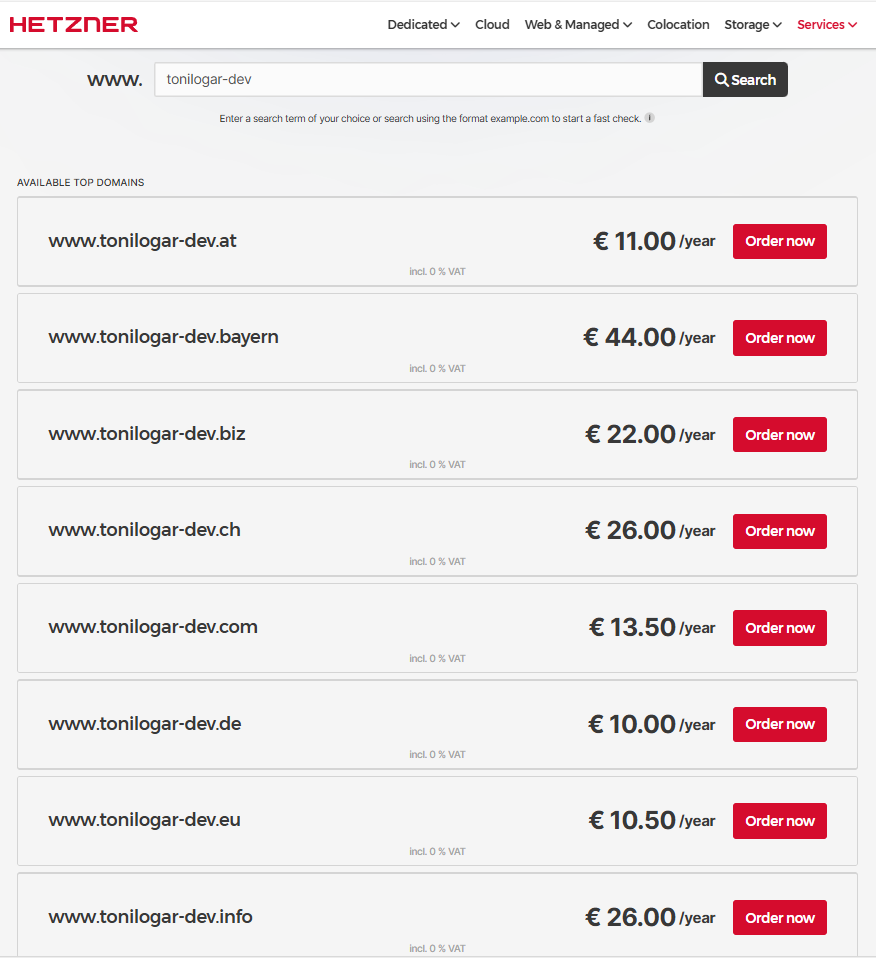
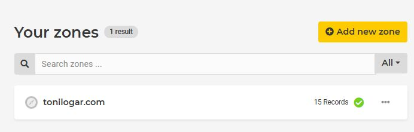
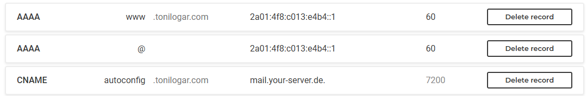
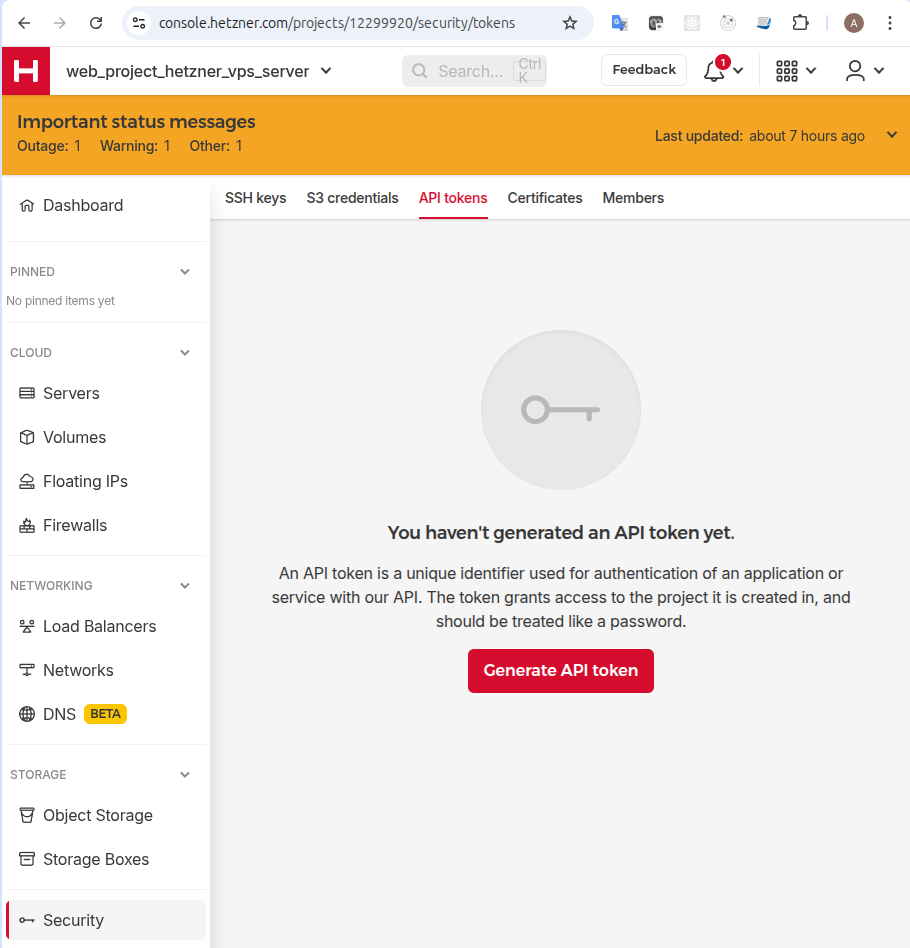
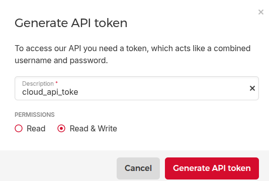
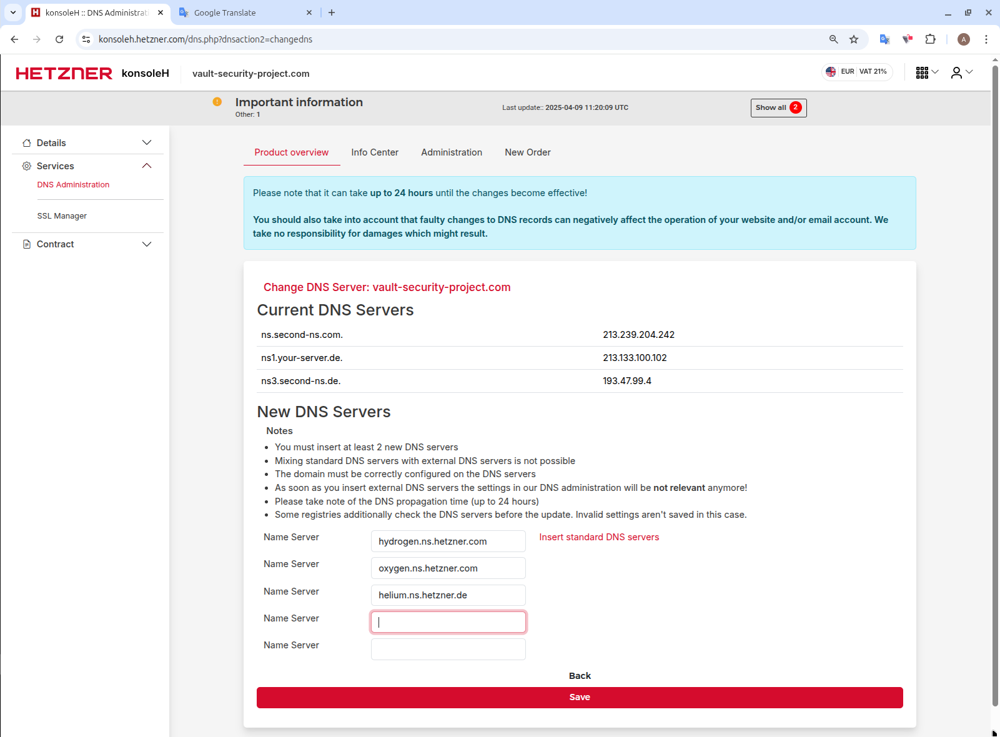

# Hetzner login, domain & tokens

## Index

1. [Create Hetzner user](#1-create-hetzner-user)
2. [Buy domain](#2-buy-domain)
3. [Create Hetzner API tokens](#3-create-hetzner-api-tokens)
4. [Edit nameservers](#4-edit-nameservers)

---

## 1 Create Hetzner user

[Create user or login →](https://accounts.hetzner.com/login)



[←Index](#index)

## 2 Buy domain

We use Let's Encrypt, so a real domain is mandatory.

- Ownership verification stays under your control.  
- Certificates renew automatically even if the IP changes.  
- Wildcard SSL lets us reuse the same cert for all subdomains.

- Allowed by https `https://5.75.244.206`  
- Not allowed by https `https://yourdomain.com`

[Search and buy domain](https://www.hetzner.com/whois/) →



[Create DNS zone for the domain](https://dns.hetzner.com/) →  
  


Quick check:  
Shows current IP
```bash
nslookup tonilogar.com  
```

```
Server:         127.0.0.53
Address:        127.0.0.53#53

Non-authoritative answer:
Name:   tonilogar.com
Address: 128.140.114.179
Name:   tonilogar.com
Address: 2a01:4f8:c013:e4b4::1
```
[←Index](#index)

## 3 Create Hetzner API tokens

Create a project in https://console.hetzner.cloud and generate a Cloud API token.




[←Index](#index)

## 4 Edit nameservers



[←Index](#index)

- [002_github_ssh](./002_github_ssh.md)
