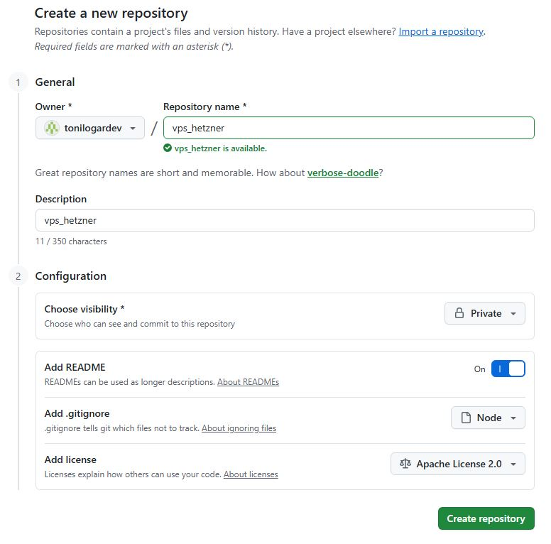

# GitHub & SSH

## Index

1.  [Create GitHub repository](#1-create-github-repository)
2.  [Clone repository](#2-clone-repository)
3.  [Configure SSH keys](#3-configure-ssh-keys)

---

## 1 Create GitHub repository

-   Create a new repository on [GitHub](https://github.com/).
    
-   Ensure the following files exist (or creaate them):
    -   [README.md](../README.md)
    -   [.gitignore](../.gitignore)
    -   [NOTICE](../NOTICE)
    -   [LICENSE](../LICENSE)

[←Index](#index)

## 2 Clone repository

-   Clone the repository locally:
    ```bash
    git clone https://github.com/tonilogardev/basic_server.git
    cd basic_server
    ```
-   Switch to the development branch:
    ```bash
    git checkout -b main_dev_pro origin/main_dev_pro
    # Or if it doesn't exist yet:
    # git checkout -b main_dev_pro
    ```

[←Index](#index)

## 3 Configure SSH keys

Generate a dedicated SSH key pair for the VPS deployment.
**These keys will be used to connect to the Hetzner VPS server.**

-   Update [.gitignore](../.gitignore) to exclude key files:
    ```gitignore
    # ssh files
    002_ssh_key/*
    ```

-   Generate the key (ED25519):
    ```bash
    mkdir -p 002_ssh_key
    cd 002_ssh_key
    ssh-keygen -t ed25519 -f ssh_vps_hetzner
    ```

-   Restrict permissions (Linux/WSL):
    ```bash
    chmod 600 ssh_vps_hetzner
    ls -l ssh_vps_hetzner
    ```
    *Output should show `-rw------- 1 tonilogar tonilogar 444 feb 12 12:13 ssh_vps_hetzner`.*

[←Index](#index)

## Next steps

-   [003_jenkins](./003_jenkins.md)
