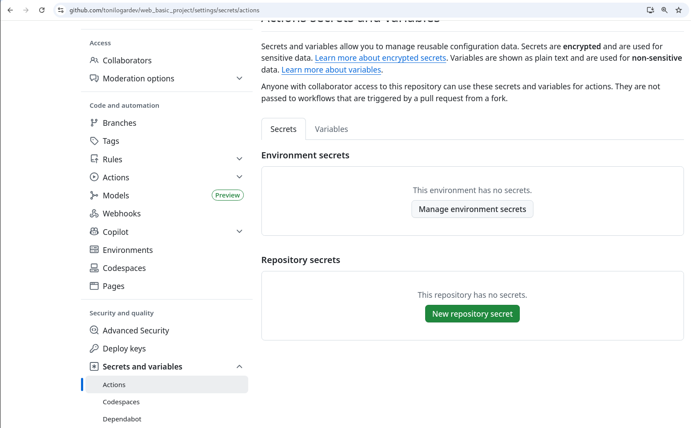
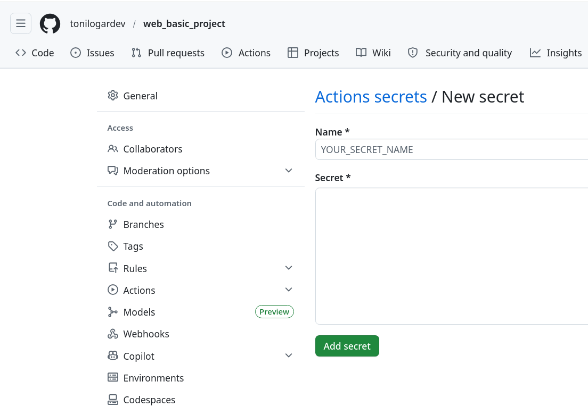
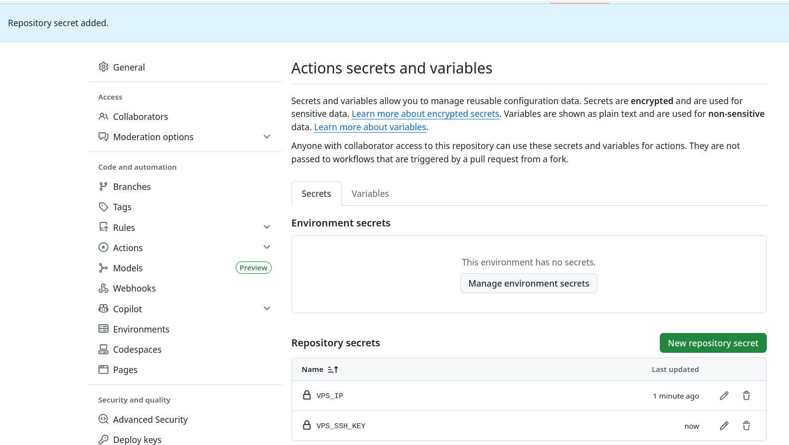

# GitHub, SSH & CI/CD Pipeline

## Index

1. [Create GitHub repository](#1-create-github-repository)
2. [Clone repository](#2-clone-repository)
3. [Configure SSH keys](#3-configure-ssh-keys)
4. [Configurar GitHub Secrets (Automated CI/CD)](#4-configurar-github-secrets-automated-cicd)
5. [Next steps](#5-next-steps)

---

## 1 Create GitHub repository

-   ***Instruction***: Crea el repositorio en entorno Remoto (Nube).
-   ***Visuals***:
    
-   ***File References***:
    - [README.md](../README.md)
    - [.gitignore](../.gitignore)

[←Index](#index)

## 2 Clone repository

-   ***Instruction***: Vincula la versión remota. Ejecuta:
```bash
git clone https://github.com/tonilogardev/basic_server.git
cd basic_server
git checkout -b main_dev_pro origin/main_dev_pro
```

[←Index](#index)

## 3 Configure SSH keys

-   ***Instruction***: Genera las llaves criptográficas para abrir los puertos de Hetzner. Ejecuta:
```bash
mkdir -p 002_ssh_key
cd 002_ssh_key
ssh-keygen -t ed25519 -f ssh_vps_hetzner
chmod 600 ssh_vps_hetzner
```
-   ***File References***:
    - Asegura que `002_ssh_key/*` exista en tu [../.gitignore](../.gitignore).

[←Index](#index)

## 4 Configurar GitHub Secrets (Automated CI/CD)

- ***Instruction***: Dirígete a la configuración de tu repositorio e inyecta la IP y la LLAVE PRIVADA param habilitar Github Actions.
- ***Visuals***:
    
    
    
- ***File References***:
    - Acción controlada por el YAML oficial en [../.github/workflows/production-deploy.yml](../.github/workflows/production-deploy.yml).
    - Copia el valor de la terminal ejecutando `cat ../002_ssh_key/ssh_vps_hetzner`.

[←Index](#index)

## 5 Next steps

- [003_terraform.md](./003_terraform.md)
