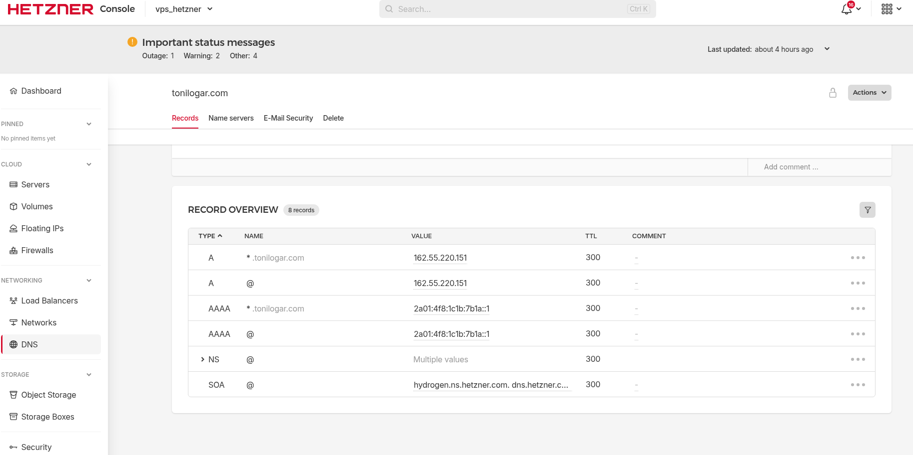

# Despliegue de Infraestructura (Hetzner Cloud VPS)

## Index

1. [Revisión de Variables](#1-revisión-de-variables)
2. [Inicialización del Motor](#2-inicialización-del-motor)
3. [Aplicación a Producción](#3-aplicación-a-producción)
4. [Configuración DNS Manual](#4-configuración-dns-manual)
5. [Next steps](#5-next-steps)

---

## 1 Revisión de Variables

- ***Instruction***: Rellena tus tokens y rutas obligatorias en la matriz de entorno.
- ***File References***:
    - Edita [../.env.development](../.env.development).
    - Comprueba tener definidos `TF_VAR_hcloud_token` y `TF_VAR_ssh_public_key_path`.
    - Verifica la arquitectura de red privada inyectada en [../003_terraform/main.tf](../003_terraform/main.tf).

[←Index](#index)

## 2 Inicialización del Motor

- ***Instruction***: Carga las credenciales en tu sesión de terminal y descarga los motores modernos (versión 1.60.0+). Ejecuta línea a línea:
```bash
set -a
source .env.development
set +a
cd 003_terraform
terraform init
terraform validate
```
- ***File References***:
    - Revisa políticas de bloque en [../003_terraform/providers.tf](../003_terraform/providers.tf).

[←Index](#index)

## 3 Aplicación a Producción

- ***Instruction***: Planea la estructura y crea las instancias físicas (Servidor, Redes, IPs) en tu cuenta de Hetzner. Previamente debes volver a cargar tus credenciales de entorno. Ejecuta:
```bash
set -a
source ../.env.development
set +a
terraform plan -out=tfplan
terraform apply "tfplan"
```

> [!NOTE]
> **¿Qué es `tfplan`?**
> Es un archivo binario estático donde Terraform guarda el "plano exacto" de lo que va a construir. Al usar `terraform apply "tfplan"`, le bloqueas la capacidad de re-calcular o adivinar; le obligas a construir matemática y únicamente lo que figuraba en los planos. Es el estándar de oro en ciberseguridad y CI/CD.

- ***File References***:
    - Copia al portapapeles las IPs generadas que dictará el retorno de [../003_terraform/outputs.tf](../003_terraform/outputs.tf).

[←Index](#index)

## 4 Configuración DNS Manual

- ***Instruction***: Dirígete al panel web del registrador y apunta estáticamente los nombres raíz (`@`) y comodín (`*`) a la IP generada en el paso anterior param los registros A y AAAA. 
- ***Visuals***:
    
- ***File References***:
    - Acción externa en portal remoto. Ningún archivo modificado.

[←Index](#index)

## 5 Next steps

- [004_homepage.md](./004_homepage.md)