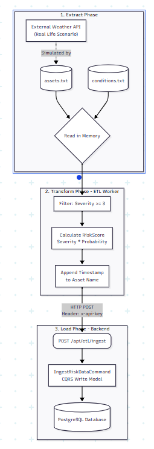
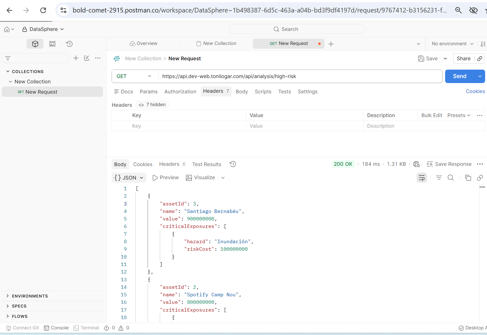
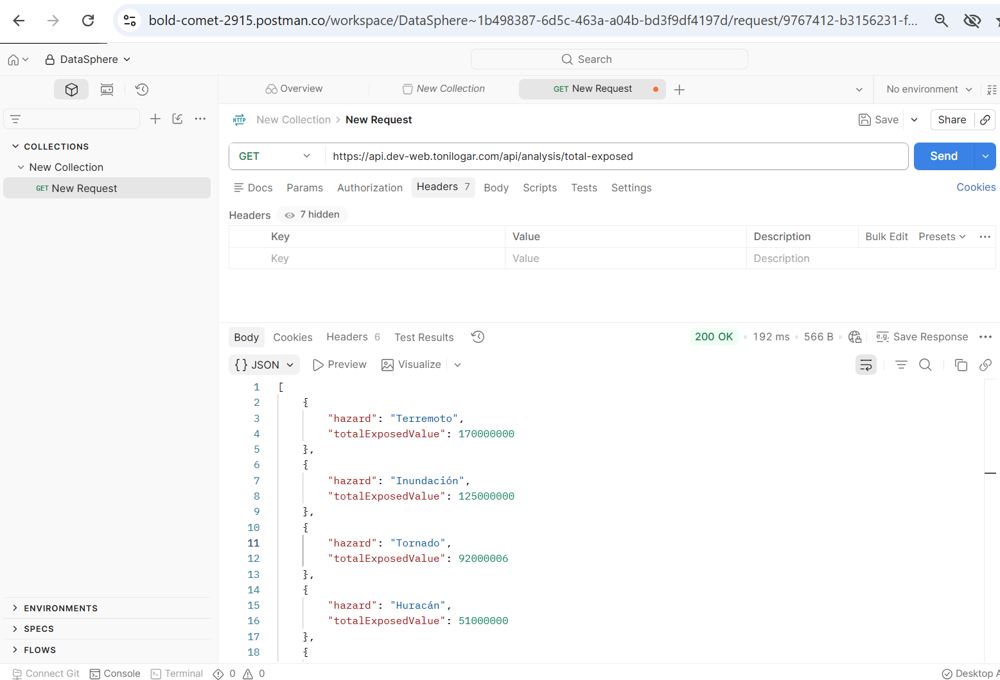
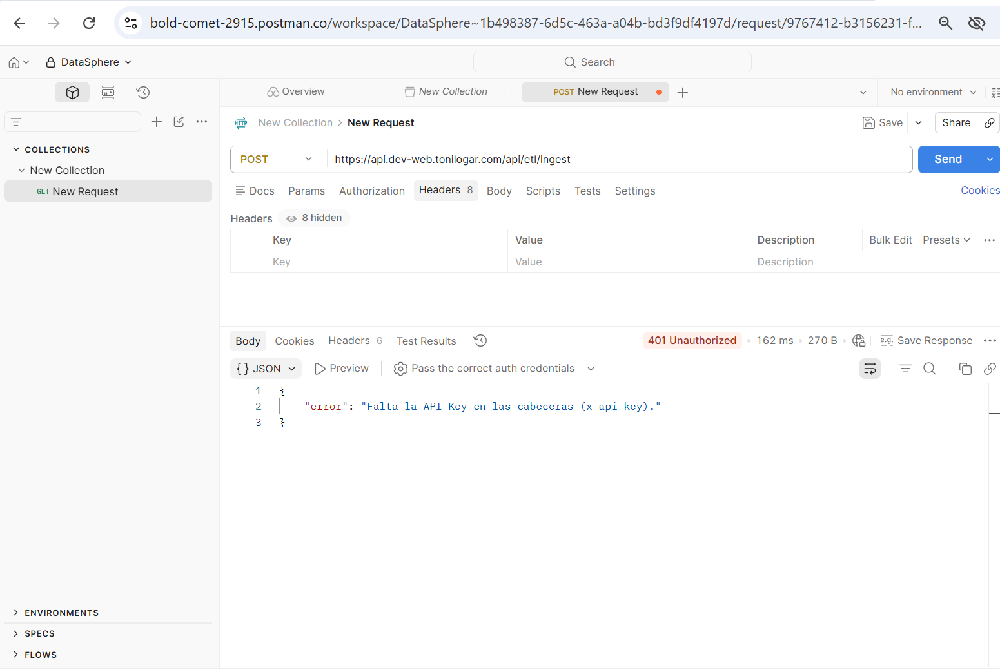
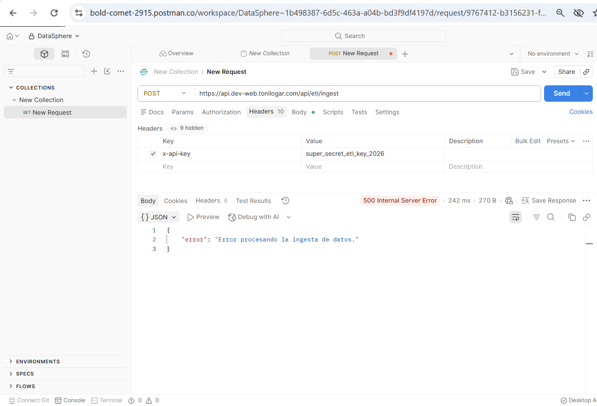

# Actividad 3: DataOps ETL y CQRS en DataSphere

**Alumno:** Antonio López
**Asignatura:** Desarrollo Web

## Introducción
En esta actividad, se ha simulado la ingesta automatizada de datos (ETL) y se ha aplicado el patrón de diseño **CQRS** en el backend. 

Se ha diseñado e implementado un contenedor independiente (`010_etl_worker`) encargado de simular el proceso de extracción, transformación y carga mediante llamadas Service-to-Service protegidas por **API Keys**. En el backend, se ha separado estrictamente la lógica de escritura (comandos) de la de lectura (consultas).

https://tonilogar.com/
https://dev-web.tonilogar.com/

---

## Tarea 1: Diseño del Flujo ETL (Extract, Transform, Load)

Para la automatización de la recolección de datos, se ha desplegado un **Worker programado con Cron en un contenedor Docker independiente** (`010_etl_worker`). En un entorno de producción real, este worker se conectaría a APIs meteorológicas o sísmicas (ej. OpenWeather). En este caso simulamos el proceso ETL leyendo dos ficheros `.txt`.

### Fase 1: Extract (Datos Ficticios)
Se han generado los siguientes archivos en la ruta `010_etl_worker/data/`:

**`assets.txt`** (Activos Físicos)
```text
1,Sede Central,40.4168,-3.7038,ES-MD,50000000
2,Almacen Norte,41.3851,2.1734,ES-CT,20000000
3,Data Center Sur,37.3891,-5.9845,ES-AN,80000000
4,Oficina Valencia,39.4699,-0.3763,ES-VC,15000000
```

**`conditions.txt`** (Condiciones por peligro)
```text
1,1,Tornado,3,2
2,1,Earthquake,4,1
3,2,Rainstorm,2,4
4,3,Hurricane,5,3
5,4,Volcano,1,1
```

### Fase 2: Transform
Una vez leídos los archivos en memoria, el Worker aplica el ETL:
1. Filtra y **descarta** cualquier peligro con una severidad inferior a 3.
2. Calcula el **RiskScore** multiplicando `SeverityLevel * ProbabilityScore`.
3. Se añade dinámicamente la fecha y hora de ejecución al nombre del activo (ej: `"Sede Central - 2026-06-07 19:15"`).

Un Cron Job se ejecuta **cada 15 minutos entre las 19:00 y las 19:59** de forma autónoma.



---

## Tarea 2: Comando de Ingestión de Datos (Command - CQRS)

El script del ETL realiza el cálculo del `RiskScore` y envía los datos transformados a un nuevo endpoint en el backend protegido.

En el backend, el archivo `IngestRiskDataCommand.ts` recibe esta información y, **mediante una transacción controlada de Prisma**, asegura la integridad de los datos en la base de datos PostgreSQL, insertando en las tablas `Asset`, `Hazard` y `AssetHazardExposure`.

### IngestRiskDataCommand.ts
```typescript
import { PrismaClient } from '@prisma/client';

export interface IngestPayload {
  assetName: string;
  latitude: number;
  longitude: number;
  assetValue: number;
  hazardName: string;
  riskScore: number;
}

export class IngestRiskDataCommand {
  private prisma: PrismaClient;

  constructor(prisma: PrismaClient) {
    this.prisma = prisma;
  }

  async execute(payload: IngestPayload): Promise<boolean> {
    console.log(`[Command] Procesando ingesta para activo: ${payload.assetName}`);

    try {
      await this.prisma.$transaction(async (tx) => {
        // Categoría por defecto
        const category = await tx.category.upsert({
          where: { name: 'Desconocida' },
          update: {},
          create: { name: 'Desconocida' }
        });

        // Peligro (Hazard)
        const hazard = await tx.hazard.upsert({
          where: { name: payload.hazardName },
          update: {},
          create: { name: payload.hazardName }
        });

        // Nuevo Activo 
        const asset = await tx.asset.create({
          data: {
            name: payload.assetName,
            latitude: payload.latitude,
            longitude: payload.longitude,
            base_value: payload.assetValue,
            category_id: category.id
          }
        });

        // RiskScore como exposure_value
        await tx.assetHazardExposure.create({
          data: {
            asset_id: asset.id,
            hazard_id: hazard.id,
            exposure_value: payload.riskScore
          }
        });
      });

      return true;
    } catch (error) {
      console.error("[Command Error] Falla al insertar en base de datos:", error);
      throw error;
    }
  }
}
```

### Pruebas de Ejecución del ETL (Logs)
El worker se ejecuta automáticamente a las 6:00 AM mediante la librería `node-cron`. 
La siguiente captura corresponde a una prueba manual:

```bash
cker exec dev_web_etl_worker npx ts-node src/index.ts run-now"


[ETL Worker] Inicializado. API_URL: http://dev-web-backend:3000
[ETL Worker] Inicializado. API_URL: http://dev-web-backend:3000
[ETL Worker] Cron schedule configurado: */15 17 * * *

--- COMENZANDO FLUJO ETL ---
[ETL] Iniciando extracción (Extract)...
[ETL] Extraídos 4 activos y 5 condiciones.
[ETL] Iniciando transformación (Transform)...
[ETL] Transformación completa. 3 registros listos para inserción.
[ETL] Iniciando carga (Load) hacia el Backend...
[ETL] Carga finalizada. Éxitos: 3, Errores: 0
--- FLUJO ETL COMPLETADO CON ÉXITO ---
```
---

## Tarea 3: Desarrollo de Consultas (Query - CQRS)

La lógica de lectura ha sido separada totalmente. Para responder a preguntas de negocio como *"¿Cuáles son los activos con mayor riesgo de exposición?"* hemos creado `GetHighRiskAssetsQuery.ts`. 

Esta query utiliza directamente a la base de datos pidiendo únicamente los campos necesarios y filtrando activos con un valor de exposición superior a un límite crítico (ej: > 10.000.000).

### Código Relevante: `GetHighRiskAssetsQuery.ts`
```typescript
import { PrismaClient } from '@prisma/client';

export class GetHighRiskAssetsQuery {
  private prisma: PrismaClient;

  constructor(prisma: PrismaClient) {
    this.prisma = prisma;
  }

  // CQRS QUERY: Solo lee datos de forma optimizada, no modifica estado
  async execute() {
    console.log("[Query] Obteniendo activos con alto riesgo de exposición");

    // Una consulta compleja para analistas, ejecutada directamente sobre la base de datos
    const highRiskAssets = await this.prisma.asset.findMany({
      where: {
        AssetHazardExposure: {
          some: {
            // Filtrar activos que tengan alguna exposición mayor a 10 millones
            exposure_value: { gt: 10000000 }
          }
        }
      },
      include: {
        AssetHazardExposure: {
          include: {
            Hazard: true
          }
        }
      },
      orderBy: {
        base_value: 'desc'
      },
      // Optimización de lectura: solo cogemos los primeros 50
      take: 50
    });

    // Proyectar a un DTO limpio para la vista
    return highRiskAssets.map(asset => ({
      assetId: asset.id,
      name: asset.name,
      value: Number(asset.base_value),
      criticalExposures: asset.AssetHazardExposure
        .filter(exp => Number(exp.exposure_value) > 10000000)
        .map(exp => ({
          hazard: exp.Hazard.name,
          riskCost: Number(exp.exposure_value)
        }))
    }));
  }
}
```

### Prueba de los Endpoints de Lectura
Para probar que ambas Queries CQRS funcionan correctamente en nuestro servidor de producción:

1. **Test Query A (Alto Riesgo)**: 



```typescript
import { PrismaClient } from '@prisma/client';

export class GetTotalValueExposedByHazardQuery {
  private prisma: PrismaClient;

  constructor(prisma: PrismaClient) {
    this.prisma = prisma;
  }

  // CQRS QUERY: Solo lee datos de forma optimizada, no modifica estado
  async execute() {
    console.log("[Query] Calculando valor total expuesto agrupado por peligro");

    // (Query SQL nativa de agrupación)
    const exposures = await this.prisma.assetHazardExposure.groupBy({
      by: ['hazard_id'],
      _sum: {
        exposure_value: true,
      },
      orderBy: {
        _sum: {
          exposure_value: 'desc'
        }
      }
    });

    const hazards = await this.prisma.hazard.findMany();

    // Proyectar limpio
    return exposures.map(exp => {
      const hazardName = hazards.find(h => h.id === exp.hazard_id)?.name || 'Unknown';
      return {
        hazard: hazardName,
        totalExposedValue: exp._sum.exposure_value ? Number(exp._sum.exposure_value) : 0
      };
    });
  }
}
```

2. **Test Query B (Valor Total Expuesto)**:



---

## Tarea 4: Autenticación Servicio a Servicio (API Keys)

Al separar la plataforma en dos contenedores (Backend y ETL Worker), se hacía necesario proteger el endpoint de ingesta contra peticiones externas maliciosas, ya que este endpoint no usa tokens JWT de un usuario, sino comunicación "Machine to Machine" (M2M).

Implementando un middleware específico en Express (`apiKeyAuth.ts`) que comprueba que la cabecera `x-api-key` contenga un token pre-compartido de forma segura a través de las variables de entorno de Docker Compose.

### Código Relevante: Middleware `apiKeyAuth.ts`
```typescript
import { Request, Response, NextFunction } from 'express';

const API_KEY_HEADER = 'x-api-key';
const EXPECTED_API_KEY = process.env.ETL_API_KEY || 'default-secret-key';

export const apiKeyAuth = (req: Request, res: Response, next: NextFunction) => {
  const apiKey = req.header(API_KEY_HEADER);

  if (!apiKey) {
    return res.status(401).json({ error: 'Falta la API Key en las cabeceras (x-api-key).' });
  }

  if (apiKey !== EXPECTED_API_KEY) {
    return res.status(403).json({ error: 'API Key inválida. Acceso denegado.' });
  }

  // Si la clave es correcta, pasa al siguiente middleware/controlador
  next();
};
```

### Pruebas de Seguridad en Postman

1. **Intento sin API Key (Acceso Denegado)**
   


2. **Ingesta Correcta con API Key**
   


---

## Conclusión

El diseño de una arquitectura orientada a microservicios con un orquestador Docker nos ha permitido aislar el trabajo pesado de transformación de datos (ETL) en un entorno seguro y cronometrado. Al aplicar **CQRS**, hemos garantizado que las ráfagas de lectura que harán los analistas para ver los activos en peligro no bloqueen la base de datos ni los modelos de escritura de la ingesta de datos. Finalmente, asegurar el perímetro M2M con **API Keys** asienta unas bases fundamentales de DataOps y Ciberseguridad en arquitecturas distribuidas.
