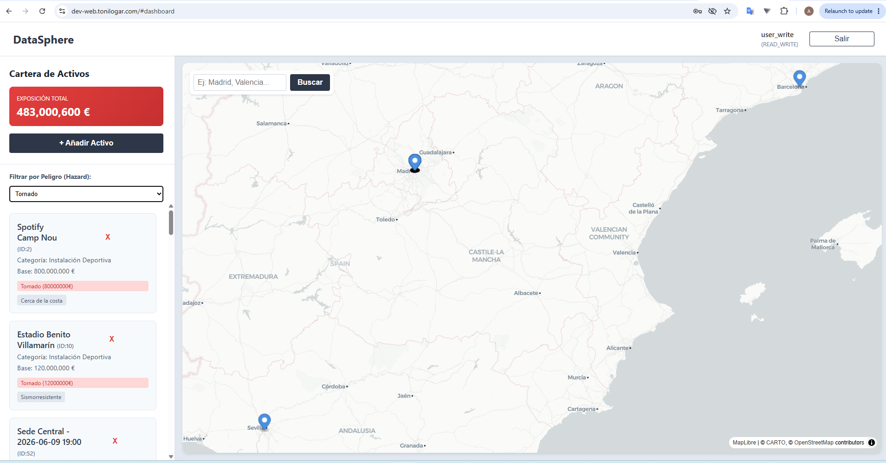
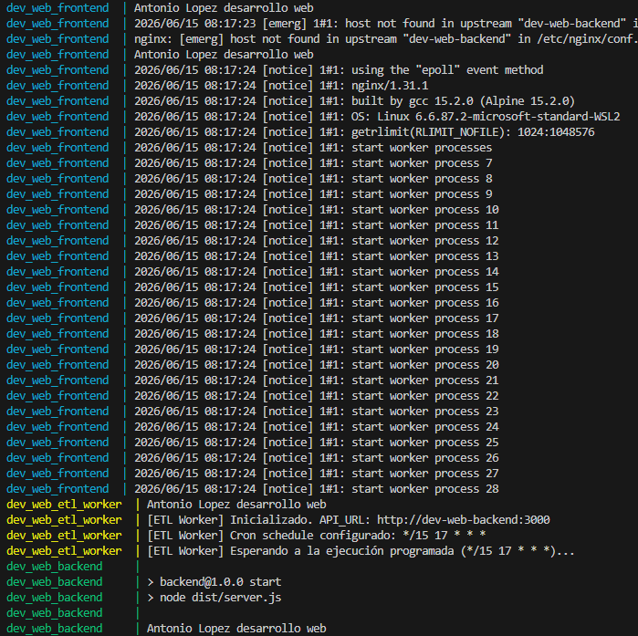
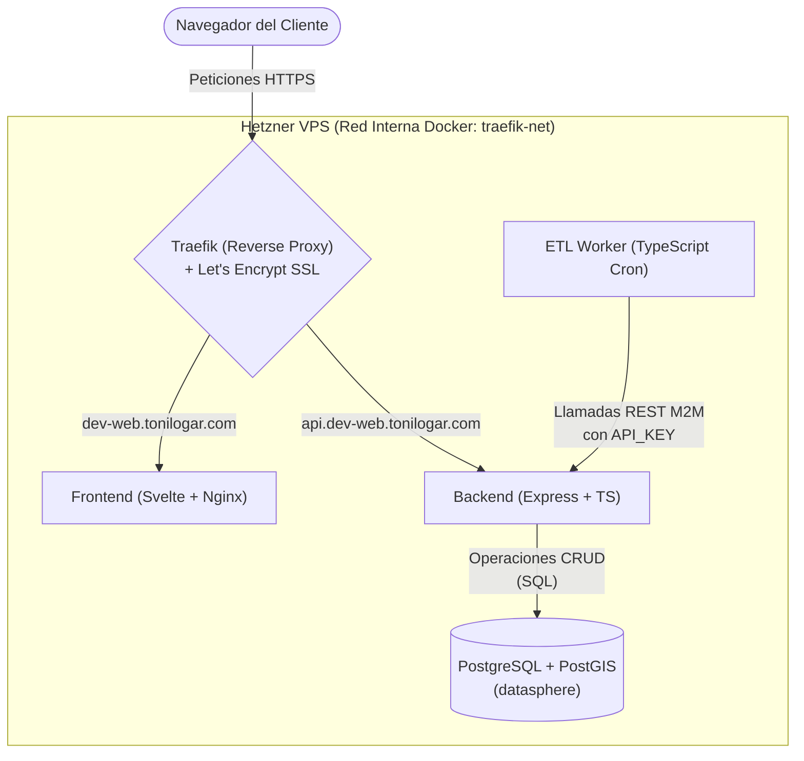
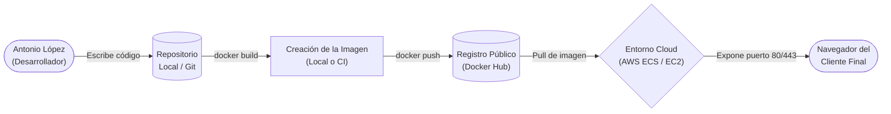

# Actividad 4: Frontend, Dockerización y Despliegue en la Nube
**Alumno:** Antonio López

Para la realización de las 4 actividades he creado una aplicación web que permite gestionar los activos de una empresa y sus riesgos asociados. La aplicación está dividida en 4 módulos:
- Frontend: Interfaz de usuario interactiva.
- Backend: Servidor API REST.
- ETL Worker: Servicio en segundo plano para la ingesta automatizada de datos.
- Base de Datos: Sistema gestor de base de datos relacional.
La he alojado dentro de mi web construida con docker compose. En la web aprovecho para mostrar y aprender sobre desarrollo de software gis devops etc..  
https://tonilogar.com/

La herramienta de la asignatura es:
https://dev-web.tonilogar.com/

---

## Tarea 1: Frontend con Mapa y Filtro Reactivo



He construido el frontend utilizando **Svelte** con VITE para manejar la reactividad de los elementos de la interfaz. Mi objetivo principal ha sido consumir los datos de la API (Backend) e interactuar con ellos.

### 1.1 Filtrado Reactivo (Client-Side)
He implementado un sistema de **filtrado en cliente**.
Al arrancar la aplicación (`Dashboard.svelte`), obtengo el listado completo de activos con una única llamada a la API:

```typescript
let assets: any[] = [];
// Variable reactiva para almacenar el hazard seleccionado
let selectedHazardId: number = 0;

// Filtra dinámicamente sin mutar el array original ni recargar
$: filteredAssets = selectedHazardId === 0 
  ? assets 
  : assets.filter(a => a.AssetHazardExposure?.some((exp: any) => exp.hazard_id === selectedHazardId || exp.Hazard?.id === selectedHazardId));
```

### 1.2 El Mapa (MapLibre)
Para la visualización de los activos he utilizado la librería **MapLibre**. El componente del mapa recibe el array `filteredAssets`. Cuando Svelte detecta que el usuario cambia el selector de peligro, la variable `filteredAssets` se actualiza instantáneamente y muestra solo los que cumplen el filtro.


### 1.3 Variables de Entorno
En este proyecto utilizo ficheros `.env` para configurar variables tanto en desarrollo como en producción.

- `.env.development`
- `.env.production`

Cuando levanto la herramienta con `docker-compose` en local, utilizo las variables de `.env.development`. Cuando hago un *push*, el sistema utiliza las variables de `.env.production` alojadas en GitHub Secrets para el despliegue automático.

Ejemplo:

**`.env.development`** (Entorno Local)
```env
# 3. DOCKER COMPOSE ROUTING (Parametrización Traefik Local)
DOMAIN_NAME=localhost
TRAEFIK_HTTP_PORT=8001
SENTINEL_URL=http://sentinel.localhost:8001/
CASSINI_URL=http://cassini.localhost:8001/
DEV_WEB_URL=http://dev-web.localhost:8001/
DEV_WEB_API_URL=http://api.dev-web.localhost:8001

ETL_API_KEY=xxxxxxxxxxxxxxxx
```

**`.env.production`** (Entorno Cloud / VPS)
```env
# Entorno de Producción (Hetzner VPS) - CI/CD
# Estas variables serán leídas nativamente por /docker-compose.yml al orquestar Traefik.

DOMAIN_NAME=tonilogar.com
TRAEFIK_HTTP_PORT=80
SENTINEL_URL=https://sentinel.tonilogar.com/
CASSINI_URL=https://cassini.tonilogar.com/
DEV_WEB_URL=https://dev-web.tonilogar.com/
DEV_WEB_API_URL=https://api.dev-web.tonilogar.com

ETL_API_KEY=xxxxxxxxxxxxxxxxx
```

---

## Tarea 2: Dockerización de DataSphere

Para preparar la aplicación para producción, no puedo servir el frontend simplemente con el servidor de desarrollo (`npm run dev`). Necesito construir una imagen estática y servirla de forma eficiente. 

Para ello, utilizo un **Dockerfile Multi-Stage** (Multietapa):

```dockerfile
# Etapa 1: Build (Node.js)
FROM node:18-alpine AS builder
WORKDIR /app
COPY package*.json ./
RUN npm install
COPY . .
# Se inyecta la URL de la API mediante argumentos de build
ARG VITE_API_URL
ENV VITE_API_URL=$VITE_API_URL
# Se compila el código (HTML, CSS, JS minificado en la carpeta /dist)
RUN npm run build

# Etapa 2: Producción con Nginx
FROM nginx:alpine
# Copiar configuración personalizada para SPA (Single Page Applications)
COPY nginx.conf /etc/nginx/conf.d/default.conf
# Copiar los archivos estáticos generados en la etapa anterior
COPY --from=builder /app/dist /usr/share/nginx/html

EXPOSE 80
CMD ["nginx", "-g", "daemon off;"]
```


**Ventajas de este enfoque:**
1. **Seguridad y Peso:** La imagen final solo contiene Nginx y archivos estáticos. No hay rastro de Node.js, `npm`, ni del código fuente original. Esto hace que la imagen pese unos pocos megabytes.
2. **Eficiencia:** Nginx está optimizado para servir archivos estáticos (`.html`, `.js`, `.css`).


**Despliegue local**

---

## Tarea 3: Despliegue en la Nube y Arquitectura Global

### 3.1 Despliegue Real Automatizado en Producción (Hetzner + CI/CD)

La herramienta global que he construido para realizar la asignatura funciona y se despliega actualmente en un VPS de **Hetzner**. El proceso está totalmente automatizado mediante flujos de Integración y Despliegue Continuo (CI/CD) utilizando **GitHub Actions**.

**Proceso de Despliegue Real de DataSphere:**
1. **IaC con Terraform:** Aprovisiono la máquina física desde cero mediante código Terraform, parametrizando las variables de sistema con `.env.development`.
2. **GitHub Actions (CI/CD):** Cualquier `push` hacia la rama de producción dispara un *workflow* que se conecta por SSH M2M al servidor.
3. **Orquestación con Docker Compose:** El pipeline reconstruye *in-situ* las imágenes (`docker-compose up --build -d`) y levanta los contenedores (Frontend, Backend, DB, Worker) inyectando los secretos de producción de GitHub.
4. **Traefik y Let's Encrypt:** Traefik gestiona todas las peticiones, resolviendo los dominios (`dev-web.tonilogar.com`) y generando certificados SSL Wildcard automáticamente.



### 3.2 Diseño del Despliegue Conceptual (Docker Hub + AWS)

La herramienta actual reconstruye las imágenes en el propio servidor. **Si quisiera desplegarla en un entorno cloud comercial como AWS** apoyándome en un registro público de imágenes, el proceso sería el siguiente:




