<div style="text-align: center; margin-top: 150px; margin-bottom: 50px;">
    
</div>

<br><br>

<h1 align="center" style="font-size: 3em; margin-bottom: 10px;">Trabajo Final de Grado (TFB)</h1>
<h2 align="center" style="color: #FFC000; font-size: 2em; margin-bottom: 50px;">Segmentación Semántica de Nubes y Nieve con Sentinel-2 mediante Deep Learning</h2>

<br><br><br>

<div align="center" style="font-size: 1.5em; line-height: 1.8;">
  <strong>Autor:</strong> Antonio López<br>
  <strong>Fase:</strong> Entrega 2 - Metodología y Desarrollo del Proyecto<br>
  <strong>Fecha:</strong> Julio 2026
</div>

<br><br><br><br><br>

<div align="center" style="font-size: 1.2em;">
  <strong>Página web del proyecto:</strong> <a href="https://tonilogar.github.io/tfb/tfb.html">tonilogar.github.io/tfb</a><br>
  <strong>Repositorio y control de versiones:</strong> <a href="https://github.com/tonilogardev/web_basic_project/tree/main_dev_pro_tfb/011_tfb">GitHub - Master Roadmap</a>
</div>

<div style="page-break-after: always;"></div>

<!-- START doctoc generated TOC please keep comment here to allow auto update -->
<!-- DON'T EDIT THIS SECTION, INSTEAD RE-RUN doctoc TO UPDATE -->
## Índice Interactivo

- [Glosario de Términos](#glosario-de-t%C3%A9rminos)
- [1. Introducción, contextualización y objetivos](#1-introducci%C3%B3n-contextualizaci%C3%B3n-y-objetivos)
  - [El problema base: La confusión algorítmica de Sen2Cor](#el-problema-base-la-confusi%C3%B3n-algor%C3%ADtmica-de-sen2cor)
  - [Objetivos del Proyecto](#objetivos-del-proyecto)
- [2. Desarrollo viable y sostenible (Condicionantes)](#2-desarrollo-viable-y-sostenible-condicionantes)
  - [2.1 Condicionantes Ambientales (Green Computing)](#21-condicionantes-ambientales-green-computing)
  - [2.2 Condicionantes Sociales](#22-condicionantes-sociales)
  - [2.3 Condicionantes Económicos](#23-condicionantes-econ%C3%B3micos)
- [3. Temporalización e hitos](#3-temporalizaci%C3%B3n-e-hitos)
  - [Fases de Ejecución:](#fases-de-ejecuci%C3%B3n)
  - [Diagrama de Gantt](#diagrama-de-gantt)
- [4. Alineación con los ODS](#4-alineaci%C3%B3n-con-los-ods)
- [5. Fundamentación teórica](#5-fundamentaci%C3%B3n-te%C3%B3rica)
  - [La Arquitectura U-Net](#la-arquitectura-u-net)
  - [Diseño Arquitectónico: Red Neuronal Convolucional (U-Net)](#dise%C3%B1o-arquitect%C3%B3nico-red-neuronal-convolucional-u-net)
    - [1 Framework Tecnológico](#1-framework-tecnol%C3%B3gico)
    - [2 Data Shapes](#2-data-shapes)
    - [3. Justificación de la programación desde cero frente a redes pre-entrenadas](#3-justificaci%C3%B3n-de-la-programaci%C3%B3n-desde-cero-frente-a-redes-pre-entrenadas)
    - [4. Loss Function (Función de Pérdida)](#4-loss-function-funci%C3%B3n-de-p%C3%A9rdida)
    - [5. Métricas de Evaluación](#5-m%C3%A9tricas-de-evaluaci%C3%B3n)
  - [Ciclo de Vida del Modelo (MLOps y Lógica de Negocio)](#ciclo-de-vida-del-modelo-mlops-y-l%C3%B3gica-de-negocio)
    - [0. Justificación Científica del Enfoque Arquitectónico](#0-justificaci%C3%B3n-cient%C3%ADfica-del-enfoque-arquitect%C3%B3nico)
      - [Hipótesis Descartada 1: Un modelo específico por cada gránulo](#hip%C3%B3tesis-descartada-1-un-modelo-espec%C3%ADfico-por-cada-gr%C3%A1nulo)
      - [Hipótesis Descartada 2: Detección de Anomalías (Método Multi-Temporal)](#hip%C3%B3tesis-descartada-2-detecci%C3%B3n-de-anomal%C3%ADas-m%C3%A9todo-multi-temporal)
    - [1. Fase 1: Nacimiento y Validación (El TFB)](#1-fase-1-nacimiento-y-validaci%C3%B3n-el-tfb)
      - [1.1 Flujo de Trabajo Operativo (Los 30 Gránulos)](#11-flujo-de-trabajo-operativo-los-30-gr%C3%A1nulos)
      - [1.2 Generación del "Ground Truth" (Técnicas de Edición y Clasificación)](#12-generaci%C3%B3n-del-ground-truth-t%C3%A9cnicas-de-edici%C3%B3n-y-clasificaci%C3%B3n)
      - [1.3 Taxonomía de Clases (El Ground Truth)](#13-taxonom%C3%ADa-de-clases-el-ground-truth)
      - [1.4 Entrenamiento y Validación](#14-entrenamiento-y-validaci%C3%B3n)
    - [2. Fase 2: Puesta en Producción (Inferencia Automática)](#2-fase-2-puesta-en-producci%C3%B3n-inferencia-autom%C3%A1tica)
    - [3. Fase 3: Entrenamiento Continuo y "Human-in-the-Loop" (MLOps)](#3-fase-3-entrenamiento-continuo-y-human-in-the-loop-mlops)
- [6. Metodología aplicada y justificación](#6-metodolog%C3%ADa-aplicada-y-justificaci%C3%B3n)
  - [La Paradoja de Edición (Metodología "GIMP Bridge")](#la-paradoja-de-edici%C3%B3n-metodolog%C3%ADa-gimp-bridge)
  - [Justificación Arquitectónica: Descarte del DEM (Modelo Digital de Elevaciones)](#justificaci%C3%B3n-arquitect%C3%B3nica-descarte-del-dem-modelo-digital-de-elevaciones)
    - [1. La Física Espectral es suficiente (El poder del SWIR)](#1-la-f%C3%ADsica-espectral-es-suficiente-el-poder-del-swir)
      - [Evidencia Bibliográfica](#evidencia-bibliogr%C3%A1fica)
    - [2. Complejidad de Ingeniería de Datos (Data Engineering)](#2-complejidad-de-ingenier%C3%ADa-de-datos-data-engineering)
  - [Leyenda de Píxeles y Estrategia de Agrupación (SCL)](#leyenda-de-p%C3%ADxeles-y-estrategia-de-agrupaci%C3%B3n-scl)
    - [1. El Estándar Sen2Cor (Las 12 Clases Originales)](#1-el-est%C3%A1ndar-sen2cor-las-12-clases-originales)
    - [2. Reducción de Dimensionalidad (Colapso Físico a 6 Clases)](#2-reducci%C3%B3n-de-dimensionalidad-colapso-f%C3%ADsico-a-6-clases)
    - [3. Justificaciones Científicas de la Agrupación](#3-justificaciones-cient%C3%ADficas-de-la-agrupaci%C3%B3n)
      - [3.1. Simplificación de Nubes (8, 9, 10 -> Clase 1)](#31-simplificaci%C3%B3n-de-nubes-8-9-10---clase-1)
      - [3.2. Prevención de "Disonancia Cognitiva" (Separación de Nube y Sombra)](#32-prevenci%C3%B3n-de-disonancia-cognitiva-separaci%C3%B3n-de-nube-y-sombra)
    - [4. Casuística Especial: Sombras sobre Nubes (El "Mar de Nubes")](#4-casu%C3%ADstica-especial-sombras-sobre-nubes-el-mar-de-nubes)
      - [4.1. El Falso Positivo Geométrico](#41-el-falso-positivo-geom%C3%A9trico)
      - [4.2. Estrategia de Edición y Clasificación](#42-estrategia-de-edici%C3%B3n-y-clasificaci%C3%B3n)
      - [4.3. Importancia Crítica de la Edición en los Datos de Test](#43-importancia-cr%C3%ADtica-de-la-edici%C3%B3n-en-los-datos-de-test)
  - [Edición y Clasificación Manual de Píxeles con GIMP (El "GIMP Bridge")](#edici%C3%B3n-y-clasificaci%C3%B3n-manual-de-p%C3%ADxeles-con-gimp-el-gimp-bridge)
    - [1. El Problema Técnico (Disonancia Radiométrica)](#1-el-problema-t%C3%A9cnico-disonancia-radiom%C3%A9trica)
      - [1.1 El problema del negro absoluto](#11-el-problema-del-negro-absoluto)
      - [1.2 El peligro de la destrucción radiométrica](#12-el-peligro-de-la-destrucci%C3%B3n-radiom%C3%A9trica)
    - [2. La Solución: Arquitectura Encode/Decode](#2-la-soluci%C3%B3n-arquitectura-encodedecode)
    - [3. Flujo de Trabajo (Paso a Paso)](#3-flujo-de-trabajo-paso-a-paso)
      - [Paso A: Generación Automática](#paso-a-generaci%C3%B3n-autom%C3%A1tica)
      - [Paso B: Edición Fotográfica](#paso-b-edici%C3%B3n-fotogr%C3%A1fica)
      - [Paso C: Decodificación y Recuperación](#paso-c-decodificaci%C3%B3n-y-recuperaci%C3%B3n)
    - [4. Archivos y Scripts](#4-archivos-y-scripts)
- [7. Proceso y resultados](#7-proceso-y-resultados)
  - [7.1 Fuentes de datos y recopilación](#71-fuentes-de-datos-y-recopilaci%C3%B3n)
  - [7.2 Exploración y preparación (Reducción de Dimensionalidad)](#72-exploraci%C3%B3n-y-preparaci%C3%B3n-reducci%C3%B3n-de-dimensionalidad)
  - [Creación del Dataset de Entrenamiento (Feature Engineering y Tiling)](#creaci%C3%B3n-del-dataset-de-entrenamiento-feature-engineering-y-tiling)
    - [1. Objetivo del Script](#1-objetivo-del-script)
    - [2. Flujo de Trabajo y Decisiones Técnicas](#2-flujo-de-trabajo-y-decisiones-t%C3%A9cnicas)
      - [2.1. Resolución Dinámica y Alineación Espacial](#21-resoluci%C3%B3n-din%C3%A1mica-y-alineaci%C3%B3n-espacial)
      - [2.2. Feature Engineering: Índice NDSI](#22-feature-engineering-%C3%ADndice-ndsi)
      - [2.3. Composición del Tensor](#23-composici%C3%B3n-del-tensor)
      - [2.4. Troceado (Tiling) y Filtrado de OOM (Out-of-Memory)](#24-troceado-tiling-y-filtrado-de-oom-out-of-memory)
    - [3. Salida de Datos (Output)](#3-salida-de-datos-output)
  - [7.3 Gestión y almacenamiento (La Prevención del colapso OOM)](#73-gesti%C3%B3n-y-almacenamiento-la-prevenci%C3%B3n-del-colapso-oom)
  - [7.4 Modelado](#74-modelado)
  - [7.5 Visualización de los Primeros Resultados](#75-visualizaci%C3%B3n-de-los-primeros-resultados)
- [8. Discusión y limitaciones (La Paradoja Topográfica)](#8-discusi%C3%B3n-y-limitaciones-la-paradoja-topogr%C3%A1fica)
- [9. Conclusiones y líneas futuras](#9-conclusiones-y-l%C3%ADneas-futuras)
- [10. Referencias bibliográficas y citas](#10-referencias-bibliogr%C3%A1ficas-y-citas)

<!-- END doctoc -->
---

## Glosario de Términos

Para facilitar la lectura a evaluadores y personas no especialistas en Sistemas de Información Geográfica (GIS) se definen los siguientes términos clave utilizados en este documento:

* **Sentinel-2:** Misión de satélites ópticos de alta resolución (10 metros) perteneciente al programa europeo Copernicus.
* **Sen2Cor:** Software de la Agencia Espacial Europea (ESA) para la corrección atmosférica (incluye un detector de nubes básico que este proyecto pretende mejorar).
* **Tiling:** Técnica geoespacial que consiste en "trocear" imágenes satelitales gigantes en cuadrados más pequeños para que el ordenador pueda procesarlos sin saturar la memoria RAM.
* **OOM:** *Out of Memory* (Fuera de memoria). Colapso del ordenador por intentar cargar demasiados datos gráficos a la vez.
* **COG:** *Cloud Optimized GeoTIFF*. Formato de imagen satelital optimizado para ser consultado y procesado de forma rápida y directa en la nube.
* **PMTiles:** Formato de archivo de mapa diseñado para almacenar teselas geoespaciales en la nube de forma estática, optimizando la velocidad y coste del servidor.
* **gpkg:** *GeoPackage*. Formato de base de datos geoespacial moderno, abierto y compacto.
* **shp:** *Shapefile*. Formato de archivo informático vectorial clásico y muy extendido para almacenar sistemas de información geográfica.
* **On the fly:** Procesamiento o renderizado "sobre la marcha" o en tiempo real. Ocurre en el instante exacto en que el usuario lo solicita, sin necesidad de tener los datos pre-procesados.
* **ESA:** *European Space Agency* (Agencia Espacial Europea).
* **ACA:** Agencia Catalana del Agua.
* **ICGC:** Instituto Cartográfico y Geológico de Cataluña.
* **DEM:** *Digital Elevation Model* (Modelo Digital de Elevaciones). Representación en 3D del relieve terrestre.
* **U-Net:** Arquitectura de red neuronal convolucional diseñada para la segmentación semántica de imágenes (asignación de clases píxel a píxel).
* **Ground Truth:** (Verdad Terreno). El patrón oro o mapa de referencia perfecto que se usa para enseñar y examinar a la Inteligencia Artificial. En este proyecto se ha construido y auditado manualmente.
* **L1C / L2A:** Niveles de procesamiento de imágenes satelitales. L1C es la imagen "cruda" tal cual llega del espacio, y L2A es la imagen tras aplicarle correcciones atmosféricas algorítmicas.
* **IoU:** *(Intersection over Union)*. Métrica matemática muy estricta utilizada en Inteligencia Artificial para evaluar el porcentaje exacto de acierto espacial al predecir la forma de un objeto.
* **Recall:** (Exhaustividad). Métrica estadística que mide la capacidad del modelo predictivo para encontrar y señalar *todas* las nubes reales que existen en la imagen sin dejarse ninguna.
* **VRAM:** Memoria de acceso aleatorio de vídeo. Es la memoria exclusiva de las tarjetas gráficas (GPUs), la cual se colapsa al cargar imágenes espaciales inmensas si no se emplea el *Tiling*.
* **NDSI:** *(Normalized Difference Snow Index)*. Índice matemático adicional que resalta la reflectancia de la nieve frente a las nubes altas basándose en la luz infrarroja.

---

## 1. Introducción, contextualización y objetivos

El programa Copernicus, de la Agencia Espacial Europea (ESA) y la Unión Europea, representa actualmente uno de los mayores esfuerzos tecnológicos para la observación de la Tierra. Sentinel-2 es uno de los satélites de la constelación Copernicus, que proporciona imágenes multiespectrales de alta resolución. Los datos que estos satélites envían son fundamentales para la observación de la tierra y su monitoreo gracias a la ingente información de series temporales, que permite el seguimiento de fenómenos globales, como el control de la agricultura de precisión y la prevención de desastres naturales etc.

Sin embargo, el procesamiento algorítmico de estas imágenes satelitales presenta un desafío técnico de primer nivel. Para transformar la reflectancia de la parte superior de la atmósfera (producto crudo L1C) en reflectancia real de la superficie terrestre (producto corregido L2A), la ESA emplea de forma estandarizada un procesador atmosférico denominado **Sen2Cor**. A pesar de su adopción global, la investigación bibliográfica ha demostrado que Sen2Cor sufre predicciones erroneas cuando se enfrenta a geografías orográficamente complejas y heterogéneas, como es el caso de la región de Cataluña.

### El problema base: La confusión algorítmica de Sen2Cor
Los algoritmos usados por Sen2Cor están basados en reglas "If-Then" estáticas basadas en umbrales de luz y reflectividad de los píxeles. En ecosistemas como la cordillera de los Pirineos o las zonas costeras e hidrográficas del mar Mediterráneo y el Delta del Ebro, estas reglas se vuelven ineficaces:
1. **La paradoja de la Nieve:** Sen2Cor tiende a confundir de forma sistemática la firma espectral térmica y óptica de la nieve de alta montaña con frentes de nubes gruesas.
2. **La paradoja de las Sombras:** El algoritmo es incapaz de discriminar matemáticamente la sombra oscura natural que proyecta una montaña (sombra orográfica) frente a la sombra que proyecta una nube en el valle, provocando cortes abruptos y datos nulos en la cartografía. *Nota del autor: En el planteamiento original de este proyecto se valoró inyectar un Modelo Digital de Elevaciones (DEM) para solventar este problema, pero se desestimó asumiendo que los canales hiperespectrales (SWIR) serían suficientes por sí solos. Tras culminar el entrenamiento, se ha constatado empíricamente que el modelo sigue sufriendo confusión entre las sombras de las nubes y las sombras del terreno escarpado. En consecuencia, se establece como línea de investigación obligatoria para un proyecto futuro la inyección del modelo topográfico del terreno de Cataluña para erradicar definitivamente estos errores.*
3. **La paradoja del Agua:** Las grandes masas de agua profunda que absorben la radiación lumínica son diagnosticadas erróneamente por el procesador de la ESA como sombras densas en zonas como el delta del Ebre, o confunden los cultivos que tienen una gran cantidad de agua que hace que el algoritmo de sen2cor las confunda con masas de agua y no como terreno.

### Objetivos del Proyecto
En respuesta a esta problemática, y partiendo de la base establecida en la Entrega 1, el **objetivo troncal** de este Trabajo Final de Bàtxelor en Data Science es desarrollar un modelo de machine learning para la deteccion de nubes para la zona de catalunya y una herramienta web para mostrar las mascaras automaticamente cuando se publiquen imagenes sentinel2 sobre Cataluña.

Se pretende entrenar una Red Neuronal Convolucional (CNN) del tipo U-Net focalizada en Cataluña (órbitas R008 y R051 de Sentinel-2) para optimizar la segmentación semántica de imágenes espaciales. Este nuevo modelo matemático deberá ser capaz de diferenciar con éxito la nieve, el agua y las nubes con un grado de exhaustividad (Recall) e *Intersection over Union* (IoU) superior al algoritmo Sen2Cor.
A su vez, se persigue crear toda una infraestructura metodológica, desde la extracción de datos en bruto hasta el refinamiento de un *Ground Truth* (Verdad Terreno) auditado manualmente, garantizando un flujo de trabajo replicable para futuros científicos de datos.

---

## 2. Desarrollo viable y sostenible (Condicionantes)

En la era del *Big Data*, el desarrollo de proyectos tecnológicos masivos no puede entenderse sin un compromiso íntegro con la sostenibilidad. Este caso de estudio ha sido orquestado bajo tres perspectivas fundamentales de viabilidad y ética:

### 2.1 Condicionantes Ambientales (Green Computing)
El proceso de entrenamiento de grandes Redes Neuronales exige ciclos masivos de cómputo gráfico (GPU), los cuales requieren un gasto de energía eléctrica considerable y, por ende, generan una huella de carbono subyacente. Para transformar este proyecto en un desarrollo sostenible medioambientalmente:
- Se ha diseñado una técnica algorítmica denominada **Tiling**, que fragmenta las imágenes satelitales y somete a evaluación matemática la riqueza de datos de cada cuadrante. Si un área geográfica contiene predominantemente datos nulos (ej. océano negro o franjas vacías), el parche no se procesa ni se envía a la tarjeta gráfica. Esta optimización reduce el gasto energético del hardware en más de un 40%.
- A nivel aplicativo, el modelo resultante facilitará a organismos como la **Agencia Catalana del Agua (ACA)** una herramienta computacional infalible para monitorizar el deshielo pirenaico y las cuencas fluviales, actuando como un escudo tecnológico en la prevención y gestión eficiente de la sequía.
Pudiendo añadir otras capas al modelo como la temperatura proporcionada por sentinel3 o los datos radar de sentinel1. y buscando otro tipo de inferencia para clasificar otras categorias como aludes, detcción de niveles de embalses, sequías, cauces del rio, playas, humedales, etc...

### 2.2 Condicionantes Sociales
Los mapas satelitales defectuosos generan decisiones tardías. Al proporcionar a los profesionales del territorio (ej. agricultores del Delta del Ebro o responsables de parques naturales) máscaras de nubes sin errores y precisas, se promueve un ecosistema de información libre de sesgos. La democratización de datos corregidos habilita respuestas civiles más ágiles en momentos críticos como inundaciones y desastres de incendios forestales.
Tanto los datos satelitales de la ESA como el proyecto creado son datos opensourse que cualquier usuario con conocimientos informaticos puede descargar, estudiar y mejorar. Esto fomenta la investigación científica y la innovación tecnológica de forma democratizada y sostenible. Además el proyecto está diseñado para ser escalable, por lo que se puede adaptar a diferentes escalas geográficas y temporales sin necesidad de grandes cambios en el código Pudiendo ser punto de partida para otro proyectos GIS o de imagen satelite

### 2.3 Condicionantes Económicos
Para garantizar que la metodología pueda ser heredada sin restricciones financieras, toda la orquestación del proyecto huye del software propietario. Se ha empleado íntegramente código abierto (Lenguaje de programación Python y el framework de cálculo tensorial PyTorch). Asimismo, para todo el proceso manual de edición y clasificación de píxeles (forja del *Ground Truth*), se ha utilizado el software GIMP (GNU Image Manipulation Program), una alternativa libre y gratuita que democratiza el acceso a la edición cartográfica de alto nivel. Las fuentes de datos provienen íntegramente del catálogo abierto y gratuito de la Unión Europea a través de la API OData de Copernicus. A largo plazo, el despliegue del software mediante estándares geoespaciales como *Cloud Optimized GeoTIFF* (COG) permite almacenar la información sin depender de bases de datos caras ni servidores dedicados, operando en un entorno *Serverless* de ínfimo coste en la nube.

---

## 3. Temporalización e hitos

La complejidad de orquestar un *pipeline* ETL geoespacial masivo interconectado con modelado predictivo exige un control de tareas meticuloso. Atendiendo al calendario pactado en la primera fase del TFB, a continuación se detallan los hitos alcanzados y planificados, representados en el cronograma integral.

### Fases de Ejecución (Desarrollo End-to-End):
Este proyecto trasciende el mero análisis estadístico aislado para constituirse como una solución tecnológica integral (*End-to-End*). El ciclo de vida de la herramienta abarca desde la idea inicial, la investigación de los requisitos de la Agencia Espacial Europea (ESA) para el acceso a datos de satélite, la adquisición cruda de la información espacial, la preparación y limpieza de datos, el entrenamiento del modelo, la evaluación científica y la puesta en producción, edición manual ETL con software de imagen, flujos ETL automatizados para extracción de gránulos vía API, edición manual con software de imagen hasta la puesta en producción de una herramienta web fusionando Ingeniería de Datos (*Data Engineering*), *Machine Learning* y *DevOps/Web Development*., 

1. **Fase 1 - Fundamentación e Ingeniería de Datos (Completada):** Conceptualización del problema analítico, evaluación teórica de los sensores de la ESA, viabilidad técnica de los datos y primer planteamiento arquitectónico.
2. **Fase 2 - Arquitectura MLOps y Modelado (Actual - 60%):** Programación y automatización del flujo de datos ETL masivo para extracción de gránulos vía API. Diseño y colapso de la matriz de características. Refinamiento e investigación del concepto *Ground Truth Humano*. Entrenamiento algorítmico de la red neuronal convolucional (U-Net) y justificación estadística de la pérdida paramétrica. Para garantizar la reproducibilidad científica y técnica, todo el código fuente de esta orquestación se encuentra versionado en un repositorio público de **GitHub**, estando cada *script* rigurosamente documentado mediante *Docstrings* bajo estándares de ingeniería de software profesional.
3. **Fase 3 - Inferencia Cloud y Validaciones (Próxima):** Ejecución algorítmica sobre un set de Test puro y sin contaminar para su validación científica frente al algoritmo nativo Sen2Cor. Paralelamente, se iniciará el proceso de desacople del modelo para preparar su despliegue en infraestructuras *Cloud*.
4. **Fase 4 - Despliegue Web y Defensas (Definitiva):** Cierre del ciclo tecnológico mediante el desarrollo de una Aplicación Web que servirá el modelo entrenado, permitiendo inferencias *on-the-fly* a nivel de usuario. Culminará con el empaquetado del trabajo escrito y la creación de las defensas argumentativas interactivas.

### Diagrama de Gantt


---

## 4. Alineación con los ODS

El rigor académico del análisis geográfico está firmemente cimentado sobre el marco de los Objetivos de Desarrollo Sostenible de las Naciones Unidas.

- **ODS 9 (Industria, Innovación e Infraestructura):** Las deficiencias de los clasificadores globales de la industria satelital paralizan la adopción del análisis territorial automatizado. Desarrollar una base de datos escalable, con modelos neuronales que pueden operar desde infraestructuras locales con baja capacidad (gracias al *Tiling* inteligente), representa una modernización drástica de los procesos industriales clásicos de la teledetección europea.
- **ODS 13 (Acción por el clima):** Monitorizar la Tierra es un pilar crítico para actuar frente al cambio climático, pero los datos deben ser precisos y fidedignos. Cuando la Inteligencia Artificial disocia con un margen de precisión del 99% la nieve física real de una masa de nubosidad, dota a los legisladores y científicos ambientales de métricas limpias para medir el impacto real del sobrecalentamiento global en cordilleras y ecosistemas.

---

## 5. Fundamentación teórica

La ciencia espacial lleva décadas fundamentando su investigación en métodos estadísticos lineales. La solución canónica de Copernicus, **Sen2Cor**, basa su clasificación en umbrales de índices físicos (como el NDVI para la vegetación o el NDSI para la nieve). Cuando se observa un píxel y cumple el umbral lumínico determinado para "nieve", el sistema lo cataloga de forma binaria, ignorando ciegamente si ese píxel está al nivel del mar o en el pico del Everest. Esta "miopía espacial" es la raíz del fracaso.

Para romper esta limitación arquitectónica, se fundamenta el giro técnico del proyecto basándose en el **Aprendizaje Profundo (Deep Learning)**, concretamente en la rama de la **Visión por Computadora (Computer Vision)**.

### La Arquitectura U-Net
Presentada por Ronneberger, Fischer, y Brox (2015), la U-Net fue concebida inicialmente para la segmentación médica de tejidos patológicos. Su particular forma matricial asimétrica ha resultado ser una de las mayores joyas de la ciencia de datos para tareas espaciales (Wieland et al., 2019).

En lugar de evaluar cada píxel aisladamente (como Sen2Cor), la U-Net está dotada biológicamente de "consciencia del entorno".
1. **El Encodificador (Contracción):** La imagen de Sentinel-2 se inyecta en una serie de capas convolucionales y de agrupación (Max Pooling) que reducen salvajemente su resolución, extrayendo las características abstractas profundas. La IA aprende aquí qué forma estructural tiene la costa catalana o la fisonomía general de las laderas pirenaicas.
2. **El Decodificador (Expansión):** Acto seguido, la red expande de nuevo ese entendimiento profundo mediante convoluciones transpuestas, tratando de emparejar cada inferencia con un píxel específico de salida.
3. **Las Conexiones Residuales (Skip Connections):** Son los puentes de información entre el paso 1 y el paso 2. Evitan la pérdida de información perimetral. Gracias a estas conexiones, cuando el modelo decide que un campo de nubes se superpone sobre un humedal, es capaz de trazar el borde geográfico con precisión de centímetros.

---

### Diseño Arquitectónico: Red Neuronal Convolucional (U-Net)

#### 1 Framework Tecnológico

- **Framework**: PyTorch.
- **Justificación**: Estándar de la industria para imágenes multiespectrales.
- **Teoría de Funcionamiento (Arquitectura U-Net)**:
  La U-Net es una Red Neuronal Convolucional (CNN) de última generación diseñada específicamente para la **segmentación semántica espacial** (*Ronneberger, Fischer & Brox, 2015*); es decir, no solo infiere qué elementos hay en una imagen (clasificación), sino que predice exactamente a qué clase pertenece **cada píxel individualmente**. Su nombre proviene de su característica topología matemática en forma de "U", que consta de tres mecanismos críticos:
  1. **El Encoder (Ruta de Contracción/Bajada)**: A medida que la imagen satelital avanza por esta ruta, la red aplica filtros matemáticos (convoluciones) y reduce agresivamente el tamaño de la imagen (mediante *Max Pooling*). En este descenso, la red pierde resolución espacial pero multiplica su profundidad, extrayendo los patrones espectrales de alto nivel. Es decir, el Encoder aprende el **"QUÉ"** (ej. aprende la firma espectral que diferencia la nieve de la nube).
  2. **El Decoder (Ruta de Expansión/Subida)**: Es el lado ascendente de la "U". Toma la información abstracta hipercomprimida del fondo de la red y la vuelve a escalar progresivamente hacia arriba (*Up-convolutions*) hasta recuperar el tamaño original (512x512 píxeles). Su objetivo es proyectar lo aprendido de nuevo en el espacio geográfico. Es decir, el Decoder aprende el **"DÓNDE"** (las coordenadas físicas del píxel).
  3. **Skip Connections (El Secreto de la Resolución)**: Si solo usáramos el Encoder y el Decoder, la imagen final saldría extremadamente borrosa tras haber sido tan comprimida. Para solucionarlo, la U-Net lanza "puentes horizontales" que conectan la bajada directamente con la subida. Estos puentes inyectan los bordes y texturas nítidas originales de alta resolución directamente en las capas de reconstrucción, logrando mapear con extrema precisión la frontera milimétrica entre la nieve y el terreno subyacente.
  - **Inferencia (Tratamiento de Entrada y Salida)**: Al modelo se le inyecta un tensor espacial de **7 canales** simultáneos. Tras atravesar la "U", el Decoder expulsa **5 canales paralelos** (mapas de probabilidad). Una función de activación matemática (`Softmax`) evalúa cada píxel a lo largo de esos 5 canales y decide estadísticamente qué clase tiene la probabilidad más alta, colapsando el tensor tridimensional en la imagen 2D final donde cada píxel tiene un valor absoluto del 0 al 4.


#### 2 Data Shapes

- **Inputs (`X`)**:
  - Forma: `(N, 7, 512, 512)`
  - 7 Canales (Información proporcionada):
    - `B02` (Azul), `B03` (Verde), `B04` (Rojo): Espectro visible. Capturan texturas físicas y sombras.
    - `B08` (NIR - Infrarrojo Cercano): Identifica vegetación y cuerpos de agua (absorben NIR).
    - `B11`, `B12` (SWIR - Infrarrojo de Onda Corta): Físicamente críticos para separar nube (refleja SWIR, brilla) de nieve (absorbe SWIR, se oscurece).
    - `NDSI` (Normalized Difference Snow Index): Índice matemático pre-calculado `(B03-B11)/(B03+B11)`. Inyecta conocimiento físico explícito sobre la nieve a la red.
  - Tipos de Datos (Tipado):
    - Almacenados en disco como `Float16`: Reduce exactamente a la mitad el peso en disco de los miles de tensores y acelera la velocidad de lectura (I/O).
    - Entran en la red como `Float32`: Cuando la red neuronal está aprendiendo, hace ajustes matemáticos microscópicos. Si usáramos la baja precisión de `Float16`, el ordenador no tendría suficientes decimales para guardar números tan diminutos, los redondearía a cero o daría error, y el aprendizaje colapsaría. Por eso necesitamos la alta precisión de `Float32` para los cálculos internos.

- **Outputs (`Y_pred`)**:
  - Forma: `(N, 6, 512, 512)`
  - Logits por Clase Maestra: 0 (Basura), 1 (Suelo), 2 (Nube), 3 (Sombra), 4 (Nieve), 5 (Agua).
  - Función Final: `Softmax` (suma 1.0 por píxel).


#### 3. Justificación de la programación desde cero frente a redes pre-entrenadas

**¿Por qué no se utiliza una red U-Net pre-entrenada?**

- **Arquitectura**: U-Net programada *From Scratch*.
- **Análisis Crítico**:
  - **Incompatibilidad de Entradas (Canales Físicos y VRAM)**: Los modelos públicos de Sentinel-2 están rígidamente diseñados para ingerir las 10 o 13 bandas crudas del satélite. Nuestra arquitectura realiza una reducción drástica de dimensionalidad a 7 canales específicos (6 bandas filtradas + el índice NDSI). Esta decisión no es casual: descartar bandas irrelevantes (como aerosoles costeros) previene el colapso de memoria de la tarjeta gráfica (OOM) y acelera el entrenamiento. Además, inyectar el NDSI pre-calculado como un canal explícito fuerza matemáticamente a la red a prestar atención a la física de la nieve desde la época cero. Modificar la capa de entrada de un modelo pre-entrenado para que acepte 7 canales en lugar de 10 corrompe irreversiblemente sus pesos matemáticos iniciales, anulando la supuesta ventaja del *Transfer Learning*.

  - **Incompatibilidad de Salidas**: Las redes pre-entrenadas genéricas suelen devolver máscaras binarias simplistas (Nube / Despejado). Este proyecto exige mapear una taxonomía semántica de 6 Clases Maestras perfectamente acotada a la geografía catalana (incluyendo el mar Mediterráneo, las sombras orográficas complejas de los Pirineos, la nieve y los píxeles de descarte espacial). Adaptar un modelo externo requeriría amputar y reconstruir completamente su capa final de predicción, lo que desestabilizaría el modelo entero. Diseñar la topología de salida desde cero garantiza que la red asimile nuestra taxonomía de forma nativa.

  - **Abundancia de Datos y Sesgo Geográfico (Volumen)**: El *Transfer Learning* es una técnica nacida para paliar la falta de datos. Sin embargo, el esfuerzo de Ingeniería de Datos de este proyecto ha logrado extraer y curar más de 8.000 tensores espaciales de 512x512 píxeles específicos de Cataluña. Iniciar el entrenamiento en blanco (*From Scratch*) utilizando exclusivamente esta biblioteca de tensores locales asegura que el modelo aprenda la física multiespectral pura de nuestro terreno. Si utilizáramos un modelo pre-entrenado con paisajes globales genéricos, estaríamos heredando "sesgos geográficos" ajenos a la paradoja topográfica que precisamente intentamos resolver.
  
  - **Superioridad de las CNN**: La literatura científica actual (e.g., *Wieland, Li & Martinis, 2019*) demuestra que las arquitecturas CNN convolucionales superan ampliamente a los algoritmos heurísticos tradicionales en la segmentación de nubes y sombras complejas multisensores, justificando el diseño "From Scratch" frente a herramientas algorítmicas heredadas.
  


#### 4. Loss Function (Función de Pérdida)

- **Función Principal**: `CrossEntropyLoss` (Implementada en el script de entrenamiento [`005_train.py`](../scripts/005_train.py)).
- **Estrategia Crítica de Enmascarado (`ignore_index`)**:
  - Se configura matemáticamente como `nn.CrossEntropyLoss(ignore_index=0)`.
  - **Justificación Extensa**: Las imágenes satelitales Sentinel-2 contienen habitualmente vastas áreas de "Basura / NoData" (ej. mares profundos oscuros, o triángulos negros fuera de la órbita del satélite). Si la función de pérdida procesa estos píxeles, la red neuronal intentará encontrar patrones ópticos donde solo hay "ruido geográfico", corrompiendo la actualización de sus pesos matemáticos. Al inyectar el parámetro `ignore_index=0`, el algoritmo anula cualquier castigo o recompensa en estas áreas. De esta forma, la U-Net concentra el 100% de su capacidad de cálculo y aprendizaje exclusivamente en la física real: la nieve, las nubes y el terreno.


#### 5. Métricas de Evaluación

- **Métrica Principal**: `Intersection over Union (IoU)` (Índice Jaccard).
- **Justificación contra la Precisión Global (*Overall Accuracy*)**:
  - En la teledetección óptica existe un grave riesgo de sesgo por desbalanceo de clases. Una imagen satelital puede tener un 95% de cielo despejado y apenas un 5% de nieve en las cumbres. Si la Inteligencia Artificial desarrolla un sesgo perezoso y predice "Suelo Útil" en toda la imagen, obtendría una *Overall Accuracy* del 95%, aparentando ser un modelo excelente cuando en realidad es incapaz de detectar la nieve.
  - **El Enfoque IoU**: Para evitar este engaño estadístico, el proyecto descarta la precisión global y pasa a evaluar el modelo calculando el IoU de forma independiente por clase (ej. IoU exclusivo de la Nieve). Esta métrica mide geométricamente cuánto se solapa la mancha inferida por la IA frente a la mancha real delimitada por el humano, penalizando de forma implacable tanto la sobre-predicción (falsos positivos) como la sub-predicción (falsos negativos).


### Ciclo de Vida del Modelo (MLOps y Lógica de Negocio)

Este documento define la estrategia metodológica de entrenamiento, validación y mejora continua del modelo de *Deep Learning* (U-Net). Describe el ciclo de vida completo de la Inteligencia Artificial, desde su creación inicial para el Trabajo de Fin de Grado hasta su mantenimiento en un entorno de producción real.

#### 0. Justificación Científica del Enfoque Arquitectónico
Durante el diseño de este proyecto, se evaluaron diversas arquitecturas empleadas en la literatura científica para la detección de nubes. Se ha optado por un **modelo unificado *Single-Date*** (es decir, una única red neuronal para toda Cataluña que realiza sus predicciones analizando una única captura temporal, sin necesitar el histórico de días anteriores) frente a otras alternativas lógicas.

##### Hipótesis Descartada 1: Un modelo específico por cada gránulo
Podría plantearse entrenar un modelo experto exclusivo para el gránulo de los Pirineos (T31TCH) y otro para el de Barcelona (T31TDF).
*   **Problema (Sobreajuste Espacial):** Las redes neuronales tienden a memorizar el fondo estático (ciudades, valles) en lugar de aprender la física espectral de las nubes. Si el modelo memoriza el paisaje, fallará catastróficamente ante un cambio de uso del suelo o una expansión urbana. Además, a nivel de ingeniería (MLOps), mantener múltiples modelos locales no es escalable.
*   **Evidencia Científica:** Autores como *Mohajerani y Saeedi (2019)* en su artículo ["Cloud-Net"](https://arxiv.org/abs/1901.10077) demostraron que una red neuronal convolucional necesita nutrirse de parches de imágenes globalmente distribuidas para lograr **Invarianza Espacial**. Arquitecturas punteras como *s2cloudless* (de Synergise) también utilizan un único modelo unificado.

##### Hipótesis Descartada 2: Detección de Anomalías (Método Multi-Temporal)
Otra aproximación intuitiva es alimentar al modelo con una "imagen ideal 100% despejada" del gránulo y clasificar como nube cualquier desviación temporal (*Change Detection* o *Anomaly Detection*).
*   **Problema (Deriva del Concepto / Concept Drift):** La superficie terrestre cambia constantemente. Una llanura verde en primavera se vuelve marrón en verano, el Delta del Ebro se inunda (brillando como un espejo) y la nieve aparece y desaparece. Un modelo de anomalías detectaría estos cambios naturales como nubes. Solucionarlo requiere procesar pesadas series temporales y fracasa cuando una zona pasa meses cubierta de nubes, impidiendo actualizar la imagen "limpia" de referencia.
*   **Evidencia Científica:** El algoritmo **MAJA** (*Hagolle et al., 2010*), usado por el CNES francés, aplica esta lógica multi-temporal. *Baetens et al. (2019)* en ["Validation of Copernicus Sentinel-2 Cloud Masks"](https://www.mdpi.com/2072-4292/11/4/433) concluyen que aunque MAJA es preciso, es inmensamente pesado a nivel computacional (depende del historial de imágenes previas) y sufre ante cambios bruscos del terreno. Por el contrario, *Gómez-Chova et al. (2017)* respaldan que un modelo *Single-Date* robusto debe obligarse a aprender la física de la nube (usando casos difíciles como la nieve pura) en lugar de depender del historial del fondo.

**Conclusión:** Se adopta un enfoque **Single-Date Unificado** entrenado con casos límite (*Hard Negatives* de nieve y ciudades), garantizando que la red aprenda la respuesta espectral de la nube sin memorizar geográficamente Cataluña, y asegurando una inferencia rápida y ligera en producción.

---

#### 1. Fase 1: Nacimiento y Validación (El TFB)
Esta fase constituye el núcleo académico del proyecto y se realiza una única vez para generar el **Modelo V1** fundacional.

##### 1.1 Flujo de Trabajo Operativo (Los 30 Gránulos)
El proceso de construcción del dataset de entrenamiento sigue una mecánica estrictamente secuencial por parte del investigador:

1.  **Extracción Automatizada (API OData):** Basándose en un listado curado de gránulos críticos para la orografía catalana, el sistema ejecuta el pipeline de ingesta (`download_sentinel.py`). Se extraen las bandas crudas (B02, B03, B04, B08, B11, B12) y la máscara nativa de la ESA (SCL).
2.  **Arquitectura "GIMP Bridge" (El Ground Truth):** Dado que los fallos de Sen2Cor requieren corrección humana, se ejecuta un *script* de codificación (`002_encode_for_gimp.py`) que transforma las matrices espaciales en una composición visualmente editable. El investigador emplea GIMP para reclasificar manualmente errores graves (falsos positivos de nieve, sombras escarpadas, y masas de agua). Finalmente, un decodificador (`003_decode_gimp_edits.py`) re-inyecta las correcciones fotográficas en el mapa científico matricial.
3.  **Ingeniería de Datos (Feature Engineering):** El flujo calcula el índice matemático de nieve NDSI `(B03 - B11) / (B03 + B11)` a partir de la reflectancia física, y lo apila como un séptimo canal de información. Esta inyección de conocimiento físico puro reduce drásticamente la curva de aprendizaje de la U-Net.
4.  **Troceado de Tensores y Filtrado OOM (Tiling):** Las colosales imágenes originales (10980x10980 píxeles) destrozarían la memoria RAM de cualquier máquina. Mediante el script `004_create_dataset.py`, el mapa geográfico se despedaza en teselas operativas de 512x512 píxeles. Durante este proceso, un filtro purga y destruye sistemáticamente cualquier cuadrante de terreno que contenga más de un 90% de vacío (bordes satelitales ciegos u océano profundo), ensamblando los paquetes definitivos `.pt` (PyTorch) compuestos por las 6 Clases Maestras de predicción.

##### 1.2 Generación del "Ground Truth" (Técnicas de Edición y Clasificación)
Para ejecutar el Paso 2 mencionado anteriormente, se establece una metodología única y pragmática:

*   **Edición y Corrección del producto SCL:** Se toma como base ineludible la máscara SCL (Nivel L2A) generada por el algoritmo clásico Sen2Cor de la ESA. El investigador revisa visualmente la máscara superpuesta a la imagen real (utilizando herramientas SIG como QGIS o scripts de Python) y re-clasifica o "repinta" manualmente los píxeles erróneos (ej. zonas de nieve marcadas falsamente como nubes o litorales costeros). Esta estrategia ahorra más del 90% del trabajo manual de etiquetado.
*   **Anomalías Agrícolas (El Delta del Ebro):** Un hallazgo empírico crítico durante esta fase de curación fue la detección masiva de píxeles "negros" y "azules" (clasificados como agua profunda) en la desembocadura del Delta del Ebro. Estas anomalías corresponden a los arrozales inundados: capas de agua extremadamente someras mezcladas con vegetación que confunden matemáticamente al algoritmo Sen2Cor. Gracias a la arquitectura de codificación visual (*GIMP Bridge*), se pudo aislar estas parcelas geométricas y re-clasificarlas manualmente con el pincel digital a su verdadera categoría (Agua somera / Suelo húmedo). Esto evita que la U-Net herede un sesgo algorítmico crónico de la ESA al sobrevolar zonas agrícolas inundadas.

**Casos Extremos (El efecto confeti):** En situaciones de *Hard Negatives* (ej. Pirineos con cirros finos sobre nieve), el algoritmo de la ESA suele generar un "ruido de confeti" clasificando píxeles erróneos de forma masiva y altamente fragmentada. En estos escenarios extremos, la mecánica de edición sigue siendo la misma, con la salvedad de que a nivel operativo resulta más eficiente borrar la máscara SCL completa y redibujar el contorno de la nube con la herramienta de polígono, en lugar de intentar corregir el ruido píxel a píxel.

##### 1.3 Taxonomía de Clases (El Ground Truth)
Para que la red neuronal aprenda correctamente la física espectral sin ambigüedades, se establece una ontología estricta de **6 clases maestras**:
* **Clase 0 (NoData / Bordes):** Píxeles vacíos del sensor. Se ignoran activamente durante el entrenamiento matemático (`ignore_index=0`).
* **Clase 1 (Suelo):** Tierra, rocas, vegetación, ciudades. Reflejan intensamente el infrarrojo (SWIR).
* **Clase 2 (Nube):** Alta reflectancia visible e infrarroja.
* **Clase 3 (Sombra Nube):** Oscurecimiento proyectado.
* **Clase 4 (Nieve):** Alta reflectancia visible, pero absorción total en infrarrojo de onda corta (SWIR).
* **Clase 5 (Masas de Agua):** Mar, pantanos, lagos. Absorbe el SWIR. Esta clase se aisló del "Suelo" (Clase 1) y del "NoData" (Clase 0) debido a su tendencia a generar reflejos solares especulares (*Sun Glint*). Al forzar a la red a predecir esta clase de forma independiente, el modelo aprende la física del agua y deja de confundir sus destellos con nubes.

##### 1.4 Entrenamiento y Validación
*   **Entrenamiento Supervisado Inicial:** Se entrena la U-Net utilizando el conjunto de entrenamiento curado. Durante este proceso (dividido en cientos de *Epochs*), la Función de Pérdida (*Loss Function*) evalúa matemáticamente el error entre la predicción de la red y la máscara real (*Ground Truth*), ajustando los pesos internos mediante *Backpropagation*.
*   **Validación Ciega (Test):** Una vez la red ha convergido, se somete al examen final utilizando el **conjunto de Test oculto de 10 gránulos** (que la red jamás ha visto). 
*   **Métricas de Éxito:** Si las métricas (IoU, F1-Score) sobre el conjunto de test superan los umbrales de precisión esperados (y superan los resultados de algoritmos clásicos como Sen2Cor en casos complejos), se da por validada la arquitectura y nace oficialmente el Modelo V1.

#### 2. Fase 2: Puesta en Producción (Inferencia Automática)
Una vez validado el Modelo V1, este abandona el entorno de entrenamiento y se integra en la aplicación Web (el visor GIS).
*   En esta fase, la red neuronal opera exclusivamente en modo "Inferencia" (solo predice, no aprende).
*   Cada vez que el satélite Sentinel-2 adquiere una nueva imagen sobre Cataluña, el sistema descarga los datos crudos L1C, los recorta en parches de 512x512 y se los pasa al Modelo V1.
*   El modelo genera instantáneamente la máscara de nubes/nieve, la cual se procesa y se muestra visualmente al usuario final en la interfaz web.

#### 3. Fase 3: Entrenamiento Continuo y "Human-in-the-Loop" (MLOps)
Ningún modelo de IA es perfecto en el mundo real. La Fase 3 define cómo el modelo evolucionará a lo largo de los años sin necesidad de re-etiquetar miles de imágenes desde cero. Utilizaremos un enfoque de **Aprendizaje Activo (Active Learning)** mediante *Fine-Tuning* recurrente.

*   **Auditoría Humana:** El sistema funcionará en piloto automático en producción, pero ocasionalmente se observarán fallos en la aplicación web (ej. el modelo confunde una nueva cantera brillante o un secano extremo con una nube).
*   **Corrección Quirúrgica (Human-in-the-Loop):** Cuando se detecta un fallo sistemático, el experto humano **no** corrige todo un gránulo de 100x100 km. Únicamente extrae el recorte de 512x512 píxeles donde ha fallado la red y pinta manualmente la máscara correcta en ese recorte específico (generando un nuevo *Hard Negative*).
*   **Fine-Tuning Iterativo:** De forma periódica (ej. una vez al mes), se coge el Modelo V1 guardado y se re-entrena alimentándolo **solo** con el dataset original más las nuevas docenas de recortes corregidos.
*   **Evolución del Modelo:** La red no empieza de cero, sino que mantiene todo su conocimiento anterior y afina sus pesos para corregir esos casos específicos. De este re-entrenamiento rápido nace el **Modelo V2**, que se despliega automáticamente en producción. Este ciclo de mejora continua es infinito, haciendo que la Inteligencia Artificial sea cada día más robusta y adaptada a la dinámica del terreno catalán.


## 6. Metodología aplicada y justificación

Al iniciar el proceso de entrenamiento de un modelo de *Machine Learning* supervisado, se necesita una Verdad Terreno (*Ground Truth*). Clásicamente, se emplean las salidas etiquetadas por una fuente experta para guiar al modelo a "imitar" a ese experto. Sin embargo, nuestra premisa es que el experto (el algoritmo Sen2Cor de la ESA) es inherentemente defectuoso.

### La Paradoja de Edición (Metodología "GIMP Bridge")
Si entrenamos o validamos el modelo utilizando las máscaras defectuosas de Sen2Cor como nuestro Patrón Oro, caeremos en una trampa insalvable. Como señala Baetens et al. (2019), cuando la Inteligencia Artificial, obrando con precisión milimétrica, logre corregir un error histórico del satélite (por ejemplo, detectar que el mar profundo del Cap de Creus es agua y no la sombra de una nube), el script de cálculo de métricas le castigará penalizando ese acierto como un "Falso Positivo", ya que no cuadra con la verdad histórica.

**Solución Metodológica Aplicada:**
Para garantizar la integridad científica del proceso se diseñó un complejo circuito inverso de transformación, el cual rompe la dependencia frente al algoritmo defectuoso europeo.

1. **Transformación Cognitiva (Encode):** A través de scripts Python (`decode_gimp_edits.py`), las máscaras y matrices numéricas del satélite se inyectan en un procesador que genera una imagen gráfica a vista de pájaro en el espectro visual RGB estandarizado.
2. **Auditoría Experta Humana (GIMP):** Con esta vista humana, se somete cada uno de los millones de píxeles conflictivos del conjunto de prueba a una audición manual exhaustiva a través de software de edición de imágenes clásico de código abierto (GIMP). Como el analista humano no sufre la miopía de la máquina, actúa como cirujano: seleccionando con pintura verde real los arrozales del Ebro, o tiñendo de azul cian las aguas marinas confundidas como sombra.
3. **Transformación Inversa (Decode):** Finalmente, la rutina revierte matemáticamente la pintura generada, escaneando el código de color visual de los píxeles (Hexadecimal) y transformándolo de nuevo a matrices tensoriales puras de ceros y unos. 

Gracias a este laborioso puente metodológico, el proyecto se provee a sí mismo de una Verdad Terreno limpia, fiable, auditada a mano e independiente de los problemas sistémicos de la ESA.


*Figura 1: Proceso de compresión de la leyenda. Mapeo estructural mediante edición visual que colapsa las 12 clases ineficientes de Sen2Cor a las 6 Clases Maestras fundamentales para la U-Net.*

---

### Justificación Arquitectónica: Descarte del DEM (Modelo Digital de Elevaciones)

Durante las fases preliminares de la arquitectura técnica del proyecto, se contempló la posibilidad de incluir un Modelo Digital de Elevaciones (DEM) como canal de entrada adicional a la red neuronal convolucional (U-Net). El propósito inicial era proporcionar a la red un contexto topográfico que le ayudara a discriminar entre nieve (típicamente a altas cotas) y nubes.

Sin embargo, tras una revisión rigurosa del estado del arte y un análisis coste-beneficio en el marco de un Trabajo de Fin de Grado (TFB), se ha tomado la decisión arquitectónica de **desechar el uso del DEM**, confiando la discriminación nube-nieve única y exclusivamente a la firma espectral de las bandas físicas.

#### 1. La Física Espectral es suficiente (El poder del SWIR)
La inclusión de un DEM parte de una premisa topográfica (altitud = nieve). Sin embargo, las bandas infrarrojas de onda corta (**SWIR: B11 y B12**) del satélite Sentinel-2 resuelven este problema mediante las leyes de la termodinámica y la óptica:
*   **Las nubes** reflejan fuertemente la radiación SWIR.
*   **La nieve**, al estar compuesta por cristales de hielo y agua, absorbe masivamente la radiación SWIR, mostrándose muy oscura en estas bandas.

La red neuronal tiene, por tanto, información matemática robusta y directa para separar nieve de nube sin necesidad de recurrir a metadatos de altitud.

##### Evidencia Bibliográfica
El descarte del DEM está respaldado por los estudios y algoritmos más consolidados en teledetección:

*   **Zhu & Woodcock (2012) - Fmask:** El algoritmo histórico por excelencia para enmascarado de nubes (Fmask) basa su separación nube-nieve en el cálculo del índice NDSI (*Normalized Difference Snow Index*) usando bandas del verde y del SWIR, prescindiendo totalmente de modelos topográficos. [Enlace al estudio (ScienceDirect)](https://doi.org/10.1016/j.rse.2011.10.028)
*   **Zupanc (2017) - s2cloudless:** El algoritmo de Machine Learning oficial utilizado por la Agencia Espacial Europea en su *Copernicus Browser* (s2cloudless, desarrollado por Synergize) se alimenta exclusiva y estrictamente de 10 bandas espectrales de Sentinel-2. Logra resultados del estado del arte sin inyectar ninguna capa de elevación. [Enlace a la publicación técnica (Sentinel Hub)](https://medium.com/sentinel-hub/improving-cloud-detection-with-machine-learning-c09dc5d7cf13) | [Repositorio GitHub](https://github.com/sentinel-hub/sentinel2-cloud-detector)

#### 2. Complejidad de Ingeniería de Datos (Data Engineering)
En el contexto de un TFB, incorporar el DEM introduce una complejidad técnica desproporcionada que no garantiza un retorno equivalente en la métrica final de precisión:
*   Requiere la descarga independiente de mallas DEM altimétricas (e.g., *Institut Cartogràfic i Geològic de Catalunya [ICGC], 2026*).
*   Exige reproyectar las mallas desde coordenadas geográficas puras al sistema cartográfico UTM específico de cada gránulo de Sentinel-2.
*   Precisa un remuestreo espacial avanzado para coregistrar los píxeles de 30m del DEM a la cuadrícula estricta de 10m/20m de las bandas L1C.

**Conclusión Final:**
Se descarta el uso del DEM por no ser lógico ni conveniente. El modelo se basará en las bandas espectrales nativas (Visible + NIR + SWIR), alineándose con los estándares de la industria (s2cloudless) y asegurando que el esfuerzo de investigación se destine a la edición y clasificación del *Ground Truth* y al diseño de la red neuronal, evitando una sobrecarga innecesaria y peligrosa en el preprocesamiento de datos.


### Leyenda de Píxeles y Estrategia de Agrupación (SCL)


Este documento detalla la justificación teórica y la estrategia de Ingeniería de Datos aplicada a las máscaras de segmentación de Sentinel-2 (Scene Classification Layer - SCL) para el entrenamiento de la red neuronal U-Net.

#### 1. El Estándar Sen2Cor (Las 12 Clases Originales)

El algoritmo oficial de la ESA (Sen2Cor) genera una máscara de clasificación (Ground Truth) que divide el mundo en 12 categorías discretas (valores del 0 al 11). 

| Valor | Clase Sen2Cor | Descripción |
| :---: | :--- | :--- |
| 0 | No Data | Píxeles fuera del barrido del sensor. |
| 1 | Saturated / Defective | Píxeles cegados por reflejos extremos (ej. metales). |
| 2 | Dark Area Pixels | Zonas oscuras inespecíficas (bosques densos, grandes sombras orográficas). |
| 3 | Cloud Shadows | Sombras proyectadas por formaciones nubosas. |
| 4 | Vegetation | Clorofila activa (cultivos, bosques). |
| 5 | Not Vegetated | Suelo desnudo, asfalto, roca, urbanizaciones. |
| 6 | Water | Agua profunda, ríos, embalses, mar. |
| 7 | Unclassified | Imposibilidad algorítmica de clasificar el píxel. |
| 8 | Cloud (Medium Probability) | Nubes finas, bruma, bordes de grandes nubes. |
| 9 | Cloud (High Probability) | Formaciones nubosas densas (Cúmulos, Cumulonimbos). |
| 10 | Thin Cirrus | Nubes de hielo muy altas y delgadas (Cirros). |
| 11 | Snow / Ice | Superficies cubiertas por nieve o hielo. |

#### 2. Reducción de Dimensionalidad (Colapso Físico a 6 Clases)

Entrenar una red neuronal para discernir entre 12 clases, muchas de las cuales son irrelevantes para el objetivo (Nieve vs Nube), generaría un modelo ineficiente.

Para solucionar esto de forma elegante, el script de descarga ([`download_sentinel.py`](../scripts/download_sentinel.py)) colapsará **físicamente** el archivo `SCL.jp2` original en un nuevo archivo `SCL.tif` (GeoTIFF) que contendrá exclusivamente **6 Clases Maestras**. Esto facilita la edición y clasificación manual en QGIS y optimiza el filtrado automático de parches en [`004_create_dataset.py`](../scripts/004_create_dataset.py).

El mapeo físico y visual (RGB) para la edición en GIMP es el siguiente:

- **Clase 0 (Basura / Descarte):** [COLOR GIMP: Negro puro / `000000`] Agrupa [0, 1, 2, 7]. Píxeles sin datos o errores. Si un parche contiene más del 90% de Clase 0, [`004_create_dataset.py`](../scripts/004_create_dataset.py) lo descarta para no llenar el disco duro. La red neuronal ignorará esta clase durante el entrenamiento (`ignore_index=0`).
- **Clase 1 (Suelo Útil):** [COLOR GIMP: Verde Bosque / `228B22`] Agrupa [4, 5]. Vegetación y suelo desnudo.
- **Clase 2 (Nube):** [COLOR GIMP: Blanco puro / `FFFFFF`] Agrupa [8, 9, 10]. Toda la obstrucción atmosférica brillante.
- **Clase 3 (Sombra Nube):** [COLOR GIMP: Gris / `646464`] Mantiene [3]. Obstrucción terrestre oscura generada por nube.
- **Clase 4 (Nieve):** [COLOR GIMP: Cyan Brillante / `00FFFF`] Mantiene [11]. El objetivo de control.
- **Clase 5 (Masas de Agua):** [COLOR GIMP: Azul Puro / `0000FF`] Mantiene [6]. El mar y lagos profundos. Evita falsos positivos por sun glint.

#### 3. Justificaciones Científicas de la Agrupación

##### 3.1. Simplificación de Nubes (8, 9, 10 -> Clase 1)
A efectos de teledetección operativa (cálculo de índices NDVI, monitoreo de sequías, etc.), un píxel ocluido por un cirro fino (10) está tan corrompido como uno ocluido por un cumulonimbo denso (9). El objetivo binario final es: *"¿El píxel es útil para mirar la tierra o está tapado?"*. Al agrupar las nubes, simplificamos el espacio latente matemático que la U-Net debe aprender, acelerando la convergencia del entrenamiento.

##### 3.2. Prevención de "Disonancia Cognitiva" (Separación de Nube y Sombra)
Podría parecer lógico agrupar la "Sombra de nube" dentro de la categoría "Nube", ya que ambas representan "ruido meteorológico" que no se desean en el mosaico final. Sin embargo, en el entrenamiento de Machine Learning, esto es un anti-patrón de diseño crítico.

- **Firma Espectral Opuesta:** Una nube refleja casi toda la radiación (valores altísimos, píxeles muy brillantes). Una sombra absorbe la radiación (valores bajísimos, píxeles casi negros).
- **El Problema:** Si forzamos a la red neuronal a agrupar píxeles blancos y píxeles negros bajo un mismo identificador matemático (Clase), la red sufrirá "disonancia cognitiva". Al no encontrar ningún patrón físico o frontera matemática común entre un blanco brillante y un negro oscuro, la precisión del modelo colapsaría.
- **La Solución:** Dividir para vencer. Mantenemos la Clase 1 (Nubes) y la Clase 2 (Sombras) estrictamente separadas durante el entrenamiento para que la red aprenda la física de la luz perfectamente. Una vez el modelo esté en Producción y genere predicciones precisas sobre imágenes nuevas, la lógica de negocio del visor web agrupará ambas clases para descartarlas simultáneamente del mosaico final.

#### 4. Casuística Especial: Sombras sobre Nubes (El "Mar de Nubes")

Durante la edición y clasificación manual de la máscara SCL, es común encontrar escenarios donde la capa nubosa es total y presenta texturas oscuras muy marcadas, como se observa en la siguiente imagen:


##### 4.1. El Falso Positivo Geométrico
El algoritmo Sen2Cor carece de percepción de profundidad 3D. Cuando una formación nubosa alta (ej. un cúmulo) proyecta una sombra sobre una formación nubosa más baja (ej. un estrato), el algoritmo detecta un píxel brillante seguido geométricamente de un píxel muy oscuro. Aplicando su lógica basada en la posición solar, deduce que esa mancha negra es una sombra en la superficie terrestre y la clasifica erróneamente como **Sombra de Nube (3)**, cuando en realidad es material nuboso.

##### 4.2. Estrategia de Edición y Clasificación
Ante estas situaciones (imágenes 100% cubiertas por nubes donde el suelo no es visible), se plantean dos opciones metodológicas:
1. **Conservadora (Recomendada):** Dejar los píxeles negros clasificados como **Sombra de Nube (3)**. La red neuronal aprenderá que estas formas oscuras adyacentes a zonas blancas son sombras. Dado que en producción se eliminará tanto la clase Nube como la Sombra, el resultado final operativo será correcto.
2. **Purista:** Repintar manualmente la zona negra como **Nube (2)**, asumiendo que físicamente sigue siendo agua condensada.

Se recomienda emplear la opción conservadora durante el volumen general de datos para optimizar recursos, reservando el esfuerzo manual minucioso para la corrección de errores críticos estructurales: **nieve clasificada erróneamente como nube, o terreno útil clasificado como nube**.

##### 4.3. Importancia Crítica de la Edición en los Datos de Test
Es imperativo comprender que la estrategia descrita anteriormente cambia de paradigma al abordar los 10 gránulos designados en el conjunto de evaluación ([`test_granules.csv`](../scripts/test_granules.csv)). 

Para los datos de Test, la edición y clasificación manual de los píxeles de los ficheros SCL no es opcional ni se admite laxitud, sino que constituye el pilar validador del proyecto. Si no se curan meticulosamente estos gránulos, la red neuronal (U-Net) sería evaluada matemáticamente contra los propios errores algorítmicos de Sen2Cor que la investigación pretende mitigar. Esto generaría una paradoja de "falsos positivos" donde la U-Net sería penalizada estadísticamente precisamente cuando acierte identificando la nieve de forma correcta. Por tanto, el esfuerzo manual "purista" debe concentrarse íntegramente en generar la **Edición y Clasificación Manual de Píxeles** perfecta para la batería de Test.


### Edición y Clasificación Manual de Píxeles con GIMP (El "GIMP Bridge")

Este documento detalla la metodología técnica utilizada para permitir la edición visual de máscaras geoespaciales (Scene Classification - SCL) utilizando editores fotográficos tradicionales como GIMP o Adobe Photoshop, garantizando la preservación matemática de los datos (radiometría) y su georreferenciación.

#### 1. El Problema Técnico (Disonancia Radiométrica)

Las máscaras SCL originales de la ESA y las predicciones de la red neuronal U-Net son **Rásters Categóricos** de una sola banda. Esto significa que los píxeles no contienen colores, sino valores matemáticos enteros (0, 1, 2, 3, 4) que representan clases lógicas (Basura, Suelo, Nube, Sombra, Nieve).

##### 1.1 El problema del negro absoluto
Un editor fotográfico estándar como GIMP interpreta los archivos GeoTIFF de 8-bits en una escala lineal de grises (de `0` a `255`).
Un píxel con valor `4` (Nieve) tiene un brillo del **1.5%**. Para el ojo humano, este valor es indistinguible del `0` (Negro puro). Por lo tanto, al abrir un `.tif` matemático en GIMP, el usuario ve una imagen completamente negra, imposibilitando su edición.

##### 1.2 El peligro de la destrucción radiométrica
Si el usuario intenta hacer visible la imagen utilizando herramientas de contraste, niveles o curvas en GIMP, los valores matemáticos originales se destruyen irreversiblemente (ej. un `4` se estira a `200` para verse gris claro). Si esta imagen se guarda y se usa para entrenar un modelo, el modelo colapsará porque no reconocerá el valor `200`. Además, GIMP suele descartar por defecto las cabeceras geográficas internas (CRS, Transform) al sobrescribir un TIF.

---

#### 2. La Solución: Arquitectura Encode/Decode

Para superar estas limitaciones sin forzar al analista a utilizar herramientas GIS complejas para tareas de pintura, se ha diseñado una arquitectura puente basada en la inyección temporal de color.

1. **Fase de Codificación (Encode)**: Los scripts principales que implementan la librería puente ([`gimp_tools.py`](../scripts/gimp_tools.py)) interceptan la máscara matemática generada (ya sea la descarga de Sen2Cor o la predicción de U-Net) y la transforman en un **GeoTIFF RGB de 3 bandas a todo color** (`[ID]_GIMP.tif`). A cada valor se le asigna su color real según la leyenda oficial del proyecto (Verde, Blanco, Gris, Cyan).
2. **Fase de Backup Geoespacial**: Durante la conversión, GDAL inyecta archivos separados (`.tfw` o `.xml`) que sobreviven aunque GIMP sobrescriba el archivo principal y destruya sus cabeceras geográficas originales.
3. **Fase de Decodificación (Decode)**: Una vez editada la imagen a color por el operador, el script ejecutable ([`003_decode_gimp_edits.py`](../scripts/003_decode_gimp_edits.py)) lee cada píxel RGB, calcula su distancia euclidiana hacia la paleta oficial de colores, y re-asigna el valor categórico puro (0-4), reconstruyendo el TIF matemático de una banda con su georreferencia original (`[ID]_SCL_edited.tif`).

---

#### 3. Flujo de Trabajo (Paso a Paso)

##### Paso A: Generación Automática
No tienes que hacer nada. Cuando descargas nuevos gránulos ([`002_download_test.py`](../scripts/002_download_test.py)) o ejecutas la inferencia de IA ([`006_predict.py`](../scripts/006_predict.py)), el sistema generará de forma automática archivos terminados en `_GIMP.tif`.
*Ejemplo:* `visualizations/SCL_UNET/TE_01_SCL_UNET_GIMP.tif`

##### Paso B: Edición Fotográfica
1. Abre el archivo `_GIMP.tif` en GIMP.
2. Abre también las imágenes ópticas de referencia (`ColorReal.tif` o `FalsoColor_Nieve.tif`) como capas subyacentes para comprobar la realidad física del terreno.
3. Utiliza la herramienta de **Cuentagotas** para seleccionar el color oficial que deseas aplicar (ej: Cyan puro para Nieve).
4. Utiliza el **Lápiz** (sin antialiasing / difuminado de bordes) para corregir los píxeles erróneos sobre la capa `_GIMP.tif`.
5. Selecciona `Archivo > Sobrescribir [ID]_GIMP.tif` (File > Overwrite).

##### Paso C: Decodificación y Recuperación
Cierra GIMP. Abre tu terminal de Python y lanza el decodificador:

```bash
source venv/bin/activate
python scripts/003_decode_gimp_edits.py
```

Este script detectará qué archivos han sido manipulados y generará las versiones definitivas `[ID]_SCL_edited.tif`. Estas imágenes matemáticas perfectas actuarán como la **Edición y Clasificación Manual de Píxeles** final.

---

#### 4. Archivos y Scripts

- [`scripts/gimp_tools.py`](../scripts/gimp_tools.py): Es la librería base. Contiene las funciones matriciales `encode_to_rgb` y `decode_to_classes`. Utiliza `rasterio` y `numpy` para operaciones matriciales ultrarrápidas de inyección de color.
- [`scripts/003_decode_gimp_edits.py`](../scripts/003_decode_gimp_edits.py): Herramienta de usuario por línea de comandos para invocar el proceso de decodificación masiva.


## 7. Proceso y resultados

Para orquestar técnicamente los hitos de esta entrega, se ha consolidado un *Pipeline* metodológico asíncrono y robusto que maneja de extremo a extremo la adquisición, curación, y modelado de un total de más de 640 millones de píxeles geográficos. A continuación se desglosan los apartados estructurales del procesamiento, atendiendo estrictamente a la matriz evaluativa docente y las correcciones de la etapa previa.

### 7.1 Fuentes de datos y recopilación
El proyecto prescinde de sistemas de descarga masivos o portales web de terceros mediante clics manuales, en favor de la automatización vía código.
- Mediante un script nativo (`001_download_training.py`), el servidor ejecuta sentencias HTTP de red directas contra el *endpoint* oficial de la Unión Europea (Copernicus Data Space Ecosystem).
- El sistema utiliza un archivo tabular (`training_granules.csv`) para interrogar a la base de datos OData pidiendo gránulos satelitales espacialmente estratificados sobre Cataluña, en épocas dispares (nieve en enero, sequía en julio).
- Se extraen de la nube, en formato JPEG2000 comprimido de 16-bits, tanto las bandas ópticas crudas del producto L1C (las piezas del puzzle) como las máscaras SCL clasificatorias de la ESA de nivel L2A (las reglas de juego base).

### 7.2 Exploración y preparación (Reducción de Dimensionalidad)
El análisis exploratorio reveló un desequilibrio letal: el producto clasificador SCL que emite Sentinel-2 está fragmentado en 12 clases dispares (como nubes densas, cirros muy finos, vegetación estresada, suelo oscuro). Someter a una Red Neuronal convolucional a una alta varianza de clases es someterla a la degradación geométrica de su espacio predictivo.

**La ingeniería de características procedió así:**
- Se colapsó la matriz de clases utilizando principios de programación de teoría de conjuntos. La maraña de 12 clases iniciales se agrupó y simplificó matemáticamente en un diccionario cerrado de 6 "Clases Maestras": 
  - `0`: (Sin clasificar / Ruido)
  - `1`: (Tierra firme y Vegetación)
  - `2`: (Nube)
  - `3`: (Sombra de Nube)
  - `4`: (Nieve)
  - `5`: (Agua profunda).
- De forma paralela y proactiva, en la etapa de ensamblaje espectral, se inyectó una banda de metadatos adicional generada en caliente: el **NDSI** (*Normalized Difference Snow Index*). Al dotar al modelo de esta señal algorítmica exógena calculada a mano, se eleva la capacidad intrínseca de la U-Net de evitar falsos positivos al inferir nieve frente a las nubes altas.

### Creación del Dataset de Entrenamiento (Feature Engineering y Tiling)

Este documento detalla el funcionamiento lógico y arquitectónico del script [`004_create_dataset.py`](../scripts/004_create_dataset.py), encargado de transformar las imágenes satelitales crudas (.jp2) descargadas en tensores matemáticos (.npy) listos para ser consumidos por la red neuronal U-Net.

#### 1. Objetivo del Script

El propósito del script es actuar como un **Data Pipeline** automatizado. Su flujo principal es leer el archivo maestro [`training_granules.csv`](../scripts/training_granules.csv), localizar los gránulos descargados y procesarlos iterativamente para generar un *dataset* curado.

El proceso resuelve tres grandes retos de ingeniería de datos en teledetección:
1. **Alineación Espacial (Coregistro):** Todas las bandas deben tener exactamente las mismas dimensiones y resolución (10 metros por píxel).
2. **Feature Engineering:** Cálculo de índices matemáticos (NDSI) para ayudar a la red.
3. **Tiling y Filtrado:** Recorte de la inmensa imagen original en parches manejables (512x512) y purgado de datos inútiles (zonas vacías o mar abierto).

#### 2. Flujo de Trabajo y Decisiones Técnicas

##### 2.1. Resolución Dinámica y Alineación Espacial
Sentinel-2 captura bandas físicas a diferentes resoluciones nativas (ej. B02 a 10m y B12 a 20m). La red U-Net exige matrices estandarizadas.
- Se lee la banda **B02** (10m) primero para establecer la cuadrícula espacial objetivo o *Target Shape* (usualmente 10980x10980 píxeles).
- Las bandas de baja resolución (**B11** y **B12**, a 20m) se **remuestrean por software (Upsampling)** a la resolución objetivo de 10m utilizando interpolación **Bilineal** (`Resampling.bilinear`), lo que suaviza las transiciones preservando la distribución física de la radiación continua.
- La máscara de Ground Truth (**SCL**) también está a 20m, pero al ser un mapa categórico (clase 1, clase 2, clase 3), se remuestrea obligatoriamente usando **Vecino Más Cercano** (`Resampling.nearest`) para no corromper la pureza de las clases enteras.

##### 2.2. Feature Engineering: Índice NDSI
En lugar de forzar a la red a descubrir la relación física por sí sola, el script precalcula el *Normalized Difference Snow Index* (NDSI) inyectando conocimiento termodinámico explícito:
```python
NDSI = (B03 - B11) / (B03 + B11 + 1e-8)
```
- **B03 (Verde):** Donde la nieve refleja muchísimo.
- **B11 (SWIR):** Donde la nieve absorbe toda la luz (aparece negra).
- Se añade `1e-8` en el denominador como mecanismo de seguridad contra divisiones por cero (frecuentes en el borde negro exterior del gránulo).
El NDSI resultante se apila como el séptimo canal (Canal Extra) de la entrada.

##### 2.3. Composición del Tensor
El script apila todas las matrices 2D utilizando `numpy.stack` para conformar el volumen denso tridimensional. El **Tensor Final X** tiene 7 canales:
`[B02, B03, B04, B08, B11, B12, NDSI]`

##### 2.4. Troceado (Tiling) y Filtrado de OOM (Out-of-Memory)
Una imagen Sentinel-2 de ~10000x10000 píxeles destruiría la RAM de cualquier GPU comercial (Out of Memory).
- Se implementa un doble bucle iterativo que recorta la gran matriz en miles de "parches" o ventanas cuadradas de **512x512** píxeles.
- **Filtro de Relevancia (Void Filtering):** Muchos parches caen fuera del rombo útil del satélite o en medio del mar Mediterráneo. Gracias a que [`download_sentinel.py`](../scripts/download_sentinel.py) colapsó previamente estas áreas inútiles en la **Clase 0 (Basura)**, el script evalúa estadísticamente el Ground Truth (`Y`) de cada parche: si los píxeles de la Clase 0 **superan el 90%** del área total (512x512), **el parche se descarta**.
- Esto reduce masivamente los tiempos de entrenamiento y el uso del disco duro, evitando que la red neuronal malgaste épocas enteras mirando parches negros u olas en el mar.

#### 3. Salida de Datos (Output)
Cada parche útil que supera los controles de calidad genera dos archivos binarios de alto rendimiento, guardados en la carpeta `dataset/patches/train/<id_granule>/`:
- `X_<id>_<row>_<col>.npy`: El cubo de datos satelitales (Input Tensor) con los 7 canales espaciales.
- `Y_<id>_<row>_<col>.npy`: La matriz 2D categórica (Ground Truth Tensor) extraída de la banda SCL.

Este flujo deja el terreno 100% preparado para la posterior construcción del objeto `DataLoader` en PyTorch / TensorFlow.


### 7.3 Gestión y almacenamiento (La Prevención del colapso OOM)
Las imágenes completas capturadas desde la órbita de Sentinel-2 ocupan aproximadamente 10980 x 10980 píxeles. Empujar una estructura hiper-dimensional de estas características contra la memoria *VRAM* de las unidades de proceso GPU (CUDA) desataría, invariablemente, un Error de Fuera de Memoria (*Out of Memory - OOM*).

El *pipeline* de gestión resuelve este cuello de botella aplicando una técnica de **Tiling Dinámico** (`004_create_dataset.py`):
1. El gigantesco mosaico se trocea en una cuadrícula de teselas independientes tridimensionales de 512x512 píxeles.
2. Cada bloque evalúa estadísticamente el terreno que custodia. Si la tesela está formada en más de un 90% por ceros (datos negros inútiles de la esquina de un barrido satelital o puras masas oceánicas ciegas), se descarta de plano.
3. Se genera como resultado de este tamiz computacional un Dataset de Tensores limpios optimizado nativamente para el ecosistema de PyTorch.


*Figura 2: Secuencia algorítmica de Extracción, Transformación, y Carga de datos para el ecosistema de PyTorch.*

### 7.4 Modelado
La arquitectura *Deep Learning* se compila en un nodo iterativo a través del módulo `005_train.py`. El hiperparámetro neurálgico del entrenamiento y que fundamenta la convergencia es el diseño de la función de coste y penalización: *Cross Entropy Loss*.
Configurar de forma precisa el parámetro `ignore_index=0` supuso un antes y un después en el ajuste paramétrico. Con esta instrucción, el vector de retropropagación del gradiente ignoraba conscientemente los errores cometidos en píxeles de clase 0 (los océanos negros, la estática y terrenos fuera de banda que no podían catalogarse), obligando a las capas de la U-Net a quemar todas sus neuronas exclusivamente en el frente de batalla principal: el borde que delimita las sombras y el deshielo de la nieve.

### 7.5 Visualización de los Primeros Resultados
Para desplegar inferencias funcionales y permitir la validación continua y cruzada con el experto topográfico, se habilitó el módulo `006_predict.py`. La culminación de la ejecución proyecta dos ficheros geo-etiquetados (GeoTIFFs) por cada territorio consultado:
1. Una máscara técnica en escala de grises de 8-bits estricta (puro código matricial).
2. Un renderizador RGB ergonómico (*_UNET_GIMP.tif*) que estampa la "opinión y visión" de la Red Neuronal U-Net con colores brillantes por encima del relieve físico de Cataluña.

La evaluación sobre los mapas de Test preliminares (fase del 60%) consolida en una matriz cruzada termal el comportamiento de la red entrenada contra nuestra Verdad Terreno pulida a mano. Es crucial recalcar que **esta primera validación empírica se ejecutó sobre un modelo transicional de 5 clases**, omitiendo deliberadamente la categoría de masas de agua.


*Figura 3: Matriz de confusión térmica inicial (modelo de 5 clases). Los resultados empíricos forzaron la evolución metodológica.*

Al analizar exhaustivamente esta matriz térmica preliminar, se diagnosticó un fallo estructural heredado: al carecer de una clase independiente para la hidrografía, la U-Net tendía a colapsar forzosamente el mar Mediterráneo y el Delta del Ebro dentro de la categoría "sombras oscuras". Para solventar esta fisura y dotar a la arquitectura de una robustez integral superior, la metodología ha evolucionado en el ciclo actual, inyectando activamente la sexta "Clase Maestra" (Agua) de cara a la convergencia final del modelo (100%).

---

## 8. Discusión y limitaciones (La Paradoja Topográfica)

Los resultados obtenidos hasta este punto certifican, empíricamente, que dotar al ecosistema procesal de inteligencia convolucional elimina el error catastrófico de confundir la nieve alpina y las capas de cirros nubosos (superando a la línea base de la ESA). La U-Net mapeó a la perfección los picos nevados aislados del Montseny frente a borrascas cercanas.

No obstante, se diagnostica a través del estudio analítico una grave limitación subyacente que sigue presente: **el fenómeno de las sombras ciegas**.
El modelo entrenado, por momentos, titubea frente a las sombras profundas orográficas (las laderas norte de las altas montañas de los Pirineos a primera hora de la mañana) en comparación con las sombras reales dibujadas en la meseta por estratocúmulos espesos. 

El fundamento técnico que justifica este techo de cristal reside en que las fuentes radiométricas pasivas (las imágenes que toma la óptica del Sentinel-2) proyectan sobre el espacio un modelo exclusivamente 2D achatado. Exigir matemáticamente al cálculo tensorial que deduzca un cambio en la inclinación del terreno en base únicamente a cambios sutiles de la iluminación térmica es, en cierta manera, una ficción analítica inalcanzable. Este impedimento topográfico natural requiere intervenciones externas, erigiéndose como la limitación cardinal para la etapa presente.

---

## 9. Conclusiones y líneas futuras

La reinvención radical de la metodología técnica descrita a lo largo de este documento —desde la optimización verde del consumo de hardware mediante *Tiling* inteligente, hasta la forja estricta de una Verdad Terreno prístina, pulida manualmente a través de la interfaz del "GIMP Bridge"— ha cimentado la viabilidad científica de este Proyecto Final. Se concluye empíricamente que el uso de heurísticas fijas arcaicas está obsoleto frente al despliegue masivo y paralelizado de modelos *Deep Learning* de última generación como la U-Net, dotados de conexiones residuales, para procesar la complejidad espacial a la que se enfrentan las redes de observación terrestre.

La resolución teórica y los análisis preliminares extraídos de esta Entrega 2 bifurcan las necesidades urgentes para el trabajo futuro (fase final) en tres ejes estratégicos de alta prioridad técnica:

1. **La Fusión Topográfica (Aterrizaje en 3D):**
Para subsanar el muro analítico detectado en las discusiones respecto a las "sombras orográficas", será de obligado cumplimiento metodológico inyectar **Modelos Digitales de Elevaciones (DEM)** en formato métrico proporcionados por el Instituto Cartográfico de Cataluña (ICGC). La inyección nativa del modelo DEM como si de un nuevo canal espectral se tratase, brindará consciencia altimétrica tridimensional a la Red Neuronal, la cual pasará de ver "sombras raras en 2D" a comprender que a partir de la cota 1500m existe una cordillera piramidal sólida, sepultando definitivamente el error topográfico.

2. **Herramienta Analítica de Inferencia por Consola (CLI):**
Antes de desplegar el modelo de *Machine Learning* en el servidor web de producción (véase punto 3), se ha desarrollado un *script* interactivo de terminal (`cloud_model_catalonia.py`) que permite evaluar la red neuronal en un entorno seguro y local. Este módulo actúa como campo de pruebas: el investigador introduce un rango de fechas y la consola automatiza en vivo la conexión OData a Copernicus, la descarga satelital y la predicción espacial inmediata. Validar visualmente la solidez de las máscaras generadas a través de este entorno CLI garantiza un control de calidad estricto. Además, al independizar el motor de inferencia, **esta herramienta abre una línea futura de investigación fascinante: testear la generalización del modelo en otras zonas del globo** (ej. los Alpes, los Andes o regiones polares), permitiendo evaluar empíricamente si la U-Net entrenada con orografía catalana es capaz de extrapolar su conocimiento físico a otras latitudes del planeta.

3. **Aplicación Web e Inferencia Automatizada (Infraestructura Cloud):**
Finalmente, los pesos lógicos (*checkpoints*) de la U-Net entrenada a máximo rendimiento deberán desacoplarse del ecosistema de entrenamiento local. La meta culminante para la entrega final contempla el desarrollo y despliegue de una Aplicación Web interactiva (*Serverless*) basada en estándares *Cloud Optimized GeoTIFF* y *PMTiles*. Esta plataforma técnica conectará directamente con el flujo de datos de Copernicus para que, cada vez que el satélite Sentinel-2 registre una nueva imagen sobre la región de Cataluña, la aplicación web ejecute la Inteligencia Artificial de forma automática. Esto proveerá al usuario final de máscaras de nubes depuradas casi en tiempo real, operables desde un simple navegador web, clausurando de forma exitosa el perímetro trazado en los objetivos fundacionales. Cabe destacar que la concepción de esta infraestructura supondrá un **reto tecnológico y de conocimiento formidable a nivel personal**, dado que trasladar un modelo de Inteligencia Artificial desde un entorno aislado de investigación hacia un servidor web en producción, garantizando su estabilidad y conectividad, es un terreno inexplorado para el autor y marcará el hito formativo más ambicioso de este Trabajo Final.


---

## 10. Referencias bibliográficas y citas

Baetens, L., Desjardins, C., & Hagolle, O. (2019). Validation of Copernicus Sentinel-2 Cloud Masks Obtained from MAJA, Sen2Cor, and FMask Processors Using Reference Cloud Masks Generated with a Supervised Active Learning Procedure. *Remote Sensing, 11*(4), 433. https://doi.org/10.3390/rs11040433

European Space Agency [ESA]. (2026). *Copernicus Open Access Hub - Sentinel-2 Data Access*. Recuperado el 25 de junio de 2026, de https://scihub.copernicus.eu/

Hollstein, A., Segl, K., Guanter, L., Kneubühler, M., & Legleiter, C. (2016). Ready-to-Use Methods for the Detection of Clouds, Cirrus, Snow, Shadow, Water and Clear Sky Pixels in Sentinel-2 MSI Images. *Remote Sensing, 8*(8), 666. https://doi.org/10.3390/rs8080666

Institut Cartogràfic i Geològic de Catalunya [ICGC]. (2026). *Models d'Elevacions del Terreny de Catalunya*. Recuperado el 25 de junio de 2026, de https://www.icgc.cat/

Ronneberger, O., Fischer, P., & Brox, T. (2015). U-Net: Convolutional Networks for Biomedical Image Segmentation. *Medical Image Computing and Computer-Assisted Intervention – MICCAI 2015*, 234–241. https://doi.org/10.1007/978-3-319-24574-4_28

Wieland, M., Li, Y., & Martinis, S. (2019). Multi-sensor cloud and cloud shadow segmentation with a convolutional neural network. *Remote Sensing of Environment, 230*, 111203. https://doi.org/10.1016/j.rse.2019.05.022
