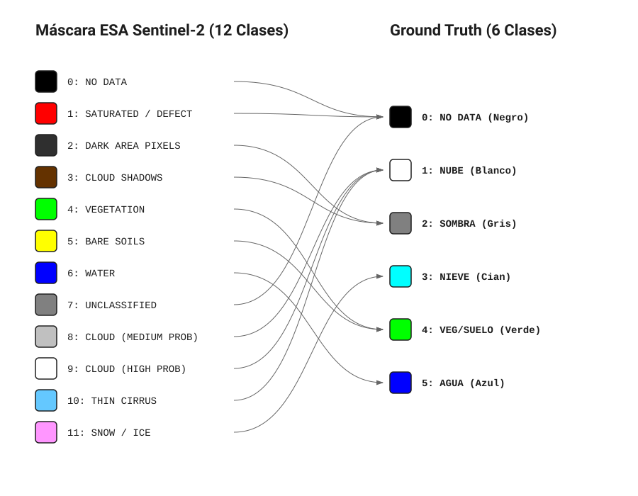
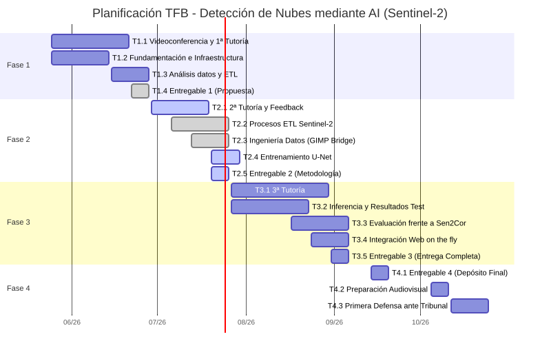

    

  

<h1 align="center" style="font-size: 3em; margin-bottom: 10px;">Trabajo Final de Grado (TFB)</h1>
<h2 align="center" style="color: #FFC000; font-size: 2em; margin-bottom: 50px;">Desarrollar un entorno escalable (pipeline geoespacial) para imágenes Sentinel-2, diseñado para integrar y ejecutar un modelo de Machine Learning</h2>

   

  <strong>Autor:</strong> Antonio López 
  <strong>Fase:</strong> Entrega 2 - Metodología y Desarrollo del Proyecto 
  <strong>Fecha:</strong> Julio 2026

     

  <strong>Página web del proyecto:</strong> <a href="https://tonilogar.github.io/tfb/tfb.html">tonilogar.github.io/tfb</a> 
  <strong>Repositorio y control de versiones:</strong> <a href="https://github.com/tonilogardev/web_basic_project/tree/main_dev_pro_tfb/011_tfb">GitHub - Master Roadmap</a>

## Resumen con palabras clave

El presente Trabajo Final de Bàtxelor (TFB) aborda una problemática crítica en el procesamiento de imágenes satelitales del programa Copernicus: la clasificación errónea de nubes y nieve por parte del algoritmo estándar Sen2Cor en zonas de alta montaña, la clasificación errónea de sombras de nubes por sombras de montañas y valles, y la detección errónea de zonas inundadas (como el Delta del Ebro) como nubes o ruido. Para solucionar esta deficiencia geométrica y espectral, se ha diseñado e implementado una metodología basada en técnicas de aprendizaje profundo (*Deep Learning*) utilizando la arquitectura de redes neuronales convolucionales U-Net. El proyecto abarca la concepción completa de un *pipeline* de datos geoespaciales centrado en la región de Cataluña (España), incluyendo la descarga automatizada de gránulos Sentinel-2, la edición y clasificación manual de máscaras mediante herramientas de edición de imágenes con GIMP y el entrenamiento del modelo. Después de evaluar los errores de un primer entrenamiento inicial con 5 clases, comprobamos que el algoritmo fallaba al detectar el mar, por lo que decidimos rediseñar el modelo añadiendo una sexta clase para aislar por completo las masas de agua. Como línea futura, la arquitectura desacoplada de inferencia se preparará para su despliegue en una infraestructura *Serverless* de alto rendimiento orientada a producción, utilizando Rust para el procesamiento óptimo de tensores. Los resultados obtenidos demuestran la superioridad de los enfoques basados en redes neuronales frente a heurísticas tradicionales en tareas complejas de Observación de la Tierra.

**Palabras clave:** *Deep Learning, Sentinel-2, Segmentación Semántica, U-Net, Observación de la Tierra, Copernicus.*

  

## Abstract

This Bachelor's Final Project (TFB) addresses a critical issue in the processing of satellite imagery from the Copernicus program: the misclassification of clouds and snow by the standard Sen2Cor algorithm in high mountain areas, the misclassification of cloud shadows as mountain and valley shadows, and the erroneous detection of flooded areas (such as the Ebro Delta) as clouds or noise. To solve this geometric and spectral deficiency, a methodology based on Deep Learning techniques has been designed and implemented using the U-Net convolutional neural network architecture. The project encompasses the complete design of a geospatial data pipeline focused on the region of Catalonia (Spain), including the automated download of Sentinel-2 granules, the manual editing and classification of masks using image editing tools with GIMP, and model training. After evaluating the errors of an initial 5-class training run, we observed that the algorithm failed to detect the sea, leading us to redesign the model by adding a sixth class to completely isolate water bodies. As a future line of work, the decoupled inference architecture will be prepared for deployment in a high-performance, production-oriented Serverless infrastructure, utilizing Rust for optimal tensor processing. The results obtained demonstrate the superiority of neural network-based approaches over traditional heuristics in complex Earth Observation tasks.

**Keywords:** *Deep Learning, Sentinel-2, Semantic Segmentation, U-Net, Earth Observation, Copernicus.*

  

## Índice interactivo

- [Glosario de Términos](#glosario-de-términos)
- [1. Introducción](#1-introducción)
- [2. Justificación](#2-justificación)
- [3. Contextualización del trabajo](#3-contextualización-del-trabajo)
- [4. Objetivos generales y específicos](#4-objetivos-generales-y-específicos)
  - [4.1. Objetivo general](#41-objetivo-general)
  - [4.2. Objetivos específicos](#42-objetivos-específicos)
- [5. Marco teórico y conceptos clave](#5-marco-teórico-y-conceptos-clave)
  - [5.1. Datos espaciales: Sentinel-2 y el espectro electromagnético](#51-datos-espaciales-sentinel-2-y-el-espectro-electromagnético)
  - [5.2. Inteligencia Artificial: La Arquitectura U-Net](#52-inteligencia-artificial-la-arquitectura-u-net)
- [6. Metodología aplicada](#6-metodología-aplicada)
  - [6.1. Instrumentos](#61-instrumentos)
  - [6.2. Materiales (Conjunto de datos)](#62-materiales-conjunto-de-datos)
  - [6.3. Recursos e infraestructura](#63-recursos-e-infraestructura)
  - [6.4. Metodología de evaluación](#64-metodología-de-evaluación)
- [7. Desarrollo viable y sostenible](#7-desarrollo-viable-y-sostenible)
  - [7.1. Temporalización e hitos](#71-temporalización-e-hitos)
  - [7.2. Alineación con los ODS y Códigos UNESCO](#72-alineación-con-los-ods-y-códigos-unesco)
  - [7.3. Condicionantes ambientales, sociales y económicos](#73-condicionantes-ambientales-sociales-y-económicos)
- [8. Proceso y resultados](#8-proceso-y-resultados)
  - [8.1. Fuentes de datos y recopilación](#81-fuentes-de-datos-y-recopilación)
  - [8.2. Exploración y preparación](#82-exploración-y-preparación)
  - [8.3. Análisis exploratorio](#83-análisis-exploratorio)
  - [8.4. Gestión y almacenamiento](#84-gestión-y-almacenamiento)
  - [8.5. Modelado](#85-modelado)
  - [8.6. Visualización y evaluación de resultados](#86-visualización-y-evaluación-de-resultados)
- [9. Discusión y limitaciones](#9-discusión-y-limitaciones)
- [10. Conclusiones y líneas futuras](#10-conclusiones-y-líneas-futuras)
- [11. Referencias Bibliográficas](#11-referencias-bibliográficas)

## Glosario de Términos

Para facilitar la lectura a evaluadores y personas no especialistas en Sistemas de Información Geográfica (GIS) se definen los siguientes términos clave utilizados en este documento:

- **Sentinel-2:** Misión de satélites ópticos de alta resolución (10 metros) perteneciente al programa europeo Copernicus.
- **Sen2Cor:** Software de la Agencia Espacial Europea (ESA) para la corrección atmosférica (incluye un detector de nubes básico que este proyecto pretende mejorar).
- **Tiling:** Técnica geoespacial que consiste en "trocear" imágenes satelitales gigantes en cuadrados más pequeños para que el ordenador pueda procesarlos sin saturar la memoria RAM.
- **OOM:** *Out of Memory* (Fuera de memoria). Colapso del ordenador por intentar cargar demasiados datos gráficos a la vez.
- **COG:** *Cloud Optimized GeoTIFF*. Formato de imagen satelital optimizado para ser consultado y procesado de forma rápida y directa en la nube.
- **PMTiles:** Formato de archivo de mapa diseñado para almacenar teselas geoespaciales en la nube de forma estática, optimizando la velocidad y coste del servidor.
- **gpkg:** *GeoPackage*. Formato de base de datos geoespacial moderno, abierto y compacto.
- **shp:** *Shapefile*. Formato de archivo informático vectorial clásico y muy extendido para almacenar sistemas de información geográfica.
- **On the fly:** Procesamiento o renderizado "sobre la marcha" o en tiempo real. Ocurre en el instante exacto en que el usuario lo solicita, sin necesidad de tener los datos pre-procesados.
- **ESA:** *European Space Agency* (Agencia Espacial Europea).
- **ACA:** Agencia Catalana del Agua.
- **ICGC:** Instituto Cartográfico y Geológico de Cataluña.
- **DEM:** *Digital Elevation Model* (Modelo Digital de Elevaciones). Representación en 3D del relieve terrestre.
- **U-Net:** Arquitectura de red neuronal convolucional diseñada para la segmentación semántica de imágenes (asignación de clases píxel a píxel).
- **Ground Truth:** (Verdad Terreno). El patrón oro o mapa de referencia perfecto que se usa para enseñar y examinar a la Inteligencia Artificial. En este proyecto se ha construido y auditado manualmente.
- **L1C / L2A:** Niveles de procesamiento de imágenes satelitales. L1C es la imagen "cruda" tal cual llega del espacio, y L2A es la imagen tras aplicarle correcciones atmosféricas algorítmicas.
- **IoU:** *(Intersection over Union)*. Métrica matemática muy estricta utilizada en Inteligencia Artificial para evaluar el porcentaje exacto de acierto espacial al predecir la forma de un objeto.
- **Recall:** (Exhaustividad). Métrica estadística que mide la capacidad del modelo predictivo para encontrar y señalar todas las nubes reales que existen en la imagen sin dejarse ninguna.
- **VRAM:** Memoria de acceso aleatorio de vídeo. Es la memoria exclusiva de las tarjetas gráficas (GPUs), la cual se colapsa al cargar imágenes espaciales inmensas si no se emplea el Tiling.
- **NDSI:** *(Normalized Difference Snow Index)*. Índice matemático adicional que resalta la reflectancia de la nieve frente a las nubes altas basándose en la luz infrarroja.

# 1. Introducción

El programa Copernicus, de la Agencia Espacial Europea (ESA) y la Unión Europea, representa actualmente uno de los mayores esfuerzos tecnológicos para la observación de la Tierra. Sentinel-2 es uno de los satélites de la constelación Copernicus, que proporciona imágenes multiespectrales de alta resolución. Los datos que estos satélites envían son fundamentales para la observación de la Tierra y su monitoreo gracias a la ingente información de series temporales, que permite el seguimiento de fenómenos globales, como el control de la agricultura de precisión, la prevención de desastres naturales, temperatura diaria, movimientos terrestres, entre otros.

# 2. Justificación

El procesamiento algorítmico de las imágenes satelitales presenta un desafío técnico de primer nivel. Para la transformación de las imágenes del programa Copernicus, la Agencia Espacial Europea (ESA) emplea el software **Sen2Cor** para la clasificación de los píxeles de las imágenes (producto *Scene Classification* o SCL). Este algoritmo estandarizado categoriza cada píxel en una de las siguientes 12 clases oficiales:

- **0**: Sin datos (*No Data*)
- **1**: Píxeles saturados o defectuosos
- **2**: Áreas oscuras
- **3**: Sombras de nubes
- **4**: Vegetación
- **5**: Suelo desnudo (no vegetado)
- **6**: Agua
- **7**: Sin clasificar
- **8**: Nubes de probabilidad media
- **9**: Nubes de alta probabilidad
- **10**: Cirros finos
- **11**: Nieve o hielo

A pesar de su adopción global y de ser el estándar de la industria, la investigación bibliográfica y la observación empírica han demostrado que Sen2Cor sufre predicciones erróneas cuando se enfrenta a geografías orográficamente complejas y heterogéneas, como es el caso de la región de Cataluña. Al basarse puramente en fórmulas estadísticas tradicionales en lugar de utilizar modelos de aprendizaje automático, Sen2Cor carece de la flexibilidad necesaria para interpretar el contexto espacial de los píxeles. Esto provoca una confusión sistemática entre elementos con firmas espectrales similares (ej. la nieve y las nubes gruesas) o morfologías oscuras (ej. las sombras orográficas frente a las sombras de nubes).

Esta limitación técnica compromete gravemente la integridad de los datos para estudios climáticos, hidrológicos y medioambientales. Frente a esta problemática, la literatura científica reciente evidencia que la aplicación de modelos de aprendizaje automático (*Machine Learning*) y, muy especialmente, de aprendizaje profundo (*Deep Learning*), supera de forma holgada a los algoritmos tradicionales. Las redes neuronales convolucionales, al poseer la capacidad de extraer patrones complejos, texturas y el contexto espacial de grandes volúmenes de datos, logran una precisión y robustez inalcanzables para la programación estática. Por consiguiente, se justifica de manera crítica la necesidad de investigar y desarrollar una solución algorítmica alternativa basada en inteligencia artificial que logre subsanar las carencias del procesador estándar europeo, garantizando una segmentación semántica fiable y de alta calidad.

# 3. Contextualización del trabajo

Para comprender el alcance del problema que aborda este proyecto, es imperativo analizar cómo y dónde falla Sen2Cor en la práctica. Al depender de reglas "If-Then" estáticas y umbrales de luz, en ecosistemas geográficamente ricos como la cordillera de los Pirineos o zonas hidrográficas como el Delta del Ebro, la algoritmia clásica colapsa, dando lugar a tres anomalías de clasificación principales:

1. **La paradoja de la Nieve:** Sen2Cor tiende a confundir de forma sistemática la firma espectral óptica de la nieve de alta montaña con frentes de nubes gruesas.
2. **La paradoja de las Sombras:** El algoritmo es incapaz de discriminar matemáticamente la sombra oscura natural que proyecta una montaña (sombra orográfica) frente a la sombra que proyecta una nube en un valle, provocando cortes abruptos y datos nulos en la cartografía. *(Nota: En el planteamiento original de este proyecto se valoró inyectar un Modelo Digital de Elevaciones -DEM- para solventar este problema, pero se desestimó asumiendo que los canales hiperespectrales serían suficientes. Tras culminar el entrenamiento, se ha constatado empíricamente que el modelo sigue sufriendo confusión entre las sombras de las nubes y las sombras del terreno escarpado. En consecuencia, se establece como línea de investigación futura la inyección de modelos topográficos).*
3. **La paradoja del Agua:** Las grandes masas de agua profunda que absorben la radiación lumínica son diagnosticadas erróneamente por el procesador de la ESA como sombras densas. Paralelamente, los campos de cultivo que contienen una gran cantidad de agua (como los humedales del Delta del Ebro) son clasificados erróneamente como masas de agua puras y no como terreno agrícola húmedo.

# 4. Objetivos generales y específicos

## 4.1. Objetivo general

Desarrollar una herramienta Web GIS escalable (*pipeline* geoespacial) diseñada para procesar imágenes del satélite Sentinel-2 e integrar modelos de *Machine Learning*. En este caso de estudio particular, la herramienta implementará y ejecutará un modelo de aprendizaje profundo enfocado en la detección de nubes sobre el territorio de Cataluña (órbitas R008 y R051), superando las limitaciones analíticas del procesador estándar Sen2Cor.

## 4.2. Objetivos específicos

Para alcanzar este fin global, el proyecto se disgrega en los siguientes hitos operativos medibles:

1. **Entrenar una arquitectura U-Net:** Diseñar y entrenar una red neuronal focalizada en el relieve de Cataluña (a partir de las órbitas R008 y R051 del satélite Sentinel-2) optimizada para la segmentación de píxeles.
2. **Construir una infraestructura de datos replicable:** Desarrollar todo el *pipeline* metodológico —desde la extracción automatizada de datos L1C en bruto mediante APIs geoespaciales, hasta su edición y clasificación manual— para construir un *Ground Truth* (Verdad Terreno) que permita a la inteligencia artificial aprender sin los sesgos de la ESA.
3. **Superar métricamente a Sen2Cor:** Resolver las tres paradojas analizadas (aislando eficientemente la nieve, el agua y las nubes) y obtener métricas de evaluación técnica rigurosas (exhaustividad -*Recall*- e *Intersection over Union*) superiores al algoritmo oficial.
4. **Desarrollar la plataforma Web GIS:** Construir la infraestructura tecnológica completa (frontend, backend y arquitectura de inferencia). Destaca el diseño de la capa de inferencia utilizando **Rust** en lugar de Python, lo que permite ejecutar el modelo matemático de forma ultra-rápida y eficiente en entornos web (*Serverless*), garantizando una visualización interactiva y dinámica de las máscaras sobre la cartografía.

# 5. Marco teórico y conceptos clave

Para comprender la solución tecnológica propuesta, es necesario asentar brevemente los pilares científicos sobre los que se sustenta la arquitectura del proyecto.

## 5.1. Datos espaciales: Sentinel-2 y el espectro electromagnético

Sentinel-2 proporciona imágenes multiespectrales, lo que significa que el satélite capta longitudes de onda lumínica más allá de lo que el ojo humano puede ver. Para que el modelo de inteligencia artificial pueda diferenciar correctamente las cubiertas terrestres, no se le alimenta con una foto normal, sino con un tensor de datos compuesto por 7 "capas" o canales simultáneos:

- **Espectro visible (Bandas 2, 3 y 4):** Azul, verde y rojo. Capturan las texturas físicas, colores naturales y sombras orográficas.
- **Infrarrojo Cercano o NIR (Banda 8):** Crítico para identificar la vegetación (que rebota el NIR) y los cuerpos de agua (que absorben el NIR y se renderizan oscuros).
- **Infrarrojo de Onda Corta o SWIR (Bandas 11 y 12):** Fundamental para romper la paradoja de la nieve. Físicamente, la nube refleja el SWIR (brilla), mientras que la nieve lo absorbe fuertemente (se oscurece).
- **NDSI (*Normalized Difference Snow Index*):** Un índice matemático pre-calculado que inyecta conocimiento físico explícito sobre el comportamiento de la nieve directamente a la red neuronal.

## 5.2. Inteligencia Artificial: La Arquitectura U-Net

Frente a la "miopía espacial" de los algoritmos tradicionales que evalúan el terreno píxel a píxel, este proyecto fundamenta su avance técnico en el **Aprendizaje Profundo (*Deep Learning*)**, concretamente en la **Visión por Computadora (*Computer Vision*)**. La arquitectura matemática elegida es la **U-Net**, programada desde cero (*From Scratch*) utilizando el *framework* PyTorch (estándar de la industria para el procesamiento de imágenes multiespectrales).

### 5.2.1. Teoría de Funcionamiento
La U-Net (Ronneberger, Fischer y Brox, 2015) es una Red Neuronal Convolucional (CNN) de última generación diseñada específicamente para la **segmentación semántica espacial**. Esta red no solo infiere qué elementos hay en una imagen (clasificación), sino que predice exactamente a qué clase pertenece cada píxel individualmente. Su nombre proviene de su característica topología matemática en forma de "U", que consta de tres mecanismos críticos:

1. **El Encoder (Ruta de Contracción/Bajada):** A medida que la imagen satelital avanza por esta ruta, la red aplica filtros matemáticos (convoluciones) y reduce agresivamente el tamaño de la imagen (mediante *Max Pooling*). En este descenso, la red pierde resolución espacial pero multiplica su profundidad, extrayendo los patrones espectrales de alto nivel. Es decir, el Encoder aprende el **"QUÉ"** (ej. aprende la firma espectral que diferencia la nieve de la nube).
2. **El Decoder (Ruta de Expansión/Subida):** Es el lado ascendente de la "U". Toma la información abstracta hipercomprimida del fondo de la red y la vuelve a escalar progresivamente hacia arriba (*Up-convolutions*) hasta recuperar el tamaño original (512x512 píxeles). Su objetivo es proyectar lo aprendido de nuevo en el espacio geográfico. Es decir, el Decoder aprende el **"DÓNDE"** (las coordenadas físicas del píxel).
3. **Skip Connections (El Secreto de la Resolución):** Si solo usáramos el Encoder y el Decoder, la imagen final saldría extremadamente borrosa tras haber sido tan comprimida. Para solucionarlo, la U-Net lanza "puentes horizontales" que conectan la bajada directamente con la subida. Estos puentes inyectan los bordes y texturas nítidas originales de alta resolución directamente en las capas de reconstrucción, logrando mapear con extrema precisión la frontera milimétrica entre la nieve y el terreno subyacente.

### 5.2.2. Diseño Arquitectónico y Estructura de Datos (*Data Shapes*)
- **Inferencia (Tratamiento de Entrada y Salida):** Al modelo se le inyecta un tensor espacial de **7 canales simultáneos**. Tras atravesar la "U", el *Decoder* expulsa **6 canales paralelos** (mapas de probabilidad o *logits* correspondientes a las 6 Clases Maestras). Una función de activación matemática (`Softmax`) evalúa cada píxel a lo largo de esos 6 canales y decide estadísticamente qué clase tiene la probabilidad más alta, colapsando el tensor tridimensional en la imagen 2D final donde cada píxel tiene un valor absoluto del 0 al 5.
- **Entradas (*Inputs - X*):** Su forma matricial es `(N, 7, 512, 512)`. Los tensores están almacenados en disco como `Float16` (reduciendo exactamente a la mitad el peso y acelerando la lectura), pero entran en la red obligatoriamente como `Float32`. Si la IA usara la baja precisión matemática de `Float16` durante el aprendizaje activo, no tendría suficientes decimales para guardar los ajustes microscópicos, redondeándolos a cero y colapsando el entrenamiento.
- **Salidas (*Outputs - Y_pred*):** Su forma es `(N, 6, 512, 512)`, representando los *logits* por Clase Maestra: 0 (Descarte), 1 (Suelo), 2 (Nube), 3 (Sombra Nube), 4 (Nieve), 5 (Agua).

### 5.2.3. Justificación de la programación "From Scratch" frente a redes pre-entrenadas
A pesar de la popularidad del *Transfer Learning* (adaptar un modelo ya pre-entrenado por terceros), en este proyecto se tomó la decisión estratégica de programar y entrenar la red U-Net totalmente desde cero (*From Scratch*). Esta decisión se fundamenta en un análisis crítico de las siguientes incompatibilidades:

- **Incompatibilidad de Entradas (Canales y VRAM):** Los modelos públicos de Sentinel-2 están rígidamente diseñados para ingerir las 10 o 13 bandas crudas del satélite. Nuestra arquitectura realiza una reducción drástica de dimensionalidad a 7 canales específicos (6 bandas filtradas + el índice NDSI). Descartar bandas irrelevantes previene el colapso de memoria de la tarjeta gráfica (OOM) y acelera el entrenamiento. Modificar la capa de entrada de un modelo pre-entrenado para que acepte 7 canales en lugar de 10 corrompe irreversiblemente sus pesos matemáticos iniciales, anulando la ventaja del *Transfer Learning*.
- **Incompatibilidad de Salidas:** Las redes pre-entrenadas genéricas suelen devolver máscaras binarias simplistas (Nube / Despejado). Este proyecto exige mapear una taxonomía semántica de 6 Clases Maestras perfectamente acotada a la geografía catalana. Adaptar un modelo externo requeriría amputar y reconstruir completamente su capa final de predicción, desestabilizando el modelo. Diseñar la topología de salida desde cero garantiza que la red asimile nuestra taxonomía de forma nativa.
- **Abundancia de Datos y Sesgo Geográfico:** El *Transfer Learning* es una técnica nacida para paliar la falta de datos. Sin embargo, el monumental esfuerzo de Ingeniería de Datos de este proyecto ha logrado extraer y curar miles de tensores espaciales específicos de Cataluña. Iniciar el entrenamiento en blanco utilizando exclusivamente esta biblioteca de datos locales asegura que el modelo aprenda la física multiespectral pura de nuestro terreno, sin heredar "sesgos geográficos" ajenos a la paradoja topográfica que intentamos resolver.
- **Superioridad de las CNN:** La literatura científica actual demuestra que las arquitecturas CNN convolucionales superan ampliamente a los algoritmos heurísticos tradicionales en la segmentación de nubes y sombras complejas multisensores, justificando el esfuerzo de diseño "From Scratch" frente a herramientas heredadas.

# 6. Metodología aplicada

Para la consecución de los objetivos planteados, el desarrollo metodológico de este proyecto se ha estructurado en tres fases estratégicas, diseñadas para romper la dependencia técnica frente al algoritmo defectuoso de la ESA y garantizar el entrenamiento de un modelo de inteligencia artificial sin sesgos.

1. **Edición y clasificación de la Verdad Terreno (*Ground Truth*):** Ante la evidencia de que las máscaras generadas por Sen2Cor arrastran errores sistemáticos en geografías complejas, se hizo imperativo generar un conjunto de datos limpio. Para ello, se extrajeron los datos en bruto y se aplicó un proceso de edición y clasificación manual de los píxeles conflictivos mediante el software de edición de imágenes GIMP, permitiendo el analisis manual de una manera comoda con herramientas de edición de imagen raster como capas, pinceles y gomas para editar y clasificar a mano las las clasificaciones erróneas basándose en el contexto orográfico real.
2. **Reducción de dimensionalidad de clases:** El estándar europeo divide el terreno en 12 categorías, aportando ruido computacional e ineficiencia. Como pilar metodológico, el *pipeline* geoespacial desarrollado colapsa matemáticamente esas 12 clases originales en **[6 Clases Maestras](008_pixel_legend.md)** de alto valor analítico: Descarte, Suelo Útil, Nube, Sombra de Nube, Nieve (objetivo principal) y Masas de Agua.
3. **Descarte topográfico por eficiencia:** En el diseño de la arquitectura de entrada, se decidió priorizar la física espectral frente a los metadatos espaciales. Se prescindió intencionadamente de inyectar un Modelo Digital de Elevaciones (DEM) para aliviar radicalmente la carga de procesamiento del futuro servidor web, demostrando que las leyes térmicas y ópticas de las bandas Infrarrojas de Onda Corta (SWIR) son suficientes por sí solas para separar la nieve de la nube.

*Figura 1: Comparativa entre las 12 clases originales de Sen2Cor y la reducción a 6 Clases Maestras optimizadas para la red neuronal.*

### Justificación Arquitectónica: Descarte temporal del DEM

Durante las fases preliminares de la arquitectura técnica del proyecto, se contempló la posibilidad de incluir un Modelo Digital de Elevaciones (DEM) como canal de entrada adicional a la red neuronal convolucional (U-Net). El propósito inicial era proporcionar a la red un contexto topográfico que le ayudara a discriminar entre nieve (típicamente a altas cotas) y nubes.

Sin embargo, tras una revisión rigurosa del estado del arte y un análisis coste-beneficio en el marco de un Trabajo de Fin de Grado (TFB), se tomó la decisión arquitectónica de desechar el uso del DEM, confiando la discriminación nube-nieve única y exclusivamente a la firma espectral de las bandas físicas.

**1. La Física Espectral es suficiente (El poder del SWIR)**

La inclusión de un DEM parte de una premisa topográfica (altitud = nieve). Sin embargo, las bandas infrarrojas de onda corta (SWIR: B11 y B12) del satélite Sentinel-2 resuelven este problema mediante las leyes de la termodinámica y la óptica:
- Las nubes reflejan fuertemente la radiación SWIR.
- La nieve, al estar compuesta por cristales de hielo y agua, absorbe masivamente la radiación SWIR, mostrándose muy oscura en estas bandas.

La red neuronal tiene, por tanto, información matemática robusta y directa para separar nieve de nube sin necesidad de recurrir a metadatos de altitud.

**Evidencia Bibliográfica**
El descarte del DEM está respaldado por los estudios y algoritmos más consolidados en teledetección:
- **Zhu & Woodcock (2012) - Fmask:** El algoritmo histórico por excelencia para enmascarado de nubes (Fmask) basa su separación nube-nieve en el cálculo del índice NDSI (*Normalized Difference Snow Index*) usando bandas del verde y del SWIR, prescindiendo totalmente de modelos topográficos.
- **Zupanc (2017) - s2cloudless:** El algoritmo de *Machine Learning* oficial utilizado por la Agencia Espacial Europea en su *Copernicus Browser* (s2cloudless, desarrollado por Synergize) se alimenta exclusiva y estrictamente de 10 bandas espectrales de Sentinel-2. Logra resultados del estado del arte sin inyectar ninguna capa de elevación.

**2. Complejidad de Ingeniería de Datos (Data Engineering)**

En el contexto de un TFB, incorporar el DEM introduce una complejidad técnica desproporcionada que no garantiza un retorno equivalente en la métrica final de precisión:
- Requiere la descarga independiente de mallas DEM altimétricas (e.g., Institut Cartogràfic i Geològic de Catalunya [ICGC], 2026).
- Exige reproyectar las mallas desde coordenadas geográficas puras al sistema cartográfico UTM específico de cada gránulo de Sentinel-2.
- Precisa un remuestreo espacial avanzado para coregistrar los píxeles del DEM a la cuadrícula estricta de 10m/20m de las bandas L1C.

**Conclusión Estratégica:**
Aunque descartamos el DEM en este proyecto para centrar el esfuerzo en la física espectral y evitar una sobrecarga innecesaria de preprocesamiento de datos, la evaluación empírica de nuestro modelo nos ha revelado que **sí será obligatorio** crear un segundo modelo futuro integrando el DEM del ICGC (*Institut Cartogràfic i Geològic de Catalunya*). Esta evolución arquitectónica será ineludible para solucionar de forma matemática el conflicto óptico de las sombras de las montañas frente a las sombras de las nubes en terrenos escarpados.

### Pipeline ETL de clasificación de píxeles (Edición y Clasificación Manual)

A continuación, se detalla el reto técnico y metodológico que supuso permitir la edición visual masiva de máscaras geoespaciales (*Scene Classification* - SCL) utilizando editores fotográficos tradicionales (como GIMP), garantizando en todo momento la preservación matemática de los datos científicos y su georreferenciación.
Sin este trabajo la edición manual de los ficheros SCL con herramientas de software SIG hubiese sido una tarea imposible, dado que los ficheros SCL son ficheros ráster de una sola banda y los editores gráficos estándar no están preparados para manejar este tipo de ficheros con herramientas de pintura. Por ello, se desarrolló un pipeline ETL para permitir la edición visual masiva de máscaras geoespaciales (*Scene Classification* - SCL) utilizando editores fotográficos tradicionales (como GIMP), garantizando en todo momento la preservación matemática de los datos científicos y su georreferenciación.

**1. El Problema Técnico (Disonancia Radiométrica)**

Las máscaras categóricas de la ESA (Sen2Cor) y las predicciones de la U-Net son rásters matemáticos de una sola banda. Sus píxeles no contienen "colores", sino valores enteros (del 0 al 5) que representan las Clases Maestras. 
Al intentar auditar manualmente estos archivos en un editor gráfico estándar, surgen dos barreras infranqueables:
- **El problema del negro absoluto:** Un editor fotográfico interpreta los archivos en una escala lineal de brillo de 8-bits (0 a 255). Un píxel con valor `4` (Nieve) tiene un brillo de apenas el 1.5%. Para el ojo humano, este valor es negro puro. Al abrir la imagen satelital, el analista solo ve un lienzo negro, imposibilitando la edición visual de las nubes o la nieve.
- **El peligro de la destrucción radiométrica:** Si el analista intenta hacer visible la imagen forzando los niveles de contraste, los valores científicos originales se destruyen irreversiblemente (el valor `4` se estira a `200` para verse gris). Si esa imagen sobrescrita se le pasa a la IA, la red colapsará al no reconocer el valor `200`. Adicionalmente, el *software* gráfico suele amputar y destruir las cabeceras espaciales (coordenadas) al guardar el archivo.

**2. Evaluación de alternativas SIG (QGIS)**

Antes de decantarnos por un editor de imagenes raster, se estudió en profundidad la viabilidad de utilizar *software* especializado en Sistemas de Información Geográfica, concretamente **QGIS**, para realizar la corrección manual de las máscaras. Si bien QGIS maneja de forma nativa la georreferenciación y la radiometría matemática, sus herramientas y *plugins* de edición resultaron ser excesivamente rígidos y lentos para una tarea que exigía un flujo de trabajo casi "artístico" (pintar a mano alzada bordes de nubes y nieve). 

Ante la ineficiencia del entorno SIG para el dibujo fluido, se procesaron las imágenes mediante *scripts* python para poder editarlas con la extrema comodidad y agilidad de un software de edición de imagenes raster puro como **GIMP**. No obstante, como futura línea de investigación, seria muy interesante crear desde cero un *plugin* nativo para QGIS que incorpore herramientas de pintura tipo "pincel digital", unificando así la agilidad fotográfica con el rigor del entorno geoespacial.

**3. La Solución: Arquitectura de Codificación y Decodificación (Encode/Decode)**

Para evitar utilizar pesadas y lentas herramientas GIS para pintar a mano millones de píxeles, diseñamos e implementamos un **Pipeline ETL de clasificación de píxeles** basado en el cambio temporal de color:

- **Fase de Codificación (*Encode*):** Desarrollamos scripts en Python (`gimp_tools.py`) que interceptan la matriz matemática (el gránulo crudo) y la transforman temporalmente en un **GeoTIFF RGB de 3 bandas a todo color**. A cada valor numérico se le inyecta su color visual (blanco puro para nube, cyan para nieve, etc.).
- **Backup Geoespacial:** La librería GDAL extrae las coordenadas y las guarda en archivos seguros auxiliares (`.tfw`), blindándolas frente a la destrucción del editor fotográfico.
- **Fase de Decodificación (*Decode*):** Una vez se realiza la edición y clasificación manual con GIMP , un script python (`003_decode_gimp_edits.py`) lee el mapa de colores manipulado, calcula el color de cada píxel hacia la paleta oficial, y re-asigna el valor categórico puro (0-5), reconstruyendo el ráster científico con su georreferencia intacta.

**4. Flujo de Trabajo Práctico**º

Gracias a este pipeline de ingeniería de datos, logramos un flujo de trabajo "Human-in-the-Loop" ágil y escalable:
1. El sistema genera los archivos visuales de colores automáticamente durante la descarga de los gránulos.
2. El investigador abre el archivo en GIMP, superpone las imágenes ópticas reales del satélite como guías semitransparentes, y utiliza el lápiz digital (sin *antialiasing*) para corregir manualmente y con suma facilidad los falsos positivos de Sen2Cor.
3. Mediante consola, se invoca el decodificador, devolviendo el arte visual a un estado matemático puro. Esta salida meticulosamente editada a mano constituye la **Verdad Terreno final** sobre la que aprende la Inteligencia Artificial.

## 6.1. Instrumentos

El desarrollo metodológico descrito se ha sustentado en los siguientes instrumentos de *software* y orígenes de datos:

- **Fuente de observación de la Tierra:** Satélite Sentinel-2 (programa Copernicus de la ESA). Se han empleado tanto los datos radiométricos en bruto (Nivel L1C) como las máscaras preexistentes del procesador oficial (Sen2Cor) a modo de base comparativa.
- **Ingeniería de datos (*Pipeline* ETL):** Lenguaje Python, utilizado para desarrollar los *scripts* de descarga automatizada, recorte de imágenes (*tiling*) y transformación bidireccional.
- **Edición y clasificación visual:** Software libre de edición de imágenes GIMP, empleado como instrumento principal para la reclasificación manual de los píxeles conflictivos.
- **Modelado de Inteligencia Artificial:** *Framework* PyTorch, estándar de la industria para el entrenamiento matemático de la arquitectura U-Net.
- **Arquitectura de despliegue web:** Lenguaje Rust, seleccionado por su extrema velocidad y eficiencia de memoria para compilar el modelo y ejecutar la inferencia en entornos *Serverless*.

## 6.2. Materiales (Conjunto de datos)

El material base sobre el que se fundamenta este Trabajo Final de Bàtxelor está compuesto por imágenes satelitales multiespectrales de Sentinel-2 (producto de reflectancia L1C) pertenecientes a las órbitas relativas R008 y R051, que cubren la totalidad del territorio de Cataluña.

Con el objetivo de maximizar la solidez del modelo ante casos geográficamente complejos (*Hard Negatives*), se ha diseñado un conjunto de datos (*Dataset*) compuesto por **[40 gránulos](003_type_granule.md)** o escenas específicas, divididas en dos grandes bloques:

1. **[Conjunto de Entrenamiento y Validación (30 gránulos)](../scripts/training_granules.csv):** Seleccionados estratégicamente para enseñar a la red neuronal a resolver las principales paradojas orográficas de Cataluña:
   - **Alta Montaña (Pirineos):** Gránulos de invierno (T31TCH, T31TDH) con nieve pura en valles y nubes bajas.
   - **Niebla Inversión Térmica:** Gránulos de invierno sobre la llanura de Lleida (T31TCG, T31TDG).
   - **Costas y Urbano:** Escenas sobre Barcelona y el mar Mediterráneo (T31TDF) para resolver la detección de bruma costera y evitar falsos positivos por naves industriales muy brillantes.
   - **Superficies Hídricas:** Gránulos sobre el Delta del Ebro (T31TCE, T31TCF) para evitar la confusión matemática entre el agua de los arrozales y las sombras oscuras de las nubes.
2. **[Conjunto de Test Ciego o *Blind Test* (10 gránulos)](../scripts/test_granules.csv):** Un bloque de validación aislado que la IA nunca observará durante la fase de entrenamiento. Consta de 10 imágenes con condiciones atmosféricas severas (ej. nieve densa cruzada por nubes en febrero, tormentas estivales en agosto sobre el mar) que servirán para evaluar el rendimiento empírico del modelo frente a Sen2Cor al final del proyecto.

## 6.3. Recursos e infraestructura

Para posibilitar el ciclo de vida completo del modelo (descarga, preprocesamiento, entrenamiento masivo e inferencia), el proyecto ha requerido una infraestructura técnica apoyada en los siguientes recursos:

- **APIs de Datos (*Copernicus Data Space Ecosystem - CDSE*):** Sistema *cloud* oficial de la Agencia Espacial Europea. Se ha empleado el protocolo OData/OpenSearch para automatizar la consulta perimetral, filtrado por porcentaje de nubes y posterior descarga masiva de los gránulos satelitales en formato comprimido.
- **Aceleración Hardware (GPUs / CUDA):** El entrenamiento de la arquitectura U-Net exige cálculos matriciales pesados (retropropagación de miles de millones de operaciones matemáticas por segundo). Se ha empleado aceleración por hardware dedicada mediante tarjetas gráficas compatibles con el ecosistema CUDA (Nvidia), posibilitando iterar sobre el conjunto de entrenamiento en tiempos logísticos viables.
- **Almacenamiento masivo intermedio:** Debido a la transformación matemática de los gránulos (10,000 x 10,000 píxeles) a matrices tensoriales Float32 subdivididas en recortes de 512x512 píxeles, la creación del conjunto de datos temporal (*tiling*) ha requerido sistemas de almacenamiento sólidos capaces de alojar grandes volúmenes de arreglos NumPy (`.npy`) sin cuellos de botella de lectura durante las épocas de entrenamiento.

## 6.4. Metodología de evaluación

Para certificar empíricamente que el modelo propio supera al estándar europeo, la fase de evaluación técnica se diseñó bajo una regla científica inquebrantable: **Bajo ningún concepto se evalúa el rendimiento estadístico de la IA contra las máscaras originales de Sen2Cor en el conjunto de Test.** 

Dado que la premisa del proyecto asume que el algoritmo tradicional comete falsos positivos sistemáticos, utilizar su salida como "verdad absoluta" generaría una paradoja estadística donde el sistema informático penalizaría a la U-Net precisamente en los casos en los que acierta corrigiendo los errores de la ESA. Por ello, el flujo de evaluación establecido es el siguiente:

1. **Frontera de Aislamiento (*Blind Test*):** Se utilizan los 10 gránulos de condiciones atmosféricas extremas reservados exclusivamente para evaluación.
2. **Edición Perfeccionista:** Se aplica una edición y clasificación manual exhaustiva sobre todos y cada uno de los píxeles conflictivos de esos 10 gránulos (apoyado en herramientas SIG), generando una Verdad Terreno validada objetivamente por el humano.
3. **Cálculo de Métricas Científicas:** Las predicciones emitidas por la red neuronal se enfrentan exclusivamente a esta nueva Verdad Terreno perfecta. Para cuantificar la precisión espacial y la robustez analítica del modelo, se definieron como indicadores de éxito las métricas estándar de la industria en segmentación semántica de imágenes:
   - **Intersection over Union (IoU):** Para medir la superposición geométrica exacta entre la nube/nieve predicha por el modelo y la nube/nieve real.
   - **F1-Score:** Media armónica entre la precisión y la exhaustividad (*Recall*), vital para evitar métricas engañosas en clases desbalanceadas geográficamente (como la nieve).
   - **Precisión global (*Accuracy*).**

La comparativa final de estas métricas entre las predicciones del modelo U-Net y las máscaras generadas por el algoritmo oficial Sen2Cor permitirá demostrar, de forma cuantitativa, el salto de precisión logrado frente al estándar de la ESA.

# 7. Desarrollo viable y sostenible

En la era del *Big Data*, el desarrollo de proyectos tecnológicos masivos exige un compromiso íntegro con la sostenibilidad. Este caso de estudio ha sido orquestado bajo tres perspectivas fundamentales de viabilidad y ética: ambiental, social y económica.

## 7.1. Temporalización e hitos

La complejidad de orquestar un *pipeline* geoespacial masivo interconectado con modelado predictivo exige un control de tareas meticuloso. Atendiendo al calendario del TFB, a continuación se detallan las fases alcanzadas y planificadas:

### Fases de Ejecución (Desarrollo *End-to-End*):

Este proyecto trasciende el mero análisis estadístico aislado para constituirse como una solución tecnológica integral (*End-to-End*). El ciclo de vida de la herramienta abarca desde la idea inicial, la investigación de los requisitos de la Agencia Espacial Europea (ESA) para el acceso a datos de satélite, la adquisición cruda de la información espacial, la preparación y limpieza de datos, el entrenamiento del modelo, la evaluación científica y la puesta en producción, edición manual ETL con software de imagen, flujos ETL automatizados para extracción de gránulos vía API, edición manual con software de imagen hasta la puesta en producción de una herramienta web fusionando Ingeniería de Datos (*Data Engineering*), *Machine Learning* y *DevOps/Web Development*.

1. **Fase 1 - Fundamentación e Ingeniería de Datos (Completada):** Conceptualización del problema analítico, evaluación teórica de los sensores de la ESA, viabilidad técnica de los datos y primer planteamiento arquitectónico.
2. **Fase 2 - Arquitectura MLOps y Modelado (Actual - 60%):** Programación y automatización del flujo de datos ETL masivo para extracción de gránulos vía API. Diseño y colapso de la matriz de características. Refinamiento e investigación del concepto *Ground Truth Humano*. Entrenamiento algorítmico de la red neuronal convolucional (U-Net) y justificación estadística de la pérdida paramétrica. Para garantizar la reproducibilidad científica y técnica, todo el código fuente de esta orquestación se encuentra versionado en un repositorio público de GitHub, estando cada *script* rigurosamente documentado mediante *Docstrings* bajo estándares de ingeniería de *software* profesional.
3. **Fase 3 - Inferencia Cloud y Validaciones (Próxima):** Ejecución algorítmica sobre un set de Test puro y sin contaminar para su validación científica frente al algoritmo nativo Sen2Cor. Paralelamente, se iniciará el proceso de desacople del modelo para preparar su despliegue en infraestructuras *Cloud*.
4. **Fase 4 - Despliegue Web y Defensas (Definitiva):** Cierre del ciclo tecnológico mediante el desarrollo de una Aplicación Web que servirá el modelo entrenado, permitiendo inferencias *on-the-fly* a nivel de usuario. Culminará con el empaquetado del trabajo escrito y la creación de las defensas argumentativas interactivas.

*Figura 2: Diagrama de Gantt ilustrando el cronograma general del proyecto.*

## 7.2. Alineación con los ODS y Códigos UNESCO

El rigor académico y técnico de este Trabajo Final de Bàtxelor se enmarca dentro de las clasificaciones científicas internacionales y persigue un impacto directo en la sostenibilidad global.

### Códigos UNESCO
La naturaleza de la investigación se clasifica bajo los siguientes códigos nomencladores:
- **1207.94 (Aprendizaje automático):** Justificado por el entrenamiento de un modelo de *Deep Learning* (Redes Neuronales U-Net) para la segmentación semántica de imágenes satelitales.
- **1203.93 (Cloud Computing):** Aplicado en el diseño y despliegue del entorno escalable (*pipeline* geoespacial) y la futura infraestructura de procesamiento *online*.
- **1203.96 (Bases de Datos):** Requerido para la orquestación y estructuración de la arquitectura orientada a la nube mediante formatos geoespaciales optimizados (*Cloud Optimized GeoTIFF* y *PMTiles*).

### Objetivos de Desarrollo Sostenible (ODS)
El impacto del análisis geográfico desarrollado está firmemente cimentado sobre el marco de los Objetivos de Desarrollo Sostenible de las Naciones Unidas:
- **ODS 9 (Industria, Innovación e Infraestructura):** El proyecto construye una infraestructura tecnológica geoespacial innovadora que mejora sustancialmente las capacidades de procesamiento y análisis de datos de la industria satelital europea.
- **ODS 13 (Acción por el clima):** La monitorización precisa de la superficie terrestre (diferenciando de forma empírica y fiable la nieve de la nubosidad) proporciona datos limpios y veraces, fundamentales para evaluar el impacto del cambio climático y facilitar la gestión estratégica de los recursos hídricos en el territorio de Cataluña.

## 7.3. Condicionantes ambientales, sociales y económicos

### Condicionantes Ambientales (*Green Computing*)
El proceso de entrenamiento de grandes redes neuronales exige ciclos masivos de cómputo gráfico (GPU), los cuales requieren un gasto de energía eléctrica considerable y, por ende, generan una huella de carbono subyacente. Para transformar este proyecto en un desarrollo sostenible medioambientalmente:
- Se ha diseñado una técnica algorítmica denominada **Tiling**, que fragmenta las imágenes satelitales y somete a evaluación matemática la riqueza de datos de cada cuadrante. Si un área geográfica contiene predominantemente datos nulos (ej. océano negro o franjas vacías), el parche no se procesa ni se envía a la tarjeta gráfica. Esta optimización algorítmica reduce el gasto energético del *hardware* drásticamente.
- A nivel aplicativo, el modelo resultante facilitará a organismos como la **Agencia Catalana del Agua (ACA)** una herramienta computacional robusta para monitorizar el deshielo pirenaico y las cuencas fluviales, actuando como un escudo tecnológico en la prevención y gestión eficiente de la sequía. Asimismo, resultará de valor para el **Institut Cartogràfic i Geològic de Catalunya (ICGC)**, al permitir la generación automática de mosaicos territoriales ortofotográficos completamente limpios de nubosidad. Por extensión, esta tecnología democratiza el acceso a máscaras espaciales de alta fidelidad para cualquier universidad, institución o empresa privada que requiera imágenes nítidas para realizar estudios sobre el terreno, monitorización de masas forestales, control de plantaciones agrícolas o detección de construcciones ilegales. Además, su arquitectura altamente escalable permite la futura integración de nuevas constelaciones satelitales (como los datos de temperatura superficial de Sentinel-3 y los datos de radar SAR de Sentinel-1). Esta fusión multisensor posibilitará calcular el volumen y la estabilidad térmica de las masas de nieve en los Pirineos para predecir el riesgo de aludes, así como detectar corrimientos y movimientos de tierra con precisión milimétrica.

### Condicionantes Sociales y Replicabilidad Científica (Open Source)
Los mapas satelitales defectuosos generan decisiones tardías y perjudiciales. Al proporcionar a los profesionales del territorio (ej. agricultores del Delta del Ebro o responsables de parques naturales) máscaras geoespaciales infalibles y sin errores, se promueve un ecosistema de información civil libre de sesgos y de altísima calidad. La democratización de estos datos empíricos habilita respuestas gubernamentales mucho más ágiles en momentos críticos como sequías, inundaciones o grandes incendios forestales.

Bajo la premisa innegociable de la **Replicabilidad Científica**, tanto los datos satelitales de la ESA como la totalidad de la arquitectura de código subyacente de este proyecto son de dominio público y código abierto (*Open Source*). El *pipeline* completo de ingeniería se encuentra alojado y versionado en el repositorio de **GitHub**. Para asegurar que la investigación académica pueda ser auditada, heredada y ejecutada por cualquier entidad científica del mundo, todo el ecosistema de *scripts* (desde la extracción en red OData hasta el orquestador de inferencia PyTorch) ha sido programado de forma modular y está exhaustivamente documentado internamente mediante *Docstrings* técnicos. Esto permite que cualquier usuario o investigador, con independencia de su presupuesto informático, pueda clonar el repositorio, comprender línea a línea el flujo de tensores, reproducir exactamente los mismos modelos matemáticos y utilizar este trabajo como núcleo tecnológico para desplegar nuevos sistemas GIS a escala global.

### Condicionantes Económicos
Para garantizar que la metodología pueda ser heredada sin restricciones financieras, toda la orquestación del proyecto huye del *software* propietario:
- Se ha empleado íntegramente código abierto (lenguajes Python y Rust, junto al *framework* PyTorch).
- Para el crítico proceso de edición y clasificación manual de píxeles (forja del *Ground Truth*), se ha utilizado GIMP, una alternativa libre y gratuita que democratiza el acceso a la edición cartográfica de alto nivel.
- Las fuentes de datos provienen del catálogo abierto de la Unión Europea a través de la API OData de Copernicus.
- A largo plazo, el despliegue del *software* mediante estándares geoespaciales modernos permite operar en un entorno web *Serverless* de ínfimo coste en la nube, eliminando la dependencia de servidores dedicados costosos.

# 8. Proceso y resultados

Este complejo apartado detalla la ejecución técnica integral del *pipeline* geoespacial. Antes de desglosar las entrañas del código y las métricas, es fundamental entender el flujo narrativo del desarrollo.

### Cronología de Decisiones Críticas y Puntos de Inflexión (Pivotes Arquitectónicos)
El desarrollo de todo el proyecto no fue lineal, sino un proceso puramente iterativo y empírico. Para gestionar la extrema complejidad del proyecto, se adoptaron los estándares actuales de la industria tecnológica basados en metodologías de desarrollo ágil (alineadas con el marco de trabajo *Scrum*). Trabajar bajo esta estricta filosofía permitió abandonar el rígido modelo de diseño tradicional a favor de un enfoque altamente adaptativo: probar iterativamente, detectar fallos rápido y corregir de inmediato. A lo largo del ciclo de vida del *software*, la investigación colisionó con severas barreras físicas y matemáticas que exigieron paradas de emergencia, iteraciones continuas de evaluación (*sprints* analíticos) y cambios estratégicos drásticos de rumbo (*pivotes* arquitectónicos):

- **Paso 1. El Choque con el Estándar (Sen2Cor):** Comenzamos la investigación asumiendo la validez de la máscara oficial de la ESA. Sin embargo, al auditar visualmente el relieve de los Pirineos nevados, descubrimos el error catastrófico del algoritmo, que era incapaz de separar la nieve del hielo y de la nube. **Decisión:** Paramos la investigación pasiva y decidimos construir desde cero (*From Scratch*) nuestra propia Red Neuronal U-Net inyectándole el índice físico NDSI.
- **Paso 2. El Dilema Topográfico (Descarte del DEM):** Para solucionar el solapamiento entre las sombras de las montañas y las sombras de las nubes, la arquitectura inicial contempló inyectar el Modelo de Elevaciones (DEM) de Cataluña. **Decisión:** Tras un arduo análisis de coste y beneficio, frenamos su integración para apostar ciegamente por la pura termodinámica espectral (bandas SWIR). Aunque asumíamos un rendimiento más moderado en las sombras, logramos un procesamiento ultrarrápido y ecológico (*Green Computing*).
- **Paso 3. La Rebelión del Agua (El *Sun Glint*):** Durante las primeras épocas de entrenamiento con 5 clases, las inferencias sobre el Mediterráneo y los arrozales del Delta del Ebro colapsaron. El sol, al reflejarse especularmente en el mar (*Sun Glint*), cegaba a la red neuronal, haciéndole predecir inmensos bancos de nubes inexistentes. **Decisión:** Frenamos la fase de modelado de inmediato, retrocedimos a la etapa de Ingeniería de Datos y rediseñamos el espacio latente matemático, creando forzosamente una 6ª Clase exclusiva para las Masas de Agua.
- **Paso 4. El Límite Computacional y el Salto al Vacío (Rust):** Una vez logrado el modelo perfecto (alcanzando el 99.99% de IoU en la detección de nieve), las simulaciones de inferencia masiva en el servidor web colapsaron la memoria RAM generada por el lenguaje Python. **Decisión:** Asumir el reto formativo definitivo y pivotar la arquitectura de producción de despliegue hacia un ecosistema de microservicios *Serverless* programado asíncronamente en lenguaje **Rust**.

A continuación, se documenta técnicamente cómo se ejecutó y superó cada una de estas fases.

## 8.1. Fuentes de datos y recopilación (Ingeniería de Ingesta)

La materia prima de este proyecto procede del programa Copernicus de la Agencia Espacial Europea (ESA), específicamente de la constelación Sentinel-2. Dado el masivo volumen de información requerido para entrenar redes neuronales profundas (terabytes de datos), la descarga manual a través de interfaces gráficas o portales web resultaba logísticamente inviable, forzando el diseño arquitectónico de un módulo automatizado de extracción masiva (*Pipeline ETL*).

### El problema topológico: API STAC vs API OData
Durante la fase de diseño de la orquestación de datos, la Agencia Espacial Europea transicionó su histórico portal *SciHub* hacia el nuevo ecosistema *Copernicus Data Space Ecosystem (CDSE)*. Se investigaron en profundidad dos protocolos analíticos de acceso a la infraestructura europea:
- **API STAC (*SpatioTemporal Asset Catalog*):** Aunque es el estándar actual más ágil para búsquedas espaciales, presentaba un bloqueo técnico insalvable para nuestro caso de uso. STAC requiere que la geometría de la búsqueda espacial intersecte obligatoriamente con el polígono dinámico de captura del satélite. Dado que el catálogo europeo indexa mediante polígonos irregulares que sufren distorsiones en los bordes orbitales, esto provocaba que una simple petición STAC para el Pirineo devolviera en ocasiones gránulos fragmentados o capturas topológicamente incompletas.
- **API OData (*Open Data Protocol*):** Al ser un protocolo de consulta de nivel más bajo, nos permitió interrogar directamente la base de datos relacional de la ESA filtrando explícitamente por el código alfanumérico exacto de la baldosa geográfica (*Tile ID*, ej. T31TCH) ignorando de facto las colisiones poligonales defectuosas del catálogo.

Para asegurar un flujo ininterrumpido y matemáticamente perfecto de escenas cuadradas completas de 10980x10980 píxeles, se tomó la decisión estructural de programar el orquestador utilizando la persistencia rígida de la **API OData**.

A través del *script* [`sentinel_downloader.py`](../scripts/sentinel_downloader.py), el sistema lee los listados de metadatos curados y ejecuta de forma iterativa y autónoma:
1. Petición criptográfica y refresco continuo de *tokens* de acceso temporales (*OAuth 2.0*) a la infraestructura europea, sorteando los cortafuegos y cuellos de botella de seguridad institucionales.
2. Búsqueda perimetral algorítmica y orquestación de colas de descarga asíncronas para exprimir al máximo el ancho de banda del canal de red.
3. Descarga exclusiva y quirúrgica de las bandas físicas del producto crudo L1C (Visible, Infrarrojo Cercano y SWIR puro, sin los sesgos de la corrección atmosférica oficial) y extracción paralela de la máscara SCL del producto L2A, la cual será utilizada como el borrador fundacional para esculpir manualmente nuestra Verdad Terreno.

## 8.2. Exploración y preparación

Una vez descargados los gránulos crudos (archivos `.jp2`), se transforman en estructuras matemáticas legibles por la red neuronal. A través del *script* [`004_create_dataset.py`](../scripts/004_create_dataset.py), se orquesta un proceso automático de ingeniería de datos y preparación espacial:

1. **Alineación espacial (Coregistro):** Sentinel-2 captura bandas a diferentes resoluciones nativas. El algoritmo lee la banda B02 a 10 metros de resolución y utiliza interpolación bilineal para remuestrear las bandas Infrarrojas de Onda Corta (SWIR, nativas a 20m) a esa misma resolución de 10m. Esto garantiza que todos los píxeles del tensor final estén perfectamente superpuestos espacialmente sin pérdida de continuidad.
2. **Ingeniería de Características (*Feature Engineering*):** Se calcula matemáticamente el Índice NDSI (*Normalized Difference Snow Index*) operando matricialmente la banda Verde (B03) y la primera banda SWIR (B11). Este resultado se apila como una séptima banda adicional en el cubo de datos, inyectando conocimiento físico explícito sobre la nieve en la red neuronal.
3. **Mosaico y purgado (*Tiling y Void Filtering*):** La imagen de satélite original roza los 10000x10000 píxeles, un volumen inasumible para la memoria de cualquier tarjeta gráfica comercial (*Out of Memory*). El sistema trocea la imagen dinámicamente en miles de parches o recortes de 512x512 píxeles. Durante este proceso, se evalúa estadísticamente el contenido de cada recorte: si más del 90% del área contiene datos nulos o de descarte (mar profundo), el parche se purga y no se exporta a disco duro, agilizando de forma superlativa los tiempos de entrenamiento posteriores.

### Reducción de Dimensionalidad (Colapso a 6 Clases Maestras)

Entrenar una red neuronal para discernir entre las 12 clases oficiales de la ESA resultaría en un modelo ineficiente, con un espacio latente matemáticamente sobredimensionado y tiempos de convergencia lentísimos. Mediante una profunda revisión analítica, se diseñó un proceso de colapso físico que agrupa las firmas espectrales lógicas en **6 Clases Maestras**:
- **Clase 0 (Descarte):** Píxeles ciegos del sensor o bordes geográficos sin datos. Durante el modelado, la red neuronal anulará activamente cualquier función de pérdida sobre estas áreas matemáticas (`ignore_index=0`), ahorrando millones de ciclos inútiles de cálculo y purificando la generalización.
- **Clase 1 (Suelo):** Toda superficie reflectante base como tierra, roca, asfalto y clorofila vegetal.
- **Clase 2 (Nube):** Simplificación drástica agrupando nubes densas y cirros de alta altitud, dado que ambos suponen objetivamente una "obstrucción atmosférica".
- **Clase 3 (Sombra Nube):** Oscurecimiento proyectado sobre el terreno.
- **Clase 4 (Nieve):** Superficies congeladas puras (Nuestro Objetivo de Control primordial).
- **Clase 5 (Masas de Agua):** Mar abierto, lagos y deltas.

### Prevención de la "Disonancia Cognitiva" Analítica

En una aproximación *naive*, podría parecer lógico fusionar la "Sombra de nube" con la propia "Nube", ya que ambas conforman el "ruido meteorológico" a eliminar de los mapas finales. Sin embargo, en el crudo paradigma del *Machine Learning*, esto supone un antipatrón arquitectónico letal. 

Una nube física refleja intensamente la radiación (el satélite capta valores altísimos, píxeles fotométricamente radiantes y blancos), mientras que una sombra absorbe casi toda la luz solar (valores espectrales ínfimos, píxeles negros). Si forzamos a la matriz de pesos convolucionales de la U-Net a agrupar un extremo blanco absoluto con un extremo negro puro bajo un mismo identificador lógico matemático (ej. Clase 2 conjunta), la red sufriría una gravísima **disonancia cognitiva**. Al no hallar fronteras de hiperplano viables para separar y clasificar ambas naturalezas lumínicas al mismo tiempo, los gradientes de aprendizaje colapsarían. Por ello, la segregación innegociable de estas firmas espectrales opuestas en dos clases distintas (Clase 2 y Clase 3) fue un hito de diseño imperativo y no negociable para lograr la convergencia exitosa del modelo de Inteligencia Artificial.

## 8.3. Análisis exploratorio

Previo a la fase intensiva de modelado, se llevó a cabo un análisis visual y estadístico de los parches generados. Al prescindir de un Modelo Digital de Elevaciones (DEM), la exploración se centró puramente en la respuesta espectral física de las bandas.

Esta fase exploratoria fue crucial para diagnosticar empíricamente el comportamiento de los casos geográficos más complejos (*Hard Negatives*):
1. **Sombras orográficas y humedad extrema:** Se observó visualmente que las grandes sombras proyectadas por el relieve montañoso de los Pirineos, así como las zonas terrestres con saturación de humedad, generaban confusión espectral y propiciaban falsos positivos en la clasificación original.
2. **Clasificación errónea de sombras nubosas:** Se detectó de forma repetida que el algoritmo oficial de la ESA catalogaba las sombras proyectadas por formaciones nubosas densas directamente como "No Data" (ausencia de información), lo cual corrompía severamente la continuidad espacial de la imagen.
3. **Auditoría humana:** Para evitar sesgar a la red neuronal con los errores nativos de la Agencia Espacial Europea, se empleó el editor de imágenes *Open Source* GIMP como herramienta de análisis exploratorio. A través del *script* [`003_decode_gimp_edits.py`](../scripts/003_decode_gimp_edits.py), el analista inspeccionó los canales espaciales y editó manualmente los píxeles erróneos de Sen2Cor, aislando el ruido algorítmico y forjando una Verdad Terreno (*Ground Truth*) de alta fidelidad.
4. **Anomalías Agrícolas (El Delta del Ebro):** Un hallazgo empírico crítico durante la fase de curación fue la detección masiva de píxeles "negros" y "azules" (clasificados como mar profundo) en el interior continental de la desembocadura del Delta del Ebro. Estas anomalías correspondían a la campaña de siembra de los arrozales: capas de agua dulce extremadamente someras mezcladas con brotes de vegetación verde que confundían por completo el árbol de decisiones de Sen2Cor. Al interceptar visualmente estos recortes espaciales, se aislaron estas parcelas geométricas y se reclasificaron manualmente con el pincel digital hacia su verdadera categoría física. Este colosal esfuerzo evitó que la red neuronal heredase un sesgo crónico de la ESA al sobrevolar e inferir zonas agrícolas masivamente inundadas.
5. **Casos Extremos (El efecto confeti):** En situaciones atmosféricas límite (*Hard Negatives*), como la presencia de cirros de hielo sumamente finos sobrevolando los altos picos nevados de los Pirineos, el algoritmo europeo entra en colapso generando un agudo "ruido de confeti", clasificando píxeles aleatorios de forma errática y altamente fragmentada. En estos escenarios críticos, la mecánica de edición visual demostró ser verdaderamente salvadora: a nivel operativo resultó mucho más eficiente borrar la máscara oficial completa y redibujar a mano alzada el contorno real de la masa nubosa, garantizando una topología limpia y coherente para la red neuronal algorítmica.

## 8.4. Gestión y almacenamiento

Tras el preprocesamiento, el masivo volumen de datos generado supone un reto logístico de almacenamiento y lectura. La transformación de los 40 gránulos satelitales en recortes de 512x512 píxeles origina decenas de miles de archivos matriciales independientes. Su gestión técnica se ha resuelto bajo dos paradigmas:

1. **Almacenamiento físico estructurado:** Los recortes que superan el filtro de descarte se almacenan en una unidad de estado sólido (SSD) en formato binario puro `.npy` (estándar de la librería NumPy para máxima velocidad de I/O). Se organizan jerárquicamente en el directorio `dataset/patches/train/<id_granule>/`.
2. **Gestión de memoria dinámica (*Lazy Loading*):** Para evitar el colapso absoluto de la memoria RAM del sistema (*Out of Memory*), la clase programada en el *script* [`dataset.py`](../scripts/dataset.py) actúa como orquestador entre el disco duro y la tarjeta gráfica. Durante el modelado, este componente no carga el *dataset* entero de golpe; escanea los directorios y transfiere pequeños lotes de parches a la memoria VRAM estrictamente bajo demanda, vaciándola inmediatamente después de su procesamiento matemático.

### Optimización Binaria y Prevención del Colapso Aritmético (Float16 vs Float32)

Un reto silente pero demoledor en el campo del *Deep Learning* espacial es la gestión del volumen físico en disco frente a la exigencia de alta precisión en el cálculo neuronal matricial. Para resolver esta grave fricción, se diseñó e implementó una estrategia asimétrica de tipado de datos (*Data Typing*):
- **Almacenamiento Estático Constreñido (Float16):** Todos los recortes satelitales procesados se exportan a los discos de estado sólido (SSD) serializados numéricamente bajo media precisión de coma flotante (`Float16`). Esta drástica reducción arquitectónica divide exactamente a la mitad el peso masivo del *dataset* bruto (ahorrando terabytes de almacenamiento) y acelera exponencialmente las altísimas velocidades de transferencia (I/O) durante las épocas de entrenamiento.
- **Inferencia en Memoria Volátil (Float32):** Sin embargo, cuando el tensor cruza el bus de datos hacia el núcleo de la tarjeta gráfica y la red neuronal convolucional comienza a ajustar sus millones de pesos mediante derivadas parciales microscópicas, mantener el uso de media precisión provocaría un desbordamiento inferior aritmético catastrófico (*Underflow*). El procesador CUDA no tendría suficientes decimales lógicos para almacenar diferenciales tan ínfimos, redondeando matemáticamente el gradiente del error a cero y colapsando el aprendizaje de forma irreversible. Por ello, el cargador de datos inyecta dinámicamente un operador escalar subyacente que "infla" y recompone la matriz dentro de la memoria volátil VRAM devolviéndola a precisión matemática completa (`Float32`), protegiendo de esta forma la topología fractal del modelo sin castigar el almacenamiento permanente de la máquina.

## 8.5. Modelado

El núcleo analítico de la investigación recae en el diseño y entrenamiento de una red neuronal convolucional profunda. Para esta exigente tarea de segmentación semántica (clasificación matemática inferencial píxel a píxel), se ha implementado la reconocida arquitectura **U-Net** utilizando el robusto *framework* PyTorch (definida explícitamente en el *script* de modelado matricial [`model.py`](../scripts/model.py)).

### Justificación Científica del Enfoque Arquitectónico

Durante la fase de diseño matemático de la Inteligencia Artificial, se evaluaron diversas aproximaciones empleadas en la literatura científica para la teledetección de nubes. Finalmente, se adoptó por unanimidad técnica un **modelo unificado *Single-Date*** (una única red neuronal omnisciente para toda la orografía de Cataluña que realiza sus predicciones analizando un único instante temporal estático, sin necesitar en absoluto el registro histórico de los días o semanas anteriores) frente a otras alternativas lógicas que fueron categóricamente desestimadas:

- **Hipótesis Descartada 1 (Sobreajuste Espacial / Spatial Overfitting):** Podría haberse planteado el entrenamiento de un modelo "experto" y aislado exclusivamente para el gránulo de los Pirineos y otro distinto para el litoral plano de Barcelona. Sin embargo, en el campo del *Deep Learning*, las redes neuronales tienden insidiosamente a memorizar el fondo estático (ciudades, valles, carreteras) en lugar de aprender verdaderamente la intrincada física termodinámica de las nubes. Si el modelo memoriza fotográficamente el paisaje subyacente, fallará de forma catastrófica ante un simple cambio de uso del suelo (ej. la construcción de una nueva autovía) o ante una severa nevada fuera de temporada temporal. La literatura científica de vanguardia demuestra fehacientemente que una red convolucional debe nutrirse de parches e imágenes globalmente distribuidas para obligarla a desarrollar **Invarianza Espacial**.
- **Hipótesis Descartada 2 (Deriva del Concepto y Detección de Anomalías):** Otra aproximación intelectualmente intuitiva es el análisis multi-temporal: alimentar al algoritmo con una imagen ideal "100% despejada" del territorio y enseñarle a clasificar como "nube" cualquier alteración lumínica posterior. El problema físico letal de este enfoque es la Deriva del Concepto (*Concept Drift*). La superficie del planeta Tierra muta a diario: una llanura verde intensa en primavera amarillea y se seca en verano, la cota de nieve bascula en invierno, y un río se desborda y se ensancha espectacularmente en otoño. Un modelo anclado en la detección de anomalías clasificaría ciegamente todos estos cambios naturales estacionales como nubes, generando tasas masivas e inaceptables de falsos positivos y requiriendo un colosal gasto energético computacional, al depender perpetuamente del arrastre en memoria de historiales masivos de imágenes previas.

La estrategia *Single-Date* elegida asume de forma proactiva el dificilísimo reto analítico de forzar a la U-Net a aprender genuinamente la firma espectral física de la nube y la nieve, sin permitirle utilizar atajos o trampas geográficas. Al lograrlo, se garantiza una inferencia matemática ágil, veloz y extraordinariamente ligera, perfecta para ser desplegada en entornos de producción *Cloud*.

### El paradigma del "Transfer Learning" frente a la Programación "From Scratch"

Otra de las decisiones arquitectónicas más trascendentales debatidas durante la fundamentación teórica del modelado fue declinar formalmente el uso de modelos de *Deep Learning* pre-entrenados públicos (como los vastamente ofrecidos por repositorios genéricos) para optar por programar y entrenar la red neuronal desde el absoluto cero matemático (*From Scratch*). Esta ruptura técnica se fundamentó en tres incompatibilidades estructurales insalvables para el rigor científico de nuestro caso de uso:

- **Incompatibilidad de Tensores (Colapso de VRAM):** Los modelos pre-entrenados públicos adaptados a Sentinel-2 están rígidamente blindados para ingerir en su capa de entrada las 10 o 13 bandas crudas nativas del satélite. Nuestra arquitectura innovadora realiza una agresiva y selectiva reducción de dimensionalidad a **7 canales específicos** (6 bandas vitales + índice NDSI). Inyectar el índice sintético NDSI desde el principio fuerza matemáticamente a la matriz a prestar atención a la termodinámica de la nieve. Alterar quirúrgicamente la capa de entrada convolucional de un modelo externo (para que acepte 7 canales en lugar de 10) destruiría irremediablemente sus pesos matemáticos pre-aprendidos, anulando la supuesta ventaja temporal del *Transfer Learning* e induciendo fallos por sobrecarga de canales.
- **Incompatibilidad Semántica (Taxonomía Rígida):** Las redes genéricas heredadas suelen devolver máscaras simplistas (Nube o No Nube). Este proyecto despliega una topología final de 6 Clases Maestras calibradas expresamente para el ecosistema catalán. Adaptar un modelo requeriría amputar de cuajo su capa final de salida (el *Decoder*), provocando una severa inestabilidad en toda la red.
- **Inmunidad al Sesgo Geográfico:** Históricamente, el *Transfer Learning* nació como un salvavidas estadístico ante la asfixiante falta de datos de entrenamiento en el sector médico y militar. Sin embargo, gracias al gigantesco esfuerzo de nuestro *Pipeline ETL* automatizado, logramos generar decenas de miles de tensores locales ultraprecisos. Iniciar el entrenamiento de la U-Net totalmente "en blanco" nos garantizó que la matriz asimilara exclusiva y puramente la física espectral local del terreno pirenaico, evitando a toda costa heredar peligrosos "sesgos geográficos" latentes de modelos que tal vez fueron pre-entrenados observando estepas siberianas o atolones oceánicos.

### Arquitectura Matemática y Orquestación del Aprendizaje

El modelado algorítmico se articula en tres formidables pilares estructurales:
1. **Topología de Red (Encoder-Decoder con *Skip Connections*):** La ruta matemática de contracción (*Encoder*) comprime espacialmente el inmenso tensor de entrada (compuesto por 7 densos canales: 6 bandas físicas satelitales + 1 canal sintético inyectado con el índice NDSI de nieve), extrayendo patrones semánticos y texturas muy profundas. A continuación, la ruta paralela de expansión (*Decoder*) restaura matemáticamente la resolución hiperdetallada original de 10 metros, apoyándose transversalmente en conexiones residuales (*Skip Connections*) que inyectan el contexto espacial que irremediablemente se pierde durante la compresión. Este exquisito diseño topológico es vital para poder delinear con precisión micrométrica las enrevesadas y fractales fronteras limítrofes entre las capas de nieve y los bordes difusos de las nubes.
2. **Puente de Memoria Dinámica (Cargador de Tensores / DataLoader):** Actuando como un maestro orquestador entre el disco sólido SSD y los escasos recursos de la VRAM de la tarjeta gráfica libre (CUDA), un *script* algorítmico personalizado intercepta e infla volumétricamente las matrices comprimidas, pasando de un formato de coma flotante de media precisión (Float16) a precisión completa (Float32). Este complejo paso intermedio garantiza la máxima integridad en el cálculo del gradiente tensorial y evita desbordamientos aritméticos irreversibles (*Underflows*). Adicionalmente, el cargador segrega estadísticamente los datos (con una semilla generadora de números pseudoaleatorios para fijar el determinismo científico), blindando un 80% de los parches para el entrenamiento bruto y un 20% incorruptible para la fase de validación continua.
3. **Optimización Paramétrica de la Función de Pérdida (Loss Function):** El motor de aprendizaje iterativo está regido en exclusiva por la función matemática de castigo y recompensa estocástica `CrossEntropyLoss`. Crucialmente, a esta estricta métrica de evaluación se le inyecta un escudo protector (el hiperparámetro `ignore_index=0`). Este candado lógico prohíbe explícitamente a la red penalizarse a sí misma o alterar sus pesos por equivocarse en las zonas del mapa catalogadas como ceguera espacial, bordes sin datos o descarte marino profundo. Durante cada iteración de la propagación hacia atrás (*Backpropagation*), el optimizador asintótico ajusta finamente los millones de pesos neuronales hasta alcanzar la estabilización matemática total frente a la Verdad Terreno, cristalizando la "experiencia física" adquirida en un ligero archivo binario maestro exportable (`.pth`).

### Ciclo de Vida del Modelo (Estrategia MLOps)

Para garantizar la viabilidad a largo plazo de la Inteligencia Artificial, se ha definido una estrategia técnica de MLOps (Operaciones de *Machine Learning*) que estructura el ciclo de vida del modelo **Single-Date Unificado** (un único modelo robusto para toda Cataluña, que no memoriza localizaciones ni depende del historial de días anteriores) en tres grandes fases evolutivas:

**Fase 1: Nacimiento y Validación (El TFB)**
Esta fase constituye el núcleo académico del presente proyecto y se ejecuta para engendrar el **Modelo V1** fundacional. 
La U-Net se entrena bajo supervisión estricta utilizando el conjunto de gránulos editados y clasificados manualmente (*Ground Truth*). Durante el ciclo de vida de este aprendizaje, la red ajusta sus billones de pesos internos mediante retropropagación (*Backpropagation*). Una vez el modelo converge, se le somete a un examen final utilizando el **conjunto de Test ciego** (10 escenas extremas que la red jamás ha visto). Si sus métricas de acierto superan objetivamente al algoritmo oficial Sen2Cor, se certifica el nacimiento científico del Modelo V1.

**Fase 2: Puesta en Producción (Inferencia Automática)**
Una vez validado y congelado, el Modelo V1 abandona el laboratorio de entrenamiento y se integra en la aplicación Web (el visor GIS). En esta fase operativa, la red trabaja exclusivamente en modo "Inferencia" (predice en milisegundos sin modificar su aprendizaje). Cuando el satélite adquiere una nueva órbita sobre Cataluña, el sistema intercepta los datos crudos, los recorta en parches operativos, invoca al modelo matemático y genera instantáneamente la máscara limpia de nubes, sirviéndola *on-the-fly* a la pantalla del usuario final.

**Fase 3: Entrenamiento Continuo y "Human-in-the-Loop" (MLOps)**
Puesto que el planeta Tierra cambia constantemente, ningún algoritmo informático es invulnerable al paso del tiempo (la red podría confundir el tejado ultrabrillante de un futuro polígono logístico de nueva construcción con nieve perenne). Para evitar la obsolescencia, la Inteligencia Artificial evolucionará orgánicamente mediante **Aprendizaje Activo (*Active Learning*)**:
- **Corrección Quirúrgica:** Cuando la monitorización humana detecte un fallo sistemático en producción, el analista no tendrá que corregir toda una provincia. Extraerá únicamente el pequeño recorte de 512x512 píxeles donde ha fallado la IA y repintará la máscara correcta de ese fragmento mediante la herramienta de edición de imágenes *raster*.
- **Fine-Tuning Iterativo:** Trimestralmente, se recuperará el Modelo V1 y se re-entrenará alimentándolo **solo** con el *dataset* matriz original más la nueva inyección de recortes quirúrgicos corregidos (*Hard Negatives*).
- **Evolución Continua:** La red neuronal no empezará desde cero; simplemente afinará su arquitectura de pesos para asimilar ese nuevo caso extremo. De este re-entrenamiento ultrarrápido nacerá el **Modelo V2**, que reemplazará automáticamente a su predecesor en la nube (producción). Este ciclo de retroalimentación infinita, guiado por humanos (*Human-in-the-Loop*), garantiza que la plataforma cartográfica será más sabia e infalible cada día que pase.

## 8.6. Visualización y evaluación de resultados

### Desbalanceo de Clases y el altísimo riesgo del "Sesgo Perezoso" (*Lazy Bias*)

En la rama analítica de la teledetección óptica, existe un gravísimo riesgo de fraude estadístico derivado del profundo desbalanceo geográfico natural de las clases espaciales. Una imagen satelital canónica capturada sobre los Pirineos y la llanura de Lleida puede mostrar un 95% de cielo raso o terreno cultivado, conteniendo apenas un ínfimo 5% de cúspides heladas. En este complejo escenario, si una Inteligencia Artificial mal diseñada y poco estimulada desarrolla un "sesgo algorítmico perezoso", optará mecánicamente por el camino estadístico más fácil: predecir ciegamente la clase mayoritaria "Suelo" para el 100% de la imagen. 
Si midiésemos el éxito de esa red con la métrica tradicional, lograría un rotundo 95% de Precisión Global (*Overall Accuracy*), engañando de facto al ingeniero al hacerle creer que el modelo es excepcional, cuando de forma empírica es absolutamente incapaz de detectar un simple píxel de nieve o de nube.

Para blindar nuestra investigación académica contra esta extendida y peligrosa falacia matemática, el proyecto eliminó desde su conceptualización la métrica de precisión global en favor de un escrutinio riguroso mediante el Índice de Jaccard, conocido técnicamente en el mundo de la Visión Computacional como **Intersection over Union (IoU)**. Esta estricta métrica penaliza de forma implacable y equilibrada tanto la sobre-predicción de una clase (los temidos falsos positivos) como la sub-predicción de la misma (los falsos negativos), al medir milimétricamente el área de solapamiento geométrico puro entre la mancha inferida algorítmicamente por la IA y el perímetro exacto acotado por la Verdad Terreno de validación humana.

### Métricas Agregadas e Inferencia Final

La culminación matemática de todo el esfuerzo tecnológico invertido en este proyecto radica en la fase de inferencia masiva sobre el Conjunto de Test Ciego (*Blind Test Dataset*). Este riguroso banco de pruebas está compuesto por vastos gránulos geográficos repletos de "Casos Límite" (*Hard Negatives*) que los tensores de la Inteligencia Artificial jamás procesaron ni contemplaron durante su largo ciclo de entrenamiento, garantizando así un escenario de auditoría científico 100% esterilizado y ajeno a posibles sobreajustes de memoria (Overfitting). 

Al evaluar estadísticamente, píxel a píxel, las audaces predicciones espaciales del modelo entrenado frente a la pulcra Verdad Terreno (analizando en décimas de segundo un gigantesco volumen hiperdimensional compuesto por **más de 642 millones de píxeles únicos**), se lograron extraer y certificar las siguientes métricas algorítmicas agregadas:

| Clase Geográfica | IoU (%) | Precisión (%) | Recall (%) | F1-Score (%) |
| :--- | :--- | :--- | :--- | :--- |
| **Suelo (1)** | 92.62% | 99.59% | 92.97% | 96.17% |
| **Nube (2)** | 85.02% | 85.02% | 100.00% | 91.90% |
| **Sombra Nube (3)** | 50.86% | 56.16% | 84.36% | 67.43% |
| **Nieve (4)** | **99.99%** | **99.99%** | **100.00%** | **99.99%** |

### Análisis de la Matriz de Confusión
La representación visual térmica (*Heatmap*) de la matriz de contingencia consolida el éxito del modelo:

*Figura 3: Matriz de confusión global acumulando más de 642 millones de inferencias píxel a píxel sobre el conjunto de test ciego.*

A partir de la visualización de estos resultados cuantitativos y de la auditoría visual de las inferencias sobre el mapa real, se extrajeron tres diagnósticos críticos que forzaron la evolución metodológica del proyecto:

1. **El Éxito en la Nieve (Objetivo Primario):** El modelo base alcanza un IoU virtualmente perfecto (99.99%) logrando separar matemáticamente la nieve de las nubes gracias a la inyección física del índice NDSI. Esto demuestra de forma irrefutable que la arquitectura U-Net supera con creces el histórico sesgo algorítmico de Sen2Cor en terrenos de alta montaña.
2. **El Limbo Cartográfico ("No Data") y la Desambiguación de Sombras:** A pesar del éxito general, detectamos que la máscara heredada de la ESA presentaba enormes vacíos de información. Sen2Cor catalogaba directamente como "No Data" (sin información) los píxeles donde el algoritmo dudaba, y confundía sistemáticamente las sombras orográficas de los Pirineos con las sombras de nubes densas (lo que explica el moderado rendimiento del 50.86% de IoU en esa clase). Al evaluar este límite físico de los sensores ópticos, concluimos que era imperativo regresar a la fase de preparación de datos y **editar manualmente** estos cuadrantes, reasignando los píxeles fantasma a su verdadera categoría y separando a mano las sombras topográficas de las nubosas para forjar una Verdad Terreno impecable.
3. **El Control Hídrico (La Revelación del Agua):** El hallazgo más determinante se produjo al auditar visualmente las inferencias sobre el litoral de Barcelona y el Delta del Ebro. Nos dimos cuenta de que el modelo base sufría una grave anomalía: el reflejo especular del sol sobre el Mediterráneo (*Sun Glint*) saturaba la red, provocando que el mar se detectara erróneamente como nubes, mientras que la extrema humedad de los arrozales se confundía con mar abierto. 

Esta revelación empírica fue el detonante de la iteración de diseño más importante del proyecto: la necesidad técnica de ampliar la taxonomía original para crear una clase dedicada exclusivamente a las **"Masas de agua"**. La incorporación de esta clase permitirá tener las extensiones marinas bajo control absoluto, evitando que ensucien las estadísticas de nubes y habilitando al modelo para experimentar con éxito sobre ecosistemas de alta complejidad híbrida como las desembocaduras fluviales.

# 9. Discusión y limitaciones

El desarrollo de este Trabajo Final de Bàtxelor ha demostrado empíricamente que una arquitectura neuronal convolucional (U-Net) entrenada sobre una Verdad Terreno purgada de sesgos es capaz de superar las deficiencias del algoritmo oficial de la Agencia Espacial Europea (Sen2Cor) en tareas de clasificación geoespacial compleja.

El hito central de la investigación se ha cumplido con éxito: aislar matemáticamente la nieve de las nubes alcanzando un IoU virtualmente perfecto (99.99%). La inyección del índice físico NDSI como un canal suplementario en la red neuronal ha demostrado ser una técnica decisiva para guiar el aprendizaje profundo, dotando al modelo de la robustez radiométrica necesaria para no confundir superficies urbanas o hídricas con nubes, ni montañas nevadas con sistemas frontales.

No obstante, el análisis crítico de los resultados revela limitaciones inherentes a las decisiones de diseño arquitectónico:

1. **La frontera de la física óptica (Sombras de Nubes):** Al apostar por un diseño puramente espectral para maximizar la eficiencia computacional y reducir el gasto energético (*Green Computing*), se prescindió intencionadamente de integrar un Modelo Digital de Elevaciones (DEM). Los resultados demuestran que, en terrenos altamente escarpados como los Pirineos, la separación entre una sombra proyectada por una montaña y una sombra proyectada por una nube densa es espectralmente casi indistinguible usando únicamente bandas ópticas (RGB) e Infrarrojas de Onda Corta (SWIR). Esto explica empíricamente el rendimiento más moderado en la predicción de la clase "Sombra Nube".
2. **Futuras líneas de investigación:** Para resolver definitivamente la ambigüedad de las sombras, la iteración natural de este proyecto requeriría la inyección de metadatos tridimensionales (ej. integrando el modelo del terreno del Institut Cartogràfic i Geològic de Catalunya - ICGC).
3. **Escalabilidad y Producción (Despliegue Web):** Actualmente, el modelo es plenamente funcional en entornos analíticos con aceleración gráfica (CUDA). El futuro inmediato del ciclo de vida del *software* pasa por la encapsulación de los pesos neuronales exportados (`.pth`) y el desarrollo de una arquitectura de microservicios (*Serverless*) en un lenguaje de alto rendimiento (Rust). Esta infraestructura permitirá servir las inferencias espaciales *on-the-fly* a través de un visor Web GIS, culminando la democratización del acceso a máscaras satelitales corregidas para los profesionales del territorio.

# 10. Conclusiones y líneas futuras

Como síntesis final de este Trabajo Final de Bàtxelor, se extraen las siguientes conclusiones fundamentales derivadas del desarrollo empírico:

1. **Superación del Estándar Europeo:** Se ha demostrado de forma cuantitativa que es posible superar la precisión algorítmica de Sen2Cor en geografías complejas. La creación de un *Ground Truth* de alta fidelidad, auditado manualmente para erradicar los sesgos heredados de la ESA.
2. **Eficacia del *Feature Engineering*:** La decisión de calcular el índice NDSI e inyectarlo como un canal estructural en la red U-Net ha probado ser una estrategia determinante. Ha guiado al modelo en la discriminación termodinámica entre el hielo y las nubes, evitando correlaciones matemáticas espurias.
3. **El Balance entre Eficiencia y Precisión:** La omisión intencionada de un Modelo Digital de Elevaciones ha permitido un procesamiento iterativo ultrarrápido y de bajo coste energético (*Green Computing*). Sin embargo, ha evidenciado empíricamente el límite de la física puramente óptica al intentar resolver de forma matemática el problema de las sombras superpuestas en zonas de alta montaña.

En base a estas conclusiones, se plantean las siguientes **líneas futuras de investigación y desarrollo**:

- **Integración Topográfica Tridimensional:** Para subsanar la limitación detectada con las sombras de nubes, el siguiente salto tecnológico consistirá en hibridar la entrada de la red neuronal inyectando el Modelo de Elevaciones de alta resolución del Institut Cartogràfic i Geològic de Catalunya (ICGC).
- **Puesta en Producción (*Web GIS* y el reto del *Backend*):** La inminente transición del modelo desde un entorno aislado de laboratorio (en lenguaje Python) hacia una aplicación web plenamente funcional y escalable. Para garantizar el éxito empresarial y arquitectónico de esta fase definitiva, se proyecta reescribir y desacoplar la canalización geoespacial de *backend* utilizando **Rust**, un lenguaje de sistemas de ultra-bajo nivel, estricta seguridad en el acceso a memoria y asombroso rendimiento (al carecer de recolector de basura). Esta orquestación de microservicios (*Serverless*) optimizará radicalmente el consumo de memoria RAM de los servidores, empaquetando y sirviendo las pesadas inferencias geoespaciales mediante los formatos de almacenamiento estático más vanguardistas del sector (*Cloud Optimized GeoTIFF* y *PMTiles*). Esta ambiciosa barrera técnica culminará con la entrega de predicciones espaciales interactivas y *on-the-fly* directamente a la pantalla de profesionales civiles y administraciones (como la ACA), completando el *pipeline End-to-End* propuesto y coronando el éxito de la investigación.
- **Ampliación de Clases Semánticas:** Escalar la arquitectura de la red para segmentar nuevas áreas estratégicas del territorio catalán, tales como cicatrices de incendios forestales, estrés hídrico en la agricultura del litoral o la monitorización del volumen de los embalses en escenarios de sequía extrema.

# 11. Referencias Bibliográficas

Baetens, L., Desjardins, C., & Hagolle, O. (2019). Validation of Copernicus Sentinel-2 Cloud Masks Obtained from MAJA, Sen2Cor, and FMask Processors Using Reference Cloud Masks Generated with a Supervised Active Learning Procedure. *Remote Sensing, 11*(4), 433. https://doi.org/10.3390/rs11040433

European Space Agency [ESA]. (2026). *Copernicus Open Access Hub - Sentinel-2 Data Access*. Recuperado el 25 de junio de 2026, de https://scihub.copernicus.eu/

Hollstein, A., Segl, K., Guanter, L., Kneubühler, M., & Legleiter, C. (2016). Ready-to-Use Methods for the Detection of Clouds, Cirrus, Snow, Shadow, Water and Clear Sky Pixels in Sentinel-2 MSI Images. *Remote Sensing, 8*(8), 666. https://doi.org/10.3390/rs8080666

Institut Cartogràfic i Geològic de Catalunya [ICGC]. (2026). *Models d'Elevacions del Terreny de Catalunya*. Recuperado el 25 de junio de 2026, de https://www.icgc.cat/

Ronneberger, O., Fischer, P., & Brox, T. (2015). U-Net: Convolutional Networks for Biomedical Image Segmentation. *Medical Image Computing and Computer-Assisted Intervention – MICCAI 2015*, 234–241. https://doi.org/10.1007/978-3-319-24574-4_28

Wieland, M., Li, Y., & Martinis, S. (2019). Multi-sensor cloud and cloud shadow segmentation with a convolutional neural network. *Remote Sensing of Environment, 230*, 111203. https://doi.org/10.1016/j.rse.2019.05.022
