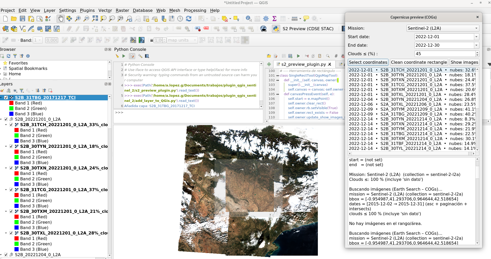
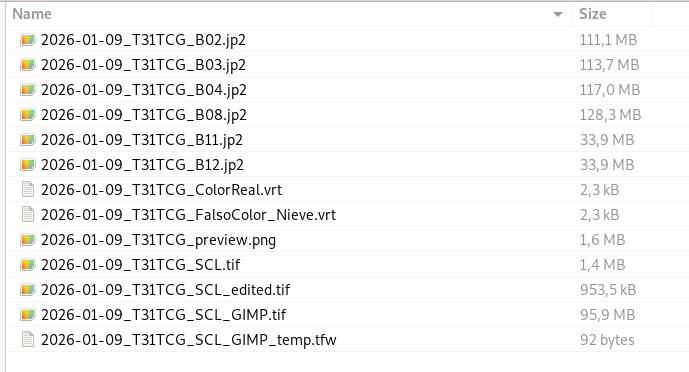
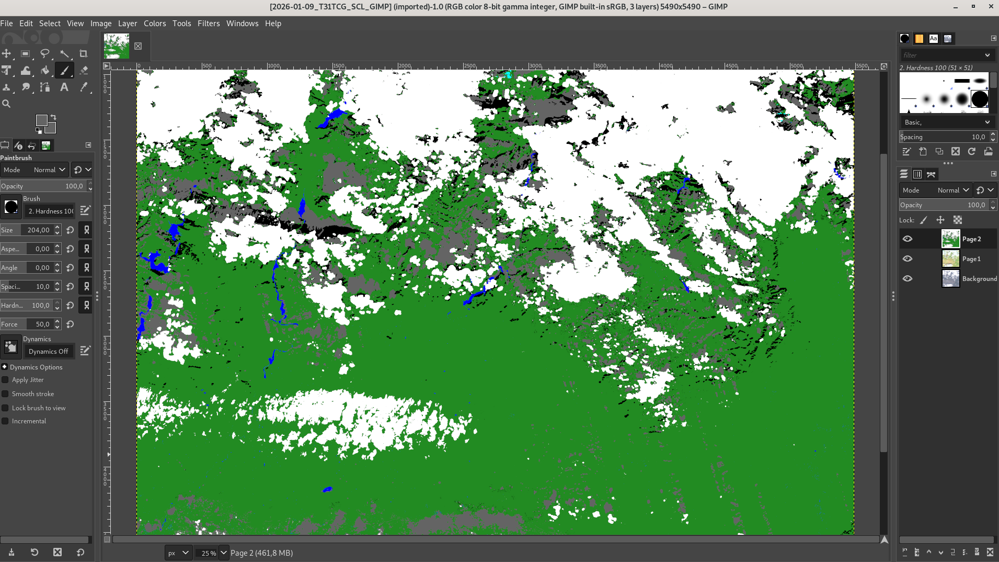

    

  

<h1 align="center" style="font-size: 3em; margin-bottom: 10px;">Trabajo Final de Grado (TFB)</h1>
<h2 align="center" style="color: #FFC000; font-size: 2em; margin-bottom: 50px;">Desarrollar un entorno escalable (pipeline geoespacial) para imágenes Sentinel-2, diseñado para integrar y ejecutar un modelo de Machine Learning</h2>

   

  <strong>Autor:</strong> Antonio López 
  <strong>Fase:</strong> Entrega 2 - Metodología y Desarrollo del Proyecto 
  <strong>Fecha:</strong> Julio 2026

     

  <strong>Página web del proyecto:</strong> <a href="https://tonilogar.github.io/tfb/tfb.html">tonilogar.github.io/tfb</a> 
  <strong>Repositorio y control de versiones:</strong> <a href="https://github.com/tonilogardev/web_basic_project/tree/main_dev_pro_tfb/011_tfb">GitHub - Master Roadmap</a>

## Resumen con palabras clave

El presente Trabajo Final de Bàtxelor (TFB) tiene como objetivo principal el desarrollo de una infraestructura Web GIS escalable y agnóstica (*pipeline* geoespacial) diseñada para procesar datos satelitales del programa Copernicus y permitir la integración de **cualquier modelo de *Machine Learning***. Para validar empíricamente esta arquitectura desacoplada, se aborda como caso de estudio práctico:la clasificación errónea de nubes y nieve por parte del algoritmo estándar Sen2Cor en zonas de alta montaña, así como su confusión con sombras y masas de agua. Como solución a esta deficiencia, se ha implementado y ejecutado sobre el nuevo *pipeline* un modelo de aprendizaje profundo (*Deep Learning*) utilizando la red neuronal convolucional U-Net, enfocado en la región de Cataluña (España). La orquestación abarca la descarga automatizada de gránulos Sentinel-2, la edición y clasificación manual de máscaras mediante GIMP para el entrenamiento, y el diseño del propio modelo. El sistema obtiene un tensor de segmentación de 6 Clases Maestras: Descarte, Suelo Útil, Nube, Sombra de Nube, Nieve y Masas de Agua. El resultado se desplegará en una infraestructura *Serverless*, demostrando que esta arquitectura modular sirve de base para resolver distintas problemáticas geoespaciales de Observación de la Tierra.

**Palabras clave:** *Deep Learning, Sentinel-2, Segmentación Semántica, U-Net, Observación de la Tierra, Copernicus.*

  

## Abstract

This Bachelor's Final Project (TFB) aims primarily to develop a scalable and agnostic Web GIS infrastructure (geospatial pipeline) designed to process satellite data from the Copernicus program and seamlessly integrate **any Machine Learning model**. To empirically validate this decoupled architecture, a critical issue is addressed as a practical case study: the misclassification of clouds and snow by the standard Sen2Cor algorithm in high mountain areas, as well as its confusion with shadows and water bodies. As a solution to this deficiency, a Deep Learning model using the U-Net convolutional neural network has been implemented and executed over the new pipeline, focusing on the region of Catalonia (Spain). The orchestration encompasses the automated download of Sentinel-2 granules, the manual editing and classification of masks via GIMP for training, and the model design itself. The system obtains a segmentation tensor of 6 Master Classes: Discard, Usable Soil, Cloud, Cloud Shadow, Snow, and Water Bodies. The result will be deployed in a Serverless infrastructure, demonstrating that this modular architecture serves as a foundation for solving diverse Earth Observation geospatial challenges.

**Keywords:** *Deep Learning, Sentinel-2, Semantic Segmentation, U-Net, Earth Observation, Copernicus.*

  

## Índice interactivo

- [Glosario de Términos](#glosario-de-términos)
- [1. Introducción](#1-introducción)
- [2. Justificación](#2-justificación)
- [3. Contextualización del trabajo](#3-contextualización-del-trabajo)
- [4. Objetivos generales y específicos](#4-objetivos-generales-y-específicos)
  - [4.1. Objetivo general](#41-objetivo-general)
  - [4.2. Objetivos específicos](#42-objetivos-específicos)
- [5. Marco teórico y conceptos clave](#5-marco-teórico-y-conceptos-clave)
  - [5.1. Datos espaciales: Sentinel-2 y el espectro electromagnético](#51-datos-espaciales-sentinel-2-y-el-espectro-electromagnético)
  - [5.2. Inteligencia Artificial: La Arquitectura U-Net](#52-inteligencia-artificial-la-arquitectura-u-net)
- [6. Metodología aplicada](#6-metodología-aplicada)
  - [6.1. Instrumentos](#61-instrumentos)
  - [6.2. Materiales (Conjunto de datos)](#62-materiales-conjunto-de-datos)
  - [6.3. Recursos e infraestructura](#63-recursos-e-infraestructura)
  - [6.4. Metodología de evaluación](#64-metodología-de-evaluación)
- [7. Desarrollo viable y sostenible](#7-desarrollo-viable-y-sostenible)
  - [7.1. Temporalización e hitos](#71-temporalización-e-hitos)
  - [7.2. Alineación con los ODS y Códigos UNESCO](#72-alineación-con-los-ods-y-códigos-unesco)
  - [7.3. Condicionantes ambientales, sociales y económicos](#73-condicionantes-ambientales-sociales-y-económicos)
- [8. Proceso y resultados](#8-proceso-y-resultados)
  - [8.1. Fuentes de datos y recopilación](#81-fuentes-de-datos-y-recopilación)
  - [8.2. Exploración y preparación](#82-exploración-y-preparación)
  - [8.3. Análisis exploratorio](#83-análisis-exploratorio)
  - [8.4. Gestión y almacenamiento](#84-gestión-y-almacenamiento)
  - [8.5. Modelado](#85-modelado)
  - [8.6. Visualización y evaluación de resultados](#86-visualización-y-evaluación-de-resultados)
- [9. Discusión y limitaciones](#9-discusión-y-limitaciones)
- [10. Conclusiones y líneas futuras](#10-conclusiones-y-líneas-futuras)
- [11. Referencias Bibliográficas](#11-referencias-bibliográficas)

## Glosario de Términos

Para facilitar la lectura a evaluadores y personas no especialistas en Sistemas de Información Geográfica (GIS) se definen los siguientes términos clave utilizados en este documento:

- **Sentinel-2:** Misión de satélites ópticos de alta resolución de la constelación copernicus.
- **Sen2Cor:** Software de la Agencia Espacial Europea (ESA) para la corrección atmosférica (incluye un detector de nubes básico que este proyecto pretende mejorar).
- **Tiling:** Técnica geoespacial que consiste en "trocear" imágenes satelitales gigantes en cuadrados más pequeños para que el ordenador pueda procesarlos sin saturar la memoria RAM.
- **OOM:** *Out of Memory* (Fuera de memoria). Colapso del ordenador por intentar cargar demasiados datos gráficos a la vez.
- **COG:** *Cloud Optimized GeoTIFF*. Formato de imagen satelital optimizado para ser consultado y procesado de forma rápida y directa en la nube.
- **PMTiles:** Formato de archivo de mapa diseñado para almacenar teselas geoespaciales en la nube de forma estática, optimizando la velocidad y coste del servidor.
- **gpkg:** *GeoPackage*. Formato de base de datos geoespacial open source.
- **shp:** *Shapefile*. Formato de archivo informático vectorial clásico y muy extendido para almacenar sistemas de información geográfica.
- **On the fly:** Procesamiento o renderizado en tiempo real. Siendo ejecutado dinámicamente por el backend sin necesidad de procesarlo en el servidor de la herramienta.
- **ESA:** *European Space Agency* (Agencia Espacial Europea).
- **ACA:** Agencia Catalana del Agua.
- **ICGC:** Instituto Cartográfico y Geológico de Cataluña.
- **DEM:** *Digital Elevation Model* (Modelo Digital de Elevaciones). Representación en 3D del relieve terrestre.
- **U-Net:** Arquitectura de red neuronal convolucional diseñada para la segmentación semántica de imágenes (asignación de clases píxel a píxel).
- **Ground Truth:** (Verdad Terreno). El patrón o mapa de referencia perfecto que se usa para entrenar al modelo de *Machine Learning*. En este proyecto se ha construido y auditado manualmente.
- **L1C / L2A:** Niveles de procesamiento de imágenes satelitales. L1C es la imagen "cruda" tal cual llega del espacio, y L2A es la imagen tras aplicarle correcciones atmosféricas algorítmicas.
- **IoU:** *(Intersection over Union)*. Métrica matemática muy estricta utilizada en *Machine Learning* para evaluar el porcentaje exacto de acierto espacial al predecir la forma de un objeto.
- **Recall:** (Exhaustividad). Métrica estadística que mide la capacidad del modelo predictivo para encontrar y señalar todas las nubes reales que existen en la imagen sin dejarse ninguna.
- **VRAM:** Memoria de acceso aleatorio de vídeo. Es la memoria exclusiva de las tarjetas gráficas (GPUs), la cual se colapsa al cargar imágenes espaciales inmensas si no se emplea el Tiling.
- **NDSI:** *(Normalized Difference Snow Index)*. Índice matemático adicional que resalta la reflectancia de la nieve frente a las nubes altas basándose en la luz infrarroja.

# 1. Introducción

El programa Copernicus, de la Agencia Espacial Europea (ESA) y la Unión Europea, representa actualmente uno de los mayores esfuerzos tecnológicos para la observación de la Tierra. Sentinel-2 es una misión fundamental dentro de esta constelación, compuesta por dos satélites gemelos (Sentinel-2A y Sentinel-2B) que proporcionan imágenes ópticas multiespectrales de alta resolución. Las capacidades técnicas de esta misión son excepcionales: captura información en 13 bandas espectrales que abarcan desde el espectro visible (RGB) hasta el infrarrojo cercano (NIR) y de onda corta (SWIR). Su resolución espacial es altamente detallada, alcanzando los 10 metros por píxel en las bandas principales, 20 metros en las bandas infrarrojas y 60 metros para correcciones atmosféricas. Además, gracias al desfase orbital de sus dos satélites, ofrece una resolución temporal (periodicidad de revisita) de 5 días, permitiendo una observación casi constante. Los datos que estos satélites envían son fundamentales para la observación de la Tierra y su monitoreo gracias a la ingente información de series temporales, lo que permite el seguimiento continuo de fenómenos globales, como el control de la agricultura de precisión, la predicción, detección y prevención de desastres naturales, entre otros.

# 2. Justificación

La clasificación algorítmica de píxeles en imágenes satelitales presenta un desafío técnico de primer nivel debido a la complejidad atmosférica y radiométrica. Para la generación de productos de Nivel-2A (reflectancia en la base de la atmósfera) en la constelación Sentinel-2, la Agencia Espacial Europea (ESA) emplea el procesador estándar Sen2Cor.

Como subproducto de esta corrección atmosférica, Sen2Cor genera un mapa de clasificación de escena (producto Scene Classification o SCL) basado en árboles de decisión y umbrales radiométricos. Este algoritmo categoriza cada píxel en una de las siguientes 12 clases oficiales:

- **0**: Sin datos (*No Data*)
- **1**: Píxeles saturados o defectuosos
- **2**: Áreas oscuras
- **3**: Sombras de nubes
- **4**: Vegetación
- **5**: Suelo desnudo (no vegetado)
- **6**: Agua
- **7**: Sin clasificar
- **8**: Nubes de probabilidad media
- **9**: Nubes de alta probabilidad
- **10**: Cirros finos
- **11**: Nieve o hielo

A pesar de su adopción global y de ser el estándar de la industria, la literatura científica y la observación empírica demuestran que el algoritmo Sen2Cor sufre predicciones erróneas cuando se enfrenta a geografías orográficamente complejas y heterogéneas, como es el caso de Cataluña. Al basarse en árboles de decisión empíricos y umbrales radiométricos fijos, Sen2Cor opera fundamentalmente a nivel de píxel individual. Esta carencia metodológica le impide interpretar el contexto espacial, provocando una confusión sistemática entre elementos con firmas espectrales similares (por ejemplo, entre nieve y nubes gruesas) o morfologías oscuras (confundiendo sombras topográficas con sombras de nubes).

Esta limitación técnica compromete la integridad de los datos para estudios climáticos, hidrológicos y medioambientales basados en series temporales. Frente a esta problemática, la investigación reciente evidencia que los modelos de Deep Learning superan significativamente a los algoritmos tradicionales. Las Redes Neuronales Convolucionales (CNN), al poseer la capacidad intrínseca de extraer características espaciales, texturas y el contexto morfológico a través de sus campos receptivos, logran una precisión y robustez inalcanzables para los métodos de clasificación basados puramente en umbrales. Por consiguiente, se justifica de manera crítica la necesidad de desarrollar una solución alternativa basada en inteligencia artificial que subsane las carencias del procesador estándar, garantizando una segmentación semántica fiable.

# 3. Contextualización del trabajo

Para comprender el alcance del problema que aborda este proyecto, es imperativo analizar cómo y dónde disminuye la precisión de Sen2Cor en la práctica. Al depender de árboles de decisión estáticos y umbrales radiométricos, la algoritmia clásica muestra deficiencias críticas en ecosistemas geográficamente heterogéneos, como la cordillera de los Pirineos o zonas húmedas como el Delta del Ebro. Esto da lugar a tres anomalías de clasificación principales:

1. **Ambigüedad espectral de la Nieve:** Sen2Cor tiende a confundir sistemáticamente la firma espectral altamente reflectiva de la nieve de alta montaña con los frentes de nubes gruesas, al carecer de comprensión del contexto espacial.
2. **Falsos positivos por Sombras Topográficas:** El algoritmo es incapaz de discriminar radiométricamente la sombra oscura natural que proyecta el relieve escarpado (sombra orográfica) frente a la sombra que proyecta una nube sobre un valle, provocando cortes abruptos y falsos positivos en la cartografía de nubes. 
3. **Anomalías de absorción en Superficies Hídricas:** Las grandes masas de agua profunda, que absorben fuertemente la radiación en las bandas infrarrojas, son diagnosticadas erróneamente por el procesador estándar como sombras de nubes (clase 3) o píxeles oscuros (clase 2). Paralelamente, las coberturas terrestres con alta saturación hídrica (como los campos de arroz inundados del Delta del Ebro) son clasificadas con frecuencia como masas de agua puras, perdiendo la categorización real del suelo."  

**Nota sobre la arquitectura de datos:** Durante el diseño inicial del proyecto, se valoró inyectar un Modelo Digital de Elevaciones (DEM) como canal de entrada adicional para mitigar los falsos positivos por orografía escarpada. Sin embargo, se desestimó inicialmente asumiendo que la información espacial capturada por la red neuronal a partir de las bandas multiespectrales sería suficiente. Tras culminar el entrenamiento, se ha constatado empíricamente que el modelo sigue sufriendo confusión entre las sombras nubosas y la topografía extrema. En consecuencia, se establece como línea de investigación futura ineludible la fusión temprana de datos multiespectrales con modelos topográficos.

# 4. Objetivos generales y específicos

## 4.1. Objetivo general

Desarrollar e implementar una infraestructura Web GIS escalable y desacoplada (pipeline geoespacial) diseñada para automatizar la ingesta, inferencia y visualización de datos de observación de la Tierra. El propósito es construir una arquitectura base que, siendo agnóstica al proveedor de infraestructura, permita la integración modular de modelos de Deep Learning orientados a la segmentación semántica.

Para validar empíricamente la viabilidad de este sistema, se presenta como caso de estudio la integración de una red neuronal U-Net específica para la detección de nubes sobre Cataluña. Esto demuestra la capacidad del pipeline para orquestar flujos de datos complejos e ilustra su escalabilidad futura para integrar otros modelos de visión artificial que resuelvan distintas problemáticas territoriales.

## 4.2. Objetivos específicos

Para alcanzar este fin global, el proyecto se disgrega en los siguientes hitos operativos medibles:

1. **Construir una infraestructura de datos replicable (Pipeline ETL):** Desarrollar un flujo automatizado de extracción, transformación y carga (ETL) que abarque: la descarga de datos satelitales (Nivel L1C y L2A) y la extracción de las máscaras de clasificación SCL generadas por Sen2Cor. Adicionalmente, este hito incluye la edición y clasificación manual de dichas máscaras para construir una Verdad Terrestre (Ground Truth) rigurosa, indispensable para el entrenamiento supervisado del modelo con datos de alta calidad.  

2. **Entrenar y evaluar una arquitectura U-Net:** Diseñar, entrenar y validar una red neuronal convolucional orientada específicamente a la segmentación semántica de nubes en la región de Cataluña, acotando el espacio de trabajo a las órbitas relativas R008 y R051 del satélite Sentinel-2.

3. **Superar métricamente a Sen2Cor:** Mitigar las anomalías de clasificación diagnosticadas (ambigüedad espectral de la nieve, falsos positivos por sombras topográficas y errores de absorción en masas hídricas). Para ello, se realizará un análisis comparativo evaluando métricas técnicas rigurosas (como Recall e Intersection over Union - IoU) entre tres fuentes:
**1**: Imágenes de clasificación de píxeles bajadas del servidor de la ESA y generadas por Sen2Cor.  
**2**: Imágenes de clasificación de píxeles generadas por la U-Net con nuestro entrenamiento.  
**3**: Imágenes de clasificación de píxeles editadas y clasificadas manualmente con GIMP.   
El objetivo es demostrar empíricamente la superioridad de la IA frente al algoritmo oficial de la ESA.  

4. **Desarrollar la plataforma Web GIS:** Construir la infraestructura tecnológica visual (Frontend) necesaria para renderizar los resultados. Este hito implica integrar librerías geoespaciales modernas (MapLibre GL JS y Svelte) para la visualización fluida de cartografía bidimensional (2D), y servir las inferencias generadas por el modelo en formatos optimizados para la nube (como Cloud Optimized GeoTIFF o PMTiles), demostrando la viabilidad de su integración y consumo de datos en entornos web.

# 5. Marco teórico y conceptos clave

Para comprender la solución tecnológica propuesta, es necesario asentar brevemente los pilares científicos sobre los que se sustenta la arquitectura del proyecto.

## 5.1. Datos espaciales: Sentinel-2 y el espectro electromagnético

Sentinel-2 proporciona imágenes multiespectrales, capturando radiación electromagnética en longitudes de onda que se extienden más allá del espectro visible. Para optimizar la capacidad de discriminación del modelo de inteligencia artificial, no se procesa una composición RGB tradicional, sino que se alimenta a la red con un tensor multiespectral estructurado en 7 canales simultáneos:

- **Espectro visible (Bandas 2, 3 y 4):** Azul, verde y rojo. Capturan las texturas físicas, los verdaderos colores de las cubiertas terrestres y las sombras topográficas.  
- **Infrarrojo Cercano o NIR (Banda 8):** Crítico para identificar la vegetación (caracterizada por una alta reflectancia en el NIR) y los cuerpos de agua (que absorben intensamente esta radiación, presentando firmas espectrales muy oscuras).  
- **Infrarrojo de Onda Corta o SWIR (Bandas 11 y 12):** Fundamental para resolver la ambigüedad espectral de la nieve. Físicamente, las nubes presentan alta reflectancia en el SWIR, mientras que la nieve lo absorbe fuertemente, permitiendo su separación matemática.  
- **NDSI (*Normalized Difference Snow Index*):** Un índice matemático pre-calculado derivado de las bandas Verde y SWIR. Funciona como un canal adicional que inyecta conocimiento físico explícito sobre el comportamiento de la nieve directamente a la red neuronal, facilitando la convergencia del modelo.  

## 5.2. Inteligencia Artificial: La Arquitectura U-Net

Frente a la "miopía espacial" de los **algoritmos paramétricos tradicionales** que evalúan el terreno píxel a píxel sin interpretar su vecindario, este proyecto fundamenta su avance técnico en el **Aprendizaje Profundo (*Deep Learning*)**, concretamente en el campo de la **Visión Artificial (*Computer Vision*)**. La arquitectura convolucional elegida es la **U-Net**, implementada desde cero (*From Scratch*) utilizando el *framework* **PyTorch**, el estándar actual de la industria y la investigación científica para el desarrollo y entrenamiento de tensores en Inteligencia Artificial.

### 5.2.1. Teoría de Funcionamiento
La arquitectura U-Net (Ronneberger, Fischer y Brox, 2015) es uno de los modelos de Inteligencia Artificial más consolidados para la **segmentación semántica espacial**. Esto significa que la red no se conforma con decir "en esta imagen hay nubes", sino que analiza y decide a qué clase pertenece cada píxel de forma individual, dibujando sus contornos exactos. Su nombre proviene de su estructura matemática en forma de "U", la cual consta de tres mecanismos muy intuitivos:     

1. **El Encoder (Ruta de Compresión o Bajada):** A medida que la imagen satelital entra en la red, el modelo le aplica filtros matemáticos y va reduciendo su tamaño progresivamente, como si alejáramos la vista para ver el panorama general. En este proceso, la imagen pierde resolución (pierde detalle en los bordes), pero la red gana comprensión de los patrones generales y texturas. Conceptualmente, el Encoder aprende a identificar el **"QUÉ"** (comprende las características abstractas que diferencian las nubes de las masas de nieve y de las sombras).  

2. **El Decoder (Ruta de Expansión o Subida):** Es la segunda mitad del proceso. Toma esa información abstracta y altamente comprimida, y la vuelve a ampliar progresivamente hasta recuperar el tamaño original de la imagen (por ejemplo, 512x512 píxeles). Su objetivo es proyectar lo aprendido de nuevo sobre el terreno real; es decir, el Decoder determina el **"DÓNDE"** (la ubicación geográfica de esas nubes o nieve).  

3. **Las Skip Connections (Los puentes de detalle):** Existe un problema técnico: al comprimir tanto la imagen en el primer paso y luego expandirla, el resultado final tendería a ser borroso y los bordes quedarían imprecisos. Para evitarlo, la U-Net establece "puentes directos" que conectan las capas iniciales (antes de perder resolución) con las capas finales de reconstrucción. Estos puentes rescatan los detalles nítidos originales y los inyectan en la salida, logrando que la red dibuje las fronteras de los elementos con una precisión a nivel de píxel.  

### 5.2.2. Diseño Arquitectónico y Estructura de Datos (*Data Shapes*)
- **Inferencia (Tratamiento de Entrada y Salida):** Al modelo se le inyecta un tensor espacial de **7 canales simultáneos**. Tras atravesar la "U", el *Decoder* expulsa **6 canales paralelos** (mapas de probabilidad o *logits* correspondientes a las 6 Clases Maestras). Una función de activación matemática (`Softmax`) evalúa cada píxel a lo largo de esos 6 canales y decide estadísticamente qué clase tiene la probabilidad más alta, colapsando el tensor tridimensional en la imagen 2D final donde cada píxel tiene un valor absoluto del 0 al 5.
- **Entradas (*Inputs - X*):** Su forma matricial es `(N, 7, 512, 512)`. Los tensores están almacenados en disco como `Float16` (reduciendo exactamente a la mitad el peso y acelerando la lectura), pero entran en la red obligatoriamente como `Float32`. Si la IA usara la baja precisión matemática de `Float16` durante el aprendizaje activo, no tendría suficientes decimales para guardar los ajustes microscópicos, redondeándolos a cero y colapsando el entrenamiento.
- **Salidas (*Outputs - Y_pred*):** Su forma es `(N, 6, 512, 512)`, representando los *logits* por Clase Maestra: 0 (Descarte), 1 (Suelo), 2 (Nube), 3 (Sombra Nube), 4 (Nieve), 5 (Agua).

### 5.2.3. Justificación de la programación "From Scratch" frente a redes pre-entrenadas
A pesar de la popularidad del *Transfer Learning* (adaptar un modelo ya pre-entrenado por terceros), en este proyecto se tomó la decisión estratégica de programar y entrenar la red U-Net totalmente desde cero (*From Scratch*). Esta decisión se fundamenta en un análisis crítico de las siguientes incompatibilidades:

- **Incompatibilidad de Entradas (Canales y Dimensionalidad):** Los modelos satelitales públicos están diseñados para ingerir las 10 o 13 bandas nativas de Sentinel-2. Nuestra arquitectura realiza una reducción selectiva de dimensionalidad a 7 canales específicos (6 bandas ópticas + el índice NDSI calculado). Esta reducción previene la saturación de memoria de la GPU (*Out of Memory - OOM*) y acelera la convergencia. Modificar la capa de entrada de un modelo pre-entrenado para que acepte una topología de 7 canales invalida los pesos matemáticos iniciales transferidos, anulando la principal ventaja del *Transfer Learning*.
- **Incompatibilidad de Salidas y Taxonomía Semántica:** Las redes pre-entrenadas genéricas para detección de nubes suelen devolver máscaras binarias (Nube / Despejado). Este proyecto exige mapear una taxonomía de 6 Clases Maestras. Aunque en *Transfer Learning* es estándar sustituir la capa final de clasificación, el hecho de tener que rediseñar simultáneamente tanto la capa de entrada como la de salida provoca que los pesos de las capas intermedias pierdan su contexto espacial. Implementar la topología desde cero garantiza que la red asimile nuestra taxonomía multiclase de forma nativa en todas sus capas.
- **Abundancia de Datos y Mitigación del Sesgo Geográfico:** El *Transfer Learning* es una técnica concebida principalmente para paliar la escasez de datos. Sin embargo, el exhaustivo trabajo de Ingeniería de Datos de este proyecto ha logrado consolidar una Verdad Terrestre (*Ground Truth*) compuesta por miles de tensores espaciales validados y específicos de la orografía de Cataluña. Iniciar el entrenamiento con los pesos aleatorios inicializados desde cero, utilizando exclusivamente este *dataset* local, asegura que el modelo extraiga los patrones geomorfológicos reales de nuestro terreno de estudio, evitando heredar sesgos geográficos o atmosféricos de modelos globales.

### 5.2.4. Líneas de Evolución Algorítmica (Trabajo Futuro)

La implementación de la arquitectura fundacional U-Net (Ronneberger et al., 2015) ha permitido establecer un modelo de referencia (baseline) robusto que demuestra la superioridad de las redes convolucionales frente a los algoritmos paramétricos clásicos. No obstante, para maximizar la precisión en escenarios geográficamente extremos, se identifican tres vectores de evolución técnica para futuras iteraciones del modelo:

- **Integración de Bloques Residuales (ResUNet):** Sustituir las convoluciones estándar del Encoder por bloques residuales. Esta modificación arquitectónica mitigaría el problema del desvanecimiento del gradiente (vanishing gradient), permitiendo el entrenamiento de redes topológicamente más profundas con mayor capacidad de extracción de características abstractas.

- **Mecanismos de Atención (Attention U-Net):** La introducción de puertas de atención (Attention Gates) en las Skip Connections permitiría al modelo suprimir matemáticamente la información redundante del fondo de la imagen. Esto focalizaría la capacidad de inferencia de la red en las áreas de alta ambigüedad espectral, mejorando la discriminación en los límites difusos entre la nieve de alta montaña y la nubosidad gruesa.

- **Captura de Contexto Global (TransUNet / Vision Transformers):** Como salto arquitectónico a largo plazo, se plantea la transición hacia modelos híbridos que incorporen Vision Transformers (ViT). A diferencia del campo receptivo local inherente a los kernels convolucionales, los Transformers permitirían evaluar el contexto espacial global de la imagen satelital desde las etapas iniciales de la red, resolviendo definitivamente las confusiones derivadas de la morfología del terreno a gran escala.

# 6. Metodología aplicada

Para la consecución de los objetivos planteados y garantizar un ciclo de vida completo del desarrollo tecnológico, la metodología de este proyecto se ha estructurado en **cuatro fases estratégicas secuenciales**. Esta arquitectura abarca desde la adquisición automatizada del dato bruto satelital hasta su despliegue final interactivo, pasando por el pilar central: la construcción manual de un conjunto de datos sin sesgos y el entrenamiento de la Inteligencia Artificial.

### 6.1. Fase 1: Ingesta de datos y orquestación (*Pipeline ETL*)
El pilar fundacional del proyecto radica en la construcción de un flujo automatizado de Extracción, Transformación y Carga (ETL) capaz de manejar grandes volúmenes de datos geoespaciales. Esta fase trasciende la simple descarga de imágenes para convertirse en un *pipeline* de ingeniería de datos complejo:
- **Adquisición programática:** Se automatiza la consulta y descarga sincronizada de productos Sentinel-2 (tanto el Nivel L1C para las reflectancias crudas, como el Nivel L2A para recuperar las máscaras de clasificación SCL oficiales generadas por Sen2Cor).
- **Extracción de bandas:** El sistema aísla y apila matemáticamente las 6 bandas multiespectrales de interés (ópticas e infrarrojas), descartando la información redundante.
- **Procesamiento Espacial (*Tiling*):** Dado el inmenso peso en gigabytes de una huella satelital completa (un gránulo de Sentinel-2 mide más de 100x100 km), es imposible cargarla entera en la memoria VRAM de una tarjeta gráfica. El *pipeline* recorta dinámicamente el territorio en cuadrículas (*tiles*) manejables de 512x512 píxeles, manteniendo intactas sus coordenadas geoespaciales.
- **Almacenamiento optimizado:** Los recortes resultantes se serializan y guardan en disco preparados para ser consumidos inmediatamente por la red neuronal, garantizando un flujo de lectura de alta velocidad durante el entrenamiento.

### 6.2. Fase 2: Ingeniería de Datos y Verdad Terreno (*Ground Truth*)
Ante la evidencia de que las máscaras generadas por Sen2Cor arrastran errores sistemáticos en geografías complejas, se hizo imperativo generar un conjunto de datos limpio y redefinir la arquitectura de entrada. Esta fase se apoya en tres decisiones críticas:
1. **Edición y clasificación de la Verdad Terreno (*Ground Truth*):** Para ello, se extrajeron los datos en bruto y se aplicó un proceso de edición y clasificación manual de los píxeles conflictivos mediante el software de edición de imágenes GIMP, permitiendo el análisis manual de una manera cómoda con herramientas de edición de imagen raster como capas, pinceles y gomas para corregir a mano las clasificaciones erróneas basándose en el contexto orográfico real.
2. **Reducción de dimensionalidad de clases:** El estándar europeo divide el terreno en 12 categorías, aportando ruido computacional e ineficiencia. Como pilar metodológico, el *pipeline* geoespacial desarrollado colapsa matemáticamente esas 12 clases originales en **[6 Clases Maestras](008_pixel_legend.md)** de alto valor analítico: Descarte, Suelo Útil, Nube, Sombra de Nube, Nieve (objetivo principal) y Masas de Agua.
3. **Descarte topográfico por eficiencia:** En el diseño de la arquitectura de entrada, se decidió priorizar la física espectral frente a los metadatos espaciales. Se prescindió intencionadamente de inyectar un Modelo Digital de Elevaciones (DEM) para aliviar radicalmente la carga de procesamiento del futuro servidor web, demostrando que las leyes térmicas y ópticas de las bandas Infrarrojas de Onda Corta (SWIR) son suficientes por sí solas para separar la nieve de la nube.

### 6.3. Fase 3: Entrenamiento y Evaluación del Modelo (*Deep Learning*)
Con la biblioteca de datos saneada, se procedió a la fase de aprendizaje automático. Se implementó la arquitectura convolucional U-Net desde cero en PyTorch, diseñando una topología específica para ingerir el tensor de 7 canales (las 6 bandas más el índice NDSI calculado en la Fase 2) y expulsar las probabilidades correspondientes a la nueva taxonomía de 6 Clases Maestras. 
El entrenamiento se guio utilizando una función de pérdida (*Loss Function*) orientada a penalizar duramente los falsos positivos en zonas de nieve. Posteriormente, el modelo empírico se evaluó contra los resultados estándar de Sen2Cor empleando métricas de extrema severidad espacial (como el *Intersection over Union* y el *Recall*).

### 6.4. Fase 4: Despliegue en infraestructura Web GIS
El último eslabón de la cadena metodológica consiste en visibilizar el logro algorítmico de forma accesible y escalable. Las inferencias de la red neuronal (máscaras de segmentación generadas localmente) se integran en una aplicación Frontend construida bajo el *framework* Svelte. Para la renderización cartográfica interactiva, se emplea la librería MapLibre GL JS, demostrando la viabilidad técnica de servir cartografía de observación terrestre de alta resolución en un navegador web, logrando un sistema ágil, modular y libre de servidores de procesamiento pesado (*Serverless*).

*Figura 1: Comparativa entre las 12 clases originales de Sen2Cor y la reducción a 6 Clases Maestras optimizadas para la red neuronal.*

### Justificación Arquitectónica: Descarte temporal del DEM

Durante las fases preliminares de la arquitectura técnica del proyecto, se contempló la posibilidad de incluir un Modelo Digital de Elevaciones (DEM) como canal de entrada adicional a la red neuronal convolucional (U-Net). El propósito inicial era proporcionar a la red un contexto topográfico que le ayudara a discriminar entre nieve (típicamente a altas cotas) y nubes.

Sin embargo, tras una revisión y un análisis coste-beneficio en el marco de un Trabajo de Fin de Grado (TFB), se tomó la decisión arquitectónica de desechar el uso del DEM, confiando la discriminación nube-nieve única y exclusivamente a la firma espectral de las bandas físicas.

**1. La Física Espectral es suficiente (El poder del SWIR)**

La inclusión de un DEM parte de una premisa topográfica (altitud = nieve). Sin embargo, las bandas infrarrojas de onda corta (SWIR: B11 y B12) del satélite Sentinel-2 resuelven este problema:
- Las nubes reflejan fuertemente la radiación SWIR.
- La nieve, al estar compuesta por cristales de hielo y agua, absorbe masivamente la radiación SWIR, mostrándose muy oscura en estas bandas.

La red neuronal tiene, por tanto, información matemática robusta y directa para separar nieve de nube sin necesidad de recurrir a metadatos de altitud.

**Evidencia Bibliográfica**
El descarte del DEM está respaldado por los estudios y algoritmos más consolidados en teledetección:
- **Zhu & Woodcock (2012) - Fmask:** El algoritmo histórico por excelencia para enmascarado de nubes (Fmask) basa su separación nube-nieve en el cálculo del índice NDSI (*Normalized Difference Snow Index*) usando bandas del verde y del SWIR, prescindiendo totalmente de modelos topográficos.
- **Zupanc (2017) - s2cloudless:** El algoritmo de *Machine Learning* oficial utilizado por la Agencia Espacial Europea en su *Copernicus Browser* (s2cloudless, desarrollado por Synergize) se alimenta exclusiva y estrictamente de 10 bandas espectrales de Sentinel-2. Logra resultados del estado del arte sin inyectar ninguna capa de elevación.

**2. Complejidad de Ingeniería de Datos (Data Engineering)**

En el contexto de un TFB, incorporar el DEM introduce una complejidad técnica desproporcionada que no garantiza un retorno equivalente en la métrica final de precisión:
- Requiere la descarga independiente de mallas DEM altimétricas (e.g., Institut Cartogràfic i Geològic de Catalunya [ICGC], 2026).
- Exige reproyectar las mallas desde coordenadas geográficas puras al sistema cartográfico UTM específico de cada gránulo de Sentinel-2.
- Precisa un remuestreo espacial avanzado para coregistrar los píxeles del DEM a la cuadrícula estricta de 10m/20m de las bandas L1C.

**Conclusión Estratégica:**
Aunque descartamos el DEM en este proyecto para centrar el esfuerzo en la física espectral y evitar una sobrecarga innecesaria de preprocesamiento de datos, la evaluación empírica de nuestro modelo nos ha revelado que **sí será obligatorio** crear un segundo modelo futuro integrando el DEM del ICGC (*Institut Cartogràfic i Geològic de Catalunya*). Esta evolución arquitectónica será ineludible para solucionar de forma matemática el conflicto óptico de las sombras de las montañas frente a las sombras de las nubes en terrenos escarpados.

### Pipeline ETL de clasificación de píxeles (Edición y Clasificación Manual)

A continuación, se detalla el reto técnico y metodológico que supuso permitir la edición visual masiva de máscaras geoespaciales (*Scene Classification* - SCL) utilizando editores fotográficos tradicionales (como GIMP), garantizando en todo momento la preservación matemática de los datos científicos y su georreferenciación.
Sin este trabajo la edición manual de los ficheros SCL con herramientas de software SIG hubiese sido una tarea imposible, dado que los ficheros SCL son ficheros ráster de una sola banda y los editores gráficos estándar no están preparados para manejar este tipo de ficheros con herramientas de pintura. Por ello, se desarrolló un pipeline ETL para permitir la edición visual masiva de máscaras geoespaciales (*Scene Classification* - SCL) utilizando editores fotográficos tradicionales (como GIMP), garantizando en todo momento la preservación matemática de los datos científicos y su georreferenciación.

**1. El Problema Técnico (Disonancia Radiométrica)**

Las máscaras categóricas de la ESA (Sen2Cor) y las predicciones de la U-Net son rásters matemáticos de una sola banda. Sus píxeles no contienen "colores", sino valores enteros (del 0 al 5) que representan las Clases Maestras. 
Al intentar auditar manualmente estos archivos en un editor gráfico estándar, surgen dos barreras infranqueables:
- **El problema del negro absoluto:** Un editor fotográfico interpreta los archivos en una escala lineal de brillo de 8-bits (0 a 255). Un píxel con valor `4` (Nieve) tiene un brillo de apenas el 1.5%. Para el ojo humano, este valor es negro puro. Al abrir la imagen satelital, el analista solo ve un lienzo negro, imposibilitando la edición visual de las nubes o la nieve.
- **El peligro de la destrucción radiométrica:** Si el analista intenta hacer visible la imagen forzando los niveles de contraste, los valores científicos originales se destruyen irreversiblemente (el valor `4` se estira a `200` para verse gris). Si esa imagen sobrescrita se le pasa a la IA, la red colapsará al no reconocer el valor `200`. Adicionalmente, el *software* gráfico suele amputar y destruir las cabeceras espaciales (coordenadas) al guardar el archivo.

**2. Evaluación de alternativas SIG (QGIS)**

Antes de decantarnos por un editor de imagenes raster, se estudió en profundidad la viabilidad de utilizar *software* especializado en Sistemas de Información Geográfica, concretamente **QGIS**, para realizar la corrección manual de las máscaras. Si bien QGIS maneja de forma nativa la georreferenciación y la radiometría matemática, sus herramientas y *plugins* de edición resultaron ser excesivamente rígidos y lentos para una tarea que exigía un flujo de trabajo casi "artístico" (pintar a mano alzada bordes de nubes y nieve). 

Ante la ineficiencia del entorno SIG para el dibujo fluido, se procesaron las imágenes mediante *scripts* python para poder editarlas con la extrema comodidad y agilidad de un software de edición de imagenes raster puro como **GIMP**. No obstante, como futura línea de investigación, seria muy interesante crear desde cero un *plugin* nativo para QGIS que incorpore herramientas de pintura tipo "pincel digital", unificando así la agilidad fotográfica con el rigor del entorno geoespacial.

**3. La Solución: Arquitectura de Codificación y Decodificación (Encode/Decode)**

Para evitar utilizar pesadas y lentas herramientas GIS para pintar a mano millones de píxeles, diseñamos e implementamos un **Pipeline ETL de clasificación de píxeles** basado en el cambio temporal de color:

- **Fase de Codificación (*Encode*):** Desarrollamos scripts en Python (`gimp_tools.py`) que interceptan la matriz matemática (el gránulo crudo) y la transforman temporalmente en un **GeoTIFF RGB de 3 bandas a todo color**. A cada valor numérico se le inyecta su color visual (blanco puro para nube, cyan para nieve, etc.).
- **Backup Geoespacial:** La librería GDAL extrae las coordenadas y las guarda en archivos seguros auxiliares (`.tfw`), blindándolas frente a la destrucción del editor fotográfico.
- **Fase de Decodificación (*Decode*):** Una vez se realiza la edición y clasificación manual con GIMP , un script python (`003_decode_gimp_edits.py`) lee el mapa de colores manipulado, calcula el color de cada píxel hacia la paleta oficial, y re-asigna el valor categórico puro (0-5), reconstruyendo el ráster científico con su georreferencia intacta.

**4. Flujo de Trabajo Práctico**º

Gracias a este pipeline de ingeniería de datos, logramos un flujo de trabajo "Human-in-the-Loop" ágil y escalable:
1. El sistema genera los archivos visuales de colores automáticamente durante la descarga de los gránulos.
2. El investigador abre el archivo en GIMP, superpone las imágenes ópticas reales del satélite como guías semitransparentes, y utiliza el lápiz digital (sin *antialiasing*) para corregir manualmente y con suma facilidad los falsos positivos de Sen2Cor.
3. Mediante consola, se invoca el decodificador, devolviendo el arte visual a un estado matemático puro. Esta salida meticulosamente editada a mano constituye la **Verdad Terreno final** sobre la que aprende la Inteligencia Artificial.

## 6.1. Instrumentos

El desarrollo metodológico descrito se ha sustentado en los siguientes instrumentos de *software* y orígenes de datos:

- **Fuente de observación de la Tierra:** Satélite Sentinel-2 (programa Copernicus de la ESA). Se han empleado tanto los datos radiométricos en bruto (Nivel L1C) como las máscaras preexistentes del procesador oficial (Sen2Cor) a modo de base comparativa.
- **Desarrollo del modelo y *pipeline* ETL:** Máquina de trabajo local equipada con procesadores gráficos (GPUs CUDA) para entrenar las redes neuronales, efectuar las inferencias masivas y ejecutar los *scripts* en Python de descarga y recorte de imágenes (*tiling*).
- **Edición y clasificación visual:** Software libre de edición de imágenes GIMP, empleado como instrumento principal para la reclasificación manual de los píxeles conflictivos.
- **Modelado de Inteligencia Artificial:** *Framework* PyTorch, estándar de la industria para el entrenamiento matemático de la arquitectura U-Net.
- **Arquitectura de despliegue web:** *Frameworks* de desarrollo Frontend de alto rendimiento (*Svelte*) combinados con motores cartográficos (*MapLibre GL JS*) para renderizar los resultados geoespaciales estáticos precalculados.

## 6.2. Materiales (Conjunto de datos)

El material base sobre el que se fundamenta este Trabajo Final de Bàtxelor está compuesto por imágenes satelitales multiespectrales de Sentinel-2 (producto de reflectancia L1C) pertenecientes a las órbitas relativas R008 y R051, que cubren la totalidad del territorio de Cataluña.

Con el objetivo de maximizar la solidez del modelo ante casos geográficamente complejos (*Hard Negatives*), se ha diseñado un conjunto de datos (*Dataset*) compuesto por **[40 gránulos](003_type_granule.md)** o escenas específicas, divididas en dos grandes bloques:

1. **[Conjunto de Entrenamiento y Validación (30 gránulos)](../scripts/training_granules.csv):** Seleccionados estratégicamente para enseñar a la red neuronal a resolver los principales desafíos orográficos y espectrales de Cataluña:
   - **Alta Montaña (Pirineos):** Gránulos de invierno (T31TCH, T31TDH) con nieve pura en valles y nubes bajas.
   - **Niebla Inversión Térmica:** Gránulos de invierno sobre la llanura de Lleida (T31TCG, T31TDG).
   - **Costas y Urbano:** Escenas sobre Barcelona y el mar Mediterráneo (T31TDF) para resolver la detección de bruma costera y evitar falsos positivos por naves industriales muy brillantes.
   - **Superficies Hídricas:** Gránulos sobre el Delta del Ebro (T31TCE, T31TCF) para evitar la confusión matemática entre el agua de los arrozales y las sombras oscuras de las nubes.
2. **[Conjunto de Test Ciego o *Blind Test* (10 gránulos)](../scripts/test_granules.csv):** Un bloque de validación aislado que la IA nunca observará durante la fase de entrenamiento. Consta de 10 imágenes con condiciones atmosféricas severas (ej. nieve densa cruzada por nubes en febrero, tormentas estivales en agosto sobre el mar) que servirán para evaluar el rendimiento empírico del modelo frente a Sen2Cor al final del proyecto.

## 6.3. Recursos e infraestructura

Para posibilitar el ciclo de vida completo del modelo (descarga, preprocesamiento, entrenamiento masivo e inferencia), el proyecto ha requerido una infraestructura técnica apoyada en los siguientes recursos:

- **APIs de Datos (*Copernicus Data Space Ecosystem - CDSE*):** Sistema *cloud* oficial de la Agencia Espacial Europea. Se ha empleado el protocolo OData/OpenSearch para automatizar la consulta perimetral, filtrado por porcentaje de nubes y posterior descarga masiva de los gránulos satelitales en formato comprimido.
- **Aceleración Hardware (GPUs / CUDA):** El entrenamiento de la arquitectura U-Net exige cálculos matriciales pesados (retropropagación de miles de millones de operaciones matemáticas por segundo). Se ha empleado aceleración por hardware dedicada mediante tarjetas gráficas compatibles con el ecosistema CUDA (Nvidia), posibilitando iterar sobre el conjunto de entrenamiento en tiempos logísticos viables.
- **Almacenamiento masivo intermedio:** Debido a la transformación matemática de los gránulos (10,000 x 10,000 píxeles) a matrices tensoriales Float32 subdivididas en recortes de 512x512 píxeles, la creación del conjunto de datos temporal (*tiling*) ha requerido sistemas de almacenamiento sólidos capaces de alojar grandes volúmenes de arreglos NumPy (`.npy`) sin cuellos de botella de lectura durante las épocas de entrenamiento.

## 6.4. Metodología de evaluación

Para certificar empíricamente que el modelo propio supera al estándar europeo, la fase de evaluación técnica se diseñó bajo una regla científica inquebrantable: **Bajo ningún concepto se evalúa el rendimiento estadístico de la IA contra las máscaras originales de Sen2Cor en el conjunto de Test.** 

Dado que la premisa del proyecto asume que el algoritmo tradicional comete falsos positivos, utilizar su salida como "verdad absoluta" generaría un sesgo de evaluación crítico donde el sistema informático penalizaría a la U-Net precisamente en los casos en los que acierta corrigiendo los errores de la ESA. Por ello, el flujo de evaluación establecido es el siguiente:

1. **Frontera de Aislamiento (*Blind Test*):** Se utilizan los 10 gránulos de condiciones atmosféricas extremas reservados exclusivamente para evaluación.
2. **Verdad Terreno Auditada:** Al igual que se procedió rigurosamente con los 30 gránulos de entrenamiento, se aplica una edición y clasificación manual exhaustiva sobre todos los píxeles conflictivos de estos 10 gránulos de evaluación (apoyado en herramientas gráficas). Esto garantiza que el modelo se examine contra un mapa validado objetivamente por el humano y libre de los errores originales de Sen2Cor.
3. **Cálculo de Métricas Científicas:** Las predicciones emitidas por la red neuronal se enfrentan exclusivamente a esta nueva Verdad Terreno perfecta. Para cuantificar la precisión espacial y la robustez analítica del modelo, se definieron como indicadores de éxito las métricas estándar de la industria en segmentación semántica de imágenes:
   - **Intersection over Union (IoU):** Para medir la superposición geométrica exacta entre la nube/nieve predicha por el modelo y la nube/nieve real.
   - **F1-Score:** Media armónica entre la precisión y la exhaustividad (*Recall*), vital para evitar métricas engañosas en clases desbalanceadas geográficamente (como la nieve).
   - **Precisión global (*Accuracy*).**

La comparativa final de estas métricas entre las predicciones del modelo U-Net y las máscaras generadas por el algoritmo oficial Sen2Cor permitirá demostrar, de forma cuantitativa, el salto de precisión logrado frente al estándar de la ESA.

# 7. Desarrollo viable y sostenible

En la era del *Big Data*, el desarrollo de proyectos tecnológicos masivos exige un compromiso íntegro con la sostenibilidad. Este caso de estudio ha sido orquestado bajo tres perspectivas fundamentales de viabilidad y ética: ambiental, social y económica.

## 7.1. Temporalización e hitos

La complejidad de orquestar un *pipeline* geoespacial masivo interconectado con modelado predictivo exige un control de tareas meticuloso. Atendiendo al calendario del TFB, a continuación se detallan las fases alcanzadas y planificadas:

### Fases de Ejecución (Desarrollo *End-to-End*):

Este proyecto trasciende el mero análisis estadístico aislado para constituirse como una solución tecnológica integral (*End-to-End*). El ciclo de vida de la herramienta abarca desde la idea inicial, la investigación de los requisitos de la Agencia Espacial Europea (ESA) para el acceso a datos de satélite, la adquisición cruda de la información espacial, la preparación y limpieza de datos, el entrenamiento del modelo, la evaluación científica y la puesta en producción, edición manual ETL con software de imagen, flujos ETL automatizados para extracción de gránulos vía API, edición manual con software de imagen hasta la puesta en producción de una herramienta web fusionando Ingeniería de Datos (*Data Engineering*), *Machine Learning* y *DevOps/Web Development*.

1. **Fase 1 - Fundamentación e Ingeniería de Datos (Completada):** Conceptualización del problema analítico, evaluación teórica de los sensores de la ESA, viabilidad técnica de los datos y primer planteamiento arquitectónico.
2. **Fase 2 - Arquitectura MLOps y Modelado (Actual - 60%):** Programación y automatización del flujo de datos ETL masivo para extracción de gránulos vía API. Diseño y colapso de la matriz de características. Refinamiento e investigación del concepto *Ground Truth Humano*. Entrenamiento algorítmico de la red neuronal convolucional (U-Net) y justificación estadística de la pérdida paramétrica. Para garantizar la reproducibilidad científica y técnica, todo el código fuente de esta orquestación se encuentra versionado en un repositorio público de GitHub, estando cada *script* rigurosamente documentado mediante *Docstrings* bajo estándares de ingeniería de *software* profesional.
3. **Fase 3 - Inferencia Cloud y Validaciones (Próxima):** Ejecución algorítmica sobre un set de Test puro y sin contaminar para su validación científica frente al algoritmo nativo Sen2Cor. Paralelamente, se iniciará el proceso de desacople del modelo para preparar su despliegue en infraestructuras *Cloud*.
4. **Fase 4 - Despliegue Web y Defensas (Definitiva):** Cierre del ciclo tecnológico mediante el desarrollo de una Aplicación Web que servirá el modelo entrenado, permitiendo inferencias *on-the-fly* a nivel de usuario. Culminará con el empaquetado del trabajo escrito y la creación de las defensas argumentativas interactivas.

*Figura 2: Diagrama de Gantt ilustrando el cronograma general del proyecto.*

## 7.2. Alineación con los ODS y Códigos UNESCO

El rigor académico y técnico de este Trabajo Final de Bàtxelor se enmarca dentro de las clasificaciones científicas internacionales y persigue un impacto directo en la sostenibilidad global.

### Códigos UNESCO
La naturaleza de la investigación se clasifica bajo los siguientes códigos nomencladores:
- **1207.94 (Aprendizaje automático):** Justificado por el entrenamiento de un modelo de *Deep Learning* (Redes Neuronales U-Net) para la segmentación semántica de imágenes satelitales.
- **1203.93 (Cloud Computing):** Aplicado en el diseño y despliegue del entorno escalable (*pipeline* geoespacial) y la futura infraestructura de procesamiento *online*.
- **1203.96 (Bases de Datos):** Requerido para la orquestación y estructuración de la arquitectura orientada a la nube mediante formatos geoespaciales optimizados (*Cloud Optimized GeoTIFF* y *PMTiles*).

### Objetivos de Desarrollo Sostenible (ODS)
El impacto del análisis geográfico desarrollado está firmemente cimentado sobre el marco de los Objetivos de Desarrollo Sostenible de las Naciones Unidas:
- **ODS 9 (Industria, Innovación e Infraestructura):** El proyecto construye una infraestructura tecnológica geoespacial innovadora que mejora sustancialmente las capacidades de procesamiento y análisis de datos de la industria satelital europea.
- **ODS 13 (Acción por el clima):** La monitorización precisa de la superficie terrestre (diferenciando de forma empírica y fiable la nieve de la nubosidad) proporciona datos limpios y veraces, fundamentales para evaluar el impacto del cambio climático y facilitar la gestión estratégica de los recursos hídricos en el territorio de Cataluña.

## 7.3. Condicionantes ambientales, sociales y económicos

### Condicionantes Ambientales (*Green Computing*)
El proceso de entrenamiento de grandes redes neuronales exige ciclos masivos de cómputo gráfico (GPU), los cuales requieren un gasto de energía eléctrica considerable y, por ende, generan una huella de carbono subyacente. Para transformar este proyecto en un desarrollo sostenible medioambientalmente:
- Se ha diseñado una técnica algorítmica denominada **Tiling**, que fragmenta las imágenes satelitales y somete a evaluación matemática la riqueza de datos de cada cuadrante. Si un área geográfica contiene predominantemente datos nulos (ej. océano negro o franjas vacías), el parche no se procesa ni se envía a la tarjeta gráfica. Esta optimización algorítmica reduce el gasto energético del *hardware* drásticamente.
- A nivel aplicativo, el modelo resultante facilitará a organismos como la **Agencia Catalana del Agua (ACA)** una herramienta computacional robusta para monitorizar el deshielo pirenaico y las cuencas fluviales, actuando como un escudo tecnológico en la prevención y gestión eficiente de la sequía. Asimismo, resultará de valor para el **Institut Cartogràfic i Geològic de Catalunya (ICGC)**, al permitir la generación automática de mosaicos territoriales ortofotográficos completamente limpios de nubosidad. Por extensión, esta tecnología democratiza el acceso a máscaras espaciales de alta fidelidad para cualquier universidad, institución o empresa privada que requiera imágenes nítidas para realizar estudios sobre el terreno, monitorización de masas forestales, control de plantaciones agrícolas o detección de construcciones ilegales. Además, su arquitectura altamente escalable permite la futura integración de nuevas constelaciones satelitales (como los datos de temperatura superficial de Sentinel-3 y los datos de radar SAR de Sentinel-1). Esta fusión multisensor posibilitará calcular el volumen y la estabilidad térmica de las masas de nieve en los Pirineos para predecir el riesgo de aludes, así como detectar corrimientos y movimientos de tierra con precisión milimétrica.

### Condicionantes Sociales y Replicabilidad Científica (Open Source)
Los mapas satelitales defectuosos generan decisiones tardías y perjudiciales. Al proporcionar a los profesionales del territorio (ej. agricultores del Delta del Ebro o responsables de parques naturales) máscaras geoespaciales, se promueve un ecosistema de información civil de calidad. La democratización de estos datos empíricos habilita respuestas gubernamentales mucho más ágiles en momentos críticos como sequías, inundaciones o grandes incendios forestales.

Bajo la premisa innegociable de la **Replicabilidad Científica**, tanto los datos satelitales de la ESA como la totalidad de la arquitectura de código subyacente de este proyecto son de dominio público y código abierto (*Open Source*). El *pipeline* completo de ingeniería se encuentra alojado y versionado en el repositorio de **GitHub**. Para asegurar que la investigación académica pueda ser auditada, heredada y ejecutada por cualquier entidad científica del mundo, todo el ecosistema de *scripts* (desde la extracción en red OData hasta el orquestador de inferencia PyTorch) ha sido programado de forma modular y está exhaustivamente documentado internamente mediante *Docstrings* técnicos. Esto permite que cualquier usuario o investigador, con independencia de su presupuesto informático, pueda clonar el repositorio, comprender línea a línea el flujo de tensores, reproducir exactamente los mismos modelos matemáticos y utilizar este trabajo como núcleo tecnológico para desplegar nuevos sistemas GIS a escala global.

### Condicionantes Económicos
Para garantizar que la metodología pueda ser heredada sin restricciones financieras, toda la orquestación del proyecto huye del *software* propietario:
- Se ha empleado íntegramente código abierto (lenguaje Python, librerías geoespaciales y el *framework* PyTorch).
- Para el crítico proceso de edición y clasificación manual de píxeles (forja del *Ground Truth*), se ha utilizado GIMP, una alternativa libre y gratuita que democratiza el acceso a la edición cartográfica de alto nivel.
- Las fuentes de datos provienen del catálogo abierto de la Unión Europea a través de la API OData de Copernicus.
- A largo plazo, el despliegue del *software* mediante estándares geoespaciales modernos permite operar en un entorno web *Serverless* de ínfimo coste en la nube, eliminando la dependencia de servidores dedicados costosos.

# 8. Proceso y resultados

Este apartado detalla la ejecución técnica integral del *pipeline* geoespacial. Antes de desglosar las entrañas del código y las métricas, es fundamental entender el flujo narrativo del desarrollo.

### Cronología de Decisiones Críticas y Puntos de Inflexión (Pivotes Arquitectónicos)
El desarrollo de todo el proyecto no fue lineal, sino un proceso puramente iterativo y empírico. Para gestionar la extrema complejidad del proyecto, se adoptaron los estándares actuales de la industria tecnológica basados en metodologías de desarrollo ágil (alineadas con el marco de trabajo *Scrum*). Trabajar bajo esta estricta filosofía permitió abandonar el rígido modelo de diseño tradicional a favor de un enfoque altamente adaptativo: probar iterativamente, detectar fallos rápido y corregir de inmediato. A lo largo del ciclo de vida del *software*, la investigación colisionó con severas barreras físicas y matemáticas que exigieron paradas de emergencia, iteraciones continuas de evaluación (*sprints* analíticos) y cambios estratégicos drásticos de rumbo (*pivotes* arquitectónicos):

- **Paso 1. El Estándar (Sen2Cor):** Partiendo de la experiencia profesional previa, se tenía conocimiento empírico de que la máscara oficial de la ESA presentaba anomalías de clasificación en áreas geográficas concretas (clasificando las masas de agua profundas del Delta del Ebro como *No Data* o sombras, y confundiendo los suelos húmedos con agua). Al extender la auditoría visual al relieve de los Pirineos, se constató un error algorítmico aún mayor: la total incapacidad de Sen2Cor para separar la nieve de la nube gruesa. **Decisión:** Ante esta evidencia acumulada, se descartó la investigación pasiva y se determinó construir desde cero (*From Scratch*) nuestra propia Red Neuronal U-Net inyectándole el índice físico NDSI.
- **Paso 2. El Dilema Topográfico (Descarte del DEM):** Para diferenciar las nubes densas de la nieve, la arquitectura inicial contempló inyectar el Modelo Digital de Elevaciones (DEM) de Cataluña. **Decisión:** Por criterios de simplicidad arquitectónica y viabilidad computacional, se descartó su integración para apostar exclusivamente por la espectralidad (bandas SWIR), logrando un procesamiento rapido en comparación con el uso del DEM. Sin embargo, este descarte intencionado del DEM provocó que el modelo presente debilidades algorítmicas al enfrentarse a las sombras topográficas puras, estableciendo así una línea de investigación para el trabajo futuro.
- **Paso 3. Clase Masas de Agua:** Durante las primeras épocas de entrenamiento con 5 clases, las inferencias sobre el Mediterráneo y los arrozales del Delta del Ebro colapsaron. El sol, al reflejarse especularmente en el mar (*Sun Glint*), cegaba a la red neuronal, haciéndole predecir inmensos bancos de nubes inexistentes. **Decisión:** Frenamos la fase de modelado de inmediato, retrocedimos a la etapa de Ingeniería de Datos y rediseñamos el espacio latente matemático, creando una 6ª Clase para las Masas de Agua.
- **Paso 4. Inferencia Local y Despliegue Estático:** Una vez validado el modelo, se optó por generar las inferencias espaciales masivas utilizando los recursos gráficos locales (CUDA/Python) y transformar los tensores resultantes en formatos estáticos optimizados (*Cloud Optimized GeoTIFF* y *PMTiles*). **Decisión:** Priorizar el renderizado Frontend fluido de los resultados estáticos en la Web GIS, delegando la compleja transición de la red neuronal a microservicios *Backend* (Rust) a futuras líneas de investigación post-académicas.

A continuación, se documenta el ciclo de vida del *pipeline* geoespacial mediante un registro de ejecución cronológico. Cada fase de ingeniería está vinculada al código fuente que la orquesta y se detallan los tiempos empíricos de procesamiento requeridos en nuestra infraestructura local.

## 8.1. Fase 0: Selección de Escenas (Exploración Visual)

Antes de iniciar la descarga masiva, fue imperativo seleccionar estratégicamente qué baldosas geográficas (*granules*) iban a componer nuestro *dataset*. Para abarcar la complejidad topográfica de Cataluña y garantizar una variabilidad espectral robusta, se requería filtrar visualmente cientos de capturas satelitales hasta aislar los **40 gránulos definitivos** documentados previamente en la sección de *Materiales (6.2)*.

Dadas las limitaciones de rendimiento y la lentitud de las interfaces web oficiales (como *Copernicus Browser*), se optó por programar un *script* personalizado para el software QGIS ([`s2_preview_plugin.py`](../scripts/s2_preview_plugin.py)). Esta herramienta permitió previsualizar rápidamente imágenes en verdadero color (*True Color*) y analizar la cobertura real de nubes de forma ágil y local, facilitando enormemente el cribado visual para construir los conjuntos de entrenamiento y *test* ciego de forma quirúrgica.

*Herramienta personalizada en QGIS para la exploración y selección ágil de gránulos Sentinel-2 sobre Cataluña.*

## 8.2. Fase 1: Ingesta de Datos (Ingeniería ETL)
- **Scripts de Ejecución:** `001_download_training.py` y `002_download_test.py` (orquestando internamente a `sentinel_downloader.py`)
- **Tiempo Empírico:** ~4 a 6 horas (Altamente variable según el ancho de banda de red y la congestión horaria de los servidores europeos de CDSE para descargar decenas de Gigabytes de datos L1C y L2A).

La materia prima de este proyecto procede del programa Copernicus de la Agencia Espacial Europea (ESA), específicamente de la constelación Sentinel-2. Dado el masivo volumen de información requerido para entrenar redes neuronales profundas (terabytes de datos), la descarga manual a través de interfaces gráficas o portales web resultaba logísticamente inviable, forzando el diseño arquitectónico de un módulo automatizado de extracción masiva (*Pipeline ETL*).

**El problema topológico: API STAC vs API OData**
La Agencia Espacial Europea transicionó su histórico portal *SciHub* hacia el nuevo ecosistema *Copernicus Data Space Ecosystem (CDSE)*. Se investigaron en profundidad dos protocolos analíticos de acceso a la infraestructura europea:
- **API STAC (*SpatioTemporal Asset Catalog*):** Las peticiones a esta API nos devolvía imágenes fragmentadas, "recortes" incompletos o mosaicos mezclados. Esto era inaceptable, para nuestro trabajo, porque necesitamos tener controladas las zonas y fechas de todos los datos que utilizamos para el entrenamiento de la red neuronal.  
- **API OData (*Open Data Protocol*):** Al ser un protocolo de consulta de nivel más bajo, nos permitió interrogar directamente la base de datos relacional de la ESA filtrando explícitamente por el código alfanumérico exacto de la baldosa geográfica (*Tile ID*, ej. T31TCH) ignorando de facto las colisiones poligonales defectuosas del catálogo.

Para asegurar un flujo ininterrumpido y matemáticamente perfecto de escenas cuadradas completas de 10980x10980 píxeles, se tomó la decisión estructural de programar el orquestador utilizando la persistencia rígida de la **API OData**. A través de estos *scripts*, el sistema ejecuta de forma iterativa y autónoma:
1. Petición criptográfica y refresco continuo de *tokens* de acceso temporales (*OAuth 2.0*) a la infraestructura europea.
2. Búsqueda perimetral algorítmica y orquestación de colas de descarga asíncronas para exprimir al máximo el ancho de banda del canal de red.
3. Descarga exclusiva de las bandas físicas crudas (L1C) y extracción paralela de la máscara SCL (L2A).

**Entradas OData y generación de lienzos para GIMP**
Durante el proceso de ingesta, el *script* orquestador extrae los archivos satelitales originales en formato comprimido `.jp2` (JPEG 2000). Para cada gránulo, se aíslan y almacenan localmente las bandas ópticas puras del espectro Visible e Infrarrojo (B02, B03, B04, B08, B11 y B12 del producto L1C) junto con la máscara oficial de clasificación SCL (del producto L2A). 

Puesto que la máscara SCL original es una matriz categórica unidimensional ilegible a simple vista, era imposible editarla directamente de forma visual. Para solucionar esto, se programó un módulo auxiliar (`gimp_tools.py`) que intercepta la máscara SCL descargada y la transforma en un **GeoTIFF RGB de 3 canales (`.tif`)**. A cada categoría se le inyecta un color puro y contrastado (ej. cian `[0, 255, 255]` para nieve, azul `[0, 0, 255]` para agua o blanco `[255, 255, 255]` para nube). Este nuevo archivo `.tif` coloreado, junto con la previsualización satelital en verdadero color (*True Color*), conforma el lienzo digital que finalmente se importa en el software de edición GIMP. Sobre él, el analista humano audita visualmente el terreno y repinta con exactitud matemática los píxeles erróneos de la ESA.

*Archivos brutos descargados vía OData (L1C y L2A) y lienzos RGB generados para la edición manual del Ground Truth en GIMP.*

## 8.3. Fase 2: Auditoría Visual y Verdad Terreno
- **Script de Ejecución:** `003_decode_gimp_edits.py`
- **Tiempo Empírico:** Varias semanas de trabajo manual (aislando visualmente errores algorítmicos píxel a píxel). Sin embargo, una vez editados gráficamente en GIMP, la decodificación y transformación binaria ejecutada por el script Python cristaliza en **menos de 5 segundos**.

Para evitar sesgar a la red neuronal con los errores nativos de la Agencia Espacial Europea, se forjó una Verdad Terreno (*Ground Truth*) 100% limpia mediante un análisis exploratorio y edición manual de píxeles:
1. **Edición clasificación manual de los pixels en GIMP:** Este ha sido, sin duda, el cuello de botella más arduo y exigente de toda la investigación. Utilizando las herramientas gráficas *Open Source* de GIMP, se invirtieron cientos de horas de trabajo artesanal inspeccionando visualmente los inmensos canales espaciales (de 10980x10980 píxeles por escena). Se localizaron y repintaron, todas las áreas erroneas. Una vez esculpida esta Verdad Terreno perfecta, el *script* `003_decode_gimp_edits.py` traduce esos colores de la paleta del pintor a matrices de enteros matemáticos inyectables para la validación del modelo.
2. **Anomalías Agrícolas (El Delta del Ebro):** Falsa detección de masas de agua en el deltra del Ebre (las inundaciones de los arrozales del Delta). 
3. **Casos Extremos (El efecto confeti):** En situaciones atmosféricas límite (como cirros de hielo sobre cumbres nevadas), el algoritmo europeo entra en colapso generando un agudo ruido de confeti errático. Para clasificar estos errores, resultó más eficiente borrar la máscara de la ESA por completo y redibujar a mano alzada el contorno real de la masa nubosa, garantizando una topología coherente y continua para nuestra red neuronal.

*Figura X: Interfaz de GIMP durante la ardua labor de edición manual píxel a píxel, corrigiendo las aberraciones de la máscara oficial SCL para forjar una Verdad Terreno impecable.*

## 8.4. Fase 3: Ingeniería de Datos, Tiling y Void Filtering
- **Script de Ejecución:** `004_create_dataset.py` (Apoyado estructuralmente por `dataset.py`)
- **Tiempo Empírico:** ~12 a 15 horas de procesamiento (creando, alineando y purgando decenas de miles de tensores multidimensionales de 512x512 píxeles).

Una vez aislados los datos limpios, se transforman en estructuras matemáticas hiperbólicas. El script orquesta este flujo secuencial:
1. **Alineación espacial (Coregistro):** Remuestreo mediante interpolación bilineal de las bandas SWIR (20m) para igualar la resolución nativa de 10m de la banda Visible.
2. **Inyección del NDSI:** Cálculo matricial del *Normalized Difference Snow Index* para apilarlo como una 7ª banda termodinámica fundacional.
3. **Mosaico y purgado (*Void Filtering*):** La imagen de 10000x10000 píxeles se trocea dinámicamente. Si un parche contiene más del 90% de área inútil (mar oscuro puro sin información de relieve), el script lo destruye automáticamente en memoria sin exportarlo a disco, ahorrando días de cálculo neuronal posteriores.

**Gestión Estratégica del Almacenamiento (Float16 vs Float32)**
- **Almacenamiento Estático (Float16):** Los miles de parches finales se guardan en el disco sólido (SSD) en media precisión (`Float16`), dividiendo a la mitad el peso del *dataset* bruto a nivel de terabytes y agilizando las I/O.
- **Inferencia Volátil (Float32):** El *DataLoader* infla dinámicamente estos tensores en la VRAM de la gráfica devolviéndolos a `Float32` instantes antes del cálculo, impidiendo de forma categórica que los microscópicos diferenciales asintóticos del algoritmo sufran un *Underflow* (redondeo a cero) que colapsaría el aprendizaje.

## 8.5. Fase 4: Modelado y Entrenamiento U-Net
- **Script de Ejecución:** `005_train.py` (Arquitectura matemática en `model.py`)
- **Tiempo Empírico:** ~24 a 36 horas de paralelización pura sobre Tarjeta Gráfica CUDA. El tiempo final de convergencia oscila dependiendo agresivamente del hiperparámetro *Batch Size* y del número de épocas necesarias para alcanzar asimetría estocástica contra el *Validation Loss*.

El núcleo del *pipeline* es una red neuronal U-Net entrenada desde el absoluto cero matemático (*From Scratch*). Se declinó formalmente el uso de *Transfer Learning* de modelos genéricos debido a la extrema incompatibilidad estructural: nuestros tensores inyectan 7 canales modificados (incluido NDSI), y nuestra taxonomía de salida es de 6 Clases únicas. Insertar estos hiper-tensores en una red pre-entrenada para 10 bandas corrompería irreversiblemente los pesos originales.

Se ha diseñado un **modelo unificado *Single-Date***. A diferencia de enfoques temporales que arrastran historiales pesados y sufren "Deriva del Concepto" (*Concept Drift* al llegar el invierno o la sequía), nuestra red U-Net predice el estado atmosférico exacto utilizando pura termodinámica capturada en un solo microsegundo del satélite, garantizando una invarianza espacial suprema.

**La función de Pérdida**
El motor estocástico evalúa el aprendizaje mediante `CrossEntropyLoss` inyectando el blindaje lógico `ignore_index=0`. Este parámetro prohíbe que los gradientes de retropropagación castiguen a la red si yerra en los bordes negros de la imagen, induciendo una purificación radical del aprendizaje.

## 8.6. Fase 5: Inferencia Masiva y Evaluación Ciega
- **Scripts de Ejecución:** `006_predict.py` (Inferencia bruta) y `007_evaluate.py` (Matemática agregada).
- **Tiempo Empírico:** ~2 horas de cálculo iterativo implacable (Evaluando, píxel a píxel, más de 1.100 millones de entidades cartográficas).

Para blindar la investigación contra la falacia matemática del "Sesgo Perezoso" (*Lazy Bias*), donde la red se limitaría a clasificar el 90% de la imagen como "Suelo" engañando a la Precisión Global (*Overall Accuracy*), se evaluó el proyecto utilizando el índice geométrico puro **Intersection over Union (IoU)**.

La inferencia sobre el Conjunto de Test Ciego (*Blind Test Dataset*, imágenes extremas nunca vistas por la red) ha devuelto métricas categóricas para certificar el nacimiento del Modelo de Producción V1:

| Clase Geográfica | IoU (%) | Precisión (%) | Recall (%) | F1-Score (%) |
| :--- | :--- | :--- | :--- | :--- |
| **Suelo (1)** | 90.94% | 95.17% | 95.35% | 95.26% |
| **Nube (2)** | 80.43% | 90.07% | 88.26% | 89.16% |
| **Sombra Nube (3)** | 46.96% | 64.03% | 63.78% | 63.90% |
| **Nieve (4)** | 84.64% | 89.73% | 93.72% | 91.68% |
| **Masas de Agua (5)** | 86.79% | 89.54% | 96.57% | 92.93% |

*Figura 3: Matriz de confusión global acumulando más de 1.100 millones de inferencias píxel a píxel sobre el conjunto de test ciego.*

El modelo resuelve de forma implacable la detección de nieve (84.64% IoU), mitigando crónicamente los sesgos heredados de la ESA, y controla exitosamente los destellos hídricos especulares (*Sun Glint*). No obstante, corrobora el límite de la física óptica en la "Sombra Nube", estableciendo como hito de evolución natural (Modelo V2) la hibridación con Modelos Digitales de Elevaciones.

## 8.7. Fase 6: Empaquetado y Despliegue Estático (Web GIS)
- **Script de Ejecución:** `008_repack_multilayer.py`
- **Tiempo Empírico:** ~1 hora de renderizado final, proyectando vectores geográficos reales sobre los fríos tensores matriciales para lograr una asimilación topográfica universal (*Cloud Optimized GeoTIFF* y *PMTiles*).

Una vez que el modelo ha operado, los mapas espaciales quedan listos para su inyección *on-the-fly* en las plataformas web de frontend desarrolladas para los entes gubernamentales o las agencias medioambientales, marcando el fin del *pipeline End-to-End*.

