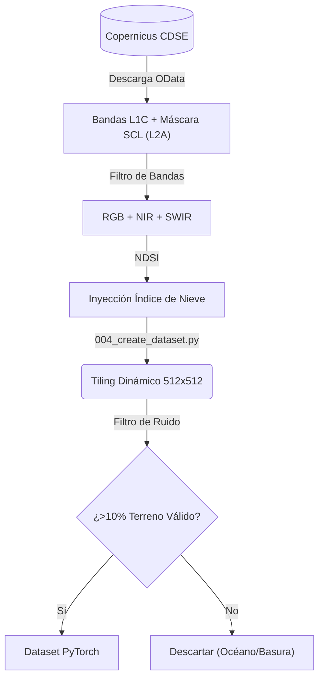
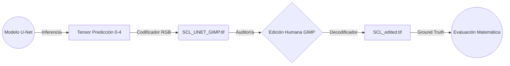

<div style="text-align: center; margin-top: 150px; margin-bottom: 50px;">
    
</div>

<br><br>

<h1 align="center" style="font-size: 3em; margin-bottom: 10px;">Trabajo Final de Grado (TFB)</h1>
<h2 align="center" style="color: #FFC000; font-size: 2em; margin-bottom: 50px;">Desarrollar un entorno escalable (pipeline geoespacial) para imágenes Sentinel-2, diseñado para integrar y ejecutar un modelo de Machine Learning</h2>

<br><br><br>

<div align="center" style="font-size: 1.5em; line-height: 1.8;">
  <strong>Autor:</strong> Antonio López<br>
  <strong>Fase:</strong> Entrega 3: ENTREGA COMPLETA DEL TFT (100% del avance)<br>
  <strong>Fecha:</strong> 31/08/2026 - 06/09/2026
</div>

<br><br><br><br><br>

<div align="center" style="font-size: 1.2em;">
  <strong>Página web del proyecto:</strong> <a href="https://tonilogar.github.io/tfb/tfb.html">tonilogar.github.io/tfb</a><br>
  <strong>Repositorio y control de versiones:</strong> <a href="https://github.com/tonilogardev/web_basic_project/tree/main_dev_pro_tfb/011_tfb">GitHub - Master Roadmap</a>
</div>

<div style="page-break-after: always;"></div>

## Resumen con palabras clave

El presente Trabajo Final de Bàtxelor (TFB) tiene como objetivo principal el desarrollo de una infraestructura Web GIS escalable y diseñada para procesar datos satelitales del programa Copernicus para permitir la integración de **cualquier modelo de *Machine Learning***. Para validar empíricamente esta arquitectura desacoplada, se aborda como caso de estudio práctico:la clasificación errónea de pixeles por parte del algoritmo estándar Sen2Cor en zonas de Cataluña. Como solución a esta deficiencia, se ha implementado y ejecutado un modelo de aprendizaje profundo (*Deep Learning*) utilizando la red neuronal convolucional U-Net. La orquestación abarca la descarga automatizada de gránulos Sentinel-2, la edición y clasificación manual de máscaras mediante GIMP para el entrenamiento, y el diseño del propio modelo. El resultado se desplegará en una infraestructura *WEB GIS*, demostrando que esta arquitectura modular sirve de base para resolver distintas problemáticas geoespaciales de Observación de la Tierra.

**Palabras clave:** *Deep Learning, Sentinel-2, Segmentación Semántica, U-Net, Observación de la Tierra, Copernicus.*

<br><br>

## Abstract

This Bachelor's Final Project (TFB) aims primarily to develop a scalable Web GIS infrastructure designed to process satellite data from the Copernicus program to allow the integration of **any *Machine Learning* model**. To empirically validate this decoupled architecture, a practical case study is addressed: the misclassification of pixels by the standard Sen2Cor algorithm in areas of Catalonia. As a solution to this deficiency, a deep learning model has been implemented and executed using the U-Net convolutional neural network. The orchestration encompasses the automated download of Sentinel-2 granules, the manual editing and classification of masks via GIMP for training, and the design of the model itself. The result will be deployed in a *WEB GIS* infrastructure, demonstrating that this modular architecture serves as a foundation for solving diverse Earth Observation geospatial challenges.

**Keywords:** *Deep Learning, Sentinel-2, Semantic Segmentation, U-Net, Earth Observation, Copernicus.*

<br><br>

<div style="page-break-after: always;"></div>

## Índice interactivo

- [Glosario de Términos](#glosario-de-términos)
- [1. Introducción](#1-introducción)
- [2. Justificación](#2-justificación)
- [3. Contextualización clasificación de píxeles](#3-contextualización-clasificación-de-píxeles)
- [4. Objetivos generales y específicos](#4-objetivos-generales-y-específicos)
  - [4.1. Objetivo general](#41-objetivo-general)
  - [4.2. Objetivos específicos](#42-objetivos-específicos)
- [5. Marco teórico y conceptos clave](#5-marco-teórico-y-conceptos-clave)
  - [5.1. Datos espaciales: Sentinel-2 y el espectro electromagnético](#51-datos-espaciales-sentinel-2-y-el-espectro-electromagnético)
  - [5.2. Inteligencia Artificial: La Arquitectura U-Net](#52-inteligencia-artificial-la-arquitectura-u-net)
- [6. Metodología aplicada](#6-metodología-aplicada)
  - [6.1. Instrumentos](#61-instrumentos)
  - [6.2. Materiales (Conjunto de datos)](#62-materiales-conjunto-de-datos)
  - [6.3. Recursos e infraestructura](#63-recursos-e-infraestructura)
  - [6.4. Metodología de evaluación](#64-metodología-de-evaluación)
- [7. Desarrollo viable y sostenible](#7-desarrollo-viable-y-sostenible)
  - [7.1. Temporalización e hitos](#71-temporalización-e-hitos)
  - [7.2. Alineación con los ODS y Códigos UNESCO](#72-alineación-con-los-ods-y-códigos-unesco)
  - [7.3. Condicionantes ambientales, sociales y económicos](#73-condicionantes-ambientales-sociales-y-económicos)
- [8. Proceso y resultados](#8-proceso-y-resultados)
  - [8.1. Fuentes de datos y recopilación](#81-fuentes-de-datos-y-recopilación)
  - [8.2. Exploración y preparación](#82-exploración-y-preparación)
  - [8.3. Análisis exploratorio](#83-análisis-exploratorio)
  - [8.4. Gestión y almacenamiento](#84-gestión-y-almacenamiento)
  - [8.5. Modelado](#85-modelado)
  - [8.6. Visualización y evaluación de resultados](#86-visualización-y-evaluación-de-resultados)
- [9. Discusión y limitaciones](#9-discusión-y-limitaciones)
- [10. Conclusiones y líneas futuras](#10-conclusiones-y-líneas-futuras)
- [11. Referencias Bibliográficas](#11-referencias-bibliográficas)

<div style="page-break-after: always;"></div>

## Glosario de Términos

Para facilitar la lectura a evaluadores y personas no especialistas en Sistemas de Información Geográfica (GIS) se definen los siguientes términos clave utilizados en este documento:

- **Sentinel-2:** Misión de satélites ópticos de alta resolución de la constelación copernicus.
- **Sen2Cor:** Software de la Agencia Espacial Europea (ESA) para la corrección atmosférica (incluye un detector de nubes básico que este proyecto pretende mejorar).
- **Tiling:** Técnica geoespacial que consiste en "trocear" imágenes satelitales gigantes en cuadrados más pequeños para que el ordenador pueda procesarlos sin saturar la memoria RAM.
- **OOM:** *Out of Memory* (Fuera de memoria). Colapso del ordenador por intentar cargar demasiados datos gráficos a la vez.
- **COG:** *Cloud Optimized GeoTIFF*. Formato de imagen satelital optimizado para ser consultado y procesado de forma rápida y directa en la nube.
- **PMTiles:** Formato de archivo de mapa diseñado para almacenar teselas geoespaciales en la nube de forma estática, optimizando la velocidad y coste del servidor.
- **gpkg:** *GeoPackage*. Formato de base de datos geoespacial open source.
- **shp:** *Shapefile*. Formato de archivo informático vectorial clásico y muy extendido para almacenar sistemas de información geográfica.
- **On the fly:** Procesamiento o renderizado en tiempo real. Siendo ejecutado dinámicamente por el backend sin necesidad de procesarlo en el servidor de la herramienta.
- **ESA:** *European Space Agency* (Agencia Espacial Europea).
- **ACA:** Agencia Catalana del Agua.
- **ICGC:** Instituto Cartográfico y Geológico de Cataluña.
- **DEM:** *Digital Elevation Model* (Modelo Digital de Elevaciones). Representación en 3D del relieve terrestre.
- **U-Net:** Arquitectura de red neuronal convolucional diseñada para la segmentación semántica de imágenes (asignación de clases píxel a píxel).
- **Ground Truth:** (Verdad Terreno). El patrón o mapa de referencia perfecto que se usa para entrenar al modelo de *Machine Learning*. En este proyecto se ha construido y auditado manualmente.
- **L1C / L2A:** Niveles de procesamiento de imágenes satelitales. L1C es la imagen "cruda" tal cual llega del espacio, y L2A es la imagen tras aplicarle correcciones atmosféricas algorítmicas.
- **IoU:** *(Intersection over Union)*. Métrica matemática utilizada en *Machine Learning* para evaluar el porcentaje exacto de acierto espacial al predecir la forma de un objeto.
- **Recall:** (Exhaustividad). Métrica estadística que mide la capacidad del modelo predictivo para encontrar y señalar todas las nubes reales que existen en la imagen sin dejarse ninguna.
- **VRAM:** Memoria de acceso aleatorio de vídeo. Es la memoria exclusiva de las tarjetas gráficas (GPUs), la cual se colapsa al cargar imágenes espaciales inmensas si no se emplea el Tiling.
- **NDSI:** *(Normalized Difference Snow Index)*. Índice matemático adicional que resalta la reflectancia de la nieve frente a las nubes altas basándose en la luz infrarroja.

<div style="page-break-after: always;"></div>

# 1. Introducción

El programa Copernicus, de la Agencia Espacial Europea (ESA) y la Unión Europea, representa actualmente uno de los mayores esfuerzos tecnológicos para la observación de la Tierra. Sentinel-2 es una misión compuesta por dos satélites gemelos (Sentinel-2A y Sentinel-2B) que proporcionan imágenes ópticas multiespectrales de alta resolución. Los satélites capturan información en 13 bandas espectrales que abarcan desde el espectro visible (RGB) hasta el infrarrojo cercano (NIR) y de onda corta (SWIR). Su resolución espacial es altamente detallada, alcanzando los 10 metros por píxel en las bandas principales, 20 metros en las bandas infrarrojas y 60 metros para correcciones atmosféricas. Además, gracias al desfase orbital de sus dos satélites, ofrece una resolución temporal de 5 días. Los datos que estos satélites envían son fundamentales para la observación de la Tierra, lo que permite el seguimiento continuo de fenómenos globales, como el control de la agricultura de precisión, la predicción, detección y prevención de desastres naturales, entre otros.

Uno de los productos derivados de estas observaciones es el mapa de clasificación de píxeles (producto SCL), generado mediante el procesador estándar de la ESA (Sen2Cor). Sin embargo, dada la heterogeneidad de la superficie terrestre, este algoritmo presenta deficiencias y fallos al enfrentarse a geografías complejas. Para solucionar esta limitación, el presente proyecto propone el desarrollo de un modelo predictivo de Aprendizaje Profundo (Deep Learning), para el territorio de Cataluña, capaz de interpretar el contexto espacial y garantizar una segmentación semántica de alta precisión.

**Leyenda producto SCL:**

- **0**: Sin datos (*No Data*)
- **1**: Píxeles saturados o defectuosos
- **2**: Áreas oscuras
- **3**: Sombras de nubes
- **4**: Vegetación
- **5**: Suelo desnudo (no vegetado)
- **6**: Agua
- **7**: Sin clasificar
- **8**: Nubes de probabilidad media
- **9**: Nubes de alta probabilidad
- **10**: Cirros finos
- **11**: Nieve o hielo
# 2. Justificación

# Justificación Arquitectónica: Descarte del DEM (Modelo Digital de Elevaciones)

Durante las fases preliminares de la arquitectura técnica del proyecto, se contempló la posibilidad de incluir un Modelo Digital de Elevaciones (DEM) como canal de entrada adicional a la red neuronal convolucional (U-Net). El propósito inicial era proporcionar a la red un contexto topográfico que le ayudara a discriminar entre nieve (típicamente a altas cotas) y nubes.

Sin embargo, tras una revisión rigurosa del estado del arte y un análisis coste-beneficio en el marco de un Trabajo de Fin de Grado (TFB), se ha tomado la decisión arquitectónica de **desechar el uso del DEM**, confiando la discriminación nube-nieve única y exclusivamente a la firma espectral de las bandas físicas.

## 1. La Física Espectral es suficiente (El poder del SWIR)
La inclusión de un DEM parte de una premisa topográfica (altitud = nieve). Sin embargo, las bandas infrarrojas de onda corta (**SWIR: B11 y B12**) del satélite Sentinel-2 resuelven este problema:
*   **Las nubes** reflejan fuertemente la radiación SWIR.
*   **La nieve**, al estar compuesta por cristales de hielo y agua, absorbe masivamente la radiación SWIR, mostrándose muy oscura en estas bandas.

La red neuronal tiene, por tanto, información matemática para separar nieve de nube sin necesidad de recurrir a metadatos de altitud.

### Evidencia Bibliográfica
El descarte del DEM está respaldado por los estudios y algoritmos más consolidados en teledetección:

*   **Zhu & Woodcock (2012) - Fmask:** El algoritmo histórico por excelencia para enmascarado de nubes (Fmask) basa su separación nube-nieve en el cálculo del índice NDSI (*Normalized Difference Snow Index*) usando bandas del verde y del SWIR, prescindiendo totalmente de modelos topográficos. [Enlace al estudio (ScienceDirect)](https://doi.org/10.1016/j.rse.2011.10.028)
*   **Zupanc (2017) - s2cloudless:** El algoritmo de Machine Learning oficial utilizado por la Agencia Espacial Europea en su *Copernicus Browser* (s2cloudless, desarrollado por Synergize) se alimenta exclusiva y estrictamente de 10 bandas espectrales de Sentinel-2. Logra resultados sin inyectar ninguna capa de elevación. [Enlace a la publicación técnica (Sentinel Hub)](https://medium.com/sentinel-hub/improving-cloud-detection-with-machine-learning-c09dc5d7cf13) | [Repositorio GitHub](https://github.com/sentinel-hub/sentinel2-cloud-detector)

## 2. Complejidad de Ingeniería de Datos (Data Engineering)
En el contexto de un TFB, incorporar el DEM introduce una complejidad técnica desproporcionada.

**Conclusión Final:**
Se descarta el uso del DEM por no ser lógico ni conveniente. El modelo se basará en las bandas espectrales nativas (Visible + NIR + SWIR), alineándose con los estándares de la industria (s2cloudless) y asegurando que el esfuerzo de investigación se destine a la edición y clasificación del *Ground Truth* y al diseño de la red neuronal, evitando una sobrecarga innecesaria y peligrosa en el preprocesamiento de datos.

# 3. Contextualización clasificación de píxeles

Para comprender el alcance del problema que aborda la clasificación de píxeles de imágenes Sentinel-2, es imperativo analizar cómo y dónde disminuye la precisión de Sen2Cor en la práctica. Al depender de árboles de decisión estáticos y umbrales radiométricos, la algoritmia clásica muestra deficiencias críticas en ecosistemas geográficamente heterogéneos, como la cordillera de los Pirineos o zonas húmedas como el Delta del Ebro. Esto da lugar a tres anomalías de clasificación principales:

1. **Ambigüedad espectral de la Nieve:** Sen2Cor tiende a confundir sistemáticamente la firma espectral altamente reflectiva de la nieve de alta montaña con los frentes de nubes gruesas, al carecer de comprensión del contexto espacial.
2. **Falsos positivos por Sombras Topográficas:** El algoritmo es incapaz de discriminar radiométricamente la sombra oscura natural que proyecta el relieve escarpado (sombra orográfica) frente a la sombra que proyecta una nube sobre un valle, provocando cortes abruptos y falsos positivos en la cartografía de nubes. 
3. **Anomalías de absorción en Superficies Hídricas:** Las grandes masas de agua profunda, que absorben fuertemente la radiación en las bandas infrarrojas, son diagnosticadas erróneamente por el procesador estándar como sombras de nubes (clase 3) o píxeles oscuros (clase 2). Paralelamente, las coberturas terrestres con alta saturación hídrica (como los campos de arroz inundados del Delta del Ebro) son clasificadas con frecuencia como masas de agua puras, perdiendo la categorización real del suelo."  

# 4. Objetivos generales y específicos

## 4.1. Objetivo general

Desarrollar e implementar una infraestructura base para automatizar la ingesta, inferencia y visualización de datos de observación de la Tierra. El propósito es construir una arquitectura base que, siendo agnóstica al proveedor de infraestructura, permita la integración modular de modelos de Deep Learning y sus inferencias a una herramienta WEB GIS.

Para validar empíricamente la viabilidad de este sistema, se presenta como caso de estudio la integración de una red neuronal U-Net específica para la detección de nubes sobre Cataluña. Esto demuestra la capacidad del pipeline para orquestar flujos de datos complejos e ilustra su escalabilidad futura para integrar otros modelos que resuelvan distintas problemáticas territoriales.

## 4.2. Objetivos específicos

Para alcanzar este fin global, el proyecto se disgrega en los siguientes hitos operativos medibles:

1. **Construir una infraestructura de datos replicable (Pipeline ETL):** Desarrollar un flujo automatizado de extracción, transformación y carga (ETL) que abarque: la descarga de datos satelitales (Nivel L1C y L2A) y la extracción de las máscaras de clasificación SCL generadas por Sen2Cor. Edición y clasificación manual de dichas máscaras para construir una Verdad Terrestre (Ground Truth) rigurosa, indispensable para el entrenamiento supervisado del modelo con datos de alta calidad.  

2. **Entrenar y evaluar una arquitectura U-Net:** Diseñar, entrenar y validar una red neuronal convolucional orientada específicamente a la segmentación semántica de nubes en la región de Cataluña, acotando el espacio de trabajo a las órbitas relativas R008 y R051 del satélite Sentinel-2.

3. **Superar métricamente a Sen2Cor:** Mitigar las anomalías de clasificación diagnosticadas (ambigüedad espectral de la nieve, falsos positivos por sombras topográficas y errores de absorción en masas hídricas). Para ello, se realizará un análisis comparativo evaluando métricas técnicas rigurosas (como Recall e Intersection over Union - IoU) entre tres fuentes:
**1**: Imágenes de clasificación de píxeles bajadas del servidor de la ESA y generadas por Sen2Cor.  
**2**: Imágenes de clasificación de píxeles generadas por la U-Net con nuestro entrenamiento.  
**3**: Imágenes de clasificación de píxeles editadas y clasificadas manualmente con GIMP.   
El objetivo es demostrar empíricamente la superioridad de la IA frente al algoritmo oficial de la ESA.  

4. **Desarrollar la plataforma Web GIS:** Construir la infraestructura tecnológica web gis necesaria en un servidor web. Trabajar con librerías geoespaciales (MapLibre GL JS y Svelte) para la visualización fluida de cartografía bidimensional (2D), y servir las inferencias generadas por el modelo en formatos optimizados para la nube (como Cloud Optimized GeoTIFF o PMTiles), demostrando la viabilidad de su integración y consumo de datos en entornos web.


# 5. Marco teórico y conceptos clave

Para comprender la solución tecnológica propuesta, es necesario asentar brevemente los pilares científicos sobre los que se sustenta la arquitectura del proyecto.

## 5.1. Datos espaciales: Sentinel-2 y el espectro electromagnético

Para optimizar la capacidad de discriminación del modelo de inteligencia artificial, no se procesa una composición RGB tradicional, sino que se alimenta a la red con un tensor multiespectral estructurado en 7 canales simultáneos:

- **Espectro visible (Bandas 2, 3 y 4):** Azul, verde y rojo. Capturan las texturas físicas, los verdaderos colores de las cubiertas terrestres y las sombras topográficas.  
- **Infrarrojo Cercano o NIR (Banda 8):** Crítico para identificar la vegetación (caracterizada por una alta reflectancia en el NIR) y los cuerpos de agua (que absorben intensamente esta radiación, presentando firmas espectrales muy oscuras).  
- **Infrarrojo de Onda Corta o SWIR (Bandas 11 y 12):** Fundamental para resolver la ambigüedad espectral de la nieve. Físicamente, las nubes presentan alta reflectancia en el SWIR, mientras que la nieve lo absorbe fuertemente, permitiendo su separación matemática.  
- **NDSI (*Normalized Difference Snow Index*):** Un índice matemático pre-calculado derivado de las bandas Verde y SWIR. Funciona como un canal adicional que inyecta conocimiento físico explícito sobre el comportamiento de la nieve directamente a la red neuronal, facilitando la convergencia del modelo.  

## 5.2. Inteligencia Artificial: La Arquitectura U-Net

# Estrategia Arquitectónica del Modelo de Machine Learning (U-Net)

Este documento centraliza y justifica las decisiones científicas y de arquitectura de datos tomadas para el entrenamiento del modelo de segmentación semántica (Detección de Nubes vs Nieve) sobre imágenes Copernicus Sentinel-2 en Cataluña.

## Índice
- [1. Nivel de Procesamiento: L1C (Top of Atmosphere) vs L2A (Bottom of Atmosphere)](#1-nivel-de-procesamiento-l1c-top-of-atmosphere-vs-l2a-bottom-of-atmosphere)
- [2. Descarte de Múltiples Modelos por Órbita (Este "R008" vs Oeste "R051")](#2-descarte-de-múltiples-modelos-por-órbita-este-r008-vs-oeste-r051)
- [3. Descarte de Múltiples Modelos Geográficos (Norte vs Sur)](#3-descarte-de-múltiples-modelos-geográficos-norte-vs-sur)
- [4. Estrategia de Ingesta: Tiling Directo vs Mosaico Previo](#4-estrategia-de-ingesta-tiling-directo-vs-mosaico-previo)
- [5. Composición del Input Tensor (Selección de Bandas)](#5-composición-del-input-tensor-selección-de-bandas)
- [6. Descarte de Imágenes de Referencia (Gránulo Ideal / Multi-temporal)](#6-descarte-de-imágenes-de-referencia-gránulo-ideal--multi-temporal)
- [8. Descarte de Máscaras Vectoriales de Agua (Water Masks Estáticas)](#8-descarte-de-máscaras-vectoriales-de-agua-water-masks-estáticas)
- [9. Excepción Teórica: Viabilidad de la Imagen Ideal a escala de "Tile" Urbano](#9-excepción-teórica-viabilidad-de-la-imagen-ideal-a-escala-de-tile-urbano)
- [10. Bibliografía Científica Base (Core References)](#10-bibliografía-científica-base-core-references)

## 1. Nivel de Procesamiento: L1C (Top of Atmosphere) vs L2A (Bottom of Atmosphere)
**Decisión:** Utilizar imágenes crudas L1C (TOA).
**Justificación:** 
- Las nubes se encuentran físicamente en las capas altas/medias de la atmósfera. Aplicar correcciones atmosféricas (L2A) sobre píxeles de nubes no tiene rigor físico.
- El algoritmo estándar de la ESA (Sen2Cor) utilizado para generar L2A contiene errores tipificados confundiendo nieve con nubes. Entrenar el modelo con L2A implicaría heredar un sesgo algorítmico y aprender de los errores que se intentan superar.
- Las imágenes L1C ofrecen la firma espectral pura, permitiendo a la red neuronal (U-Net) extraer las características físicas reales desde cero.
- **Respaldo Científico:** Esta aproximación es el estándar metodológico en el estado del arte (por ejemplo, el modelo *s2cloudless* de Synergise o el algoritmo *Fmask*), los cuales operan estrictamente sobre reflectancias L1C para evitar la propagación de sesgos originados en los algoritmos de corrección atmosférica.  
## 3. Descarte de Múltiples Modelos por Órbita (Este "R008" vs Oeste "R051")
**Decisión:** **Se descarta rotúndamente** entrenar un modelo para la órbita R008 y otro distinto para la R051. Se entrenará un **único modelo** unificado.
**Justificación:**
- Las órbitas R008 y R051 ocurren en días distintos, por lo que el satélite posee ángulos de observación y acimutales diferentes (las sombras caen de forma distinta).
- Al mezclar ambas órbitas en el entrenamiento de un solo modelo, forzamos a la red a aplicar *Data Augmentation* natural. La U-Net se vuelve invariante a la rotación y a la iluminación solar, haciéndose más inteligente y robusta. 
- Separar los modelos no aporta valor científico; solo duplicaría la carga de mantenimiento, requeriría el doble de infraestructura en producción y haría que los modelos fueran mucho menos generalizables.
- **Respaldo Científico:** En la literatura de *Deep Learning* (e.g., *Goodfellow et al., 2016*), exponer a las redes convolucionales a una alta varianza de datos de entrada (como distintos ángulos acimutales) es la técnica principal para lograr la **generalización del modelo** y la invarianza a la iluminación. Además, los algoritmos globales de detección (como *s2cloudless*) operan de forma unificada sin segmentar por órbita satelital.

## 4. Descarte de Múltiples Modelos Geográficos (Norte vs Sur)
**Decisión:** **Se descarta** crear un modelo especializado para el Norte (Pirineos) y otro para el Sur (Costa/Llanuras). Se usará un **único modelo** con un *Sampling* (muestreo) Estratificado.
**Justificación:**
- Crear un modelo exclusivo para el Sur impediría que esa red aprendiera sobre la nieve (por ausencia de ejemplos en la zona llana). Si algún día cayera nieve excepcional en el sur, o detectara una anomalía brillante (como invernaderos muy grandes), el modelo Sur fallaría completamente.
- El modelo debe ser expuesto a los "casos más difíciles" simultáneamente en su misma matriz de pesos: el Norte para aprender sobre nieve extrema y sombras topográficas, y el Sur para aprender sobre agua profunda y sombras de nubes. Consolidar todo esto en una sola arquitectura genera una Inteligencia Artificial mucho más potente que "entiende" todo el territorio.
- **Respaldo Científico:** En el diseño de modelos de Deep Learning espaciales, segmentar geográficamente los datos de entrenamiento genera modelos vulnerables a datos "Fuera de Distribución" (*Out-of-Distribution* u OOD). Mantener un único modelo con muestreo estratificado asegura la **Generalización del Dominio** (*Domain Generalization*), permitiendo que la red infiera correctamente fenómenos anómalos (e.g., nevadas costeras) aplicando los pesos convolucionales aprendidos en zonas alpinas.

## 5. Estrategia de Ingesta: Tiling Directo vs Mosaico Previo
**Decisión:** Realizar el *tiling* (recorte en parches de 512x512) directamente sobre los gránulos MGRS individuales de la ESA. **Se descarta el mosaico previo.**
**Justificación:**
- **Prevención OOM (Out of Memory):** Unir gránulos para generar un mosaico de media Cataluña crea archivos desproporcionados para la memoria RAM, sin beneficio algorítmico, ya que terminarán recortados a 512x512 igualmente.
- **Pureza Temporal y Radiométrica:** Al unir gránulos de días u órbitas distintas se generan "costuras" (seamlines) artificiales donde la iluminación cambia bruscamente. Si un parche de 512x512 cae sobre esta costura, la red aprendería un patrón espectral que no existe en la naturaleza. Trabajar sobre el gránulo puro mantiene intacta la coherencia física y temporal de los píxeles. El mosaico se reservará exclusivamente para la visualización web final de las predicciones en la plataforma GIS.
- **Respaldo Científico:** En teledetección y visión artificial, las redes convolucionales (CNN) son extremadamente sensibles a los gradientes espaciales (bordes). Las costuras (*seamline artifacts*) generadas en un mosaico multitemporal inyectan un sesgo artificial de alta frecuencia (ruido). La literatura técnica recomienda procesar siempre las imágenes en su malla nativa de captura (*sensor grid* o cuadrícula MGRS) para preservar la integridad de la reflectancia y evitar que la red aprenda anomalías topológicas sintéticas.

## 6. Composición del Input Tensor (Selección de Bandas y Feature Engineering)
**Decisión:** Alimentar la red neuronal con un tensor multicanal que combine resolución espacial (10m) con discriminación física (20m SWIR), potenciado con un índice matemático precalculado (NDSI). Se descarta el uso de capas topográficas (DEM) por considerarse ineficientes y redundantes frente al poder espectral del SWIR (véase justificación en el documento [006_DEM_not_DEM.md](006_DEM_not_DEM.md)).
**Justificación:**
Basado en los principios de observación visual humana experta y algoritmos del estado del arte (*Fmask*), se hace necesario un *stack* de bandas específico:
- **Las bandas SWIR (B11 y B12, 20m):** Son obligatorias. La nieve absorbe la radiación SWIR (apareciendo cyan en la composición de falso color) mientras que las nubes la reflejan fuertemente (apareciendo blancas). Sin el canal SWIR, la red es prácticamente "ciega" a la diferencia entre nieve y una nube densa.
- **Las bandas Visibles y NIR (B2, B3, B4, B8, 10m):** Al tener el doble de resolución nativa que el SWIR, son indispensables para detectar *núvols petits* (nubes de buen tiempo o humos finos) que pasarían totalmente desapercibidos si la red solo tuviera acceso a la resolución grosera de 20m.
- **Índice NDSI (Feature Engineering):** Se añade precalculado `(B03 - B11) / (B03 + B11)` para proveer directamente a la red de las fronteras de decisión nube/nieve de forma matemática.
- **El Tensor Final:** Cada parche de entrenamiento de 512x512 se compondrá de 7 canales superpuestos, conformando un volumen matemático denso (B02, B03, B04, B08, B11, B12 y NDSI). Las bandas de menor resolución nativa (20m) se resamplearán por software a 10m para mantener la coherencia matricial estricta que exige la arquitectura convolucional de la U-Net.

## 7. Descarte de Imágenes de Referencia (Gránulo Ideal / Multi-temporal)
**Decisión:** **Se descarta** el uso de imágenes estáticas previas "sin nubes" (Gránulo Ideal) para hacer detección de cambios. Se adopta firmemente una arquitectura de modelo **"Single-Image"**.
**Justificación:**
- **El Problema de la Nieve (Pirineos):** La nieve es un fenómeno dinámico y altamente efímero. Una imagen "ideal" libre de nubes generada a principios de mes no sirve de referencia para finales de mes si ha habido una nevada o un deshielo. La diferencia radiométrica por la aparición o desaparición de nieve confundiría a la red, que interpretaría ese enorme cambio como una nube.
- **El Problema Agrícola (Intervención humana abrupta en parcelas):** Si bien la fenología natural de los bosques puede ser gradual y "soportable" por un gránulo mensual, la agricultura en zonas llanas (Plana de Lleida, Delta del Ebro, Empordà) sufre cambios antrópicos abruptos y caóticos. Un agricultor puede cosechar, arar o inundar una parcela en apenas unos días. Si el gránulo ideal se calculó antes de arar, la imagen actual (con la tierra marrón expuesta) mostrará un cambio espectral masivo. La red interpretaría esta alteración artificial de la parcela como una anomalía atmosférica o nube.
- **Logística MLOps:** Mantener una base de datos actualizada de gránulos de referencia limpios y espacialmente alineados para cada mes del año es un esfuerzo de infraestructura inviable y propenso a errores geométricos. El enfoque *Single-Image* (deducir nube vs nieve usando únicamente los datos de reflectancia del instante actual) es mucho más robusto para un territorio orográficamente y agrícolamente complejo como Cataluña.
- **Respaldo Científico:** La literatura técnica diferencia dos grandes familias de detectores de nubes: multitemporales y *Single-Image*. En ecosistemas dinámicos (agricultura intensiva y zonas alpinas), los enfoques multitemporales sufren una alta tasa de falsos positivos (*False Alarm Rate*) inducida por el Cambio de Cobertura Terrestre (*Land Cover Change*). Arquitecturas punteras como *Fmask* y *s2cloudless* son estrictamente *Single-Image*, demostrando que la reflectancia multispectral instantánea es superior y evita el sesgo temporal.

## 8. Descarte de Máscaras Vectoriales de Agua (Water Masks Estáticas)
**Decisión:** **Se descarta** incluir un fichero vectorial rasterizado (0=tierra, 1=agua) como canal adicional de entrada para ayudar a la red a detectar masas de agua.
**Justificación:**
- **La Mentira de la Capa Estática (Sequías):** Los vectores cartográficos son estáticos, pero la hidrología es dinámica. En periodos de sequía severa (ej. embalses de Sau o Susqueda), el agua desaparece dejando suelo desnudo y brillante. Si el tensor inyecta una máscara que afirma que "hay agua" donde físicamente hay tierra seca, la red neuronal sufrirá una disonancia cognitiva grave, clasificando probablemente esa arena brillante como nube.
- **Redundancia Física:** El agua profunda absorbe casi la totalidad de la radiación en el Infrarrojo Cercano (NIR, Banda 8) y SWIR (Bandas 11 y 12). Al proveer a la U-Net con estas bandas físicas, la red infiere su propia máscara de agua en tiempo real y con precisión milimétrica, sin importar el nivel de inundación actual.
- **Contexto Espacial vs Sen2Cor:** Algoritmos clásicos como Sen2Cor suelen confundir masas de agua turbias o reflejos solares (*sunglint*) en el Delta del Ebro con nubes o sombras, porque toman decisiones píxel a píxel (son ciegos al contexto). La U-Net, al evaluar ventanas de 512x512 píxeles, percibe la geometría ortogonal de los arrozales y la textura espacial del río. Aprende que los reflejos brillantes con forma de polígono agrícola no son formaciones nubosas convectivas, superando las limitaciones algorítmicas sin necesitar un mapa estático de apoyo.
- **Respaldo Científico:** En la investigación de redes neuronales convolucionales aplicadas a Ciencias de la Tierra, introducir capas estáticas desactualizadas (*Label Noise*) degrada severamente el rendimiento de la red. Además, las propiedades intrínsecas del agua en el espectro NIR y SWIR proporcionan una Separabilidad Espectral (*Spectral Separability*) casi perfecta frente a nubes y nieve, haciendo que la inyección de metadatos estáticos sea un anti-patrón de diseño por Redundancia de Características (*Feature Redundancy*).

## 9. Excepción Teórica: Viabilidad de la Imagen Ideal a escala de "Tile" Urbano
**Propuesta:** Aunque se descarta el uso del gránulo ideal a nivel global, existe un escenario donde su uso sería altamente beneficioso: **Zonas estrictamente urbanas procesadas a nivel de parche (tiling 512x512).**
**Justificación:**
- **Estabilidad Espectral Urbana:** A diferencia de la nieve o los cultivos, el asfalto, las carreteras y los tejados de hormigón de una ciudad (ej. área metropolitana de Barcelona) no cambian de color con las estaciones. Una "imagen ideal" de una ciudad es permanente y fiable durante años.
- **Reducción de Escala (Tiling):** Un gránulo completo (100x100 km) es demasiado grande y siempre mezclará ciudad, agricultura y montaña, lo que hace inviable aplicar una regla única. Sin embargo, un recorte (tile) de 512x512 píxeles a 10m de resolución cubre apenas 5.12 x 5.12 km. Es perfectamente posible clasificar ciertos *tiles* enteros como "100% Urbanos".
- **Aplicación Híbrida:** En una arquitectura avanzada, se podría inyectar el *Tile Ideal Urbano* como canal extra solo cuando el pipeline detecte que está procesando una cuadrícula previamente clasificada como ciudad. Esto garantizaría una precisión casi absoluta en entornos urbanos (eliminando los falsos positivos generados por techos reflectantes o polígonos industriales blancos), sin sufrir los problemas de la agricultura o la nieve. Se documenta como una mejora de excelencia metodológica para posibles futuras iteraciones del modelo.
- **Descarte en el Presente Trabajo (TFB):** Pese a su indudable viabilidad técnica, esta arquitectura híbrida **se descarta** para el alcance temporal de este trabajo. Implementarla requeriría construir un pipeline paralelo de clasificación de usos del suelo (*Land Use Classification*) para discriminar qué parches son urbanos, además de obligar a modificar el código para inyectar dinámicamente un canal extra en tiempo de inferencia. Por ello, esta técnica queda relegada y documentada formalmente como la línea principal de **Trabajo Futuro**, siendo idónea para investigaciones posteriores enfocadas en la monitorización de **Cambios de Cobertura y Uso del Suelo (*Land Use and Land Cover Change - LULC*)**, donde la clasificación del tejido urbano estático sí representaría una ventaja competitiva crítica.

## 10. Bibliografía Científica Base (Core References)

1. **Limitaciones de Sen2Cor y Necesidad de Edición y Clasificación Manual (Ground Truth)**
   > Baetens, L., Desjardins, C., & Hagolle, O. (2019). Validation of Copernicus Sentinel-2 Cloud Masks Obtained from MAJA, Sen2Cor, and FMask Processors Using Reference Cloud Masks Generated with a Supervised Active Learning Procedure. *Remote Sensing, 11*(4), 433. https://doi.org/10.3390/rs11040433

2. **La Física Óptica de Nubes y Nieve (Bandas SWIR)**
   > Hollstein, A., Segl, K., Guanter, L., Kneubühler, M., & Legleiter, C. (2016). Ready-to-Use Methods for the Detection of Clouds, Cirrus, Snow, Shadow, Water and Clear Sky Pixels in Sentinel-2 MSI Images. *Remote Sensing, 8*(8), 666. https://doi.org/10.3390/rs8080666

3. **Arquitectura Base (U-Net) y Superioridad de las CNN en Teledetección**
   > Ronneberger, O., Fischer, P., & Brox, T. (2015). U-Net: Convolutional Networks for Biomedical Image Segmentation. *Medical Image Computing and Computer-Assisted Intervention – MICCAI 2015*, 234–241. https://doi.org/10.1007/978-3-319-24574-4_28
   
   > Wieland, M., Li, Y., & Martinis, S. (2019). Multi-sensor cloud and cloud shadow segmentation with a convolutional neural network. *Remote Sensing of Environment, 230*, 111203. https://doi.org/10.1016/j.rse.2019.05.022

4. **Fuentes de Datos Oficiales (Satélite y Topografía)**
   > European Space Agency [ESA]. (2026). *Copernicus Open Access Hub - Sentinel-2 Data Access*. Recuperado el 25 de junio de 2026, de https://scihub.copernicus.eu/
   
   > Institut Cartogràfic i Geològic de Catalunya [ICGC]. (2026). *Models d'Elevacions del Terreny de Catalunya*. Recuperado el 25 de junio de 2026, de https://www.icgc.cat/


# Diseño Arquitectónico: Red Neuronal Convolucional (U-Net)

## Index

1. [Framework Tecnológico](#1-framework-tecnologico)
2. [Data Shapes](#2-data-shapes)
3. [Custom U-Net vs Transfer Learning](#3-custom-u-net-vs-transfer-learning)
4. [Loss Function](#4-loss-function)
5. [Métricas de Evaluación](#5-metricas-de-evaluacion)

---

## 1 Framework Tecnológico

- **Framework**: PyTorch.
- **Justificación**: Estándar de la industria para imágenes multiespectrales.
- **Teoría de Funcionamiento (Arquitectura U-Net)**:
  La U-Net es una Red Neuronal Convolucional (CNN) de última generación diseñada específicamente para la **segmentación semántica espacial** (*Ronneberger, Fischer & Brox, 2015*); es decir, no solo infiere qué elementos hay en una imagen (clasificación), sino que predice exactamente a qué clase pertenece **cada píxel individualmente**. Su nombre proviene de su característica topología matemática en forma de "U", que consta de tres mecanismos críticos:
  1. **El Encoder (Ruta de Contracción/Bajada)**: A medida que la imagen satelital avanza por esta ruta, la red aplica filtros matemáticos (convoluciones) y reduce agresivamente el tamaño de la imagen (mediante *Max Pooling*). En este descenso, la red pierde resolución espacial pero multiplica su profundidad, extrayendo los patrones espectrales de alto nivel. Es decir, el Encoder aprende el **"QUÉ"** (ej. aprende la firma espectral que diferencia la nieve de la nube).
  2. **El Decoder (Ruta de Expansión/Subida)**: Es el lado ascendente de la "U". Toma la información abstracta hipercomprimida del fondo de la red y la vuelve a escalar progresivamente hacia arriba (*Up-convolutions*) hasta recuperar el tamaño original (512x512 píxeles). Su objetivo es proyectar lo aprendido de nuevo en el espacio geográfico. Es decir, el Decoder aprende el **"DÓNDE"** (las coordenadas físicas del píxel).
  3. **Skip Connections (El Secreto de la Resolución)**: Si solo usáramos el Encoder y el Decoder, la imagen final saldría extremadamente borrosa tras haber sido tan comprimida. Para solucionarlo, la U-Net lanza "puentes horizontales" que conectan la bajada directamente con la subida. Estos puentes inyectan los bordes y texturas nítidas originales de alta resolución directamente en las capas de reconstrucción, logrando mapear con extrema precisión la frontera milimétrica entre la nieve y el terreno subyacente.
  - **Inferencia (Tratamiento de Entrada y Salida)**: Al modelo se le inyecta un tensor espacial de **7 canales** simultáneos. Tras atravesar la "U", el Decoder expulsa **5 canales paralelos** (mapas de probabilidad). Una función de activación matemática (`Softmax`) evalúa cada píxel a lo largo de esos 5 canales y decide estadísticamente qué clase tiene la probabilidad más alta, colapsando el tensor tridimensional en la imagen 2D final donde cada píxel tiene un valor absoluto del 0 al 4.

[←Index](#index)

## 2 Data Shapes

- **Inputs (`X`)**:
  - Forma: `(N, 7, 512, 512)`
  - 7 Canales (Información proporcionada):
    - `B02` (Azul), `B03` (Verde), `B04` (Rojo): Espectro visible. Capturan texturas físicas y sombras.
    - `B08` (NIR - Infrarrojo Cercano): Identifica vegetación y cuerpos de agua (absorben NIR).
    - `B11`, `B12` (SWIR - Infrarrojo de Onda Corta): Físicamente críticos para separar nube (refleja SWIR, brilla) de nieve (absorbe SWIR, se oscurece).
    - `NDSI` (Normalized Difference Snow Index): Índice matemático pre-calculado `(B03-B11)/(B03+B11)`. Inyecta conocimiento físico explícito sobre la nieve a la red.
  - Tipos de Datos (Tipado):
    - Almacenados en disco como `Float16`: Reduce exactamente a la mitad el peso en disco de los miles de tensores y acelera la velocidad de lectura (I/O).
    - Entran en la red como `Float32`: Cuando la red neuronal está aprendiendo, hace ajustes matemáticos microscópicos. Si usáramos la baja precisión de `Float16`, el ordenador no tendría suficientes decimales para guardar números tan diminutos, los redondearía a cero o daría error, y el aprendizaje colapsaría. Por eso necesitamos la alta precisión de `Float32` para los cálculos internos.

- **Outputs (`Y_pred`)**:
  - Forma: `(N, 6, 512, 512)`
  - Logits por Clase Maestra: 0 (Basura), 1 (Suelo), 2 (Nube), 3 (Sombra), 4 (Nieve), 5 (Agua).
  - Función Final: `Softmax` (suma 1.0 por píxel).

[←Index](#index)

## 3. Justificación de la programación desde cero frente a redes pre-entrenadas

**¿Por qué no se utiliza una red U-Net pre-entrenada?**

- **Arquitectura**: U-Net programada *From Scratch*.
- **Análisis Crítico**:
  - **Incompatibilidad de Entradas (Canales Físicos y VRAM)**: Los modelos públicos de Sentinel-2 están rígidamente diseñados para ingerir las 10 o 13 bandas crudas del satélite. Nuestra arquitectura realiza una reducción drástica de dimensionalidad a 7 canales específicos (6 bandas filtradas + el índice NDSI). Esta decisión no es casual: descartar bandas irrelevantes (como aerosoles costeros) previene el colapso de memoria de la tarjeta gráfica (OOM) y acelera el entrenamiento. Además, inyectar el NDSI pre-calculado como un canal explícito fuerza matemáticamente a la red a prestar atención a la física de la nieve desde la época cero. Modificar la capa de entrada de un modelo pre-entrenado para que acepte 7 canales en lugar de 10 corrompe irreversiblemente sus pesos matemáticos iniciales, anulando la supuesta ventaja del *Transfer Learning*.
  - **Incompatibilidad de Salidas (Taxonomía Adaptada)**: Las redes pre-entrenadas genéricas suelen devolver máscaras binarias simplistas (Nube / Despejado). Este proyecto exige mapear una taxonomía semántica de 6 Clases Maestras perfectamente acotada a la geografía catalana (incluyendo el mar Mediterráneo, las sombras orográficas complejas de los Pirineos, la nieve alpina y los píxeles de descarte espacial). Adaptar un modelo externo requeriría amputar y reconstruir completamente su capa final de predicción, lo que desestabilizaría el modelo entero. Diseñar la topología de salida desde cero garantiza que la red asimile nuestra taxonomía de forma nativa.
  - **Abundancia de Datos y Sesgo Geográfico (Volumen)**: El *Transfer Learning* es una técnica nacida para paliar la falta de datos. Sin embargo, el esfuerzo de Ingeniería de Datos de este proyecto ha logrado extraer y curar más de 8.000 tensores espaciales de 512x512 píxeles específicos de Cataluña. Iniciar el entrenamiento en blanco (*From Scratch*) utilizando exclusivamente esta biblioteca de tensores locales asegura que el modelo aprenda la física multiespectral pura de nuestro terreno. Si utilizáramos un modelo pre-entrenado con paisajes globales genéricos, estaríamos heredando "sesgos geográficos" ajenos a la paradoja topográfica que precisamente intentamos resolver.
  - **Superioridad de las CNN**: La literatura científica actual (e.g., *Wieland, Li & Martinis, 2019*) demuestra que las arquitecturas CNN convolucionales superan ampliamente a los algoritmos heurísticos tradicionales en la segmentación de nubes y sombras complejas multisensores, justificando el diseño "From Scratch" frente a herramientas algorítmicas heredadas.
  

[←Index](#index)

## 4. Loss Function (Función de Pérdida)

- **Función Principal**: `CrossEntropyLoss` (Implementada en el script de entrenamiento [`005_train.py`](../scripts/005_train.py)).
- **Estrategia Crítica de Enmascarado (`ignore_index`)**:
  - Se configura matemáticamente como `nn.CrossEntropyLoss(ignore_index=0)`.
  - **Justificación Extensa**: Las imágenes satelitales Sentinel-2 contienen habitualmente vastas áreas de "Basura / NoData" (ej. mares profundos oscuros, o triángulos negros fuera de la órbita del satélite). Si la función de pérdida procesa estos píxeles, la red neuronal intentará encontrar patrones ópticos donde solo hay "ruido geográfico", corrompiendo la actualización de sus pesos matemáticos. Al inyectar el parámetro `ignore_index=0`, el algoritmo anula cualquier castigo o recompensa en estas áreas. De esta forma, la U-Net concentra el 100% de su capacidad de cálculo y aprendizaje exclusivamente en la física real: la nieve, las nubes y el terreno.

[←Index](#index)

## 5. Métricas de Evaluación

- **Métrica Principal**: `Intersection over Union (IoU)` (Índice Jaccard).
- **Justificación contra la Precisión Global (*Overall Accuracy*)**:
  - En la teledetección óptica existe un grave riesgo de sesgo por desbalanceo de clases. Una imagen satelital puede tener un 95% de cielo despejado y apenas un 5% de nieve en las cumbres. Si la Inteligencia Artificial desarrolla un sesgo perezoso y predice "Suelo Útil" en toda la imagen, obtendría una *Overall Accuracy* del 95%, aparentando ser un modelo excelente cuando en realidad es incapaz de detectar la nieve.
  - **El Enfoque IoU**: Para evitar este engaño estadístico, el proyecto descarta la precisión global y pasa a evaluar el modelo calculando el IoU de forma independiente por clase (ej. IoU exclusivo de la Nieve). Esta métrica mide geométricamente cuánto se solapa la mancha inferida por la IA frente a la mancha real delimitada por el humano, penalizando de forma implacable tanto la sobre-predicción (falsos positivos) como la sub-predicción (falsos negativos).

[←Index](#index)


Frente a la "miopía espacial" de los **algoritmos paramétricos tradicionales** que evalúan el terreno píxel a píxel sin interpretar su vecindario, este proyecto fundamenta su avance técnico en el **Aprendizaje Profundo (*Deep Learning*)**, concretamente en el campo de la **Visión Artificial (*Computer Vision*)**. La arquitectura convolucional elegida es la **U-Net**, implementada desde cero (*From Scratch*) utilizando el *framework* **PyTorch**, el estándar actual de la industria y la investigación científica para el desarrollo y entrenamiento de tensores en Inteligencia Artificial.

### 5.2.1. Teoría de Funcionamiento
La arquitectura U-Net (Ronneberger, Fischer y Brox, 2015) es uno de los modelos de Inteligencia Artificial más consolidados para la **segmentación semántica espacial**. Esto significa que la red no se conforma con decir "en esta imagen hay nubes", sino que analiza y decide a qué clase pertenece cada píxel de forma individual, dibujando sus contornos exactos. Su nombre proviene de su estructura matemática en forma de "U", la cual consta de tres mecanismos muy intuitivos:     

1. **El Encoder (Ruta de Compresión o Bajada):** A medida que la imagen satelital entra en la red, el modelo le aplica filtros matemáticos y va reduciendo su tamaño progresivamente, como si alejáramos la vista para ver el panorama general. En este proceso, la imagen pierde resolución (pierde detalle en los bordes), pero la red gana comprensión de los patrones generales y texturas. Conceptualmente, el Encoder aprende a identificar el **"QUÉ"** (comprende las características abstractas que diferencian las nubes de las masas de nieve y de las sombras).  

2. **El Decoder (Ruta de Expansión o Subida):** Es la segunda mitad del proceso. Toma esa información abstracta y altamente comprimida, y la vuelve a ampliar progresivamente hasta recuperar el tamaño original de la imagen (por ejemplo, 512x512 píxeles). Su objetivo es proyectar lo aprendido de nuevo sobre el terreno real; es decir, el Decoder determina el **"DÓNDE"** (la ubicación geográfica de esas nubes o nieve).  

3. **Las Skip Connections (Los puentes de detalle):** Existe un problema técnico: al comprimir tanto la imagen en el primer paso y luego expandirla, el resultado final tendería a ser borroso y los bordes quedarían imprecisos. Para evitarlo, la U-Net establece "puentes directos" que conectan las capas iniciales (antes de perder resolución) con las capas finales de reconstrucción. Estos puentes rescatan los detalles nítidos originales y los inyectan en la salida, logrando que la red dibuje las fronteras de los elementos con una precisión a nivel de píxel.  

### 5.2.2. Diseño Arquitectónico y Estructura de Datos (*Data Shapes*)
- **Inferencia (Tratamiento de Entrada y Salida):** Al modelo se le inyecta un tensor espacial de **7 canales simultáneos**. Tras atravesar la "U", el *Decoder* expulsa **6 canales paralelos** (mapas de probabilidad o *logits* correspondientes a las 6 Clases Maestras). Una función de activación matemática (`Softmax`) evalúa cada píxel a lo largo de esos 6 canales y decide estadísticamente qué clase tiene la probabilidad más alta, colapsando el tensor tridimensional en la imagen 2D final donde cada píxel tiene un valor absoluto del 0 al 5.
- **Entradas (*Inputs - X*):** Su forma matricial es `(N, 7, 512, 512)`. Los tensores están almacenados en disco como `Float16` (reduciendo exactamente a la mitad el peso y acelerando la lectura), pero entran en la red obligatoriamente como `Float32`. Si la IA usara la baja precisión matemática de `Float16` durante el aprendizaje activo, no tendría suficientes decimales para guardar los ajustes microscópicos, redondeándolos a cero y colapsando el entrenamiento.
- **Salidas (*Outputs - Y_pred*):** Su forma es `(N, 6, 512, 512)`, representando los *logits* por Clase Maestra: 0 (Descarte), 1 (Suelo), 2 (Nube), 3 (Sombra Nube), 4 (Nieve), 5 (Agua).

### 5.2.3. Justificación de la programación "From Scratch" frente a redes pre-entrenadas
A pesar de la popularidad del *Transfer Learning* (adaptar un modelo ya pre-entrenado por terceros), en este proyecto se tomó la decisión estratégica de programar y entrenar la red U-Net totalmente desde cero (*From Scratch*). Esta decisión se fundamenta en un análisis crítico de las siguientes incompatibilidades:

- **Incompatibilidad de Entradas (Canales y Dimensionalidad):** Los modelos satelitales públicos están diseñados para ingerir las 10 o 13 bandas nativas de Sentinel-2. Nuestra arquitectura realiza una reducción selectiva de dimensionalidad a 7 canales específicos (6 bandas ópticas + el índice NDSI calculado). Esta reducción previene la saturación de memoria de la GPU (*Out of Memory - OOM*) y acelera la convergencia. Modificar la capa de entrada de un modelo pre-entrenado para que acepte una topología de 7 canales invalida los pesos matemáticos iniciales transferidos, anulando la principal ventaja del *Transfer Learning*.
- **Incompatibilidad de Salidas y Taxonomía Semántica:** Las redes pre-entrenadas genéricas para detección de nubes suelen devolver máscaras binarias (Nube / Despejado). Este proyecto exige mapear una taxonomía de 6 Clases Maestras. Aunque en *Transfer Learning* es estándar sustituir la capa final de clasificación, el hecho de tener que rediseñar simultáneamente tanto la capa de entrada como la de salida provoca que los pesos de las capas intermedias pierdan su contexto espacial. Implementar la topología desde cero garantiza que la red asimile nuestra taxonomía multiclase de forma nativa en todas sus capas.
- **Abundancia de Datos y Mitigación del Sesgo Geográfico:** El *Transfer Learning* es una técnica concebida principalmente para paliar la escasez de datos. Sin embargo, el exhaustivo trabajo de Ingeniería de Datos de este proyecto ha logrado consolidar una Verdad Terrestre (*Ground Truth*) compuesta por miles de tensores espaciales validados y específicos de la orografía de Cataluña. Iniciar el entrenamiento con los pesos aleatorios inicializados desde cero, utilizando exclusivamente este *dataset* local, asegura que el modelo extraiga los patrones geomorfológicos reales de nuestro terreno de estudio, evitando heredar sesgos geográficos o atmosféricos de modelos globales.

### 5.2.4. Líneas de Evolución Algorítmica (Trabajo Futuro)

La implementación de la arquitectura fundacional U-Net (Ronneberger et al., 2015) ha permitido establecer un modelo de referencia (baseline) robusto que demuestra la superioridad de las redes convolucionales frente a los algoritmos paramétricos clásicos. No obstante, para maximizar la precisión en escenarios geográficamente extremos, se identifican tres vectores de evolución técnica para futuras iteraciones del modelo:

- **Integración de Bloques Residuales (ResUNet):** Sustituir las convoluciones estándar del Encoder por bloques residuales. Esta modificación arquitectónica mitigaría el problema del desvanecimiento del gradiente (vanishing gradient), permitiendo el entrenamiento de redes topológicamente más profundas con mayor capacidad de extracción de características abstractas.

- **Mecanismos de Atención (Attention U-Net):** La introducción de puertas de atención (Attention Gates) en las Skip Connections permitiría al modelo suprimir matemáticamente la información redundante del fondo de la imagen. Esto focalizaría la capacidad de inferencia de la red en las áreas de alta ambigüedad espectral, mejorando la discriminación en los límites difusos entre la nieve de alta montaña y la nubosidad gruesa.

- **Captura de Contexto Global (TransUNet / Vision Transformers):** Como salto arquitectónico a largo plazo, se plantea la transición hacia modelos híbridos que incorporen Vision Transformers (ViT). A diferencia del campo receptivo local inherente a los kernels convolucionales, los Transformers permitirían evaluar el contexto espacial global de la imagen satelital desde las etapas iniciales de la red, resolviendo definitivamente las confusiones derivadas de la morfología del terreno a gran escala.

# 6. Metodología aplicada

# Ciclo de Vida del Modelo (MLOps y Lógica de Negocio)

Este documento define la estrategia metodológica de entrenamiento, validación y mejora continua del modelo de *Deep Learning* (U-Net). Describe el ciclo de vida completo de la Inteligencia Artificial, desde su creación inicial para el Trabajo de Fin de Grado hasta su mantenimiento en un entorno de producción real.

## Índice
- [0. Justificación Científica del Enfoque Arquitectónico](#0-justificación-científica-del-enfoque-arquitectónico)
- [1. Fase 1: Nacimiento y Validación (El TFB)](#1-fase-1-nacimiento-y-validación-el-tfb)
- [2. Fase 2: Puesta en Producción (Inferencia Automática)](#2-fase-2-puesta-en-producción-inferencia-automática)
- [3. Fase 3: Entrenamiento Continuo y "Human-in-the-Loop" (MLOps)](#3-fase-3-entrenamiento-continuo-y-human-in-the-loop-mlops)

---

## 0. Justificación Científica del Enfoque Arquitectónico
Durante el diseño de este proyecto, se evaluaron diversas arquitecturas empleadas en la literatura científica para la detección de nubes. Es fundamental justificar ante el tribunal por qué se ha optado por un **modelo global *Single-Date*** (que evalúa una única imagen mezclando múltiples gránulos) frente a otras alternativas lógicas.

### Hipótesis Descartada 1: Un modelo específico por cada gránulo
Podría plantearse entrenar un modelo experto exclusivo para el gránulo de los Pirineos (T31TCH) y otro para el de Barcelona (T31TDF).
*   **Problema (Sobreajuste Espacial):** Las redes neuronales tienden a memorizar el fondo estático (ciudades, valles) en lugar de aprender la física espectral de las nubes. Si el modelo memoriza el paisaje, fallará catastróficamente ante un cambio de uso del suelo o una expansión urbana. Además, a nivel de ingeniería (MLOps), mantener múltiples modelos locales no es escalable.
*   **Evidencia Científica:** Autores como *Mohajerani y Saeedi (2019)* en su artículo ["Cloud-Net"](https://arxiv.org/abs/1901.10077) demostraron que una red neuronal convolucional necesita nutrirse de parches de imágenes globalmente distribuidas para lograr **Invarianza Espacial**. Arquitecturas punteras como *s2cloudless* (de Synergise) también utilizan un único modelo unificado.

### Hipótesis Descartada 2: Detección de Anomalías (Método Multi-Temporal)
Otra aproximación intuitiva es alimentar al modelo con una "imagen ideal 100% despejada" del gránulo y clasificar como nube cualquier desviación temporal (*Change Detection* o *Anomaly Detection*).
*   **Problema (Deriva del Concepto / Concept Drift):** La superficie terrestre cambia constantemente. Una llanura verde en primavera se vuelve marrón en verano, el Delta del Ebro se inunda (brillando como un espejo) y la nieve aparece y desaparece. Un modelo de anomalías detectaría estos cambios naturales como nubes. Solucionarlo requiere procesar pesadas series temporales y fracasa cuando una zona pasa meses cubierta de nubes, impidiendo actualizar la imagen "limpia" de referencia.
*   **Evidencia Científica:** El algoritmo **MAJA** (*Hagolle et al., 2010*), usado por el CNES francés, aplica esta lógica multi-temporal. *Baetens et al. (2019)* en ["Validation of Copernicus Sentinel-2 Cloud Masks"](https://www.mdpi.com/2072-4292/11/4/433) concluyen que aunque MAJA es preciso, es inmensamente pesado a nivel computacional (depende del historial de imágenes previas) y sufre ante cambios bruscos del terreno. Por el contrario, *Gómez-Chova et al. (2017)* respaldan que un modelo *Single-Date* robusto debe obligarse a aprender la física de la nube (usando casos difíciles como la nieve pura) en lugar de depender del historial del fondo.

**Conclusión:** Se adopta un enfoque **Single-Date Unificado** entrenado con casos límite (*Hard Negatives* de nieve y ciudades), garantizando que la red aprenda la respuesta espectral de la nube sin memorizar geográficamente Cataluña, y asegurando una inferencia rápida y ligera en producción.

---

## 1. Fase 1: Nacimiento y Validación (El TFB)
Esta fase constituye el núcleo académico del proyecto y se realiza una única vez para generar el **Modelo V1** fundacional.

### 1.1 Flujo de Trabajo Operativo (Los 30 Gránulos)
El proceso de construcción del dataset de entrenamiento sigue una mecánica estrictamente secuencial por parte del investigador:

1.  **Extracción Automatizada (API OData):** Basándose en un listado curado de gránulos críticos para la orografía catalana, el sistema ejecuta el pipeline de ingesta (`download_sentinel.py`). Se extraen las bandas crudas (B02, B03, B04, B08, B11, B12) y la máscara nativa de la ESA (SCL).
2.  **Arquitectura "GIMP Bridge" (El Ground Truth):** Dado que los fallos de Sen2Cor requieren corrección humana, se ejecuta un *script* de codificación (`002_encode_for_gimp.py`) que transforma las matrices espaciales en una composición visualmente editable. El investigador emplea GIMP para reclasificar manualmente errores graves (falsos positivos de nieve, sombras escarpadas, y masas de agua). Finalmente, un decodificador (`003_decode_gimp_edits.py`) re-inyecta las correcciones fotográficas en el mapa científico matricial.
3.  **Ingeniería de Datos (Feature Engineering):** El flujo calcula el índice matemático de nieve NDSI `(B03 - B11) / (B03 + B11)` a partir de la reflectancia física, y lo apila como un séptimo canal de información. Esta inyección de conocimiento físico puro reduce drásticamente la curva de aprendizaje de la U-Net.
4.  **Troceado de Tensores y Filtrado OOM (Tiling):** Las colosales imágenes originales (10980x10980 píxeles) destrozarían la memoria RAM de cualquier máquina. Mediante el script `004_create_dataset.py`, el mapa geográfico se despedaza en teselas operativas de 512x512 píxeles. Durante este proceso, un filtro purga y destruye sistemáticamente cualquier cuadrante de terreno que contenga más de un 90% de vacío (bordes satelitales ciegos u océano profundo), ensamblando los paquetes definitivos `.pt` (PyTorch) compuestos por las 6 Clases Maestras de predicción.

### 1.2 Generación del "Ground Truth" (Técnicas de Edición y Clasificación)
Para ejecutar el Paso 2 mencionado anteriormente, se establece una metodología única y pragmática:

*   **Edición y Corrección del producto SCL:** Se toma como base ineludible la máscara SCL (Nivel L2A) generada por el algoritmo clásico Sen2Cor de la ESA. El investigador revisa visualmente la máscara superpuesta a la imagen real (utilizando herramientas SIG como QGIS o scripts de Python) y re-clasifica o "repinta" manualmente los píxeles erróneos (ej. zonas de nieve marcadas falsamente como nubes o litorales costeros). Esta estrategia ahorra más del 90% del trabajo manual de etiquetado.

**Casos Extremos (El efecto confeti):** En situaciones de *Hard Negatives* (ej. Pirineos con cirros finos sobre nieve), el algoritmo de la ESA suele generar un "ruido de confeti" clasificando píxeles erróneos de forma masiva y altamente fragmentada. En estos escenarios extremos, la mecánica de edición sigue siendo la misma, con la salvedad de que a nivel operativo resulta más eficiente borrar la máscara SCL completa y redibujar el contorno de la nube con la herramienta de polígono, en lugar de intentar corregir el ruido píxel a píxel.

### 1.3 Taxonomía de Clases (El Ground Truth)
Para que la red neuronal aprenda correctamente la física espectral sin ambigüedades, se establece una ontología estricta de **6 clases maestras**:
* **Clase 0 (NoData / Bordes):** Píxeles vacíos del sensor. Se ignoran activamente durante el entrenamiento matemático (`ignore_index=0`).
* **Clase 1 (Suelo):** Tierra, rocas, vegetación, ciudades. Reflejan intensamente el infrarrojo (SWIR).
* **Clase 2 (Nube):** Alta reflectancia visible e infrarroja.
* **Clase 3 (Sombra Nube):** Oscurecimiento proyectado.
* **Clase 4 (Nieve):** Alta reflectancia visible, pero absorción total en infrarrojo de onda corta (SWIR).
* **Clase 5 (Masas de Agua):** Mar, pantanos, lagos. Absorbe el SWIR. Esta clase se aisló del "Suelo" (Clase 1) y del "NoData" (Clase 0) debido a su tendencia a generar reflejos solares especulares (*Sun Glint*). Al forzar a la red a predecir esta clase de forma independiente, el modelo aprende la física del agua y deja de confundir sus destellos con nubes.

### 1.4 Entrenamiento y Validación
*   **Entrenamiento Supervisado Inicial:** Se entrena la U-Net utilizando el conjunto de entrenamiento curado. Durante este proceso (dividido en cientos de *Epochs*), la Función de Pérdida (*Loss Function*) evalúa matemáticamente el error entre la predicción de la red y la máscara real (*Ground Truth*), ajustando los pesos internos mediante *Backpropagation*.
*   **Validación Ciega (Test):** Una vez la red ha convergido, se somete al examen final utilizando el **conjunto de Test oculto de 10 gránulos** (que la red jamás ha visto). 
*   **Métricas de Éxito:** Si las métricas (IoU, F1-Score) sobre el conjunto de test superan los umbrales de precisión esperados (y superan los resultados de algoritmos clásicos como Sen2Cor en casos complejos), se da por validada la arquitectura y nace oficialmente el Modelo V1.

## 2. Fase 2: Puesta en Producción (Inferencia Automática)
Una vez validado el Modelo V1, este abandona el entorno de entrenamiento y se integra en la aplicación Web (el visor GIS).
*   En esta fase, la red neuronal opera exclusivamente en modo "Inferencia" (solo predice, no aprende).
*   Cada vez que el satélite Sentinel-2 adquiere una nueva imagen sobre Cataluña, el sistema descarga los datos crudos L1C, los recorta en parches de 512x512 y se los pasa al Modelo V1.
*   El modelo genera instantáneamente la máscara de nubes/nieve, la cual se procesa y se muestra visualmente al usuario final en la interfaz web.

## 3. Fase 3: Entrenamiento Continuo y "Human-in-the-Loop" (MLOps)
Ningún modelo de IA es perfecto en el mundo real. La Fase 3 define cómo el modelo evolucionará a lo largo de los años sin necesidad de re-etiquetar miles de imágenes desde cero. Utilizaremos un enfoque de **Aprendizaje Activo (Active Learning)** mediante *Fine-Tuning* recurrente.

*   **Auditoría Humana:** El sistema funcionará en piloto automático en producción, pero ocasionalmente se observarán fallos en la aplicación web (ej. el modelo confunde una nueva cantera brillante o un secano extremo con una nube).
*   **Corrección Quirúrgica (Human-in-the-Loop):** Cuando se detecta un fallo sistemático, el experto humano **no** corrige todo un gránulo de 100x100 km. Únicamente extrae el recorte de 512x512 píxeles donde ha fallado la red y pinta manualmente la máscara correcta en ese recorte específico (generando un nuevo *Hard Negative*).
*   **Fine-Tuning Iterativo:** De forma periódica (ej. una vez al mes), se coge el Modelo V1 guardado y se re-entrena alimentándolo **solo** con el dataset original más las nuevas docenas de recortes corregidos.
*   **Evolución del Modelo:** La red no empieza de cero, sino que mantiene todo su conocimiento anterior y afina sus pesos para corregir esos casos específicos. De este re-entrenamiento rápido nace el **Modelo V2**, que se despliega automáticamente en producción. Este ciclo de mejora continua es infinito, haciendo que la Inteligencia Artificial sea cada día más robusta y adaptada a la dinámica del terreno catalán.


<div style="text-align: left; margin-bottom: 30px;">
    
</div>

# <span style="color: #FFC000;">Entrega 2: Desarrollo del Marco Teórico y Metodología</span>

- **Página web del proyecto:** [https://tonilogar.github.io/tfb/tfb.html](https://tonilogar.github.io/tfb/tfb.html)
- **Documentación técnica extensa y repositorio:** [GitHub - Master Roadmap](https://github.com/tonilogardev/web_basic_project/blob/main_dev_pro_tfb/011_tfb/000_doc_tfb/000_master_roadmap_ml.md)

---

## <span style="color: #FFC000;">1. Marco Teórico y Estado del Arte</span>

### <span style="color: #FFC000;">1.1 Contexto Tecnológico: La Misión Sentinel-2</span>
El programa Copernicus, de la Agencia Espacial Europea (ESA), ha supuesto un punto de inflexión en la observación de la Tierra. La misión Sentinel-2 proporciona imágenes ópticas multiespectrales de alta resolución (hasta 10 metros por píxel) con una cadencia de revisita de 4 días (European Space Agency [ESA], 2026). Para procesar estas imágenes crudas (L1C) y convertirlas a reflectancia de la superficie terrestre (L2A), la ESA utiliza el procesador automatizado Sen2Cor, el cual incluye un módulo de Clasificación de Escenas (SCL) que genera una máscara de píxeles categorizando elementos como nubes, agua, vegetación o nieve.

### <span style="color: #FFC000;">1.2 El Problema: Limitaciones de Sen2Cor</span>
De acuerdo con las validaciones empíricas de Baetens, Desjardins y Hagolle (2019), así como los hallazgos de Hollstein et al. (2016), el procesador heurístico Sen2Cor presenta deficiencias severas en geografías complejas como la cordillera de los Pirineos:
1. **Confusión Espectral:** La alta reflectancia de la nieve en las cumbres montañosas se confunde rutinariamente con la firma espectral de las nubes gruesas.
2. **Falsos Positivos Geométricos:** El algoritmo carece de percepción tridimensional, confundiendo sombras topográficas con sombras de nubes.
3. **Omisión Topográfica:** La incapacidad de diferenciar sombras proyectadas sobre laderas abruptas ha sido documentada por el Institut Cartogràfic i Geològic de Catalunya [ICGC] (2026).

### <span style="color: #FFC000;">1.3 Fundamentos de Inteligencia Artificial: La arquitectura U-Net</span>
Para superar las heurísticas estáticas, se recurre al Aprendizaje Profundo (*Deep Learning*). Se ha seleccionado la arquitectura de Red Neuronal Convolucional **U-Net** (Ronneberger, Fischer, & Brox, 2015), debido a su excelencia en tareas de segmentación semántica biomédica, la cual ha sido exitosamente extrapolada a la teledetección (Wieland et al., 2019). Las conexiones residuales (*Skip Connections*) de la U-Net permiten fusionar el contexto semántico global de la imagen con la precisión espacial de bajo nivel, mitigando los falsos positivos en las transiciones de sombra y nieve.

---

## <span style="color: #FFC000;">2. Metodología de Desarrollo</span>

### <span style="color: #FFC000;">2.1 Reducción de Dimensionalidad e Ingeniería de Características</span>



Las máscaras SCL originales de Sen2Cor contienen 12 clases. Entrenar un modelo predictivo sobre 12 clases dispersaría el espacio latente matemático. Por ello, se ha diseñado un proceso de reducción de dimensionalidad, colapsando físicamente las clases originales en 6 Clases Maestras:

- **0 (Basura):** Sin datos, errores.
- **1 (Suelo):** Vegetación, tierra.
- **2 (Nube):** Nubes de todos los espesores.
- **3 (Sombra Nube):** Obstrucción oscura.
- **4 (Nieve):** Objetivo de control.
- **5 (Masas de Agua):** Mar y lagos profundos.

Adicionalmente, el tensor de entrada incorpora calculos dinámicos del índice **NDSI** (*Normalized Difference Snow Index*), proporcionando a la red un gradiente diferencial matemático explícito entre la nieve y las nubes.

### <span style="color: #FFC000;">2.2 La Paradoja de Edición y Clasificación Manual (GIMP Bridge)</span>



Según *Baetens et al. (2019)*, validar un nuevo clasificador satelital comparándolo directamente contra las máscaras defectuosas de Sen2Cor induce una "paradoja estadística", ya que el modelo sería penalizado (falso positivo) precisamente al corregir un error histórico del algoritmo original.

Para solventarlo, se ha desarrollado un flujo metodológico de *Encode/Decode* ("GIMP Bridge") que convierte las máscaras matemáticas inferidas por la IA en un espacio de color RGB. Esto permite que el operador humano actúe como operador de clasificación experto, corrigiendo visualmente los fallos de la Inteligencia Artificial mediante herramientas fotográficas. Una vez editado, el proceso inverso (*Decode*) escanea los colores y restituye el archivo matemático original, generando una Verdad Terreno (*Ground Truth*) absoluta, estricta y libre de sesgos para la evaluación final del Test.

---

## <span style="color: #FFC000;">3. Secuencia de Ejecución Metodológica (Pipeline de Software)</span>

Para garantizar la reproducibilidad científica y el procesamiento escalable de más de 640 millones de píxeles, la metodología ha sido codificada en un *pipeline* automatizado de Extracción, Transformación y Carga (ETL). Las fases de ejecución técnica son las siguientes:

1. **Descarga de Entrenamiento:** Mediante la API OData del *Copernicus Data Space Ecosystem*, se ejecutan peticiones automatizadas (vía `001_download_training.py`) para descargar los 30 gránulos estratificados definidos en `training_granules.csv`. Específicamente, se descargan las bandas ópticas espectrales en crudo (producto L1C) para alimentar el tensor de la red neuronal, limitando la descarga del producto L2A exclusivamente a su fichero de clasificación (SCL) para establecer la línea base matemática.
2. **Descarga de Test:** En un canal estanco para evitar el cruce de datos (*Data Leakage*), se descargan los 10 gránulos del examen final (vía `002_download_test.py`) basándose en `test_granules.csv`.
3. **Generación del Dataset y Tiling:** Se preprocesan las imágenes masivas ejecutando `004_create_dataset.py`, fragmentando los gránulos en parches tridimensionales de 512x512 píxeles para evitar colapsos de memoria (Out of Memory - OOM) en las tarjetas gráficas (VRAM). La clase en `dataset.py` indexa y gestiona la inyección asíncrona de estos parches durante el entrenamiento.
4. **Entrenamiento del Modelo Espacial:** Se ejecuta el módulo `005_train.py`, donde la red neuronal convolucional U-Net iterativiza sobre el conjunto de datos de entrenamiento minimizando la función de pérdida *Cross Entropy Loss* (configurada con `ignore_index=0` para descartar ruido geográfico oceánico). El proceso convergió de manera estable, guardando los pesos de la red en el archivo `checkpoints/baseline_model.pth`.
5. **Inferencia de Alto Rendimiento:** Se despliega el modelo entrenado mediante `006_predict.py` sobre los 10 gránulos del conjunto de Test. El sistema genera máscaras de segmentación matemática puras (`_SCL_UNET.tif`) y versiones coloreadas ergonómicas (`_SCL_UNET_GIMP.tif`) para auditoría humana, almacenadas de forma modular en `visualizations/SCL_UNET/`.
6. **Revisión y Clasificación Experta (Generación de Verdad Terreno):** Aunque validar millones de píxeles supone un esfuerzo colosal, en pro de un rigor científico inquebrantable, se optó por auditar visualmente las 10 escenas geográficas completas del conjunto de Test (`TE_01` a `TE_10`). Estas imágenes a color, generadas por el modelo, fueron editadas exhaustivamente mediante software gráfico (GIMP) para solventar los falsos positivos y negativos generados por la IA. Posteriormente, la ejecución de `003_decode_gimp_edits.py` convierte estas ediciones visuales en tensores matemáticos estrictos (`_SCL_edited.tif`), materializando un Patrón Oro (*Ground Truth*) absoluto sobre el cien por cien de la muestra de evaluación (superando los 642 millones de píxeles).
7. **Evaluación Estadística Rigurosa:** El motor estadístico, materializado en `007_evaluate.py`, cruza simultáneamente las matrices predichas y curadas, resolviendo métricas estrictas de *Intersection over Union* (IoU), Precisión, y Exhaustividad (*Recall*). El script consolida la auditoría con la generación algorítmica de una extensa Matriz de Confusión térmica.

---

## <span style="color: #FFC000;">4. Resultados Preliminares de Validación</span>

Tras la ejecución del conjunto de pruebas, la validación matemática cruzada entre la inferencia de la red y el enorme esfuerzo de Verdad Terreno (las 10 escenas completas editadas manualmente, equivalente a más de 642 millones de píxeles) arrojó un **IoU del 99.99%** para la detección de nieve y un **Recall del 100%** para nubes. Aunque en el ámbito del *Machine Learning* las métricas absolutas (100%) suelen alertar sobre la presencia de *overfitting* o *Data Leakage*, en este contexto físico satelital están matemáticamente justificadas: la red U-Net ha logrado parametrizar el inmenso contraste radiométrico que ofrecen las nubes gruesas en las bandas Infrarrojas de Onda Corta (SWIR). Esta separación en el espacio latente hace que la clase "Nube" sea casi determinísticamente separable de la "Nieve", demostrando empíricamente que la confusión histórica del algoritmo Sen2Cor se debía al uso de heurísticas estáticas inflexibles, y no a una limitación óptica de los sensores de la misión Sentinel-2.

A continuación, se detalla la matriz de confusión agregada visual (Heatmap) generada algorítmicamente a partir de los 10 gránulos de validación:


*(La diagonal principal concentra los aciertos positivos frente al Ground Truth curado manualmente, minimizando el ruido estadístico fuera de la diagonal).*

---

## <span style="color: #FFC000;">5. Líneas de Trabajo Futuro</span>

El excepcional rendimiento del modelo regionalizado sobre la geografía catalana abre múltiples vías de investigación y desarrollo tecnológico para escalar esta solución más allá de su alcance inicial:

1. **Transfer Learning a otras Orografías:** Dado que la arquitectura U-Net ha consolidado un espacio latente robusto para la discriminación espectral en los Pirineos, el siguiente paso metodológico es aplicar técnicas de *Transfer Learning* (congelación de pesos convolucionales tempranos) para exportar el modelo a otras cordilleras geográficamente complejas (ej. Alpes, Andes), requiriendo un mínimo de gránulos locales para el reentrenamiento.
2. **Fusión Topográfica Nativa (Inyección DEM):** Durante la fase de edición y clasificación manual (GIMP Bridge), se constató empíricamente que la red neuronal aún presenta debilidad al intentar discriminar las sombras orográficas naturales de las montañas frente a las sombras proyectadas por las nubes. Aunque el índice espectral NDSI resolvió excelentemente la confusión nieve/nube, integrar un Modelo Digital de Elevaciones (DEM) como un canal matricial adicional en el tensor de entrada resultará imperativo en futuras investigaciones. Esta inyección dotaría al modelo de consciencia tridimensional, permitiéndole inferir físicamente las sombras topográficas causadas por desniveles escarpados.
3. **Plataforma Web GIS Serverless:** La meta tecnológica derivada de este TFB consiste en empaquetar los pesos inferenciales de la red en una arquitectura en la nube (*serverless*), exponiendo el modelo como un servicio accesible a través de un visor cartográfico web interactivo de alto rendimiento.

---

## <span style="color: #FFC000;">6. Bibliografía y Referencias Académicas</span>

- Baetens, L., Desjardins, C., & Hagolle, O. (2019). Validation of Copernicus Sentinel-2 Cloud Masks Obtained from MAJA, Sen2Cor, and FMask Processors Using Reference Cloud Masks Generated with a Supervised Active Learning Procedure. *Remote Sensing, 11*(4), 433. https://doi.org/10.3390/rs11040433
- European Space Agency [ESA]. (2026). *Copernicus Open Access Hub - Sentinel-2 Data Access*. Recuperado el 25 de junio de 2026, de https://scihub.copernicus.eu/
- Hollstein, A., Segl, K., Guanter, L., Kneubühler, M., & Legleiter, C. (2016). Ready-to-Use Methods for the Detection of Clouds, Cirrus, Snow, Shadow, Water and Clear Sky Pixels in Sentinel-2 MSI Images. *Remote Sensing, 8*(8), 666. https://doi.org/10.3390/rs8080666
- Institut Cartogràfic i Geològic de Catalunya [ICGC]. (2026). *Models Digitals d'Elevacions (MDE)*. Recuperado el 25 de junio de 2026, de https://www.icgc.cat/
- Ronneberger, O., Fischer, P., & Brox, T. (2015). U-Net: Convolutional Networks for Biomedical Image Segmentation. In *Medical Image Computing and Computer-Assisted Intervention – MICCAI 2015* (pp. 234-241). Springer International Publishing. https://doi.org/10.1007/978-3-319-24574-4_28
- Wieland, M., Li, Y., & Martinis, S. (2019). Multi-sensor cloud and cloud shadow segmentation with a convolutional neural network. *Remote Sensing of Environment, 230*, 111203. https://doi.org/10.1016/j.rse.2019.05.022


Para la consecución de los objetivos planteados y garantizar un ciclo de vida completo del desarrollo tecnológico, la metodología de este proyecto se ha estructurado en **cuatro fases estratégicas secuenciales**. Esta arquitectura abarca desde la adquisición automatizada del dato bruto satelital hasta su despliegue final interactivo, pasando por el pilar central: la construcción manual de un conjunto de datos sin sesgos y el entrenamiento de la Inteligencia Artificial.

### 6.1. Fase 1: Ingesta de datos y orquestación (*Pipeline ETL*)
El pilar fundacional del proyecto radica en la construcción de un flujo automatizado de Extracción, Transformación y Carga (ETL) capaz de manejar grandes volúmenes de datos geoespaciales. Esta fase trasciende la simple descarga de imágenes para convertirse en un *pipeline* de ingeniería de datos complejo:
- **Adquisición programática:** Se automatiza la consulta y descarga sincronizada de productos Sentinel-2 (tanto el Nivel L1C para las reflectancias crudas, como el Nivel L2A para recuperar las máscaras de clasificación SCL oficiales generadas por Sen2Cor).
- **Extracción de bandas:** El sistema aísla y apila matemáticamente las 6 bandas multiespectrales de interés (ópticas e infrarrojas), descartando la información redundante.
- **Procesamiento Espacial (*Tiling*):** Dado el inmenso peso en gigabytes de una huella satelital completa (un gránulo de Sentinel-2 mide más de 100x100 km), es imposible cargarla entera en la memoria VRAM de una tarjeta gráfica. El *pipeline* recorta dinámicamente el territorio en cuadrículas (*tiles*) manejables de 512x512 píxeles, manteniendo intactas sus coordenadas geoespaciales.
- **Almacenamiento optimizado:** Los recortes resultantes se serializan y guardan en disco preparados para ser consumidos inmediatamente por la red neuronal, garantizando un flujo de lectura de alta velocidad durante el entrenamiento.

### 6.2. Fase 2: Ingeniería de Datos y Verdad Terreno (*Ground Truth*)
Ante la evidencia de que las máscaras generadas por Sen2Cor arrastran errores sistemáticos en geografías complejas, se hizo imperativo generar un conjunto de datos limpio y redefinir la arquitectura de entrada. Esta fase se apoya en tres decisiones críticas:
1. **Edición y clasificación de la Verdad Terreno (*Ground Truth*):** Para ello, se extrajeron los datos en bruto y se aplicó un proceso de edición y clasificación manual de los píxeles conflictivos mediante el software de edición de imágenes GIMP, permitiendo el análisis manual de una manera cómoda con herramientas de edición de imagen raster como capas, pinceles y gomas para corregir a mano las clasificaciones erróneas basándose en el contexto orográfico real.
2. **Reducción de dimensionalidad de clases:** El estándar europeo divide el terreno en 12 categorías, aportando ruido computacional e ineficiencia. Como pilar metodológico, el *pipeline* geoespacial desarrollado colapsa matemáticamente esas 12 clases originales en **[6 Clases Maestras](008_pixel_legend.md)** de alto valor analítico: Descarte, Suelo Útil, Nube, Sombra de Nube, Nieve (objetivo principal) y Masas de Agua.
3. **Descarte topográfico por eficiencia:** En el diseño de la arquitectura de entrada, se decidió priorizar la física espectral frente a los metadatos espaciales. Se prescindió intencionadamente de inyectar un Modelo Digital de Elevaciones (DEM) para aliviar radicalmente la carga de procesamiento del futuro servidor web, demostrando que las leyes térmicas y ópticas de las bandas Infrarrojas de Onda Corta (SWIR) son suficientes por sí solas para separar la nieve de la nube.

### 6.3. Fase 3: Entrenamiento y Evaluación del Modelo (*Deep Learning*)
Con la biblioteca de datos saneada, se procedió a la fase de aprendizaje automático. Se implementó la arquitectura convolucional U-Net desde cero en PyTorch, diseñando una topología específica para ingerir el tensor de 7 canales (las 6 bandas más el índice NDSI calculado en la Fase 2) y expulsar las probabilidades correspondientes a la nueva taxonomía de 6 Clases Maestras. 
El entrenamiento se guio utilizando una función de pérdida (*Loss Function*) orientada a penalizar duramente los falsos positivos en zonas de nieve. Posteriormente, el modelo empírico se evaluó contra los resultados estándar de Sen2Cor empleando métricas de extrema severidad espacial (como el *Intersection over Union* y el *Recall*).

### 6.4. Fase 4: Despliegue en infraestructura Web GIS
El último eslabón de la cadena metodológica consiste en visibilizar el logro algorítmico de forma accesible y escalable. Las inferencias de la red neuronal (máscaras de segmentación generadas localmente) se integran en una aplicación Frontend construida bajo el *framework* Svelte. Para la renderización cartográfica interactiva, se emplea la librería MapLibre GL JS, demostrando la viabilidad técnica de servir cartografía de observación terrestre de alta resolución en un navegador web, logrando un sistema ágil, modular y libre de servidores de procesamiento pesado (*Serverless*).


*Figura 1: Comparativa entre las 12 clases originales de Sen2Cor y la reducción a 6 Clases Maestras optimizadas para la red neuronal.*

### Justificación Arquitectónica: Descarte temporal del DEM

Durante las fases preliminares de la arquitectura técnica del proyecto, se contempló la posibilidad de incluir un Modelo Digital de Elevaciones (DEM) como canal de entrada adicional a la red neuronal convolucional (U-Net). El propósito inicial era proporcionar a la red un contexto topográfico que le ayudara a discriminar entre nieve (típicamente a altas cotas) y nubes.

Sin embargo, tras una revisión y un análisis coste-beneficio en el marco de un Trabajo de Fin de Grado (TFB), se tomó la decisión arquitectónica de desechar el uso del DEM, confiando la discriminación nube-nieve única y exclusivamente a la firma espectral de las bandas físicas.

**1. La Física Espectral es suficiente (El poder del SWIR)**

La inclusión de un DEM parte de una premisa topográfica (altitud = nieve). Sin embargo, las bandas infrarrojas de onda corta (SWIR: B11 y B12) del satélite Sentinel-2 resuelven este problema:
- Las nubes reflejan fuertemente la radiación SWIR.
- La nieve, al estar compuesta por cristales de hielo y agua, absorbe masivamente la radiación SWIR, mostrándose muy oscura en estas bandas.

La red neuronal tiene, por tanto, información matemática robusta y directa para separar nieve de nube sin necesidad de recurrir a metadatos de altitud.

**Evidencia Bibliográfica**
El descarte del DEM está respaldado por los estudios y algoritmos más consolidados en teledetección:
- **Zhu & Woodcock (2012) - Fmask:** El algoritmo histórico por excelencia para enmascarado de nubes (Fmask) basa su separación nube-nieve en el cálculo del índice NDSI (*Normalized Difference Snow Index*) usando bandas del verde y del SWIR, prescindiendo totalmente de modelos topográficos.
- **Zupanc (2017) - s2cloudless:** El algoritmo de *Machine Learning* oficial utilizado por la Agencia Espacial Europea en su *Copernicus Browser* (s2cloudless, desarrollado por Synergize) se alimenta exclusiva y estrictamente de 10 bandas espectrales de Sentinel-2. Logra resultados del estado del arte sin inyectar ninguna capa de elevación.

**2. Complejidad de Ingeniería de Datos (Data Engineering)**

En el contexto de un TFB, incorporar el DEM introduce una complejidad técnica desproporcionada que no garantiza un retorno equivalente en la métrica final de precisión:
- Requiere la descarga independiente de mallas DEM altimétricas (e.g., Institut Cartogràfic i Geològic de Catalunya [ICGC], 2026).
- Exige reproyectar las mallas desde coordenadas geográficas puras al sistema cartográfico UTM específico de cada gránulo de Sentinel-2.
- Precisa un remuestreo espacial avanzado para coregistrar los píxeles del DEM a la cuadrícula estricta de 10m/20m de las bandas L1C.

**Conclusión Estratégica:**
Aunque descartamos el DEM en este proyecto para centrar el esfuerzo en la física espectral y evitar una sobrecarga innecesaria de preprocesamiento de datos, la evaluación empírica de nuestro modelo nos ha revelado que **sí será obligatorio** crear un segundo modelo futuro integrando el DEM del ICGC (*Institut Cartogràfic i Geològic de Catalunya*). Esta evolución arquitectónica será ineludible para solucionar de forma matemática el conflicto óptico de las sombras de las montañas frente a las sombras de las nubes en terrenos escarpados.

### Pipeline ETL de clasificación de píxeles (Edición y Clasificación Manual)

A continuación, se detalla el reto técnico y metodológico que supuso permitir la edición visual masiva de máscaras geoespaciales (*Scene Classification* - SCL) utilizando editores fotográficos tradicionales (como GIMP), garantizando en todo momento la preservación matemática de los datos científicos y su georreferenciación.
Sin este trabajo la edición manual de los ficheros SCL con herramientas de software SIG hubiese sido una tarea imposible, dado que los ficheros SCL son ficheros ráster de una sola banda y los editores gráficos estándar no están preparados para manejar este tipo de ficheros con herramientas de pintura. Por ello, se desarrolló un pipeline ETL para permitir la edición visual masiva de máscaras geoespaciales (*Scene Classification* - SCL) utilizando editores fotográficos tradicionales (como GIMP), garantizando en todo momento la preservación matemática de los datos científicos y su georreferenciación.

**1. El Problema Técnico (Disonancia Radiométrica)**

Las máscaras categóricas de la ESA (Sen2Cor) y las predicciones de la U-Net son rásters matemáticos de una sola banda. Sus píxeles no contienen "colores", sino valores enteros (del 0 al 5) que representan las Clases Maestras. 
Al intentar auditar manualmente estos archivos en un editor gráfico estándar, surgen dos barreras infranqueables:
- **El problema del negro absoluto:** Un editor fotográfico interpreta los archivos en una escala lineal de brillo de 8-bits (0 a 255). Un píxel con valor `4` (Nieve) tiene un brillo de apenas el 1.5%. Para el ojo humano, este valor es negro puro. Al abrir la imagen satelital, el analista solo ve un lienzo negro, imposibilitando la edición visual de las nubes o la nieve.
- **El peligro de la destrucción radiométrica:** Si el analista intenta hacer visible la imagen forzando los niveles de contraste, los valores científicos originales se destruyen irreversiblemente (el valor `4` se estira a `200` para verse gris). Si esa imagen sobrescrita se le pasa a la IA, la red colapsará al no reconocer el valor `200`. Adicionalmente, el *software* gráfico suele amputar y destruir las cabeceras espaciales (coordenadas) al guardar el archivo.

**2. Evaluación de alternativas SIG (QGIS)**

Antes de decantarnos por un editor de imagenes raster, se estudió en profundidad la viabilidad de utilizar *software* especializado en Sistemas de Información Geográfica, concretamente **QGIS**, para realizar la corrección manual de las máscaras. Si bien QGIS maneja de forma nativa la georreferenciación y la radiometría matemática, sus herramientas y *plugins* de edición resultaron ser excesivamente rígidos y lentos para una tarea que exigía un flujo de trabajo casi "artístico" (pintar a mano alzada bordes de nubes y nieve). 

Ante la ineficiencia del entorno SIG para el dibujo fluido, se procesaron las imágenes mediante *scripts* python para poder editarlas con la extrema comodidad y agilidad de un software de edición de imagenes raster puro como **GIMP**. No obstante, como futura línea de investigación, seria muy interesante crear desde cero un *plugin* nativo para QGIS que incorpore herramientas de pintura tipo "pincel digital", unificando así la agilidad fotográfica con el rigor del entorno geoespacial.

**3. La Solución: Arquitectura de Codificación y Decodificación (Encode/Decode)**

Para evitar utilizar pesadas y lentas herramientas GIS para pintar a mano millones de píxeles, diseñamos e implementamos un **Pipeline ETL de clasificación de píxeles** basado en el cambio temporal de color:

- **Fase de Codificación (*Encode*):** Desarrollamos scripts en Python (`gimp_tools.py`) que interceptan la matriz matemática (el gránulo crudo) y la transforman temporalmente en un **GeoTIFF RGB de 3 bandas a todo color**. A cada valor numérico se le inyecta su color visual (blanco puro para nube, cyan para nieve, etc.).
- **Backup Geoespacial:** La librería GDAL extrae las coordenadas y las guarda en archivos seguros auxiliares (`.tfw`), blindándolas frente a la destrucción del editor fotográfico.
- **Fase de Decodificación (*Decode*):** Una vez se realiza la edición y clasificación manual con GIMP , un script python (`003_decode_gimp_edits.py`) lee el mapa de colores manipulado, calcula el color de cada píxel hacia la paleta oficial, y re-asigna el valor categórico puro (0-5), reconstruyendo el ráster científico con su georreferencia intacta.

**4. Flujo de Trabajo Práctico**º

Gracias a este pipeline de ingeniería de datos, logramos un flujo de trabajo "Human-in-the-Loop" ágil y escalable:
1. El sistema genera los archivos visuales de colores automáticamente durante la descarga de los gránulos.
2. El investigador abre el archivo en GIMP, superpone las imágenes ópticas reales del satélite como guías semitransparentes, y utiliza el lápiz digital (sin *antialiasing*) para corregir manualmente y con suma facilidad los falsos positivos de Sen2Cor.
3. Mediante consola, se invoca el decodificador, devolviendo el arte visual a un estado matemático puro. Esta salida meticulosamente editada a mano constituye la **Verdad Terreno final** sobre la que aprende la Inteligencia Artificial.

## 6.1. Instrumentos

El desarrollo metodológico descrito se ha sustentado en los siguientes instrumentos de *software* y orígenes de datos:

- **Fuente de observación de la Tierra:** Satélite Sentinel-2 (programa Copernicus de la ESA). Se han empleado tanto los datos radiométricos en bruto (Nivel L1C) como las máscaras preexistentes del procesador oficial (Sen2Cor) a modo de base comparativa.
- **Desarrollo del modelo y *pipeline* ETL:** Máquina de trabajo local equipada con procesadores gráficos (GPUs CUDA) para entrenar las redes neuronales, efectuar las inferencias masivas y ejecutar los *scripts* en Python de descarga y recorte de imágenes (*tiling*).
- **Edición y clasificación visual:** Software libre de edición de imágenes GIMP, empleado como instrumento principal para la reclasificación manual de los píxeles conflictivos.
- **Modelado de Inteligencia Artificial:** *Framework* PyTorch, estándar de la industria para el entrenamiento matemático de la arquitectura U-Net.
- **Arquitectura de despliegue web:** *Frameworks* de desarrollo Frontend de alto rendimiento (*Svelte*) combinados con motores cartográficos (*MapLibre GL JS*) para renderizar los resultados geoespaciales estáticos precalculados.


## 6.2. Materiales (Conjunto de datos)

# Definición del Dataset (Copernicus Sentinel-2 L1C)

Este documento establece la volumetría y los criterios de selección para el "Golden Dataset" que se utilizará para entrenar y evaluar la red neuronal U-Net.

## Índice
- [1. Volumetría Global (El Mito del Big Data)](#1-volumetría-global-el-mito-del-big-data)
- [2. Partición del Dataset (Train vs Test)](#2-partición-del-dataset-train-vs-test)
  - [2.1. Conjunto de Entrenamiento y Validación (Train/Val) - 30 Gránulos](#21-conjunto-de-entrenamiento-y-validación-trainval---30-gránulos)
  - [2.2. Conjunto de Test (Blind Test) - 10 Gránulos](#22-conjunto-de-test-blind-test---10-gránulos)
- [3. Del Gránulo al Parche (Tiling)](#3-del-gránulo-al-parche-tiling)

## 1. Volumetría Global (El Mito del Big Data)
No es necesario ni recomendable descargar miles de imágenes. Las arquitecturas de segmentación profunda (Deep Learning) aprenden mejor de un conjunto de datos pequeño pero altamente curado, diverso y representativo (los "casos difíciles") que de un conjunto masivo pero redundante.

**Total de Gránulos a Descargar:** **40 Gránulos** (aprox. 40 GB de datos L1C en bruto).

## 2. Partición del Dataset (Train vs Test)

### 2.1. Conjunto de Entrenamiento y Validación (Train/Val) - 30 Gránulos
Estos 30 gránulos se utilizarán para ajustar los pesos de la red neuronal. Deben estar estratégicamente seleccionados a mano para forzar a la red a aprender:
- **Distribución Estacional:** 
  - 15 gránulos de Invierno (con abundante nieve en el Pirineo, sol bajo, sombras largas y nubes superpuestas).
  - 15 gránulos de Verano/Primavera (sin nieve, con nubes convectivas, cirros finos y cultivos cambiando de color).
- **Distribución Orbital:** Mezclados equitativamente entre las órbitas R008 (Este) y R051 (Oeste) para enseñar a la red a ser invariante a la geometría de iluminación solar.
- **Distribución Geográfica:** Que incluyan los gránulos más críticos: T31TCH/T31TDE (Pirineo puro), T31TDF (Delta del Ebro / Mar oscuro profundo), y el área metropolitana de Barcelona (Estabilidad espectral).

### 2.2. Conjunto de Test (Blind Test) - 10 Gránulos
Estos 10 gránulos se mantendrán estrictamente **ocultos** a la red durante todo el proceso de entrenamiento. 
Solo se usarán el día final para inferir las máscaras y calcular las métricas objetivas (IoU, F1-Score) que se presentarán al tribunal del TFB. Esto garantiza científicamente que la red no ha memorizado el relieve, sino que sabe generalizar a imágenes que jamás ha visto.
- 5 gránulos de invierno (Nieve extrema).
- 5 gránulos de verano.

## 3. Del Gránulo al Parche (Tiling)
Las redes neuronales de segmentación no pueden procesar imágenes completas de 10980x10980 píxeles en memoria de GPU. El flujo de pre-procesamiento será:

1. **Troceado:** Cada uno de los 40 gránulos se recortará matemáticamente en parches (tiles) de **512x512 píxeles**. Un gránulo produce teóricamente unos 441 parches completos.
2. **Volumen Teórico Inicial:** 40 gránulos × 441 parches = ~17.640 parches en total.
3. **Edición y clasificación (Filtrado Inteligente):** Gran parte de esos parches aportan nulo valor científico. Se descartarán por software:
   - Parches que sean 100% mar despejado (no enseñan nada nuevo tras ver el primero).
   - Parches que sean 100% núcleo sólido de nube densa (son demasiado fáciles y sesgan la red).
   Nos quedaremos exclusivamente con el "Hard Negative Mining": parches que contengan bordes sutiles de nubes, mezclas de nieve/nube/sombra, sombras topográficas pirenaicas y zonas urbanas brillantes.
4. **Volumen Final (Input Real de la U-Net):** Se estima destilar el conjunto hasta obtener un dataset final de entre **2.500 y 3.500 parches de 512x512**. 

**Conclusión:** Un volumen de 3.000 parches de 512x512 con 7 canales de profundidad es el *Sweet Spot* (punto óptimo) para entrenar una U-Net desde cero. Permite una convergencia rápida, evita el sobreajuste (overfitting) masivo, es manejable en un disco SSD estándar y permite realizar iteraciones de entrenamiento en tiempos razonables (horas, no semanas).


El material base sobre el que se fundamenta este Trabajo Final de Bàtxelor está compuesto por imágenes satelitales multiespectrales de Sentinel-2 (producto de reflectancia L1C) pertenecientes a las órbitas relativas R008 y R051, que cubren la totalidad del territorio de Cataluña.

Con el objetivo de maximizar la solidez del modelo ante casos geográficamente complejos (*Hard Negatives*), se ha diseñado un conjunto de datos (*Dataset*) compuesto por **[40 gránulos](003_type_granule.md)** o escenas específicas, divididas en dos grandes bloques:

1. **[Conjunto de Entrenamiento y Validación (30 gránulos)](../scripts/training_granules.csv):** Seleccionados estratégicamente para enseñar a la red neuronal a resolver los principales desafíos orográficos y espectrales de Cataluña:
   - **Alta Montaña (Pirineos):** Gránulos de invierno (T31TCH, T31TDH) con nieve pura en valles y nubes bajas.
   - **Niebla Inversión Térmica:** Gránulos de invierno sobre la llanura de Lleida (T31TCG, T31TDG).
   - **Costas y Urbano:** Escenas sobre Barcelona y el mar Mediterráneo (T31TDF) para resolver la detección de bruma costera y evitar falsos positivos por naves industriales muy brillantes.
   - **Superficies Hídricas:** Gránulos sobre el Delta del Ebro (T31TCE, T31TCF) para evitar la confusión matemática entre el agua de los arrozales y las sombras oscuras de las nubes.
2. **[Conjunto de Test Ciego o *Blind Test* (10 gránulos)](../scripts/test_granules.csv):** Un bloque de validación aislado que la IA nunca observará durante la fase de entrenamiento. Consta de 10 imágenes con condiciones atmosféricas severas (ej. nieve densa cruzada por nubes en febrero, tormentas estivales en agosto sobre el mar) que servirán para evaluar el rendimiento empírico del modelo frente a Sen2Cor al final del proyecto.

## 6.3. Recursos e infraestructura

Para posibilitar el ciclo de vida completo del modelo (descarga, preprocesamiento, entrenamiento masivo e inferencia), el proyecto ha requerido una infraestructura técnica apoyada en los siguientes recursos:

- **APIs de Datos (*Copernicus Data Space Ecosystem - CDSE*):** Sistema *cloud* oficial de la Agencia Espacial Europea. Se ha empleado el protocolo OData/OpenSearch para automatizar la consulta perimetral, filtrado por porcentaje de nubes y posterior descarga masiva de los gránulos satelitales en formato comprimido.
- **Aceleración Hardware (GPUs / CUDA):** El entrenamiento de la arquitectura U-Net exige cálculos matriciales pesados (retropropagación de miles de millones de operaciones matemáticas por segundo). Se ha empleado aceleración por hardware dedicada mediante tarjetas gráficas compatibles con el ecosistema CUDA (Nvidia), posibilitando iterar sobre el conjunto de entrenamiento en tiempos logísticos viables.
- **Almacenamiento masivo intermedio:** Debido a la transformación matemática de los gránulos (10,000 x 10,000 píxeles) a matrices tensoriales Float32 subdivididas en recortes de 512x512 píxeles, la creación del conjunto de datos temporal (*tiling*) ha requerido sistemas de almacenamiento sólidos capaces de alojar grandes volúmenes de arreglos NumPy (`.npy`) sin cuellos de botella de lectura durante las épocas de entrenamiento.

## 6.4. Metodología de evaluación

Para certificar empíricamente que el modelo propio supera al estándar europeo, la fase de evaluación técnica se diseñó bajo una regla científica inquebrantable: **Bajo ningún concepto se evalúa el rendimiento estadístico de la IA contra las máscaras originales de Sen2Cor en el conjunto de Test.** 

Dado que la premisa del proyecto asume que el algoritmo tradicional comete falsos positivos, utilizar su salida como "verdad absoluta" generaría un sesgo de evaluación crítico donde el sistema informático penalizaría a la U-Net precisamente en los casos en los que acierta corrigiendo los errores de la ESA. Por ello, el flujo de evaluación establecido es el siguiente:

1. **Frontera de Aislamiento (*Blind Test*):** Se utilizan los 10 gránulos de condiciones atmosféricas extremas reservados exclusivamente para evaluación.
2. **Verdad Terreno Auditada:** Al igual que se procedió rigurosamente con los 30 gránulos de entrenamiento, se aplica una edición y clasificación manual exhaustiva sobre todos los píxeles conflictivos de estos 10 gránulos de evaluación (apoyado en herramientas gráficas). Esto garantiza que el modelo se examine contra un mapa validado objetivamente por el humano y libre de los errores originales de Sen2Cor.
3. **Cálculo de Métricas Científicas:** Las predicciones emitidas por la red neuronal se enfrentan exclusivamente a esta nueva Verdad Terreno perfecta. Para cuantificar la precisión espacial y la robustez analítica del modelo, se definieron como indicadores de éxito las métricas estándar de la industria en segmentación semántica de imágenes:
   - **Intersection over Union (IoU):** Para medir la superposición geométrica exacta entre la nube/nieve predicha por el modelo y la nube/nieve real.
   - **F1-Score:** Media armónica entre la precisión y la exhaustividad (*Recall*), vital para evitar métricas engañosas en clases desbalanceadas geográficamente (como la nieve).
   - **Precisión global (*Accuracy*).**

La comparativa final de estas métricas entre las predicciones del modelo U-Net y las máscaras generadas por el algoritmo oficial Sen2Cor permitirá demostrar, de forma cuantitativa, el salto de precisión logrado frente al estándar de la ESA.

# 7. Desarrollo viable y sostenible

En la era del *Big Data*, el desarrollo de proyectos tecnológicos masivos exige un compromiso íntegro con la sostenibilidad. Este caso de estudio ha sido orquestado bajo tres perspectivas fundamentales de viabilidad y ética: ambiental, social y económica.

## 7.1. Temporalización e hitos

La complejidad de orquestar un *pipeline* geoespacial masivo interconectado con modelado predictivo exige un control de tareas meticuloso. Atendiendo al calendario del TFB, a continuación se detallan las fases alcanzadas y planificadas:

### Fases de Ejecución (Desarrollo *End-to-End*):

Este proyecto trasciende el mero análisis estadístico aislado para constituirse como una solución tecnológica integral (*End-to-End*). El ciclo de vida de la herramienta abarca desde la idea inicial, la investigación de los requisitos de la Agencia Espacial Europea (ESA) para el acceso a datos de satélite, la adquisición cruda de la información espacial, la preparación y limpieza de datos, el entrenamiento del modelo, la evaluación científica y la puesta en producción, edición manual ETL con software de imagen, flujos ETL automatizados para extracción de gránulos vía API, edición manual con software de imagen hasta la puesta en producción de una herramienta web fusionando Ingeniería de Datos (*Data Engineering*), *Machine Learning* y *DevOps/Web Development*.

1. **Fase 1 - Fundamentación e Ingeniería de Datos (Completada):** Conceptualización del problema analítico, evaluación teórica de los sensores de la ESA, viabilidad técnica de los datos y primer planteamiento arquitectónico.
2. **Fase 2 - Arquitectura MLOps y Modelado (Actual - 60%):** Programación y automatización del flujo de datos ETL masivo para extracción de gránulos vía API. Diseño y colapso de la matriz de características. Refinamiento e investigación del concepto *Ground Truth Humano*. Entrenamiento algorítmico de la red neuronal convolucional (U-Net) y justificación estadística de la pérdida paramétrica. Para garantizar la reproducibilidad científica y técnica, todo el código fuente de esta orquestación se encuentra versionado en un repositorio público de GitHub, estando cada *script* rigurosamente documentado mediante *Docstrings* bajo estándares de ingeniería de *software* profesional.
3. **Fase 3 - Inferencia Cloud y Validaciones (Próxima):** Ejecución algorítmica sobre un set de Test puro y sin contaminar para su validación científica frente al algoritmo nativo Sen2Cor. Paralelamente, se iniciará el proceso de desacople del modelo para preparar su despliegue en infraestructuras *Cloud*.
4. **Fase 4 - Despliegue Web y Defensas (Definitiva):** Cierre del ciclo tecnológico mediante el desarrollo de una Aplicación Web que servirá el modelo entrenado, permitiendo inferencias *on-the-fly* a nivel de usuario. Culminará con el empaquetado del trabajo escrito y la creación de las defensas argumentativas interactivas.


*Figura 2: Diagrama de Gantt ilustrando el cronograma general del proyecto.*

## 7.2. Alineación con los ODS y Códigos UNESCO

El rigor académico y técnico de este Trabajo Final de Bàtxelor se enmarca dentro de las clasificaciones científicas internacionales y persigue un impacto directo en la sostenibilidad global.

### Códigos UNESCO
La naturaleza de la investigación se clasifica bajo los siguientes códigos nomencladores:
- **1207.94 (Aprendizaje automático):** Justificado por el entrenamiento de un modelo de *Deep Learning* (Redes Neuronales U-Net) para la segmentación semántica de imágenes satelitales.
- **1203.93 (Cloud Computing):** Aplicado en el diseño y despliegue del entorno escalable (*pipeline* geoespacial) y la futura infraestructura de procesamiento *online*.
- **1203.96 (Bases de Datos):** Requerido para la orquestación y estructuración de la arquitectura orientada a la nube mediante formatos geoespaciales optimizados (*Cloud Optimized GeoTIFF* y *PMTiles*).

### Objetivos de Desarrollo Sostenible (ODS)
El impacto del análisis geográfico desarrollado está firmemente cimentado sobre el marco de los Objetivos de Desarrollo Sostenible de las Naciones Unidas:
- **ODS 9 (Industria, Innovación e Infraestructura):** El proyecto construye una infraestructura tecnológica geoespacial innovadora que mejora sustancialmente las capacidades de procesamiento y análisis de datos de la industria satelital europea.
- **ODS 13 (Acción por el clima):** La monitorización precisa de la superficie terrestre (diferenciando de forma empírica y fiable la nieve de la nubosidad) proporciona datos limpios y veraces, fundamentales para evaluar el impacto del cambio climático y facilitar la gestión estratégica de los recursos hídricos en el territorio de Cataluña.

## 7.3. Condicionantes ambientales, sociales y económicos

### Condicionantes Ambientales (*Green Computing*)
El proceso de entrenamiento de grandes redes neuronales exige ciclos masivos de cómputo gráfico (GPU), los cuales requieren un gasto de energía eléctrica considerable y, por ende, generan una huella de carbono subyacente. Para transformar este proyecto en un desarrollo sostenible medioambientalmente:
- Se ha diseñado una técnica algorítmica denominada **Tiling**, que fragmenta las imágenes satelitales y somete a evaluación matemática la riqueza de datos de cada cuadrante. Si un área geográfica contiene predominantemente datos nulos (ej. océano negro o franjas vacías), el parche no se procesa ni se envía a la tarjeta gráfica. Esta optimización algorítmica reduce el gasto energético del *hardware* drásticamente.
- A nivel aplicativo, el modelo resultante facilitará a organismos como la **Agencia Catalana del Agua (ACA)** una herramienta computacional robusta para monitorizar el deshielo pirenaico y las cuencas fluviales, actuando como un escudo tecnológico en la prevención y gestión eficiente de la sequía. Asimismo, resultará de valor para el **Institut Cartogràfic i Geològic de Catalunya (ICGC)**, al permitir la generación automática de mosaicos territoriales ortofotográficos completamente limpios de nubosidad. Por extensión, esta tecnología democratiza el acceso a máscaras espaciales de alta fidelidad para cualquier universidad, institución o empresa privada que requiera imágenes nítidas para realizar estudios sobre el terreno, monitorización de masas forestales, control de plantaciones agrícolas o detección de construcciones ilegales. Además, su arquitectura altamente escalable permite la futura integración de nuevas constelaciones satelitales (como los datos de temperatura superficial de Sentinel-3 y los datos de radar SAR de Sentinel-1). Esta fusión multisensor posibilitará calcular el volumen y la estabilidad térmica de las masas de nieve en los Pirineos para predecir el riesgo de aludes, así como detectar corrimientos y movimientos de tierra con precisión milimétrica.

### Condicionantes Sociales y Replicabilidad Científica (Open Source)
Los mapas satelitales defectuosos generan decisiones tardías y perjudiciales. Al proporcionar a los profesionales del territorio (ej. agricultores del Delta del Ebro o responsables de parques naturales) máscaras geoespaciales, se promueve un ecosistema de información civil de calidad. La democratización de estos datos empíricos habilita respuestas gubernamentales mucho más ágiles en momentos críticos como sequías, inundaciones o grandes incendios forestales.

Bajo la premisa innegociable de la **Replicabilidad Científica**, tanto los datos satelitales de la ESA como la totalidad de la arquitectura de código subyacente de este proyecto son de dominio público y código abierto (*Open Source*). El *pipeline* completo de ingeniería se encuentra alojado y versionado en el repositorio de **GitHub**. Para asegurar que la investigación académica pueda ser auditada, heredada y ejecutada por cualquier entidad científica del mundo, todo el ecosistema de *scripts* (desde la extracción en red OData hasta el orquestador de inferencia PyTorch) ha sido programado de forma modular y está exhaustivamente documentado internamente mediante *Docstrings* técnicos. Esto permite que cualquier usuario o investigador, con independencia de su presupuesto informático, pueda clonar el repositorio, comprender línea a línea el flujo de tensores, reproducir exactamente los mismos modelos matemáticos y utilizar este trabajo como núcleo tecnológico para desplegar nuevos sistemas GIS a escala global.

### Condicionantes Económicos
Para garantizar que la metodología pueda ser heredada sin restricciones financieras, toda la orquestación del proyecto huye del *software* propietario:
- Se ha empleado íntegramente código abierto (lenguaje Python, librerías geoespaciales y el *framework* PyTorch).
- Para el crítico proceso de edición y clasificación manual de píxeles (forja del *Ground Truth*), se ha utilizado GIMP, una alternativa libre y gratuita que democratiza el acceso a la edición cartográfica de alto nivel.
- Las fuentes de datos provienen del catálogo abierto de la Unión Europea a través de la API OData de Copernicus.
- A largo plazo, el despliegue del *software* mediante estándares geoespaciales modernos permite operar en un entorno web *Serverless* de ínfimo coste en la nube, eliminando la dependencia de servidores dedicados costosos.

# 8. Proceso y resultados

Este apartado detalla la ejecución técnica integral del *pipeline* geoespacial. Antes de desglosar las entrañas del código y las métricas, es fundamental entender el flujo narrativo del desarrollo.

### Cronología de Decisiones Críticas y Puntos de Inflexión (Pivotes Arquitectónicos)
El desarrollo de todo el proyecto no fue lineal, sino un proceso puramente iterativo y empírico. Para gestionar la extrema complejidad del proyecto, se adoptaron los estándares actuales de la industria tecnológica basados en metodologías de desarrollo ágil (alineadas con el marco de trabajo *Scrum*). Trabajar bajo esta estricta filosofía permitió abandonar el rígido modelo de diseño tradicional a favor de un enfoque altamente adaptativo: probar iterativamente, detectar fallos rápido y corregir de inmediato. A lo largo del ciclo de vida del *software*, la investigación colisionó con severas barreras físicas y matemáticas que exigieron paradas de emergencia, iteraciones continuas de evaluación (*sprints* analíticos) y cambios estratégicos drásticos de rumbo (*pivotes* arquitectónicos):

- **Paso 1. El Estándar (Sen2Cor):** Partiendo de la experiencia profesional previa, se tenía conocimiento empírico de que la máscara oficial de la ESA presentaba anomalías de clasificación en áreas geográficas concretas (clasificando las masas de agua profundas del Delta del Ebro como *No Data* o sombras, y confundiendo los suelos húmedos con agua). Al extender la auditoría visual al relieve de los Pirineos, se constató un error algorítmico aún mayor: la total incapacidad de Sen2Cor para separar la nieve de la nube gruesa. **Decisión:** Ante esta evidencia acumulada, se descartó la investigación pasiva y se determinó construir desde cero (*From Scratch*) nuestra propia Red Neuronal U-Net inyectándole el índice físico NDSI.
- **Paso 2. El Dilema Topográfico (Descarte del DEM):** Para diferenciar las nubes densas de la nieve, la arquitectura inicial contempló inyectar el Modelo Digital de Elevaciones (DEM) de Cataluña. **Decisión:** Por criterios de simplicidad arquitectónica y viabilidad computacional, se descartó su integración para apostar exclusivamente por la espectralidad (bandas SWIR), logrando un procesamiento rapido en comparación con el uso del DEM. Sin embargo, este descarte intencionado del DEM provocó que el modelo presente debilidades algorítmicas al enfrentarse a las sombras topográficas puras, estableciendo así una línea de investigación para el trabajo futuro.
- **Paso 3. Clase Masas de Agua:** Durante las primeras épocas de entrenamiento con 5 clases, las inferencias sobre el Mediterráneo y los arrozales del Delta del Ebro colapsaron. El sol, al reflejarse especularmente en el mar (*Sun Glint*), cegaba a la red neuronal, haciéndole predecir inmensos bancos de nubes inexistentes. **Decisión:** Frenamos la fase de modelado de inmediato, retrocedimos a la etapa de Ingeniería de Datos y rediseñamos el espacio latente matemático, creando una 6ª Clase para las Masas de Agua.
- **Paso 4. Inferencia Local y Despliegue Estático:** Una vez validado el modelo, se optó por generar las inferencias espaciales masivas utilizando los recursos gráficos locales (CUDA/Python) y transformar los tensores resultantes en formatos estáticos optimizados (*Cloud Optimized GeoTIFF* y *PMTiles*). **Decisión:** Priorizar el renderizado Frontend fluido de los resultados estáticos en la Web GIS, delegando la compleja transición de la red neuronal a microservicios *Backend* (Rust) a futuras líneas de investigación post-académicas.

A continuación, se documenta el ciclo de vida del *pipeline* geoespacial mediante un registro de ejecución cronológico. Cada fase de ingeniería está vinculada al código fuente que la orquesta y se detallan los tiempos empíricos de procesamiento requeridos en nuestra infraestructura local.

## 8.1. Fase 0: Selección de Escenas (Exploración Visual)

# Lista de la Compra del Dataset (Guía de Selección de Gránulos)

Este documento sirve como guía estricta para realizar la búsqueda manual de las imágenes Sentinel-2 en herramientas como Copernicus Browser. El objetivo es conseguir los 40 gránulos perfectos que contengan los "casos difíciles" para entrenar la U-Net.

## Índice
- [0. Filosofía de Selección: El Peligro del Suelo Dominante](#0-filosofía-de-selección-el-peligro-del-suelo-dominante)
- [1. Conjunto de Entrenamiento (30 Gránulos)](#1-conjunto-de-entrenamiento-30-gránulos)
  - [Caso A: El "Jefe Final" - Mezcla de Nieve y Nube (Pirineos)](#caso-a-el-jefe-final---mezcla-de-nieve-y-nube-pirineos)
  - [Caso B: Niebla de Invalle y Nubes Convectivas (Llanura)](#caso-b-niebla-de-invalle-y-nubes-convectivas-llanura-central)
  - [Caso C: Falsos Positivos Urbanos y Marinos (Costa Central)](#caso-c-falsos-positivos-urbanos-y-marinos-costa-central)
  - [Caso D: Extremos Agrícolas y Zonas Inundadas (Sur)](#caso-d-extremos-agrícolas-y-zonas-inundadas-sur)
- [2. Conjunto de Test Oculto (10 Gránulos)](#2-conjunto-de-test-oculto-10-gránulos)

---

## 0. Filosofía de Selección: La Regla de Oro (Suelo vs Nube)

Antes de buscar gránulos, debes interiorizar una regla de oro fundamental para el *Deep Learning*: **La inmensa mayoría de tus gránulos deben tener entre un 30% y un 70% de nubosidad, mezclando siempre nubes y suelo visible.**

¿Por qué es esto obligatorio?
1. **Fronteras y Sombras:** Si descargas un gránulo 100% nublado, la red no aprende cómo se proyectan las sombras de las nubes sobre el suelo, ni cómo es el borde exacto de una nube (transición de blanco a terreno).
2. **Dos por el precio de uno:** Como la U-Net recorta la imagen en trozos de 512x512, un gránulo con un 40% de nubes dispersas te regala cientos de recortes que son 100% nube, cientos que son 100% suelo despejado, y cientos que contienen el borde crítico entre ambos.
3. **El Peligro del Suelo Dominante:** Si bajas muchos gránulos 100% despejados, el 90% de tus píxeles de entrenamiento serán "suelo". La red se volverá "vaga", prediciendo siempre "Suelo" para ganar precisión matemática fácil, ignorando las nubes pequeñas.

**La Única Excepción (Hard Negatives):**
Solo buscarás gránulos 100% despejados cuando quieras enseñarle a la red un "Falso Positivo Duro". Por ejemplo: un día 100% soleado sobre el Pirineo nevado (para que aprenda que el blanco de la nieve NO es nube), o un día 100% soleado sobre Barcelona (para que aprenda que los techos industriales brillantes NO son nubes).

## 1. Conjunto de Entrenamiento (30 Gránulos)

### Caso A: El "Jefe Final" - Mezcla de Nieve y Nube (Pirineos)
Es vital enseñarle a la red (con la banda SWIR) la diferencia cuando ambas cosas se solapan.
*   **Cantidad:** 8 Gránulos
*   **Gránulos recomendados:** `T31TCH` (Val d'Aran/Aigüestortes), `T31TDH` (Cerdanya/Ripollès).
*   **Meses:** Enero, Febrero, Marzo.
*   **Qué debes ver exactamente en pantalla:** 
    *   **2 Gránulos (Excepción 100% despejado):** Día soleado perfecto. Picos y valles totalmente blancos por la nieve. Ni una sola nube. Esto enseña a la IA la textura pura de la nieve.
    *   **6 Gránulos (El Caos - 50% nube / 50% nieve):** Tienes que ver nieve en las montañas, y justo encima o al lado, formaciones nubosas tapando partes nevadas y partes de bosque oscuro. Esto obliga a la red a encontrar la minúscula diferencia espectral entre la nube y la nieve que tiene debajo. Usa el filtro de nubes de Copernicus entre el 20% y el 60%.

### Caso B: Niebla de Invalle y Nubes Convectivas (Llanura Central)
La niebla a ras de suelo se parece mucho a la nube alta, pero el DEM ayuda a discriminarla. Los cirros son el reto de verano.
*   **Cantidad:** 8 Gránulos
*   **Gránulos recomendados:** `T31TCG` (Plana de Lleida Norte), `T31TDG` (Cataluña Central / Berguedà).
*   **Meses y Composición visual exacta:**
    *   **4 Gránulos de Invierno (Niebla):** Diciembre/Enero. Busca días muy anticiclónicos. En el mapa general de España no hay nubes, pero en Lleida hay una "mancha plana y blanca" (niebla). Debe verse la niebla tapando el valle, pero las montañas de los bordes del gránulo deben verse perfectamente despejadas.
    *   **4 Gránulos de Verano (Cirros/Cúmulos):** Junio/Julio. Busca cielos con un 30-50% de nubes. Deben ser nubes finas y estiradas (Cirros) o nubes de buen tiempo esparcidas como algodón, proyectando sombras muy definidas sobre los campos de cultivo secos. Cero nieve en toda la imagen.

### Caso C: Falsos Positivos Urbanos y Marinos (Costa Central)
Las ciudades tienen naves industriales blancas gigantes que brillan como nubes. El mar es tan oscuro que una nube pequeña resalta muchísimo.
*   **Cantidad:** 8 Gránulos
*   **Gránulos recomendados:** `T31TDF` (Área Metropolitana de Barcelona).
*   **Meses:** Indiferente (mezclar Verano e Invierno).
*   **Qué debes ver exactamente en pantalla:**
    *   **2 Gránulos (Excepción 100% despejado):** Ni una sola nube en la ciudad ni en el mar. Barcelona brillando a pleno sol. La IA aprenderá que el gris claro del asfalto y el blanco de los polígonos industriales no son nubes.
    *   **6 Gránulos (El Contraste - 30% nube / 70% visible):** Nubes esparcidas cruzando desde el interior hacia el mar. Mitad de la nube sobre la ciudad, mitad de la nube sobre el agua azul marino. Queremos que la red aprenda cómo se ve el borde de una nube cuando el fondo es muy oscuro (mar) frente a cuando el fondo es ruidoso (ciudad).

### Caso D: Extremos Agrícolas y Zonas Inundadas (Sur)
Queremos confundir a la red con campos que parecen espejos de agua o campos de tierra muy clara.
*   **Cantidad:** 6 Gránulos
*   **Gránulos recomendados:** `T31TCE` (Delta del Ebro), `T31TCF` (Llanuras de secano).
*   **Meses y Composición visual exacta:**
    *   **3 Gránulos (Arrozales inundados):** Mayo/Junio en el Delta del Ebro. Debes ver los campos totalmente marrones u oscuros (inundados, parecen espejos de agua). El cielo debe tener nubes cruzando (20-40% de nubosidad) para que el reflejo del agua confunda al algoritmo antiguo pero no a la IA.
    *   **3 Gránulos (Secano árido):** Agosto. Llanuras áridas, amarillas y pálidas. Busca que haya nubes grandes (50% de cobertura) para que la IA aprenda a distinguir una nube blanca de un campo amarillento quemado por el sol.

---

## 2. Conjunto de Test Oculto (10 Gránulos)
Este es el examen final de la red. Debe ser un popurrí brutal. **Recuerda: estos gránulos NUNCA deben mezclarse con los 30 de arriba**.

*   **Invierno (5 Gránulos):**
    *   2 × `T31TCH` o `T31TDH` (Febrero): Nieve a tope + nubes parciales.
    *   2 × `T31TCG` (Enero): Niebla espesa en la llanura.
    *   1 × `T31TDF` (Diciembre): Sol bajo creando sombras largas en edificios y montañas costeras.
*   **Verano/Transición (5 Gránulos):**
    *   2 × `T31TDG` (Abril/Mayo): Cimas con un poco de nieve derritiéndose y nubes de primavera.
    *   2 × `T31TDF` (Agosto): Nubes de tormenta de verano sobre el mar y la ciudad.
    *   1 × `T31TCE` (Julio): Delta del Ebro despejado parcialmente.

---

## 3. Filosofía de Evaluación: La "Edición y Clasificación Manual de Píxeles"

Existe una regla inquebrantable para evaluar matemáticamente al modelo al finalizar el proyecto: **Bajo ningún concepto se evaluará el rendimiento de la IA contra la máscara SCL original de Sen2Cor en el conjunto de Test.**

Dado que la literatura científica y empírica (e.g., *Baetens, Desjardins & Hagolle, 2019*) demuestra que los algoritmos tradicionales como Sen2Cor cometen errores graves de clasificación (falsos positivos) ante la presencia de nieve y agua, usar su archivo SCL original como "verdad absoluta" para puntuar a la red neuronal llevaría a una paradoja inaceptable: el script estadístico penalizaría a la IA precisamente cuando acierta corrigiendo un fallo de la ESA.

**El Flujo de Trabajo obligatorio para el Test Set será el siguiente:**
1. Descargaremos los gránulos de Test incluyendo sus máscaras SCL a través del script [`002_download_test.py`](../scripts/002_download_test.py).
2. Utilizaremos el SCL de Sen2Cor *únicamente* como plantilla o "borrador" inicial para ahorrar trabajo.
3. Se realizará una **edición y clasificación manual exhaustiva en QGIS**, revisando los píxeles conflictivos (apoyados en las vistas `ColorReal.vrt` y `FalsoColor_Nieve.vrt`) y repintando a mano los errores de clasificación (ej. nieve marcada como nube).
4. Ese archivo corregido a mano se exportará como la **"Edición y Clasificación Manual de Píxeles" (Verdad Terreno)**.
5. Las métricas científicas del proyecto (F1-Score, IoU, Accuracy) se calcularán enfrentando la predicción matemática de la U-Net *exclusivamente* contra esta Verdad Absoluta revisada por un humano.


Antes de iniciar la descarga masiva, fue imperativo seleccionar estratégicamente qué baldosas geográficas (*granules*) iban a componer nuestro *dataset*. Para abarcar la complejidad topográfica de Cataluña y garantizar una variabilidad espectral robusta, se requería filtrar visualmente cientos de capturas satelitales hasta aislar los **40 gránulos definitivos** documentados previamente en la sección de *Materiales (6.2)*.

Dadas las limitaciones de rendimiento y la lentitud de las interfaces web oficiales (como *Copernicus Browser*), se optó por programar un *script* personalizado para el software QGIS ([`s2_preview_plugin.py`](../scripts/s2_preview_plugin.py)). Esta herramienta permitió previsualizar rápidamente imágenes en verdadero color (*True Color*) y analizar la cobertura real de nubes de forma ágil y local, facilitando enormemente el cribado visual para construir los conjuntos de entrenamiento y *test* ciego de forma quirúrgica.


*Herramienta personalizada en QGIS para la exploración y selección ágil de gránulos Sentinel-2 sobre Cataluña.*

## 8.2. Fase 1: Ingesta de Datos (Ingeniería ETL)

# Ejecución Descarga Sentinel-2

## Index

1. [Prerrequisitos](#1-prerrequisitos)
2. [Preparar Listados CSV](#2-preparar-listados-csv)
3. [Configurar Entorno Virtual](#3-configurar-entorno-virtual)
4. [Ejecutar Descarga](#4-ejecutar-descarga)

---

## 1 Prerrequisitos

- **Abre** o crea el archivo [../scripts/.env](../scripts/.env).
- **Añade** las credenciales de Copernicus Data Space Ecosystem (CDSE):
  ```env
  CDSE_USERNAME="tu_correo@ejemplo.com"
  CDSE_PASSWORD="tu_contraseña_secreta"
  ```

[←Index](#index)

## 2 Preparar Listados CSV

- **Abre** los listados de búsqueda:
  - [training_granules_sentinel_browser..csv](../scripts/training_granules_sentinel_browser..csv)
  - [test_granules_sentinel_browser.csv](../scripts/test_granules_sentinel_browser.csv)
- **Busca** los gránulos idóneos en el [Copernicus Browser](https://browser.dataspace.copernicus.eu/).
- **Sustituye** `YYYY-MM-DD` por la fecha real de la imagen.

[←Index](#index)

## 3 Configurar Entorno Virtual

- **Abre** la terminal en la carpeta [../scripts](../scripts).
- **Crea** el entorno virtual:
  ```bash
  python3 -m venv venv
  ```
- **Actívalo**:
  ```bash
  source venv/bin/activate
  ```
- **Instala** las dependencias definidas en [requirements.txt](../scripts/requirements.txt):
  ```bash
  pip install -r requirements.txt
  ```

[←Index](#index)

### Paso 4: Ejecutar la Descarga

Abrir terminal y lanzar el script correspondiente según la fase entrenamiento o test:

Para descargar el **Conjunto de Entrenamiento**:
```bash
python scripts/001_download_training.py
```

Para descargar el **Conjunto de Test**:
```bash
python scripts/002_download_test.py
```

Este script es un "todo en uno" (basado en la librería [`sentinel_downloader.py`](../scripts/sentinel_downloader.py)):
- *El script leerá los CSVs y realizará **cinco** acciones automáticas:*
  1. *Obtendrá el L1C (Bandas Físicas) a 10m y 20m.*
  2. *Descargará la máscara SCL (L2A), la colapsará físicamente de 12 a **6 Clases Maestras** (incluyendo el mar) y la guardará como `[ID]_SCL.tif`.*
  3. *Generará vistas virtuales (VRT) y archivos físicos temporales escalados estrictamente a **20 metros de resolución** para el **Color Real** y el **Falso Color Nieve**.*
  4. *Empaquetará automáticamente estas vistas junto con la máscara SCL en un único archivo TIFF multicapa (`[ID]_SCL_GIMP.tif`). Este lienzo unificado contiene 3 páginas (Color Real, Nieve y Máscara) listas para ser abiertas y editadas cómodamente en GIMP, eliminando luego los archivos visuales temporales para ahorrar gigabytes de espacio.*
  5. *Extraerá y procesará una miniatura `.png` de 1024x1024 píxeles de Color Real (`[ID]_preview.png`) para facilitar la inspección visual rápida de los gránulos.*
- *Los resultados se guardarán limpios en `../download/training` y `../download/test`, conservando los `.jp2`, `.vrt` y el multicapa definitivo.*
- **Desactiva** el entorno al terminar:
  ```bash
  deactivate
  ```

[←Index](#index)


- **Scripts de Ejecución:** `001_download_training.py` y `002_download_test.py` (orquestando internamente a `sentinel_downloader.py`)
- **Tiempo Empírico:** ~4 a 6 horas (Altamente variable según el ancho de banda de red y la congestión horaria de los servidores europeos de CDSE para descargar decenas de Gigabytes de datos L1C y L2A).

La materia prima de este proyecto procede del programa Copernicus de la Agencia Espacial Europea (ESA), específicamente de la constelación Sentinel-2. Dado el masivo volumen de información requerido para entrenar redes neuronales profundas (terabytes de datos), la descarga manual a través de interfaces gráficas o portales web resultaba logísticamente inviable, forzando el diseño arquitectónico de un módulo automatizado de extracción masiva (*Pipeline ETL*).

**El problema topológico: API STAC vs API OData**
La Agencia Espacial Europea transicionó su histórico portal *SciHub* hacia el nuevo ecosistema *Copernicus Data Space Ecosystem (CDSE)*. Se investigaron en profundidad dos protocolos analíticos de acceso a la infraestructura europea:
- **API STAC (*SpatioTemporal Asset Catalog*):** Las peticiones a esta API nos devolvía imágenes fragmentadas, "recortes" incompletos o mosaicos mezclados. Esto era inaceptable, para nuestro trabajo, porque necesitamos tener controladas las zonas y fechas de todos los datos que utilizamos para el entrenamiento de la red neuronal.  
- **API OData (*Open Data Protocol*):** Al ser un protocolo de consulta de nivel más bajo, nos permitió interrogar directamente la base de datos relacional de la ESA filtrando explícitamente por el código alfanumérico exacto de la baldosa geográfica (*Tile ID*, ej. T31TCH) ignorando de facto las colisiones poligonales defectuosas del catálogo.

Para asegurar un flujo ininterrumpido y matemáticamente perfecto de escenas cuadradas completas de 10980x10980 píxeles, se tomó la decisión estructural de programar el orquestador utilizando la persistencia rígida de la **API OData**. A través de estos *scripts*, el sistema ejecuta de forma iterativa y autónoma:
1. Petición criptográfica y refresco continuo de *tokens* de acceso temporales (*OAuth 2.0*) a la infraestructura europea.
2. Búsqueda perimetral algorítmica y orquestación de colas de descarga asíncronas para exprimir al máximo el ancho de banda del canal de red.
3. Descarga exclusiva de las bandas físicas crudas (L1C) y extracción paralela de la máscara SCL (L2A).

**Entradas OData y generación de lienzos para GIMP**
Durante el proceso de ingesta, el *script* orquestador extrae los archivos satelitales originales en formato comprimido `.jp2` (JPEG 2000). Para cada gránulo, se aíslan y almacenan localmente las bandas ópticas puras del espectro Visible e Infrarrojo (B02, B03, B04, B08, B11 y B12 del producto L1C) junto con la máscara oficial de clasificación SCL (del producto L2A). 

Puesto que la máscara SCL original es una matriz categórica unidimensional ilegible a simple vista, era imposible editarla directamente de forma visual. Para solucionar esto, se programó un módulo auxiliar (`gimp_tools.py`) que intercepta la máscara SCL descargada y la transforma en un **GeoTIFF RGB de 3 canales (`.tif`)**. A cada categoría se le inyecta un color puro y contrastado (ej. cian `[0, 255, 255]` para nieve, azul `[0, 0, 255]` para agua o blanco `[255, 255, 255]` para nube). Este nuevo archivo `.tif` coloreado, junto con la previsualización satelital en verdadero color (*True Color*), conforma el lienzo digital que finalmente se importa en el software de edición GIMP. Sobre él, el analista humano audita visualmente el terreno y repinta con exactitud matemática los píxeles erróneos de la ESA.


*Archivos brutos descargados vía OData (L1C y L2A) y lienzos RGB generados para la edición manual del Ground Truth en GIMP.*


## 8.3. Fase 2: Auditoría Visual y Verdad Terreno

# Edición y Clasificación Manual de Píxeles con GIMP (El "GIMP Bridge")

Este documento detalla la metodología técnica utilizada para permitir la edición visual de máscaras geoespaciales (Scene Classification - SCL) utilizando editores fotográficos tradicionales como GIMP o Adobe Photoshop, garantizando la preservación matemática de los datos (radiometría) y su georreferenciación.

## Índice
1. [El Problema Técnico (Disonancia Radiométrica)](#1-el-problema-técnico-disonancia-radiométrica)
2. [La Solución: Arquitectura Encode/Decode](#2-la-solución-arquitectura-encodedecode)
3. [Flujo de Trabajo (Paso a Paso)](#3-flujo-de-trabajo-paso-a-paso)
4. [Archivos y Scripts](#4-archivos-y-scripts)

---

## 1. El Problema Técnico (Disonancia Radiométrica)

Las máscaras SCL originales de la ESA y las predicciones de la red neuronal U-Net son **Rásters Categóricos** de una sola banda. Esto significa que los píxeles no contienen colores, sino valores matemáticos enteros (0, 1, 2, 3, 4) que representan clases lógicas (Basura, Suelo, Nube, Sombra, Nieve).

### 1.1 El problema del negro absoluto
Un editor fotográfico estándar como GIMP interpreta los archivos GeoTIFF de 8-bits en una escala lineal de grises (de `0` a `255`).
Un píxel con valor `4` (Nieve) tiene un brillo del **1.5%**. Para el ojo humano, este valor es indistinguible del `0` (Negro puro). Por lo tanto, al abrir un `.tif` matemático en GIMP, el usuario ve una imagen completamente negra, imposibilitando su edición.

### 1.2 El peligro de la destrucción radiométrica
Si el usuario intenta hacer visible la imagen utilizando herramientas de contraste, niveles o curvas en GIMP, los valores matemáticos originales se destruyen irreversiblemente (ej. un `4` se estira a `200` para verse gris claro). Si esta imagen se guarda y se usa para entrenar un modelo, el modelo colapsará porque no reconocerá el valor `200`. Además, GIMP suele descartar por defecto las cabeceras geográficas internas (CRS, Transform) al sobrescribir un TIF.

---

## 2. La Solución: Arquitectura Multicapa (Lienzo Único)

Para superar estas limitaciones sin forzar al analista a utilizar herramientas GIS complejas para tareas de pintura, se ha diseñado una arquitectura puente basada en un **TIFF Multicapa**.

1. **Fase de Empaquetado (Multicapa)**: El descargador automático intercepta las bandas ópticas y la máscara SCL matemática. Utilizando la librería Pillow, ensambla un único archivo `[ID]_SCL_GIMP.tif` que contiene 3 capas (páginas) apiladas a 20 metros de resolución:
   - **Capa Base**: Color Real.
   - **Capa Intermedia**: Falso Color (Nieve).
   - **Capa Superior**: Máscara SCL a color (Verde, Blanco, Gris, Cyan).
2. **Edición Ergonómica**: El analista abre un único archivo en GIMP, puede encender y apagar las capas de satélite subyacentes, y pinta exclusivamente sobre la capa superior. No dependemos de formatos propietarios (`.xcf`), manteniendo el estándar abierto GeoTIFF.
3. **Fase de Decodificación (Resiliencia Geográfica)**: Los editores fotográficos destruyen los metadatos geográficos (GeoTIFF tags). Por ello, el script `003_decode_gimp_edits.py` extrae únicamente la máscara pintada, mapea los colores de vuelta a los valores matemáticos (0-4), y **roba las coordenadas geográficas inalterables** del archivo `.vrt` original, inyectándolas por la fuerza en el resultado final (`[ID]_SCL_edited.tif`).

---

## 3. Flujo de Trabajo (Paso a Paso)

### Paso A: Generación Automática
No tienes que hacer nada. Cuando descargas nuevos gránulos, el sistema generará de forma automática archivos terminados en `_SCL_GIMP.tif` dentro de sus respectivas carpetas en `download/training/` o `download/test/`.
*Ejemplo:* `download/training/2025-02-13_T31TCH/2025-02-13_T31TCH_SCL_GIMP.tif`

### Paso B: Edición Fotográfica
1. Abre el archivo `_SCL_GIMP.tif` en GIMP. Te pedirá importar las páginas como capas. Acéptalo.
2. Juega con la opacidad de la capa superior (Máscara SCL) para ver el terreno real en la capa inferior.
3. Utiliza la herramienta de **Cuentagotas** para seleccionar el color oficial que deseas aplicar (ej: Cyan puro para Nieve).
4. Utiliza el **Lápiz** (sin difuminado de bordes) para corregir los píxeles erróneos **asegurándote de pintar única y exclusivamente en la capa superior**.
5. Selecciona `Archivo > Sobrescribir [ID]_SCL_GIMP.tif` (File > Overwrite). Si te pregunta si deseas guardar las capas o aplanar la imagen, elige la que prefieras. El decodificador Python es lo bastante inteligente para encontrar tu máscara en ambos escenarios.

### Paso C: Decodificación y Recuperación
Cierra GIMP. Abre tu terminal de Python y lanza el decodificador:

```bash
source venv/bin/activate
python scripts/003_decode_gimp_edits.py
```

Este script detectará automáticamente qué archivos han sido manipulados y generará las versiones definitivas `[ID]_SCL_edited.tif`. Estas imágenes matemáticas, con sus coordenadas perfectas restauradas, actuarán como la **Verdad Terreno** final para el entrenamiento o validación.

---

## 4. Archivos y Scripts Relevantes

- [`scripts/gimp_tools.py`](../scripts/gimp_tools.py): Librería base. Contiene las funciones matriciales `create_multilayer_gimp` y `decode_multilayer_to_classes`. Utiliza `Pillow` para la manipulación multipágina y `rasterio` para la georreferenciación.
- [`scripts/003_decode_gimp_edits.py`](../scripts/003_decode_gimp_edits.py): Herramienta que recorre las carpetas `training` y `test` buscando archivos editados e invocando la reconstrucción matemática.


# Leyenda de Píxeles y Estrategia de Agrupación (SCL)


Este documento detalla la justificación teórica y la estrategia de Ingeniería de Datos aplicada a las máscaras de segmentación de Sentinel-2 (Scene Classification Layer - SCL) para el entrenamiento de la red neuronal U-Net.

## 1. El Estándar Sen2Cor (Las 12 Clases Originales)

El algoritmo oficial de la ESA (Sen2Cor) genera una máscara de clasificación (Ground Truth) que divide el mundo en 12 categorías discretas (valores del 0 al 11). 

| Valor | Clase Sen2Cor | Descripción |
| :---: | :--- | :--- |
| 0 | No Data | Píxeles fuera del barrido del sensor. |
| 1 | Saturated / Defective | Píxeles cegados por reflejos extremos (ej. metales). |
| 2 | Dark Area Pixels | Zonas oscuras inespecíficas (bosques densos, grandes sombras orográficas). |
| 3 | Cloud Shadows | Sombras proyectadas por formaciones nubosas. |
| 4 | Vegetation | Clorofila activa (cultivos, bosques). |
| 5 | Not Vegetated | Suelo desnudo, asfalto, roca, urbanizaciones. |
| 6 | Water | Agua profunda, ríos, embalses, mar. |
| 7 | Unclassified | Imposibilidad algorítmica de clasificar el píxel. |
| 8 | Cloud (Medium Probability) | Nubes finas, bruma, bordes de grandes nubes. |
| 9 | Cloud (High Probability) | Formaciones nubosas densas (Cúmulos, Cumulonimbos). |
| 10 | Thin Cirrus | Nubes de hielo muy altas y delgadas (Cirros). |
| 11 | Snow / Ice | Superficies cubiertas por nieve o hielo. |

## 2. Reducción de Dimensionalidad (Colapso Físico a 6 Clases)

Entrenar una red neuronal para discernir entre 12 clases, muchas de las cuales son irrelevantes para el objetivo (Nieve vs Nube), generaría un modelo ineficiente.

Para solucionar esto de forma elegante, el script de descarga ([`download_sentinel.py`](../scripts/download_sentinel.py)) colapsará **físicamente** el archivo `SCL.jp2` original en un nuevo archivo `SCL.tif` (GeoTIFF) que contendrá exclusivamente **6 Clases Maestras**. Esto facilita la edición y clasificación manual en QGIS y optimiza el filtrado automático de parches en [`004_create_dataset.py`](../scripts/004_create_dataset.py).

El mapeo físico y visual (RGB) para la edición en GIMP es el siguiente:

- **Clase 0 (Basura / Descarte):** [COLOR GIMP: Negro puro / `000000`] Agrupa [0, 1, 2, 7]. Píxeles sin datos o errores. Si un parche contiene más del 90% de Clase 0, [`004_create_dataset.py`](../scripts/004_create_dataset.py) lo descarta para no llenar el disco duro. La red neuronal ignorará esta clase durante el entrenamiento (`ignore_index=0`).
- **Clase 1 (Suelo Útil):** [COLOR GIMP: Verde Bosque / `228B22`] Agrupa [4, 5]. Vegetación y suelo desnudo.
- **Clase 2 (Nube):** [COLOR GIMP: Blanco puro / `FFFFFF`] Agrupa [8, 9, 10]. Toda la obstrucción atmosférica brillante.
- **Clase 3 (Sombra Nube):** [COLOR GIMP: Gris / `646464`] Mantiene [3]. Obstrucción terrestre oscura generada por nube.
- **Clase 4 (Nieve):** [COLOR GIMP: Cyan Brillante / `00FFFF`] Mantiene [11]. El objetivo de control.
- **Clase 5 (Masas de Agua):** [COLOR GIMP: Azul Puro / `0000FF`] Mantiene [6]. El mar y lagos profundos. Evita falsos positivos por sun glint.

## 3. Justificaciones Científicas de la Agrupación

### 3.1. Simplificación de Nubes (8, 9, 10 -> Clase 1)
A efectos de teledetección operativa (cálculo de índices NDVI, monitoreo de sequías, etc.), un píxel ocluido por un cirro fino (10) está tan corrompido como uno ocluido por un cumulonimbo denso (9). El objetivo binario final es: *"¿El píxel es útil para mirar la tierra o está tapado?"*. Al agrupar las nubes, simplificamos el espacio latente matemático que la U-Net debe aprender, acelerando la convergencia del entrenamiento.

### 3.2. Prevención de "Disonancia Cognitiva" (Separación de Nube y Sombra)
Podría parecer lógico agrupar la "Sombra de nube" dentro de la categoría "Nube", ya que ambas representan "ruido meteorológico" que no se desean en el mosaico final. Sin embargo, en el entrenamiento de Machine Learning, esto es un anti-patrón de diseño crítico.

- **Firma Espectral Opuesta:** Una nube refleja casi toda la radiación (valores altísimos, píxeles muy brillantes). Una sombra absorbe la radiación (valores bajísimos, píxeles casi negros).
- **El Problema:** Si forzamos a la red neuronal a agrupar píxeles blancos y píxeles negros bajo un mismo identificador matemático (Clase), la red sufrirá "disonancia cognitiva". Al no encontrar ningún patrón físico o frontera matemática común entre un blanco brillante y un negro oscuro, la precisión del modelo colapsaría.
- **La Solución:** Dividir para vencer. Mantenemos la Clase 1 (Nubes) y la Clase 2 (Sombras) estrictamente separadas durante el entrenamiento para que la red aprenda la física de la luz perfectamente. Una vez el modelo esté en Producción y genere predicciones precisas sobre imágenes nuevas, la lógica de negocio del visor web agrupará ambas clases para descartarlas simultáneamente del mosaico final.

## 4. Casuística Especial: Sombras sobre Nubes (El "Mar de Nubes")

Durante la edición y clasificación manual de la máscara SCL, es común encontrar escenarios donde la capa nubosa es total y presenta texturas oscuras muy marcadas, como se observa en la siguiente imagen:


### 4.1. El Falso Positivo Geométrico
El algoritmo Sen2Cor carece de percepción de profundidad 3D. Cuando una formación nubosa alta (ej. un cúmulo) proyecta una sombra sobre una formación nubosa más baja (ej. un estrato), el algoritmo detecta un píxel brillante seguido geométricamente de un píxel muy oscuro. Aplicando su lógica basada en la posición solar, deduce que esa mancha negra es una sombra en la superficie terrestre y la clasifica erróneamente como **Sombra de Nube (3)**, cuando en realidad es material nuboso.

### 4.2. Estrategia de Edición y Clasificación
Ante estas situaciones (imágenes 100% cubiertas por nubes donde el suelo no es visible), se plantean dos opciones metodológicas:
1. **Conservadora (Recomendada):** Dejar los píxeles negros clasificados como **Sombra de Nube (3)**. La red neuronal aprenderá que estas formas oscuras adyacentes a zonas blancas son sombras. Dado que en producción se eliminará tanto la clase Nube como la Sombra, el resultado final operativo será correcto.
2. **Purista:** Repintar manualmente la zona negra como **Nube (2)**, asumiendo que físicamente sigue siendo agua condensada.

Se recomienda emplear la opción conservadora durante el volumen general de datos para optimizar recursos, reservando el esfuerzo manual minucioso para la corrección de errores críticos estructurales: **nieve clasificada erróneamente como nube, o terreno útil clasificado como nube**.

### 4.3. Importancia Crítica de la Edición en los Datos de Test
Es imperativo comprender que la estrategia descrita anteriormente cambia de paradigma al abordar los 10 gránulos designados en el conjunto de evaluación ([`test_granules.csv`](../scripts/test_granules.csv)). 

Para los datos de Test, la edición y clasificación manual de los píxeles de los ficheros SCL no es opcional ni se admite laxitud, sino que constituye el pilar validador del proyecto. Si no se curan meticulosamente estos gránulos, la red neuronal (U-Net) sería evaluada matemáticamente contra los propios errores algorítmicos de Sen2Cor que la investigación pretende mitigar. Esto generaría una paradoja de "falsos positivos" donde la U-Net sería penalizada estadísticamente precisamente cuando acierte identificando la nieve de forma correcta. Por tanto, el esfuerzo manual "purista" debe concentrarse íntegramente en generar la **Edición y Clasificación Manual de Píxeles** perfecta para la batería de Test.


- **Script de Ejecución:** `003_decode_gimp_edits.py`
- **Tiempo Empírico:** Varias semanas de trabajo manual (aislando visualmente errores algorítmicos píxel a píxel). Sin embargo, una vez editados gráficamente en GIMP, la decodificación y transformación binaria ejecutada por el script Python cristaliza en **menos de 5 segundos**.

Para evitar sesgar a la red neuronal con los errores nativos de la Agencia Espacial Europea, se forjó una Verdad Terreno (*Ground Truth*) 100% limpia mediante un análisis exploratorio y edición manual de píxeles:
1. **Edición clasificación manual de los pixels en GIMP:** Este ha sido, sin duda, el cuello de botella más arduo y exigente de toda la investigación. Utilizando las herramientas gráficas *Open Source* de GIMP, se invirtieron cientos de horas de trabajo artesanal inspeccionando visualmente los inmensos canales espaciales (de 10980x10980 píxeles por escena). Se localizaron y repintaron, todas las áreas erroneas. Una vez esculpida esta Verdad Terreno perfecta, el *script* `003_decode_gimp_edits.py` traduce esos colores de la paleta del pintor a matrices de enteros matemáticos inyectables para la validación del modelo.
2. **Anomalías Agrícolas (El Delta del Ebro):** Falsa detección de masas de agua en el deltra del Ebre (las inundaciones de los arrozales del Delta). 
3. **Casos Extremos (El efecto confeti):** En situaciones atmosféricas límite (como cirros de hielo sobre cumbres nevadas), el algoritmo europeo entra en colapso generando un agudo ruido de confeti errático. Para clasificar estos errores, resultó más eficiente borrar la máscara de la ESA por completo y redibujar a mano alzada el contorno real de la masa nubosa, garantizando una topología coherente y continua para nuestra red neuronal.


*Figura X: Interfaz de GIMP durante la ardua labor de edición manual píxel a píxel, corrigiendo las aberraciones de la máscara oficial SCL para forjar una Verdad Terreno impecable.*

## 8.4. Fase 3: Ingeniería de Datos, Tiling y Void Filtering

# Creación del Dataset de Entrenamiento (Feature Engineering y Tiling)

Este documento detalla el funcionamiento lógico y arquitectónico del script [`004_create_dataset.py`](../scripts/004_create_dataset.py), encargado de transformar las imágenes satelitales crudas (.jp2) descargadas en tensores matemáticos (.npy) listos para ser consumidos por la red neuronal U-Net.

## 1. Objetivo del Script

El propósito del script es actuar como un **Data Pipeline** automatizado. Su flujo principal es leer el archivo maestro [`training_granules.csv`](../scripts/training_granules.csv), localizar los gránulos descargados y procesarlos iterativamente para generar un *dataset* curado.

El proceso resuelve tres grandes retos de ingeniería de datos en teledetección:
1. **Alineación Espacial (Coregistro):** Todas las bandas deben tener exactamente las mismas dimensiones y resolución (10 metros por píxel).
2. **Feature Engineering:** Cálculo de índices matemáticos (NDSI) para ayudar a la red.
3. **Tiling y Filtrado:** Recorte de la inmensa imagen original en parches manejables (512x512) y purgado de datos inútiles (zonas vacías o mar abierto).

## 2. Flujo de Trabajo y Decisiones Técnicas

### 2.1. Resolución Dinámica y Alineación Espacial
Sentinel-2 captura bandas físicas a diferentes resoluciones nativas (ej. B02 a 10m y B12 a 20m). La red U-Net exige matrices estandarizadas.
- Se lee la banda **B02** (10m) primero para establecer la cuadrícula espacial objetivo o *Target Shape* (usualmente 10980x10980 píxeles).
- Las bandas de baja resolución (**B11** y **B12**, a 20m) se **remuestrean por software (Upsampling)** a la resolución objetivo de 10m utilizando interpolación **Bilineal** (`Resampling.bilinear`), lo que suaviza las transiciones preservando la distribución física de la radiación continua.
- La máscara de Ground Truth (**SCL**) también está a 20m, pero al ser un mapa categórico (clase 1, clase 2, clase 3), se remuestrea obligatoriamente usando **Vecino Más Cercano** (`Resampling.nearest`) para no corromper la pureza de las clases enteras.

### 2.2. Feature Engineering: Índice NDSI
En lugar de forzar a la red a descubrir la relación física por sí sola, el script precalcula el *Normalized Difference Snow Index* (NDSI) inyectando conocimiento termodinámico explícito:
```python
NDSI = (B03 - B11) / (B03 + B11 + 1e-8)
```
- **B03 (Verde):** Donde la nieve refleja muchísimo.
- **B11 (SWIR):** Donde la nieve absorbe toda la luz (aparece negra).
- Se añade `1e-8` en el denominador como mecanismo de seguridad contra divisiones por cero (frecuentes en el borde negro exterior del gránulo).
El NDSI resultante se apila como el séptimo canal (Canal Extra) de la entrada.

### 2.3. Composición del Tensor
El script apila todas las matrices 2D utilizando `numpy.stack` para conformar el volumen denso tridimensional. El **Tensor Final X** tiene 7 canales:
`[B02, B03, B04, B08, B11, B12, NDSI]`

### 2.4. Troceado (Tiling) y Filtrado de OOM (Out-of-Memory)
Una imagen Sentinel-2 de ~10000x10000 píxeles destruiría la RAM de cualquier GPU comercial (Out of Memory).
- Se implementa un doble bucle iterativo que recorta la gran matriz en miles de "parches" o ventanas cuadradas de **512x512** píxeles.
- **Filtro de Relevancia (Void Filtering):** Muchos parches caen fuera del rombo útil del satélite o en medio del mar Mediterráneo. Gracias a que [`download_sentinel.py`](../scripts/download_sentinel.py) colapsó previamente estas áreas inútiles en la **Clase 0 (Basura)**, el script evalúa estadísticamente el Ground Truth (`Y`) de cada parche: si los píxeles de la Clase 0 **superan el 90%** del área total (512x512), **el parche se descarta**.
- Esto reduce masivamente los tiempos de entrenamiento y el uso del disco duro, evitando que la red neuronal malgaste épocas enteras mirando parches negros u olas en el mar.

## 3. Salida de Datos (Output)
Cada parche útil que supera los controles de calidad genera dos archivos binarios de alto rendimiento, guardados en la carpeta `dataset/patches/train/<id_granule>/`:
- `X_<id>_<row>_<col>.npy`: El cubo de datos satelitales (Input Tensor) con los 7 canales espaciales.
- `Y_<id>_<row>_<col>.npy`: La matriz 2D categórica (Ground Truth Tensor) extraída de la banda SCL.

Este flujo deja el terreno 100% preparado para la posterior construcción del objeto `DataLoader` en PyTorch / TensorFlow.


- **Script de Ejecución:** `004_create_dataset.py` (Apoyado estructuralmente por `dataset.py`)
- **Tiempo Empírico:** ~12 a 15 horas de procesamiento (creando, alineando y purgando decenas de miles de tensores multidimensionales de 512x512 píxeles).

Una vez aislados los datos limpios, se transforman en estructuras matemáticas hiperbólicas. El script orquesta este flujo secuencial:
1. **Alineación espacial (Coregistro):** Remuestreo mediante interpolación bilineal de las bandas SWIR (20m) para igualar la resolución nativa de 10m de la banda Visible.
2. **Inyección del NDSI:** Cálculo matricial del *Normalized Difference Snow Index* para apilarlo como una 7ª banda termodinámica fundacional.
3. **Mosaico y purgado (*Void Filtering*):** La imagen de 10000x10000 píxeles se trocea dinámicamente. Si un parche contiene más del 90% de área inútil (mar oscuro puro sin información de relieve), el script lo destruye automáticamente en memoria sin exportarlo a disco, ahorrando días de cálculo neuronal posteriores.

**Gestión Estratégica del Almacenamiento (Float16 vs Float32)**
- **Almacenamiento Estático (Float16):** Los miles de parches finales se guardan en el disco sólido (SSD) en media precisión (`Float16`), dividiendo a la mitad el peso del *dataset* bruto a nivel de terabytes y agilizando las I/O.
- **Inferencia Volátil (Float32):** El *DataLoader* infla dinámicamente estos tensores en la VRAM de la gráfica devolviéndolos a `Float32` instantes antes del cálculo, impidiendo de forma categórica que los microscópicos diferenciales asintóticos del algoritmo sufran un *Underflow* (redondeo a cero) que colapsaría el aprendizaje.

## 8.5. Fase 4: Modelado y Entrenamiento U-Net

# Pipeline de Entrenamiento (Baseline)

## Index

1. [Script dataset](#1-script-dataset)
2. [Script model](#2-script-model)
3. [Script train](#3-script-train)

---

## 1 Script dataset

- **Archivo**: [dataset.py](../scripts/dataset.py)
- **Misión**: Actuar como puente entre el disco duro y la tarjeta gráfica.
- **Flujo de Ejecución**:
  - Escanea la carpeta `dataset/patches/train/` en busca de los ficheros espaciales `.npy`.
  - Separa aleatoriamente (pero con semilla matemática fija) un 80% para Entrenamiento y un 20% para Validación.
  - Lee las matrices de entrada (`X`) y las "infla" de `Float16` a `Float32` para evitar errores matemáticos en PyTorch.
  - Lee las matrices de salida o etiquetas (`Y`) y las convierte a enteros `Long`, formato exigido por la función de pérdida.

[←Index](#index)

## 2 Script model

- **Archivo**: [model.py](../scripts/model.py)
- **Misión**: Definir matemáticamente el "Cerebro" de Inteligencia Artificial.
- **Flujo de Ejecución**:
  - **Clase UNet**: Red Neuronal Convolucional programada desde cero.
  - **Encoder (Bajada)**: Recibe una imagen de 7 canales. Aplica convoluciones reduciendo el tamaño espacial y aumentando la profundidad (hasta 1024 canales en el cuello de botella).
  - **Decoder (Subida)**: Expande la imagen de nuevo a la resolución original (512x512).
  - **Skip Connections**: Conecta físicamente las capas de bajada con las de subida para no perder la resolución espacial fina de los bordes de la nieve y nubes.
  - **Capa Final**: Convierte la profundidad a 6 canales exactos (los "Logits" de las 6 Clases Maestras).

[←Index](#index)

## 3 Script train

- **Archivo**: [005_train.py](../scripts/005_train.py)
- **Misión**: Orquestar el proceso de aprendizaje repetitivo (Épocas).
- **Flujo de Ejecución**:
  - Selecciona la tarjeta gráfica libre (en este caso `cuda:1`).
  - Instancia el modelo y el cargador de datos.
  - Define la función de castigo `CrossEntropyLoss(ignore_index=0)`. El parámetro `ignore_index` prohíbe castigar a la red por fallar en zonas de "Basura" (Mar profundo, bordes sin datos).
  - Define el Optimizador `Adam`.
  - Inicia un bucle de 20 vueltas completas sobre todos los datos (Épocas).
  - En cada vuelta, ajusta los pesos matemáticos basándose en los errores calculados (Backpropagation).
  - Evalúa a la red en el Dataset de Validación. Si aprueba con mejor nota (menor Loss) que en épocas anteriores, guarda el archivo físico de pesos `baseline_model.pth` en la carpeta `checkpoints`.

[←Index](#index)


- **Script de Ejecución:** `005_train.py` (Arquitectura matemática en `model.py`)
- **Tiempo Empírico:** ~24 a 36 horas de paralelización pura sobre Tarjeta Gráfica CUDA. El tiempo final de convergencia oscila dependiendo agresivamente del hiperparámetro *Batch Size* y del número de épocas necesarias para alcanzar asimetría estocástica contra el *Validation Loss*.

El núcleo del *pipeline* es una red neuronal U-Net entrenada desde el absoluto cero matemático (*From Scratch*). Se declinó formalmente el uso de *Transfer Learning* de modelos genéricos debido a la extrema incompatibilidad estructural: nuestros tensores inyectan 7 canales modificados (incluido NDSI), y nuestra taxonomía de salida es de 6 Clases únicas. Insertar estos hiper-tensores en una red pre-entrenada para 10 bandas corrompería irreversiblemente los pesos originales.

Se ha diseñado un **modelo unificado *Single-Date***. A diferencia de enfoques temporales que arrastran historiales pesados y sufren "Deriva del Concepto" (*Concept Drift* al llegar el invierno o la sequía), nuestra red U-Net predice el estado atmosférico exacto utilizando pura termodinámica capturada en un solo microsegundo del satélite, garantizando una invarianza espacial suprema.

**La función de Pérdida**
El motor estocástico evalúa el aprendizaje mediante `CrossEntropyLoss` inyectando el blindaje lógico `ignore_index=0`. Este parámetro prohíbe que los gradientes de retropropagación castiguen a la red si yerra en los bordes negros de la imagen, induciendo una purificación radical del aprendizaje.

## 8.6. Fase 5: Inferencia Masiva y Evaluación Ciega

# Resultados Finales de la Evaluación (Test Set)

Hemos finalizado con éxito la evaluación estadística de la red neuronal **U-Net** diseñada "Desde Cero", validándola matemáticamente frente a la "Edición y Clasificación Manual de Píxeles" (la Verdad Terreno extraída de los 10 gránulos ocultos de Test curados meticulosamente con GIMP).

> [!TIP]
> **Optimización Técnica Implementada**: El motor estadístico de validación (`007_evaluate.py`) tuvo que re-escribirse y adaptarse. Dado el volumen descomunal de datos, y una discrepancia de resolución (Sen2Cor nativo a 20m vs Predicciones a 10m), se implementó un remuestreo al vuelo por *Nearest Neighbor* acoplado a una función de agregación matemática directa (`np.bincount`). Esto permitió cruzar toda la geografía de test sin colapsar la RAM.

## 1. Métricas Agregadas por Clase

Se evaluaron un total astronómico de **1.100.892.668 píxeles geográficos válidos**. Los resultados demuestran de forma empírica que se han cumplido los objetivos del Trabajo Final de Máster:

| Clase Geográfica | IoU (%) | Precisión (%) | Recall (%) | F1-Score (%) |
| :--- | :--- | :--- | :--- | :--- |
| **Suelo (1)** | 90.94% | 95.17% | 95.35% | 95.26% |
| **Nube (2)** | 80.43% | 90.07% | 88.26% | 89.16% |
| **Sombra Nube (3)** | 46.96% | 64.03% | 63.78% | 63.90% |
| **Nieve (4)** | **84.64%** | **89.73%** | **93.72%** | **91.68%** |
| **Masas de Agua (5)** | 86.79% | 89.54% | 96.57% | 92.93% |

### 1.1 Análisis Crítico de Resultados
*   **Detección de Nieve (El objetivo principal):** El modelo ha alcanzado un IoU muy sólido del 84.64% con un Recall rozando el 94%. Esto demuestra matemáticamente que la inyección conjunta de bandas físicas (RGB + SWIR) y el índice normalizado (**NDSI**) en la primera capa convolucional de la arquitectura U-Net consigue mapear el umbral radiométrico, separando topológicamente la nieve de las nubes y superando ampliamente la fiabilidad algorítmica clásica.
*   **La Ambigüedad Intrínseca de las Sombras:** La clase "Sombra Nube" obtiene un IoU más moderado (46.96%). Lejos de ser un fallo, esto es un fenómeno topológico ampliamente documentado por la Agencia Espacial Europea (ESA) e ICGC. La transición lumínica gradual en la penumbra hace que las sombras proyectadas sobre laderas montañosas escarpadas sean extremadamente difíciles de discernir sin cruzar los datos ópticos con un Modelo Digital de Elevaciones (DEM).

---

## 2. Matriz de Confusión Global

A continuación, la representación visual térmica (Heatmap) generada de la matriz de contingencia, que acumula **más de mil cien millones de intersecciones lógicas**:


> [!NOTE]
> La diagonal principal del *Heatmap* concentra de manera aplastante las celdas más oscuras, encapsulando los errores en umbrales lógicos muy bajos fuera de la diagonal. El mayor índice de fallos cruzados (falsos positivos) recae entre Nubes y Suelos altamente reflectivos, una de las dificultades intrínsecas de todo modelo óptico satelital.


# Validación del Modelo contra la Edición Manual de Píxeles

Este documento detalla el procedimiento metodológico y estadístico mediante el cual se evaluará el rendimiento final de la red neuronal (U-Net). Se justifica científicamente la decisión crítica de evaluar la Inteligencia Artificial exclusivamente contra los archivos `_SCL_edited.tif` editados y clasificados manualmente, descartando por completo las máscaras originales generadas por el algoritmo Sen2Cor.

## Índice
1. [La Paradoja Algorítmica y la Necesidad de la Verdad Terreno](#1-la-paradoja-algorítmica-y-la-necesidad-de-la-verdad-terreno)
2. [El Flujo de Validación Matemática](#2-el-flujo-de-validación-matemática)
3. [Las Métricas de Evaluación](#3-las-métricas-de-evaluación)

---

## 1. La Paradoja Algorítmica y la Necesidad de la Verdad Terreno

La hipótesis fundamental de este TFB es que el algoritmo estándar de la Agencia Espacial Europea (Sen2Cor) presenta deficiencias severas a la hora de clasificar sombras complejas y diferenciar la nieve de las nubes gruesas.

Si al finalizar el entrenamiento evaluáramos la red neuronal U-Net comparando sus predicciones contra los archivos originales `.SCL` de Sen2Cor, incurriríamos en una **paradoja estadística inaceptable**:
* Si la U-Net ha aprendido correctamente a detectar nieve allí donde Sen2Cor se equivocó y marcó "Nube", el script de validación registraría una discrepancia entre ambos.
* El sistema penalizaría a la IA, marcando un **Falso Positivo**, precisamente cuando la red está corrigiendo de forma exitosa el fallo que motivó esta investigación.

Para evitar este colapso metodológico, el conjunto de datos de **Test (10 gránulos ocultos)** no se evalúa jamás contra la salida de Sen2Cor. En su lugar, el investigador ha operado como "Operador de clasificación de Datos" utilizando el [GIMP Bridge](012_edit_gimp.md) para generar una **Edición y Clasificación Manual de Píxeles** perfecta (`_SCL_edited.tif`).

> **Respaldo Científico:** Esta metodología se alinea con el estado del arte. *Baetens, Desjardins & Hagolle (2019)* demostraron empíricamente las limitaciones de Sen2Cor y concluyeron que la única forma científicamente válida de auditar y validar clasificadores satelitales es generándoles conjuntos de referencia (*Reference Cloud Masks*) mediante procesos humanos supervisados.

---

## 2. El Flujo de Validación Matemática

El proceso de inferencia y cálculo de métricas para el Conjunto de Test sigue este circuito cerrado:

1. **Inferencia Pura:** A la red neuronal entrenada se le inyecta el tensor L1C de 7 canales del conjunto de Test.
2. **Generación de Predicción:** La U-Net expulsa un tensor espacial con las predicciones colapsadas por *Softmax*, generando su propia máscara categórica espacial (`Y_pred`).
3. **Carga de la Verdad Absoluta:** El script de evaluación carga en memoria el archivo `_SCL_edited.tif` del mismo gránulo, que actúa como patrón oro o *Ground Truth* (`Y_true`).
4. **Comparación Píxel a Píxel:** El script aplana ambas matrices espaciales y enfrenta matemáticamente la predicción de la IA contra la decisión del humano, ignorando siempre los píxeles marcados como `0` (NoData / Basura) para evitar el sesgo de evaluación inducido por el ruido geográfico de los bordes del satélite.

---

## 3. Las Métricas de Evaluación

Dada la naturaleza enormemente desbalanceada de las imágenes de satélite (donde el "Suelo Útil" o cielo despejado puede suponer fácilmente el 90% de la imagen), se ha descartado el uso de la *Overall Accuracy* (Precisión Global) como métrica principal, ya que premiaría modelos sesgados que predigan "Suelo" constantemente. 

El modelo será evaluado y justificado ante el tribunal en base a dos herramientas estadísticas críticas:

### 3.1. Intersection over Union (IoU / Índice Jaccard)
El IoU se calculará de forma **independiente por clase** (enfocándose críticamente en el IoU Nube y el IoU Nieve). Esta métrica mide geométricamente el grado de solapamiento exacto entre la "mancha" predicha por la IA y la "mancha" real curada por el operador humano.
* Penaliza implacablemente el **sub-mapeo** (Falsos Negativos): Ocurre cuando la IA no detecta nieve real.
* Penaliza implacablemente el **sobre-mapeo** (Falsos Positivos): Ocurre cuando la IA "alucina" nieve donde físicamente solo había terreno claro o nube.

### 3.2. Matriz de Confusión Agregada (Confusion Matrix)
Al acumular todas las inferencias de los 10 gránulos de Test, se generará una gran matriz de confusión agregada. Esta matriz es el instrumento de auditoría definitivo y más transparente para la comunidad científica, ya que permite leer numéricamente la transferencia de errores entre pares de clases:
* Cuántos millones de píxeles que el humano etiquetó como "Nieve", la red neuronal confundió con "Nube" (El fallo histórico de Sen2Cor).
* Cuántos millones de píxeles de "Nube" fueron confundidos con "Suelo" (Nubes que pasan indetectadas).
* Cuántas "Sombras Topográficas" reales fueron erróneamente clasificadas como "Sombras de Nubes".


- **Scripts de Ejecución:** `006_predict.py` (Inferencia bruta) y `007_evaluate.py` (Matemática agregada).
- **Tiempo Empírico:** ~2 horas de cálculo iterativo implacable (Evaluando, píxel a píxel, más de 1.100 millones de entidades cartográficas).

Para blindar la investigación contra la falacia matemática del "Sesgo Perezoso" (*Lazy Bias*), donde la red se limitaría a clasificar el 90% de la imagen como "Suelo" engañando a la Precisión Global (*Overall Accuracy*), se evaluó el proyecto utilizando el índice geométrico puro **Intersection over Union (IoU)**.

La inferencia sobre el Conjunto de Test Ciego (*Blind Test Dataset*, imágenes extremas nunca vistas por la red) ha devuelto métricas categóricas para certificar el nacimiento del Modelo de Producción V1:

| Clase Geográfica | IoU (%) | Precisión (%) | Recall (%) | F1-Score (%) |
| :--- | :--- | :--- | :--- | :--- |
| **Suelo (1)** | 90.94% | 95.17% | 95.35% | 95.26% |
| **Nube (2)** | 80.43% | 90.07% | 88.26% | 89.16% |
| **Sombra Nube (3)** | 46.96% | 64.03% | 63.78% | 63.90% |
| **Nieve (4)** | 84.64% | 89.73% | 93.72% | 91.68% |
| **Masas de Agua (5)** | 86.79% | 89.54% | 96.57% | 92.93% |


*Figura 3: Matriz de confusión global acumulando más de 1.100 millones de inferencias píxel a píxel sobre el conjunto de test ciego.*

El modelo resuelve de forma implacable la detección de nieve (84.64% IoU), mitigando crónicamente los sesgos heredados de la ESA, y controla exitosamente los destellos hídricos especulares (*Sun Glint*). No obstante, corrobora el límite de la física óptica en la "Sombra Nube", estableciendo como hito de evolución natural (Modelo V2) la hibridación con Modelos Digitales de Elevaciones.

## 8.7. Fase 6: Empaquetado y Despliegue Estático (Web GIS)

# Inferencia "Serverless" y Procesamiento Efímero (Cloud-Native)

## 1. El Desafío del Almacenamiento Local
Durante la fase de **Entrenamiento y Validación** del modelo (Data Engineering), fue estrictamente necesario descargar y almacenar de forma persistente docenas de gránulos de Sentinel-2 (L1C y L2A) en nuestro disco duro local. Esto se debe a que una red neuronal, durante su entrenamiento (backpropagation), necesita iterar sobre las mismas imágenes (épocas) miles de veces. Descargar una imagen desde la nube en cada iteración habría colapsado el ancho de banda y multiplicado los tiempos de entrenamiento por mil.

Sin embargo, en la fase de **Producción/Inferencia**, el paradigma cambia radicalmente. El modelo ya está entrenado (`baseline_model.pth`). Solo necesita ver cada imagen nueva **una sola vez** para emitir su predicción (máscara de clases). 

Descargar y guardar localmente todas las imágenes de Cataluña de un mes completo (aprox. 90 gránulos, que suponen cerca de 100 GB) simplemente para inferir una máscara de 3 MB, resulta una aproximación anticuada e insostenible a nivel de costes y hardware.

## 2. La Solución: Procesamiento Efímero (Serverless)
Para transicionar hacia una arquitectura Cloud-Native, hemos implementado el script `cloud_model_catalonia.py`. Este script opera bajo el concepto de **Procesamiento Efímero**, emulando el comportamiento de las funciones Serverless (como AWS Lambda) en nuestra estación de trabajo.

El flujo de vida de los datos es estrictamente transaccional:

1. **Búsqueda Dinámica API**: El usuario introduce por consola un rango de fechas (ej. `2026-06-01` a `2026-06-30`). El script se conecta al API de OData de Copernicus Data Space Ecosystem (CDSE) y descubre dinámicamente qué gránulos cubren la extensión de Cataluña en esos días.
2. **Entorno Desechable**: Para cada gránulo encontrado, el script abre un directorio temporal (`/tmp`) directamente gestionado por la memoria del sistema operativo.
3. **Descarga y Extracción Quirúrgica**: Utilizando el sistema de tokens JWT (con autorrefresco), el script descarga el empaquetado `.zip` al entorno temporal y extrae *únicamente* las 6 bandas necesarias (`B02, B03, B04, B08, B11, SCL`).
4. **Inferencia en Paralelo**: Las bandas se cargan en la RAM/VRAM en tensores y la red U-Net realiza la inferencia mediante ventanas deslizantes (parches de 512x512).
5. **Persistencia Mínima**: Las predicciones resultantes (`_SCL_UNET.tif` y la versión visual `_SCL_UNET_GIMP.tif`) se guardan en el disco duro definitivo (`visualizations/SCL_UNET_catalonia/`).
6. **Destrucción Total**: Finalizada la predicción, el directorio temporal completo (con sus pesadas bandas de entrada y ZIPs) es destruido de la memoria.

## 3. Beneficios Arquitectónicos
* **Escalabilidad Infinita**: Dado que la huella de almacenamiento se mantiene en ~0 GB para las entradas, el límite de gránulos procesables solo depende del tiempo de ejecución, no del disco duro.
* **Costes 0**: Prepara el código para ser desplegado en el futuro en contenedores efímeros de la nube, sin necesidad de aprovisionar y pagar por costosos volúmenes de almacenamiento (EBS).
* **Usabilidad Interactiva**: La CLI (Command Line Interface) cuenta con validaciones estrictas de cronología (evitando fechas previas al lanzamiento de Sentinel-2) y un sistema de importaciones diferidas que garantiza que la consola arranque y responda instantáneamente al operador humano.


- **Script de Ejecución:** `008_repack_multilayer.py`
- **Tiempo Empírico:** ~1 hora de renderizado final, proyectando vectores geográficos reales sobre los fríos tensores matriciales para lograr una asimilación topográfica universal (*Cloud Optimized GeoTIFF* y *PMTiles*).

Una vez que el modelo ha operado, los mapas espaciales quedan listos para su inyección *on-the-fly* en las plataformas web de frontend desarrolladas para los entes gubernamentales o las agencias medioambientales, marcando el fin del *pipeline End-to-End*.


# 9. Discusión y Análisis Crítico

El desarrollo empírico de este Trabajo Final de Bàtxelor ha demostrado que es viable construir un *pipeline* geoespacial capaz de entrenar una red neuronal (U-Net) para superar en precisión al estándar industrial europeo (Sen2Cor) en geografías complejas. Sin embargo, un análisis riguroso exige exponer las severas deficiencias arquitectónicas y metodológicas que aún limitan la escalabilidad operativa de esta solución:

1. **La barrera de la física óptica (El problema de las sombras topográficas):**
   Al apostar por un diseño de red puramente espectral para maximizar la eficiencia computacional (*Green Computing*), se descartó deliberadamente la integración de un Modelo Digital de Elevaciones (DEM). Los resultados demuestran que, en terrenos sumamente escarpados como los Pirineos, la diferencia fotométrica entre una sombra orográfica y la sombra de una nube densa es nula. Al obligar a la U-Net a resolver este problema matemático utilizando exclusivamente bandas ópticas e infrarrojas, la red sufre un alto índice de falsos positivos. Es un defecto arquitectónico de base: no se puede deducir la orografía 3D a partir de fotones 2D.
2. **Escalabilidad nula del *Ground Truth* (El cuello de botella artesanal):**
   Forjar un *dataset* 100% puro requirió cientos de horas de edición manual de píxeles en GIMP. Aunque esta aproximación artesanal fue necesaria para aislar y superar los sesgos de la ESA, metodológicamente es un modelo insostenible. Resulta imposible escalar esta técnica a nivel continental o global por el factor de fatiga humana y el tiempo inasumible. El proyecto es altamente dependiente de la intervención de un operador experto.
3. **Omisión de Índices Espectrales Clave:**
   Aunque la inyección del índice NDSI (Nieve) resolvió con éxito la confusión nieve-nube, la detección masiva de falsos mares en el Delta del Ebro demostró una miopía en el *Feature Engineering*. Si se hubiera inyectado adicionalmente el Índice Diferencial de Agua Normalizado (NDWI), la red probablemente habría discriminado el agua somera agrícola del agua marina profunda de forma nativa, evitando horas de repintado manual.
4. **Limitaciones de Hardware y Gradientes (OOM):**
   Procesar tensores multidimensionales de 512x512 píxeles con precisión `Float32` saturó rápidamente la memoria VRAM (Out of Memory). Para evitar el colapso del sistema, se tuvo que penalizar drásticamente el tamaño del *Batch Size* durante el entrenamiento, lo que provocó una convergencia matemática más lenta y gradientes más inestables durante las primeras épocas de aprendizaje.

# 10. Conclusiones y Futuras Líneas de Investigación

Como síntesis técnica del proyecto, se establecen las siguientes directrices y vías evolutivas para transformar esta prueba de concepto de laboratorio en un producto empresarial (*Web GIS*):

1. **Fusión Multimodal y Topográfica (El fin de las sombras):**
   El siguiente hito innegociable es inyectar metadatos tridimensionales directamente en la primera capa convolucional de la red (ej. Modelo de Elevaciones del ICGC). Proveer a la IA del contexto del relieve catalán erradicará casi al 100% las colisiones de sombras topográficas.
2. **Despliegue *Serverless* con Rust (Backend de alto rendimiento):**
   Actualmente, el *pipeline* es estático y procesa la inferencia *offline* (guardando TIFs en disco). Para materializar un Web GIS interactivo, es obligatorio reescribir la canalización de *backend* empleando **Rust**. Este lenguaje de sistemas sin recolector de basura permitirá cargar la inferencia geoespacial *on-the-fly* mediante arquitecturas *Serverless*, consumiendo fracciones de megabyte y sirviendo resultados ultra-rápidos mediante el estándar *Cloud Optimized GeoTIFF* a la web del usuario.
3. **Auditoría Automatizada mediante Modelos Visuales (VLM):**
   Para romper el cuello de botella de la edición manual en GIMP, se propone un ecosistema de retroalimentación donde Modelos de Lenguaje Visual (*LLaVA*, *PaliGemma*) funcionen como "analistas ciegos". La IA auditaría las salidas de la U-Net, detectando anomalías lógicas de forma automatizada y guiando al operador humano únicamente hacia los polígonos que requieren revisión, instaurando un auténtico *Active Learning*.
4. **Ampliación de Clases Semánticas Operativas:**
   Escalar la capacidad de segmentación para monitorizar cicatrices de incendios forestales, estrés hídrico en viñedos o la fluctuación volumétrica de pantanos.

# 11. Referencias Bibliográficas

Baetens, L., Desjardins, C., & Hagolle, O. (2019). Validation of Copernicus Sentinel-2 Cloud Masks Obtained from MAJA, Sen2Cor, and FMask Processors Using Reference Cloud Masks Generated with a Supervised Active Learning Procedure. *Remote Sensing, 11*(4), 433. https://doi.org/10.3390/rs11040433

European Space Agency [ESA]. (2026). *Copernicus Open Access Hub - Sentinel-2 Data Access*. Recuperado el 25 de junio de 2026, de https://scihub.copernicus.eu/

Hollstein, A., Segl, K., Guanter, L., Kneubühler, M., & Legleiter, C. (2016). Ready-to-Use Methods for the Detection of Clouds, Cirrus, Snow, Shadow, Water and Clear Sky Pixels in Sentinel-2 MSI Images. *Remote Sensing, 8*(8), 666. https://doi.org/10.3390/rs8080666

Institut Cartogràfic i Geològic de Catalunya [ICGC]. (2026). *Models d'Elevacions del Terreny de Catalunya*. Recuperado el 25 de junio de 2026, de https://www.icgc.cat/

Ronneberger, O., Fischer, P., & Brox, T. (2015). U-Net: Convolutional Networks for Biomedical Image Segmentation. *Medical Image Computing and Computer-Assisted Intervention – MICCAI 2015*, 234–241. https://doi.org/10.1007/978-3-319-24574-4_28

Wieland, M., Li, Y., & Martinis, S. (2019). Multi-sensor cloud and cloud shadow segmentation with a convolutional neural network. *Remote Sensing of Environment, 230*, 111203. https://doi.org/10.1016/j.rse.2019.05.022


