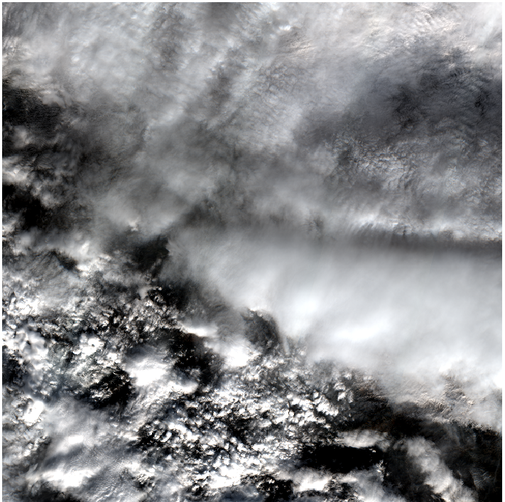

# Leyenda de Píxeles y Estrategia de Agrupación (SCL)

Este documento detalla la justificación teórica y la estrategia de Ingeniería de Datos aplicada a las máscaras de segmentación de Sentinel-2 (Scene Classification Layer - SCL) para el entrenamiento de la red neuronal U-Net.

## 1. El Estándar Sen2Cor (Las 12 Clases Originales)

El algoritmo oficial de la ESA (Sen2Cor) genera una máscara de clasificación (Ground Truth) que divide el mundo en 12 categorías discretas (valores del 0 al 11). 

| Valor | Clase Sen2Cor | Descripción |
| :---: | :--- | :--- |
| 0 | No Data | Píxeles fuera del barrido del sensor. |
| 1 | Saturated / Defective | Píxeles cegados por reflejos extremos (ej. metales). |
| 2 | Dark Area Pixels | Zonas oscuras inespecíficas (bosques densos, grandes sombras orográficas). |
| 3 | Cloud Shadows | Sombras proyectadas por formaciones nubosas. |
| 4 | Vegetation | Clorofila activa (cultivos, bosques). |
| 5 | Not Vegetated | Suelo desnudo, asfalto, roca, urbanizaciones. |
| 6 | Water | Agua profunda, ríos, embalses, mar. |
| 7 | Unclassified | Imposibilidad algorítmica de clasificar el píxel. |
| 8 | Cloud (Medium Probability) | Nubes finas, bruma, bordes de grandes nubes. |
| 9 | Cloud (High Probability) | Formaciones nubosas densas (Cúmulos, Cumulonimbos). |
| 10 | Thin Cirrus | Nubes de hielo muy altas y delgadas (Cirros). |
| 11 | Snow / Ice | Superficies cubiertas por nieve o hielo. |

## 2. Reducción de Dimensionalidad (Colapso Físico a 5 Clases)

Entrenar una red neuronal para discernir entre 12 clases, muchas de las cuales son irrelevantes para el objetivo (Nieve vs Nube), generaría un modelo ineficiente.

Para solucionar esto de forma elegante, el script de descarga ([`download_sentinel.py`](../scripts/download_sentinel.py)) colapsará **físicamente** el archivo `SCL.jp2` original en un nuevo archivo `SCL.tif` (GeoTIFF) que contendrá exclusivamente **5 Clases Maestras**. Esto facilita la curación manual en QGIS y optimiza el filtrado automático de parches en [`create_dataset.py`](../scripts/create_dataset.py).

El mapeo físico y visual (RGB) para la edición en GIMP es el siguiente:

- **Clase 0 (Basura / Descarte):** [COLOR GIMP: Negro puro / `000000`] Agrupa [0, 1, 2, 6, 7]. Píxeles sin datos, mares profundos o errores. Si un parche contiene más del 90% de Clase 0, [`create_dataset.py`](../scripts/create_dataset.py) lo descarta para no llenar el disco duro. La red neuronal ignorará esta clase durante el entrenamiento (`ignore_index=0`).
- **Clase 1 (Suelo Útil):** [COLOR GIMP: Verde Bosque / `228B22`] Agrupa [4, 5]. Vegetación y suelo desnudo.
- **Clase 2 (Nube):** [COLOR GIMP: Blanco puro / `FFFFFF`] Agrupa [8, 9, 10]. Toda la obstrucción atmosférica brillante.
- **Clase 3 (Sombra Nube):** [COLOR GIMP: Gris / `646464`] Mantiene [3]. Obstrucción terrestre oscura generada por nube.
- **Clase 4 (Nieve):** [COLOR GIMP: Cyan Brillante / `00FFFF`] Mantiene [11]. El objetivo de control.

## 3. Justificaciones Científicas de la Agrupación

### 3.1. Simplificación de Nubes (8, 9, 10 -> Clase 1)
A efectos de teledetección operativa (cálculo de índices NDVI, monitoreo de sequías, etc.), un píxel ocluido por un cirro fino (10) está tan corrompido como uno ocluido por un cumulonimbo denso (9). El objetivo binario final es: *"¿El píxel es útil para mirar la tierra o está tapado?"*. Al agrupar las nubes, simplificamos el espacio latente matemático que la U-Net debe aprender, acelerando la convergencia del entrenamiento.

### 3.2. Prevención de "Disonancia Cognitiva" (Separación de Nube y Sombra)
Podría parecer lógico agrupar la "Sombra de nube" dentro de la categoría "Nube", ya que ambas representan "ruido meteorológico" que no se desean en el mosaico final. Sin embargo, en el entrenamiento de Machine Learning, esto es un anti-patrón de diseño crítico.

- **Firma Espectral Opuesta:** Una nube refleja casi toda la radiación (valores altísimos, píxeles muy brillantes). Una sombra absorbe la radiación (valores bajísimos, píxeles casi negros).
- **El Problema:** Si forzamos a la red neuronal a agrupar píxeles blancos y píxeles negros bajo un mismo identificador matemático (Clase), la red sufrirá "disonancia cognitiva". Al no encontrar ningún patrón físico o frontera matemática común entre un blanco brillante y un negro oscuro, la precisión del modelo colapsaría.
- **La Solución:** Dividir para vencer. Mantenemos la Clase 1 (Nubes) y la Clase 2 (Sombras) estrictamente separadas durante el entrenamiento para que la red aprenda la física de la luz perfectamente. Una vez el modelo esté en Producción y genere predicciones precisas sobre imágenes nuevas, la lógica de negocio del visor web agrupará ambas clases para descartarlas simultáneamente del mosaico final.

## 4. Casuística Especial: Sombras sobre Nubes (El "Mar de Nubes")

Durante la curación manual de la máscara SCL, es común encontrar escenarios donde la capa nubosa es total y presenta texturas oscuras muy marcadas, como se observa en la siguiente imagen:

### 4.1. El Falso Positivo Geométrico
El algoritmo Sen2Cor carece de percepción de profundidad 3D. Cuando una formación nubosa alta (ej. un cúmulo) proyecta una sombra sobre una formación nubosa más baja (ej. un estrato), el algoritmo detecta un píxel brillante seguido geométricamente de un píxel muy oscuro. Aplicando su lógica basada en la posición solar, deduce que esa mancha negra es una sombra en la superficie terrestre y la clasifica erróneamente como **Sombra de Nube (3)**, cuando en realidad es material nuboso.

### 4.2. Estrategia de Curación
Ante estas situaciones (imágenes 100% cubiertas por nubes donde el suelo no es visible), se plantean dos opciones metodológicas:
1. **Conservadora (Recomendada):** Dejar los píxeles negros clasificados como **Sombra de Nube (3)**. La red neuronal aprenderá que estas formas oscuras adyacentes a zonas blancas son sombras. Dado que en producción se eliminará tanto la clase Nube como la Sombra, el resultado final operativo será correcto.
2. **Purista:** Repintar manualmente la zona negra como **Nube (2)**, asumiendo que físicamente sigue siendo agua condensada.

Se recomienda emplear la opción conservadora durante el volumen general de datos para optimizar recursos, reservando el esfuerzo manual minucioso para la corrección de errores críticos estructurales: **nieve clasificada erróneamente como nube, o terreno útil clasificado como nube**.

### 4.3. Importancia Crítica de la Edición en los Datos de Test
Es imperativo comprender que la estrategia descrita anteriormente cambia de paradigma al abordar los 10 gránulos designados en el conjunto de evaluación ([`test_granules.csv`](../scripts/test_granules.csv)). 

Para los datos de Test, la edición y clasificación manual de los píxeles de los ficheros SCL no es opcional ni se admite laxitud, sino que constituye el pilar validador del proyecto. Si no se curan meticulosamente estos gránulos, la red neuronal (U-Net) sería evaluada matemáticamente contra los propios errores algorítmicos de Sen2Cor que la investigación pretende mitigar. Esto generaría una paradoja de "falsos positivos" donde la U-Net sería penalizada estadísticamente precisamente cuando acierte identificando la nieve de forma correcta. Por tanto, el esfuerzo manual "purista" debe concentrarse íntegramente en generar la **Edición y Clasificación Manual de Píxeles** perfecta para la batería de Test.
