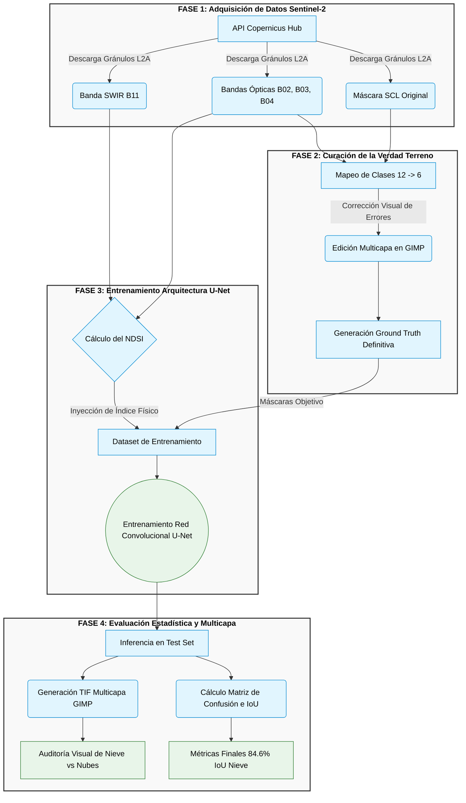

# Pipeline Metodológico del Proyecto (4 Fases)

Este documento ilustra el diagrama de flujo metodológico de nuestro motor de inferencia de nieve y nubes, desde la adquisición de datos satelitales hasta la validación visual y estadística. 

Este diagrama está diseñado para incluirse en la documentación formal para ayudar a los evaluadores a comprender la arquitectura global de un solo vistazo.

## Diagrama de Flujo (Metodología)

## Descripción de las Fases

1. **FASE 1 - Adquisición de Datos Sentinel-2:** Extraemos la información en crudo del satélite, separando la información puramente óptica (RGB) de la infrarroja (SWIR B11) que será clave posteriormente, además de capturar la clasificación base de la ESA (SCL).
2. **FASE 2 - Curación de la Verdad Terreno:** Es el trabajo manual de *Data Science*. Transformamos las 11 clases caóticas de Sentinel en 5 macro-clases lógicas (Nieve, Nube, Sombra, Agua, Tierra) y solucionamos los errores del algoritmo nativo mediante edición fotográfica (GIMP).
3. **FASE 3 - Entrenamiento Arquitectura U-Net:** La inteligencia artificial entra en juego. No solo le pasamos imágenes RGB, sino que le inyectamos matemáticamente el **NDSI (Normalized Difference Snow Index)** para que el modelo "aprenda" físicamente a diferenciar nieve de nubes blancas.
4. **FASE 4 - Evaluación Estadística y Multicapa:** Comprobación del éxito. El modelo predice escenarios desconocidos y evaluamos matemáticamente su rendimiento (IoU), además de generar paquetes visuales (4 capas) para revisión de los expertos.
